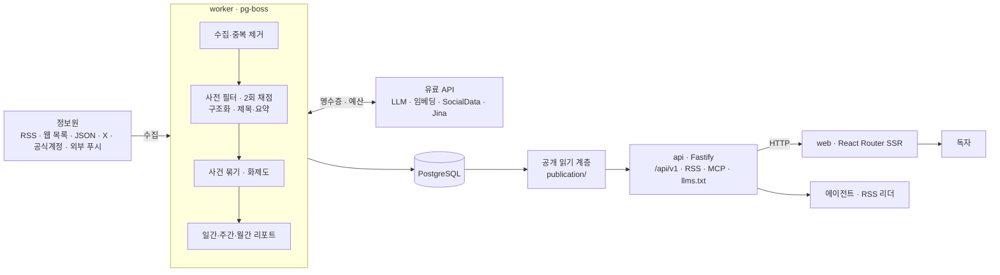
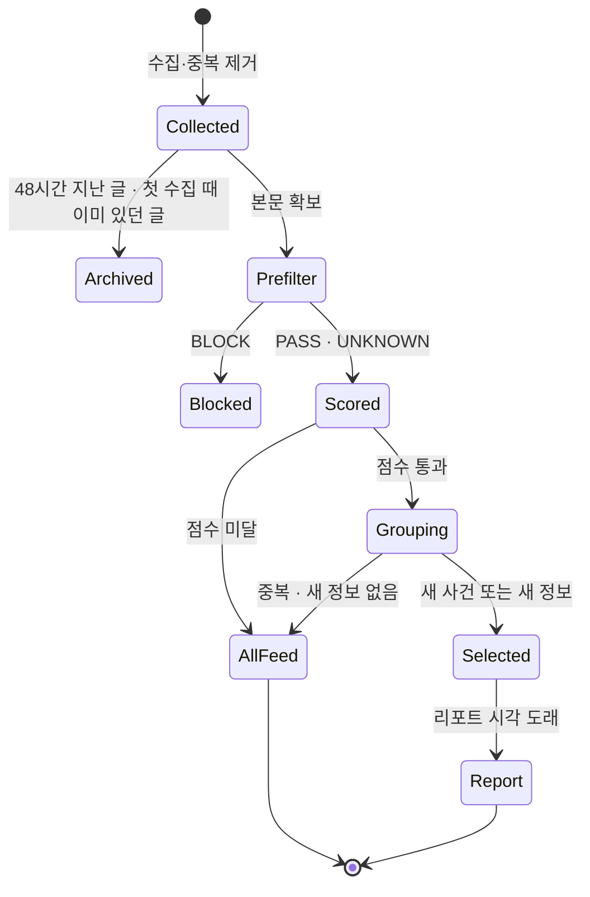

# AIHOT 핵심 개념과 동작 구조

> AIHOT을 이루는 정보원과 등급, 선별(사전 필터·2회 채점·임계값), 구조화와 사건 묶기, 화제도, 유료 요청 영수증, 업계 패키지가 각각 무엇이고 어떻게 맞물려 동작하는지 다룹니다.

## 용어 한눈에 보기

| 키워드 | 설명 |
|---|---|
| 정보원(Source) | 글을 가져오는 곳. `rss`, `web_list`, `json_list`, `x_search`, `mp_account`, `external` 여섯 종류 |
| 등급(Tier) | 정보원의 신뢰 수준. `T1` 공식 1차, `T1_5` 공식 계정·준공식, `T2` 매체·개인, `EXCLUDE_MP` 선별 제외 |
| 참여 방식 | `editorial`(선별·전체 동향에 노출), `hot_signal`(화제도 증거로만 사용), `isolated`(공개 안 함) |
| 사전 필터 | 이 글이 우리 업계 이야기인지 넓게 거르는 단계. `PASS` / `BLOCK` / `UNKNOWN` |
| 2회 채점 | 같은 기준으로 0–100점을 독립적으로 두 번 매기는 단계. 합이 `2 × 임계값` 이상이면 점수 통과 |
| 구조화 | 분류, 태그, 주체 회사, "누가 무엇을 했나" 사실을 뽑는 단계. 사건 묶기와 리포트의 재료 |
| 사건(Story) | 여러 정보원이 보도한 같은 일을 하나로 묶은 단위. 화제도와 사건 페이지의 기준 |
| 화제도(Heat) | 사건 단위 인기 점수. 48시간 창, 독립 참여자당 1회, 24시간 반감기 |
| 영수증(Receipt) | 유료 요청마다 먼저 남기는 기록. 재시작·재시도 때 결과를 재사용 |
| 업계 패키지 | `industry/`(분류·정보원·프롬프트·임계값)와 `site/`(사이트 이름·문구·모델·브랜드) |

---

## 1. 정보원과 등급

### 쉽게 설명하면

신문사 편집국에는 "통신사 속보는 바로 실을 만하다", "익명 제보는 한 번 더 확인한다" 같은 감각이 있습니다. AIHOT의 등급은 그 감각을 정보원마다 붙여 둔 이름표입니다.

### 개발 관점에서는

정보원은 DB의 `sources` 행이고, 처음에는 `industry/sources.json`에서 읽어 들입니다. 핵심 필드는 세 가지입니다.

- `kind`: 어떻게 가져올지. RSS 파서, CSS 선택자 기반 웹 목록, JSON 필드 경로, SocialData(X), 极致了(위챗 공식계정), 외부 푸시
- `tier`: 입선 임계값을 정합니다. `T1`만 "1차 출처"로 취급되고, 같은 사건의 대표 보도를 고를 때도 우선합니다.
- `participation_mode`: 공개 여부를 정합니다. 커뮤니티 토론처럼 기사로 보여 주기는 애매하지만 "사람들이 이야기하고 있다"는 증거로는 쓸모 있는 정보원은 `hot_signal`로 둡니다.

### 예제

```json
{
  "id": "rss-supreme-court-press",
  "name": "대법원 보도자료",
  "kind": "rss",
  "config": { "feedUrl": "https://court.example/press/rss.xml" },
  "tier": "T1",
  "participation_mode": "editorial",
  "interval_minutes": 60,
  "site_fulltext": false,
  "syndicate_fulltext": false
}
```

`site_fulltext`와 `syndicate_fulltext`는 기본이 `false`라서 사이트에는 요약과 원문 링크만 나갑니다. 정보원이 전문 게재를 명시적으로 허락할 때만 켭니다.

### 핵심

> 등급은 "얼마나 쉽게 입선시킬지"를, 참여 방식은 "어디에 보여 줄지"를 정합니다. 둘을 분리해 두었기 때문에 "공개는 안 하지만 화제도에는 반영"하는 정보원을 둘 수 있습니다.

## 2. 선별: 사전 필터 → 2회 채점 → 임계값

### 쉽게 설명하면

원고가 들어오면 먼저 "우리 지면에 맞는 주제인가"를 빠르게 거르고(사전 필터), 통과한 원고는 편집자 두 명이 따로 점수를 매긴 뒤 합산해서 실을지 정하는 것과 같습니다.

### 개발 관점에서는

- **사전 필터**(`prefilter.md`)는 넓게 통과시킵니다. 명백히 무관한 것만 `BLOCK`하고, 판단할 근거가 부족하면 `UNKNOWN`으로 다음 단계로 넘깁니다. 본문이 없는데 `BLOCK`이 나오면 코드가 `UNKNOWN`으로 바꿉니다.
- **2회 채점**(`selection-score.md`)은 같은 프롬프트로 두 번 독립 호출합니다. 채점 입력에는 정보원 이름이나 등급을 일부러 넣지 않습니다. 모델이 "공식 발표니까 점수를 높게"처럼 출처에 끌려가지 않게 하기 위해서이고, 출처의 무게는 임계값 쪽에서만 반영합니다.
- **임계값**(`industry/selection.ts`)은 등급별로 다릅니다. 두 점수의 합이 `2 × 임계값` 이상이면 점수로는 통과입니다. 화면에 보이는 점수는 두 점수의 평균(내림)입니다.

### 예제

```ts
// industry/selection.ts (기본값, AI 업계에서 보정된 수치)
export const SELECTION = {
  thresholds: { T1: 60, T1_5: 65, T2: 76 } as Record<string, number>,
  understandFloor: 50, // 입선은 못 했지만 평균이 이보다 높으면 입선 글처럼 공들여 요약
} as const;
```

같은 사건이라도 공식 발표(T1)는 평균 60점이면 통과하고, 매체 기사(T2)는 76점이 필요합니다. "같은 일이면 원문을 먼저 보여 준다"는 편집 원칙이 숫자로 들어가 있습니다.

### 핵심

> 점수 통과는 입선의 필요조건일 뿐입니다. 이미 선정된 뉴스와 같은 내용이면 사건 묶기 단계에서 다시 걸러집니다. 자세한 흐름은 [선별 파이프라인 깊이 보기](07-selection-pipeline.md)에서 다룹니다.

## 3. 구조화와 글쓰기

### 쉽게 설명하면

기사를 읽고 "분류: 규제 / 주체: 금융위원회 / 무엇을: 가이드라인 발표 / 언제: 10월 1일"처럼 카드에 정리하는 일과, 독자에게 보여 줄 제목과 요약을 쓰는 일을 나눠서 합니다.

### 개발 관점에서는

- **구조화**(`structure.md`)는 채점과 동시에 실행됩니다. 분류와 태그(화면에 보이는 것은 이쪽 결과), 주체 회사, 단일 뉴스인지 여러 소식을 묶은 종합 기사인지, 그리고 "주체·행위·대상·시점" 사실과 원문 인용을 뽑습니다. 원문에 실제로 없는 인용은 코드가 버립니다.
- **글쓰기**는 구조화가 끝난 뒤에 합니다. 입선했거나 입선에 가까운 글은 `content-understanding.md`로 제목, 답을 먼저 쓰는 요약, 추천 이유를 쓰고, 나머지는 더 저렴한 `summarize-*.md`로 짧게 씁니다.
- 원문에 없는 회사 이름이 제목·요약에 들어가지 않도록 업계 사전(`IDENTITY_LEXICON` 등)으로 검사합니다.

### 핵심

> 구조화 결과는 화면의 분류뿐 아니라 사건 묶기, 주제 페이지, 일간 리포트의 재료입니다. 구조화 프롬프트가 흔들리면 그 뒤가 모두 흔들립니다.

## 4. 사건 묶기와 화제도

### 쉽게 설명하면

같은 발표를 공식 블로그가 한 번, 매체가 열 번, X에서 하루 종일 이야기하면 독자는 한 번만 보면 됩니다. 그리고 "몇 곳에서 이야기하고 있나"가 그 사건이 얼마나 뜨거운지를 말해 줍니다.

### 개발 관점에서는

- **후보 찾기**: 제목·요약 임베딩으로 최근 2주 안에서 비슷한 사실을 찾습니다. 임베딩 서비스를 설정하지 않으면 글자 겹침으로 대신합니다. pgvector는 쓰지 않고, 벡터를 PostgreSQL 배열로 저장한 뒤 최근 범위만 훑습니다.
- **관계 판정**: 모델이 두 보도의 관계를 네 가지 중 하나로 판정합니다. `SAME_OCCURRENCE`(같은 일), `SAME_STORY`(같은 사건의 후속), `UNRELATED`(다른 일), `ROUNDUP`(여러 소식 묶음). 애매하면 합치고, 쓰기 전에 다시 확인합니다(확인 모델은 `GROUP_REVIEW_MODEL`로 따로 지정 가능).
- **화제도**: 사건 단위로 계산합니다. 48시간 창 안에서 독립 참여자 하나는 한 번만 세고, 24시간마다 절반으로 줄어듭니다. 같은 회사의 여러 정보원은 한 참여자로 칩니다. 5분마다 다시 계산하고, 6시간 전과 비교해 "상승", "새로움" 배지를 붙입니다.

### 예제

```text
10:00  공식 블로그(T1)    "A사, 새 정책 발표"       → 사건 #812 생성
10:20  매체 X(T2)         "A사 새 정책, 무엇이 바뀌나" → SAME_OCCURRENCE → #812
10:40  매체 X(T2) 두 번째 기사                      → #812, 하지만 참여자 수는 그대로
다음날 A사 후속 FAQ 공개                            → SAME_STORY → #812 후속으로 연결
```

### 핵심

> 화제도는 "기사 수"가 아니라 "독립적으로 이야기하는 곳의 수"입니다. 한 매체가 열 번 써도 한 번으로 셉니다.

## 5. 유료 요청 영수증과 예산

### 쉽게 설명하면

법인카드로 결제할 때마다 영수증을 먼저 받아 두는 것과 같습니다. 결제가 됐는지 헷갈릴 때 영수증을 보면 다시 결제하지 않아도 됩니다.

### 개발 관점에서는

`providers/receipts.ts`가 모든 유료 요청(모델, SocialData, Jina 등)을 감쌉니다.

1. 작업·입력 리비전·모델·프롬프트·설정으로 **논리 키**를 만듭니다.
2. 호출 전에 영수증과 시도 기록을 DB에 먼저 씁니다. 예산은 이 시도 기록으로 셉니다.
3. 응답이 오면 업무 데이터를 쓰기 전에 원본 응답부터 저장합니다.
4. 같은 논리 키로 다시 요청하면 저장된 응답을 재사용합니다.
5. 보냈는데 결과를 모르는 요청(타임아웃, 프로세스 종료)은 다시 보내지 않고, 30분 뒤 한 번만 자동으로 풀어 줍니다.

서비스마다 분·시간·일 상한이 있어서 넘으면 그 서비스 호출이 멈춥니다. 상한을 0으로 두면 즉시 끕니다.

### 핵심

> 영수증은 "같은 돈을 두 번 내지 않기"와 "어디에 얼마를 썼는지 추적하기"를 동시에 해결합니다. 평가 도구가 같은 샘플을 다시 돌릴 때도 이 영수증을 재사용합니다.

## 6. 업계 패키지(`industry/`, `site/`, `modules/`)

### 쉽게 설명하면

같은 신문사 시스템을 쓰더라도 경제지와 스포츠지는 지면 구성, 취재처, 편집 기준이 다릅니다. AIHOT에서 그 차이를 담는 곳이 업계 패키지입니다.

### 개발 관점에서는

| 위치 | 담는 것 |
|---|---|
| `industry/` | 분류·태그·주체 사전(`taxonomy.ts`), 주제(`topics.json`), 예시 정보원(`sources.json`), 프롬프트(`prompts/`), 임계값(`selection.ts`) |
| `site/` | 사이트 이름·문구·발행 시각(`site.ts`), 단계별 모델(`models.ts`), 브랜드, 약관, 루트 파일, 업데이트 로그 |
| `modules/` | 이 사이트에만 필요한 기능. 프레임워크는 모듈을 import하지 않고 `site/modules/` 목록만 읽음 |

엔진 코드는 이 값들을 읽기만 하고 특정 사이트의 값을 하드코딩하지 않는 것이 원칙이며, `tests/architecture.test.ts`가 모듈 경계를 검사합니다.

### 핵심

> 업계를 바꿀 때 손대는 곳은 거의 `site/`와 `industry/` 두 폴더입니다. 엔진을 고치지 않아야 상위 저장소의 업데이트를 계속 합칠 수 있습니다.

---

## 7. 전체 동작 구조

AIHOT은 하나의 PostgreSQL을 중심으로 세 프로세스가 역할을 나눕니다. **페이지는 모델을 호출하지 않는다**는 규칙이 구조의 핵심입니다. 모델은 worker 작업 안에서만 호출되고, 독자와 에이전트는 DB에 이미 저장된 결과만 읽습니다.



한 건의 글이 처리되는 순서는 다음과 같습니다.

1. **시작점**: `sources.schedule` 작업이 매분 도는 정보원을 큐에 넣고, 정보원별 수집기가 목록을 가져옵니다. 같은 URL·같은 내용은 하나만 남기고, 발견 시점에 48시간이 지난 글이나 새 정보원의 기존 글은 원문 날짜로 보관만 합니다.
2. **AIHOT이 판단하는 시점**: 본문이 부족하면 원문 페이지를 먼저 가져온 뒤, 사전 필터 → (구조화와 동시에) 2회 채점 → 제목·요약 순서로 처리합니다. 각 호출은 영수증을 거칩니다.
3. **내부 처리**: 점수가 통과한 글은 사건 묶기에서 "이미 선정된 뉴스와 같은가, 새 정보가 있는가"를 확인받은 뒤에 선정됩니다. 화제도는 5분마다 사건 단위로 다시 계산됩니다.
4. **외부 시스템과의 연결**: 모델은 OpenAI 호환 API 하나면 되고, 단계별로 다른 모델을 지정할 수 있습니다. X·위챗 공식계정·Jina는 키를 넣었을 때만 쓰입니다.
5. **결과 반환**: 30분마다 발행할 리포트가 있는지 확인해 일간(기본 08:00), 주간(월요일 10:00), 월간(1일 10:30) 리포트를 만듭니다(모두 베이징 시간 기준). 웹, RSS, API, MCP는 같은 공개 읽기 계층에서 결과를 읽습니다.

글 하나의 상태 변화를 보면 다음과 같습니다.



---

[← 개요](README.md) · [설치와 첫 실행 →](02-getting-started.md)
