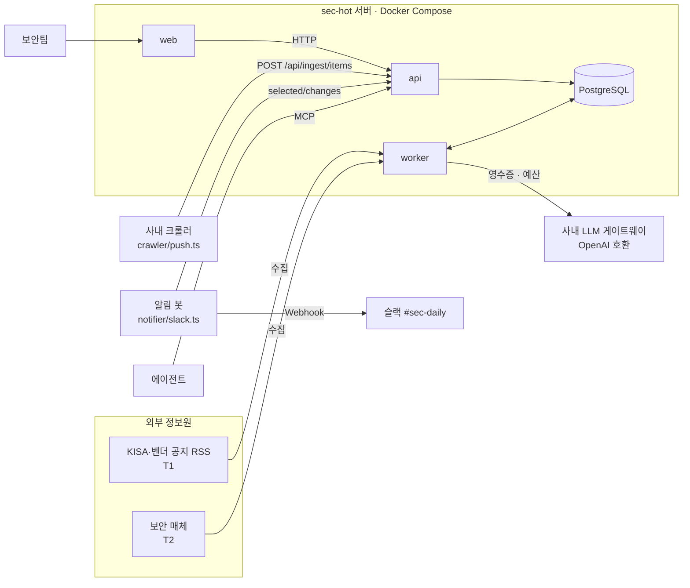

# AIHOT 활용 예시 ③ 운영과 실전 프로젝트

> AIHOT을 서버에서 운영할 때 필요한 도메인·외부 푸시·예산·백업·업그레이드를 다루고, 사내 "보안 위협 동향" 사이트를 처음부터 구성하는 실전 프로젝트를 따라갑니다.

## 서버에서의 활용

AIHOT은 서버 코드에 import하는 라이브러리가 아니라 **그 자체가 서버 애플리케이션**입니다. 그래서 "서버에서 활용한다"는 것은 이 애플리케이션을 운영하고, 기존 시스템과 연결하는 일을 말합니다.

### 활용 사례

- **도메인과 HTTPS**: 함께 들어 있는 Caddy 설정으로 인증서를 자동 발급하거나, 기존 Nginx 뒤에 둡니다.
- **기존 크롤러 연결**: 이미 운영 중인 크롤러의 결과를 `POST /api/ingest/items`로 넣으면 일반 수집과 같은 중복 제거·선별·사건 묶기를 거칩니다.
- **비용 통제**: 관리자 화면 "설정 → 유료 요청 상한"에서 서비스별 분·시간·일 상한을 둡니다.
- **단계별 모델 교체**: 채점은 정확한 모델, 요약은 저렴한 모델처럼 단계마다 다른 모델을 씁니다(`site/models.ts`, `SCORE_MODEL` 같은 환경 변수, 관리자 "모델과 평가" 화면).
- **백업과 업그레이드**: S3 호환 저장소로 매일 04:10 자동 백업하고, 정해진 순서로 마이그레이션합니다.
- **사이트 전용 기능**: 프레임워크에 없는 기능은 `modules/<이름>/`에 모듈로 만들어 엔진과 분리합니다.

### 애플리케이션 구조

```text
독자 / 에이전트 / 외부 크롤러
 ↓
Caddy 또는 Nginx (HTTPS, X-Forwarded-For)
 ↓
web (React Router SSR, :3000)  →  HTTP  →  api (Fastify, 내부 :3001)
                                            ├─ /api/v1 · RSS · MCP · llms.txt  (공개 읽기 계층만 읽음)
                                            ├─ /api/ingest/items               (외부 푸시 → 수집 큐)
                                            └─ /admin API                      (관리자)
 ↓
PostgreSQL 17  ←→  worker (pg-boss: 수집 · 모델 호출 · 사건 묶기 · 화제도 · 리포트 · 백업)
                         ↓
                    유료 API (영수증 · 예산 상한)
```

### 실제 코드

**도메인과 HTTPS로 띄우기**

```dotenv
# .env
SITE_URL=https://sec-hot.example.com
SITE_DOMAIN=sec-hot.example.com
PORT=127.0.0.1:3000      # 3000번은 같은 서버의 Caddy만 접근
TRUST_PROXY=true         # 방문자 IP를 프록시 헤더에서 읽음 (직접 노출 시에는 false)
INGEST_TOKEN=<16자 이상 무작위 문자열>
```

```bash
docker compose --profile https up -d --build
```

`TRUST_PROXY=true`는 앞에 프록시가 있을 때만 켭니다. 직접 노출된 상태에서 켜면 누구나 `X-Forwarded-For`를 위조해 로그인 시도 제한을 우회할 수 있습니다.

**업그레이드 순서**

```bash
# 1) 백업부터
docker compose exec -T db pg_dump -U aihot aihot | gzip > backup-$(date +%F).sql.gz
# 2) 새 코드 빌드
git pull
docker compose build
# 3) 옛 서비스를 멈춘 뒤 마이그레이션, 성공하면 기동
docker compose stop api worker web
docker compose run --rm setup && docker compose up -d
```

마이그레이션이 테이블이나 열을 지울 수 있으므로 옛 api·worker를 먼저 멈춥니다. worker는 진행 중인 유료 호출을 마무리하느라 최대 3분 남짓 걸릴 수 있습니다. 직접 운영한다면 systemd의 `TimeoutStopSec`이나 pm2의 `kill_timeout`을 210초 이상으로 둡니다. 너무 일찍 죽이면 그 호출은 "결과 모름" 상태가 되어 30분 뒤에야 다시 시도됩니다.

**어느 계층에 무엇을 두는가**

| 계층 | 두는 것 | 이유 |
|---|---|---|
| 리버스 프록시 | HTTPS, 요청 제한, 정적 캐시 | 앱이 내려주는 `Cache-Control`보다 길게 캐시하면 철회된 글이 남음 |
| api | 공개 출구, 외부 푸시 수신, 관리자 API | 페이지는 모델을 호출하지 않으므로 응답이 빠르고 비용이 없음 |
| worker | 수집, 모든 모델 호출, 예약 작업 | 유료 호출과 재시도를 한곳에서 영수증으로 관리 |
| PostgreSQL | 글, 분석, 사건, 영수증, 큐(pg-boss) | 큐까지 DB에 있어 별도 메시지 브로커가 필요 없음 |
| 외부 서비스 | 사내 크롤러, 알림 봇 | 엔진을 고치지 않고 푸시 API와 변경 API로만 연결 |

---

## 실전 프로젝트 적용: 사내 보안 위협 동향 사이트

### 요구사항

보안팀 5명이 매일 아침 "오늘 대응해야 할 보안 이슈"를 확인할 사이트를 만듭니다.

- 정보원: KISA·벤더 보안 공지(1차), 보안 전문 매체(2차), 사내 크롤러가 모은 벤더 권고문
- 같은 취약점(CVE)을 다룬 여러 공지·기사는 하나의 사건으로 보여야 한다
- 선정된 글은 슬랙 `#sec-daily` 채널로 알린다(기본 내장 푸시는 飞书 전용이므로 별도 연결)
- 사내망 전용, 모델 비용은 하루 상한을 둔다
- 보안 담당자의 에이전트가 MCP로 동향을 조회할 수 있어야 한다

### 전체 구조



### 폴더 구조

```text
sec-hot/                         # AIHOT 저장소를 Fork한 것
├── site/
│   ├── site.ts                  # name: "SecHOT", subject: "보안", mcpPrefix: "sechot"
│   └── models.ts                # 단계별 모델 지정
├── industry/
│   ├── taxonomy.ts              # 분류: vuln, incident, advisory, policy, opinion
│   ├── sources.json             # KISA·벤더 RSS(T1), 보안 매체(T2)
│   ├── selection.ts             # 보정 후 임계값
│   └── prompts/                 # 보안 업계 기준 + 한국어 출력
├── .data/gold.jsonl             # 직접 라벨링한 평가 샘플 (Git 제외)
├── docker-compose.yml           # 그대로 사용
└── ops/                         # 엔진 밖의 연결 코드 (별도 리포로 분리해도 됨)
    ├── crawler/push.ts
    └── notifier/slack.ts
```

### 구현

**1. 사내 모델 게이트웨이와 단계별 모델**

```dotenv
# .env : 모든 단계의 기본 모델은 사내 게이트웨이
LLM_BASE_URL=https://llm-gw.internal.example/v1
LLM_API_KEY=<게이트웨이 토큰>
LLM_MODEL=fast-small
```

```ts
// site/models.ts : 채점만 더 정확한 모델로
export const PRESETS: Record<string, ModelPreset> = {
  "gw-accurate": {
    service: "gateway", model: "accurate-large",
    baseUrlEnv: "LLM_BASE_URL", apiKeyEnv: "LLM_API_KEY", jsonMode: true,
  },
};
export const DEFAULTS: Record<string, string> = { score: "gw-accurate", groupReview: "gw-accurate" };
```

입선을 가르는 채점과 사건 판정 재확인에만 큰 모델을 쓰고, 나머지는 기본 모델로 둡니다. 바꾸기 전에는 `eval-selection.ts --models default,gw-accurate`로 같은 샘플에서 두 모델을 비교합니다.

**2. 사내 크롤러 → 외부 푸시**

```ts
// ops/crawler/push.ts
type PushItem = { title: string; url: string; publishedAt?: string; author?: string };

const BASE = process.env.SECHOT_URL!;      // https://sec-hot.example.com
const TOKEN = process.env.INGEST_TOKEN!;

export async function push(items: PushItem[]) {
  for (let i = 0; i < items.length; i += 50) {          // 요청당 최대 50건
    const batch = items.slice(i, i + 50);
    for (;;) {
      const res = await fetch(new URL('/api/ingest/items', BASE), {
        method: 'POST',
        headers: { Authorization: `Bearer ${TOKEN}`, 'Content-Type': 'application/json' },
        body: JSON.stringify({ sourceId: 'vendor-advisories', sourceName: '벤더 보안 권고(사내 수집)', items: batch }),
      });
      if (res.status === 429) {                            // 클라이언트당 분당 횟수 초과
        await new Promise((r) => setTimeout(r, Number(res.headers.get('retry-after') ?? 60) * 1000));
        continue;
      }
      if (res.status === 409) throw new Error('관리자 화면에서 정보원이 일시정지됨');
      if (!res.ok) throw new Error(`ingest ${res.status}`);
      console.log(await res.json());                       // { ok: true, created: n }
      break;
    }
  }
}

await push([
  { title: 'Vendor X, 인증 우회 취약점 CVE-2026-12345 패치 공개', url: 'https://vendor-x.example/advisory/123', publishedAt: '2026-10-05T09:10:00+09:00' },
]);
```

처음 보내는 `sourceId`는 `external` 정보원으로 자동 생성되지만 **공개되지 않습니다.** 관리자 화면 "정보원"에서 참여 방식을 `editorial`로, 등급을 정해 줘야 사이트에 나옵니다. 과거 자료를 한꺼번에 넣을 때는 항목의 `raw._aihot.backfill`을 `true`로 해서 "오늘"과 알림에 섞이지 않게 합니다.

**3. 선정 글을 슬랙으로 보내는 알림 봇**

```ts
// ops/notifier/slack.ts : 5분마다 실행 (cron, systemd timer 등)
import { readFile, writeFile } from 'node:fs/promises';

const BASE = process.env.SECHOT_URL!;
const HOOK = process.env.SLACK_WEBHOOK_URL!;
const STATE = './notifier-state.json';

async function currentCursor(): Promise<string> {
  const saved = await readFile(STATE, 'utf8').then((s) => JSON.parse(s).cursor as string, () => null);
  if (saved) return saved;
  // 처음 한 번: 과거 글은 알리지 않고 기준점만 잡는다.
  // 문서 규칙대로 마지막 페이지까지 넘긴 뒤 "첫 페이지"의 cursor를 쓴다 (minimal로 가볍게)
  let first: string | null = null;
  let page: string | null = null;
  do {
    const url = new URL('/api/v1/selected/snapshot?fields=minimal&limit=1000', BASE);
    if (page) url.searchParams.set('page', page);
    const snap = await fetch(url).then((r) => r.json());
    first ??= snap.cursor;
    page = snap.hasMore ? snap.nextPage : null;
  } while (page);
  return first!;
}

let cursor = await currentCursor();
for (;;) {
  const url = new URL('/api/v1/selected/changes', BASE);
  url.searchParams.set('cursor', cursor);
  const res = await fetch(url);
  if (res.status === 409) { await writeFile(STATE, '{}'); break; }  // 다음 실행에서 새 기준점
  const body = await res.json();

  for (const c of body.changes) {
    if (c.op !== 'upsert') continue;
    const it = c.item;
    await fetch(HOOK, {
      method: 'POST',
      headers: { 'Content-Type': 'application/json' },
      body: JSON.stringify({ text: `*[${it.score}] ${it.title}*\n${it.summary ?? ''}\n${it.links.aihot}` }),
    });
  }
  cursor = body.cursor;
  await writeFile(STATE, JSON.stringify({ cursor }));
  if (!body.hasMore) break;
}
```

`upsert`에는 새 선정뿐 아니라 수정도 포함되므로, 같은 글을 두 번 알리고 싶지 않다면 보낸 `id`를 기록해 걸러 냅니다. 엔진에 슬랙 코드를 넣지 않고 공개 변경 API만 읽기 때문에 상위 저장소 업데이트와 충돌하지 않습니다.

**4. 운영 설정**

- 관리자 "설정 → 유료 요청 상한"에서 모델 서비스의 일 상한을 정합니다.
- `.env`에 `DB_BACKUP_STORE_*`를 채워 사내 S3 호환 저장소로 매일 백업합니다. 백업은 DB `.dump`와 파일 묶음 `.tar.gz`가 한 쌍이며, 복구할 때도 둘을 함께 씁니다.
- 사내망 전용이라면 MCP가 받을 호스트를 `MCP_ALLOWED_HOSTS`에 추가합니다.

### 실제 실행 흐름

"Vendor X 인증 우회 취약점" 하나를 따라가 보겠습니다.

1. **수집**: 09:12, 사내 크롤러가 Vendor X 권고문을 푸시합니다. api는 토큰과 형식을 검사하고 `{ ok: true, created: 1 }`을 돌려줍니다. 09:20에는 KISA RSS(T1)와 보안 매체 두 곳(T2)도 같은 CVE 기사를 수집합니다.
2. **사전 필터·채점**: worker가 각 글에 사전 필터를 돌리고(`PASS`), 구조화와 동시에 2회 채점합니다. KISA 공지는 81·77점(합 158 ≥ 2×60)으로 점수 통과, 매체 기사 하나는 70·72점(합 142 < 2×76)으로 전체 동향에만 남습니다.
3. **사건 묶기**: 임베딩으로 최근 2주 후보를 찾고, 모델이 KISA 공지와 벤더 권고문, 매체 기사를 `SAME_OCCURRENCE`로 판정해 사건 하나로 묶습니다. KISA 공지가 1차 출처라서 대표 보도가 됩니다.
4. **선정 확정**: 사건 묶기 단계에서 "이미 선정된 뉴스와 같은가, 새 정보가 있는가"를 확인한 뒤 KISA 공지가 선정됩니다. 사건 묶기 모델이 형식에 맞지 않는 답을 계속 내면 글은 대기 상태로 남고, 10분이 지나면 관리자 "실행" 화면에 나타납니다.
5. **화제도**: 5분 뒤 화제도 계산에서 이 사건은 독립 참여자 4곳(KISA, Vendor X, 매체 2곳)으로 순위에 오르고 "새로움" 배지가 붙습니다.
6. **알림과 조회**: 알림 봇이 `selected/changes`에서 `upsert`를 받아 슬랙으로 보냅니다. 오후에 담당자가 에이전트에게 "오늘 인증 우회 이슈 정리해 줘"라고 하자 에이전트가 MCP로 `sechot_search`와 `sechot_get_story`를 호출해 타임라인을 정리합니다.
7. **리포트**: 다음 날 발행 시각(설정값, 기본 베이징 시간 08:00 = 한국 09:00)에 일간 리포트가 규칙에 따라 만들어지고, 이 사건이 "오늘의 주요 이슈"에 들어갑니다. 일간 리포트는 모델을 호출하지 않고 규칙으로만 편집됩니다.

---

[← 활용 예시 ② 읽는 쪽: RSS·API·MCP로 가져다 쓰기](04-usage-agent-access.md) · [목차](README.md) · [장단점과 대안 비교 →](06-comparison.md)
