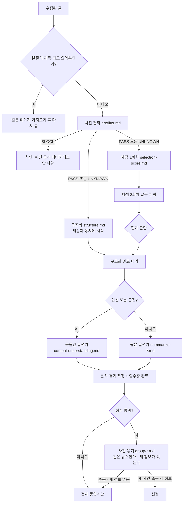

# AIHOT 선별 파이프라인 깊이 보기

> 글 한 건이 "선정"되기까지 실제 코드(`packages/backend/src/editorial/analyze.ts`)가 어떤 순서로 무엇을 판단하는지, 왜 두 번 채점하고 출처를 숨기는지, 사건 묶기가 왜 마지막 관문인지, 그리고 이 모든 호출을 영수증이 어떻게 감싸는지 다룹니다.

AIHOT에서 사이트의 품질을 결정하는 것은 수집기도 화면도 아니고 **선별 파이프라인**입니다. 이 부분을 이해하면 "왜 이 글은 뽑히고 저 글은 빠졌는가"를 스스로 추적할 수 있고, 업계를 바꿀 때 어디를 고쳐야 하는지도 분명해집니다.

## 한 장으로 보는 선별 흐름



아래에서 각 단계를 코드와 함께 봅니다.

---

## 1단계. 본문이 없으면 판단하지 않는다

```ts
// analyze.ts
export function waitsForPage(a: AnalyzeInputArticle): boolean {
  return a.bodyStatus === "pending" && !a.bodyText && !a.xPost && pageFetchable(a.url, a.source.kind);
}
```

RSS가 제목과 짧은 요약만 주는 경우가 많습니다. 이 상태로 채점하면 "제목만 보고 판단"하게 되므로, 가져올 수 있는 원문 페이지가 있으면 먼저 본문을 추출하고 분석을 다시 큐에 넣습니다. 유튜브·Vimeo 재생 페이지처럼 본문이 아닌 페이지는 본문으로 쓰지 않습니다.

## 2단계. 사전 필터는 "넓게 통과"가 원칙이다

```ts
// analyze.ts (runPrefilter 중)
// 근거 자료 없이 내린 BLOCK은 UNKNOWN(통과)으로 취급한다
const label = res.data.label === "BLOCK" && missingEvidence(a) ? "UNKNOWN" : res.data.label;
```

사전 필터의 목적은 "명백히 무관한 것만 거르기"입니다. 그래서 세 가지 장치가 있습니다.

- 프롬프트가 `BLOCK`에 **긍정적 근거**를 요구합니다. "AI 언급이 없다"는 것만으로는 막지 못합니다.
- 본문이 없는데 `BLOCK`이 나오면 코드가 `UNKNOWN`으로 바꿉니다. 모델이 정보 부족을 "무관"으로 착각하는 것을 막습니다.
- `UNKNOWN`은 버리지 않고 다음 단계로 보냅니다.

사전 필터는 가장 저렴한 단계(temperature 0, 출력 512토큰)이고, 여기서 `BLOCK`된 글은 이후 모든 비싼 호출을 건너뜁니다.

## 3단계. 같은 기준으로 두 번 채점한다

```ts
// analyze.ts
export const SCORE_CALLS = 2;

export function tierThreshold(tier: string): number | null {
  return SELECTION.thresholds[tier] ?? null; // 임계값이 없는 등급(EXCLUDE_MP 등)은 채점하지 않음
}

// runScores 중: 순서대로 호출 → 두 번째 호출이 제공자의 프롬프트 캐시를 재사용
for (let i = 0; i < SCORE_CALLS; i++) {
  const res = await chatJson({
    model, purpose: "score_article", system: SCORE_SYSTEM, user: input, schema: ScoreSchema,
    attemptTag: tagged(opts.attemptTag, `score-${i + 1}`), // 호출마다 별도의 유료 요청
    /* ... */
  });
  values.push(res.data.attentionScore);
}
```

### 왜 두 번인가

LLM 점수는 같은 입력에도 흔들립니다. 한 번 채점하면 임계값 근처의 글은 실행할 때마다 들어갔다 빠졌다 합니다. 두 번 독립 채점해 합으로 판단하면 한 번의 우연한 고득점이나 저득점의 영향이 절반으로 줄어듭니다. `attemptTag`를 `score-1`, `score-2`로 달리 주는 이유는 영수증의 논리 키가 같아지면 두 번째 호출이 첫 번째 결과를 그대로 재사용해 버리기 때문입니다.

### 왜 평균이 아니라 합으로 비교하는가

```ts
// normalizeAnalysis 중
const sum = values?.length === SCORE_CALLS ? values.reduce((t, v) => t + v, 0) : null;
const score = sum === null ? null : Math.floor(sum / SCORE_CALLS); // 화면에 보이는 점수
const selected = relevance === "pass" && sum !== null && threshold !== null && sum >= threshold * SCORE_CALLS;
```

`(75 + 76) / 2 = 75.5`를 내림하면 75가 되어 T2 임계값 76에 못 미칩니다. 합으로 비교하면 `151 < 152`라서 결과는 같지만, 판단이 "내림한 평균"이라는 표시용 값에 좌우되지 않습니다. 코드 주석의 표현대로 표시 점수는 "반 점을 혼자 결정하지 않습니다".

### 왜 채점 입력에서 출처를 숨기는가

```ts
// buildScoreInput: 정보원 정보 없이 발표 시각(베이징), 원제목, 본문 전체만 넣는다
return [
  "请按系统规则评估以下单篇材料所代表的事件。只输出 attentionScore。",
  `【发布时间（北京时间）】\n${at ? scoreInputTime(at) : "未知（收录时间不代表发布时间）"}`,
  `【标题】\n${a.title.trim()}`,
  `【完整正文】\n${body}`,
].join("\n\n");
```

채점 프롬프트는 "T1·T2, 정보원 이름, 1차 여부, 이전 점수, 임계값을 제공하지 않으니 추측하지 말라", "대기업·명문대·긴 본문·숫자 많음·SOTA를 자동 가산점으로 보지 말라"고 명시합니다. 출처의 무게는 **임계값에서 한 번만** 반영하고, 채점은 "이 사건이 독자의 주의를 얼마나 받을 만한가"만 보게 분리한 것입니다. 출처를 채점에도 반영하면 공식 발표가 점수와 임계값 양쪽에서 이중으로 유리해집니다.

또 하나, 채점 대상은 "이 기사"가 아니라 **"이 기사가 대표하는 사건"**입니다. 같은 사건의 공식 글과 매체 글 중 어느 것을 대표로 쓸지는 모델 밖(사건 묶기와 대표 선정 규칙)에서 정합니다.

### 콘텐츠 필터 거절

```ts
if (isContentFilter(error)) return { model, threshold, values, receiptIds, reused: false, refused: true };
```

모델 제공자의 콘텐츠 필터가 자료를 거절하면 채점하지 않은 것으로 보고 선정하지 않습니다. 오류로 재시도를 반복하지 않고 결과를 확정한다는 점이 중요합니다.

## 4단계. 구조화는 채점과 나란히 돈다

```ts
// runAnalysis 중
const structure = runStructure(a, opts).then((value) => ({ value }), (error: unknown) => ({ error }));
try {
  const scores = await runSelectionScores(a, opts);
  const sum = /* ... */;
  const near = sum !== null && (sum >= scores!.threshold * SCORE_CALLS || sum > UNDERSTAND_FLOOR * SCORE_CALLS);
  const s = await structure;
  if ("error" in s) throw s.error;
  const writing = (near ? await runUnderstand(a, opts) : null) ?? (await runSummarize(a, opts));
  return { prefilter, scores, writing, structure: s.value };
} finally {
  await structure; // 실패하거나 종료 중이어도 이미 보낸 유료 구조화 요청은 끝까지 기다린다
}
```

구조화(분류·태그·주체·사실 추출)는 채점 결과가 필요 없으므로 채점과 동시에 시작해 지연 시간을 줄입니다. `finally`에서 구조화 Promise를 다시 기다리는 이유는, 채점이 실패하거나 배포로 프로세스가 내려가는 중에도 **이미 비용을 낸 구조화 응답을 영수증에 저장한 뒤** 끝내기 위해서입니다.

구조화 결과는 그대로 믿지 않습니다. `normalizeStructure`는 모델이 뽑은 인용문 중 **원문과 모델이 본 입력 양쪽에 실제로 있는 것만** 남기고, 주체 회사도 업계 사전(`ENTITIES`)에 있는 것만 남깁니다. 여러 소식을 묶은 종합 기사(`composite`)이거나 원문이 비어 있으면 사실(`fact`)을 비웁니다. 이 사실이 사건 묶기의 핵심 재료이므로, 지어낸 인용이 사건 판정을 오염시키지 않게 막는 것입니다.

## 5단계. 글쓰기 비용을 점수로 나눈다

`near` 조건이 글쓰기 경로를 가릅니다.

| 조건 | 글쓰기 | 결과 |
|---|---|---|
| 합 ≥ 2 × 임계값 (점수 통과) | `content-understanding.md` | 제목, 답을 먼저 쓰는 요약, 추천 이유, 내용 유형 |
| 합 > 2 × `understandFloor`(기본 50) | 위와 같음 | 아깝게 떨어진 글도 같은 품질로 작성 |
| 그 외 | `summarize-*.md` | 짧은 제목과 요약 (짧은 게시글이 이미 중국어면 원문 그대로) |

비싼 글쓰기는 독자가 실제로 볼 가능성이 높은 글에만 씁니다. "근접" 구간을 두는 이유는 사건 묶기 결과나 이후 재평가로 선정될 수 있는 글이 저품질 요약으로 남지 않게 하기 위해서입니다. 글쓰기 결과의 제목·요약이 비어 있으면 `relevance`가 `unknown`이 되어 공개되지 않고 대기합니다.

## 6단계. 결과 저장: 리비전과 영수증

```ts
// analyzeArticle 중 (트랜잭션)
const [current] = await tx`SELECT revision FROM articles WHERE id = ${articleId} FOR UPDATE`;
const stale = !current || current.revision !== input.revision;
// 분석 결과는 항상 기록하되, 그 사이 글이 수정됐다면(stale) 글 상태는 바꾸지 않는다
INSERT INTO analyses (..., prompt_version, receipt_ids, relevance, score, selected, output) ...
for (const id of receiptIds) await completeReceipt(tx, id);
```

- 분석하는 동안 원문이 갱신되면(리비전 증가) 오래된 입력으로 만든 결과가 새 상태를 덮어쓰지 않습니다. 결과는 추적용으로만 남습니다.
- 분석 결과와 영수증 완료 처리가 같은 트랜잭션에 있습니다. 결과가 저장되지 않았다면 영수증도 "받음" 상태로 남아 있어서, 재시도하면 응답을 재사용합니다.

## 7단계. 점수 통과는 끝이 아니다: 사건 묶기 관문

점수를 통과한 글은 바로 선정되지 않고 사건 묶기를 기다립니다. 이 단계에서 모델은 두 가지를 동시에 판단합니다.

1. 이 글은 기존 보도와 어떤 관계인가: `SAME_OCCURRENCE` / `SAME_STORY` / `UNRELATED` / `ROUNDUP`
2. 이미 선정된 같은 뉴스에 비해 **새 구체 정보**가 있는가

결과에 따라 다음처럼 처리됩니다.

- **같은 뉴스의 여러 보도**: 모두 선정될 수 있지만 웹에서는 한 묶음으로 접히고, API·RSS·동기화에서는 대표 보도 하나만 나갑니다. 대표는 T1 → 검증된 T1_5 공식 계정 → 전문 보유·고득점·먼저 나온 보도 순서로 정합니다.
- **새 정보 없는 재소개**(이미 공개된 기능을 다른 말로 다시 소개, 다른 플랫폼 입점, 선정된 요점의 반복 요약): 점수가 높아도 선정되지 않고 전체 동향에만 남습니다.
- **종합 기사**: 독립 사건이 되지 않고 언급한 사건들에 걸리며, 선정되지 않은 중요한 내용이 있을 때만 선정됩니다.
- **확인 불가**: 선정되지 않습니다.

확인 전까지 글은 전체 동향에만 있고, 오래 기다린다고 자동 통과되지 않습니다. 사건 묶기 모델이 실패하거나 형식에 맞지 않는 답을 내면 글은 그 자리에 멈추고, 10분이 넘으면 경고가 뜨며 관리자 "내용 진단"에서 "다시 묶기"를 눌러야 합니다. 그래서 **사건 묶기 모델은 "형식을 안정적으로 지키는 모델"이어야 합니다.**

이 관문이 있기 때문에 "점수 높은 기사가 같은 사건으로 열 개 선정되는" 일이 생기지 않습니다. 반대로 말하면, 평가 도구(`eval-selection.ts`)로 측정하는 것은 사전 필터와 채점까지이고, 사건 묶기의 판단은 `eval-relations.ts`로 따로 평가합니다.

---

## 이 모든 호출을 감싸는 영수증

모든 모델 호출은 `chatJson`을 거쳐 `paidRequest`로 감싸집니다. 영수증의 논리 키에는 다음이 들어갑니다.

```ts
// llm.ts → receipts.ts
identity: { model, promptVersion, system: sha256(system), user: sha256(userText), temperature, maxTokens, extra }
logicalKey = [service, purpose, model, sha256(identity), attemptTag ?? "0"].join(":")
```

| 영수증 상태 | 의미 | 같은 키로 다시 요청하면 |
|---|---|---|
| `pending` | 요청을 보내는 중 | 10분 이내면 "바쁨", 넘으면 "결과 모름"으로 전환 |
| `received` / `completed` | 응답을 받아 저장함 / 업무 결과까지 커밋함 | 저장된 응답을 그대로 재사용(비용 없음) |
| `failed` | 제공자가 명확히 거절(과금 안 됨) | 다시 보냄 |
| `unknown` | 보냈지만 결과를 모름(타임아웃, 강제 종료) | 자동으로 다시 보내지 않음. 30분 뒤 1회 자동 해제, 그 뒤로는 관리자 확인 |

여기서 몇 가지 설계가 연결됩니다.

- **프롬프트 버전은 내용 해시입니다.** `promptVersion("selection-score")`는 프롬프트 파일(과 참조하는 하위 프롬프트) 내용의 SHA-256 앞 10자리입니다. 프롬프트를 고치면 키가 바뀌므로 새 글은 새 기준으로 판단되고, **이미 판단한 글은 다시 계산하지 않습니다.**
- **재평가는 `attemptTag`로 구분합니다.** 관리자가 "다시 평가"를 누르면 새 태그가 붙어 새 유료 요청이 됩니다. 단순 재시작·재시도는 태그가 같아서 기존 응답을 씁니다.
- **예산은 "시도" 단위로 셉니다.** 같은 논리 요청의 재시도도 모두 셉니다. 상한에 걸리면 `BudgetExceededError`로 해당 서비스 호출이 멈춥니다.
- **평가 도구도 같은 영수증을 씁니다.** SelectBench를 같은 샘플·같은 모델·같은 프롬프트로 다시 돌리면 이전 응답을 재사용하므로 추가 비용이 거의 없습니다.

---

## 정리: 어디를 고치면 무엇이 바뀌나

| 바꾸고 싶은 것 | 고칠 곳 | 영향 |
|---|---|---|
| 업계 관련 여부 | `prompts/prefilter.md` | 이후 모든 비용의 입구. 너무 엄격하면 놓치는 글이 생김 |
| 무엇이 중요한가 | `prompts/selection-score.md` | 점수 분포 자체가 바뀜. 고친 뒤 `eval-selection.ts`로 확인 |
| 출처별 너그러움 | `industry/selection.ts`의 `thresholds` | 전체를 평행 이동할 뿐, 특정 유형의 오판은 못 고침 |
| 공들인 요약의 범위 | `industry/selection.ts`의 `understandFloor` | 글쓰기 비용과 "아깝게 떨어진 글"의 품질 |
| 분류·사실 추출 | `prompts/structure.md`, `industry/taxonomy.ts` | 주제 페이지, 사건 묶기, 일간 리포트 전체 |
| 같은 사건 판정 | `prompts/group-*.md` | 중복 선정, 화제도. 고친 뒤 `eval-relations.ts`로 확인 |
| 단계별 모델 | `site/models.ts`, `*_MODEL` 환경 변수, 관리자 화면 | 새 작업부터 적용, 이미 판단한 글은 그대로 |

> 선별 파이프라인을 한 문장으로 줄이면 **"싸고 넓게 거르고, 두 번 재고, 출처는 임계값에서만 반영하고, 마지막으로 사건 단위에서 중복을 걸러 내며, 모든 호출은 영수증으로 한 번만 돈을 낸다"**입니다.

---

[← 장단점과 대안 비교](06-comparison.md) · [목차](README.md) · [주의할 점과 FAQ →](08-pitfalls-faq.md)
