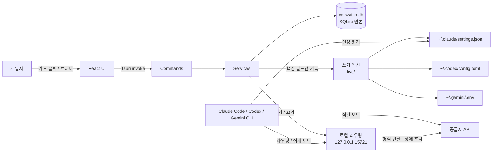
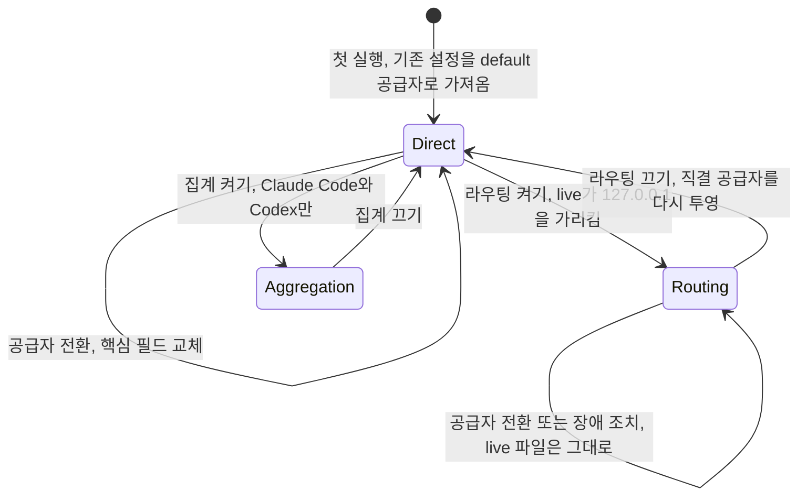

# CC Switch 핵심 개념과 동작 구조

> 공급자, Switch·Coexist 모드, 핵심 필드 교체, 데이터 저장 위치, 직결·라우팅·집계 모드, 프로젝트, MCP·Skills·프롬프트 동기화가 무엇이고 어떻게 맞물려 동작하는지 다룹니다.

## 용어 한눈에 보기

| 키워드 | 설명 |
|---|---|
| 공급자(Provider) | 도구가 요청을 보낼 대상. 주소, 인증 값, 모델, API 형식의 묶음 |
| 프리셋(Preset) | 공급자별로 미리 채워 둔 설정 템플릿. 키만 넣으면 공급자가 됨 |
| Live 설정 | 각 도구가 실제로 읽는 설정 파일. `~/.claude/settings.json`, `~/.codex/config.toml` 등 |
| Switch 모드 | 한 번에 한 공급자만 live 설정에 기록하는 방식. Claude Code, Codex 등 5개 도구 |
| Coexist 모드 | 여러 공급자를 도구 설정에 함께 기록하고 도구 안에서 고르는 방식. OpenCode 등 5개 도구 |
| 핵심 필드(Key field) | 전환할 때 CC Switch가 바꾸는 값. 주소, 인증 값, 모델, 프로토콜 |
| 로컬 라우팅 | `127.0.0.1:15721`에서 요청을 받아 실제 공급자로 넘기는 내장 프록시 |
| 집계(Aggregation) | 여러 공급자의 모델을 한 모델 목록에 함께 올리는 4.0의 모드 |
| 프로젝트(Project) | 공급자·MCP·Skills·프롬프트를 묶어 저장한 구성 스냅샷 |
| SSOT | 단일 원본. CC Switch는 `~/.cc-switch/cc-switch.db`를 원본으로 삼음 |

---

## 1. 공급자와 프리셋

### 쉽게 설명하면

공급자는 "전화번호부에 저장한 연락처"와 같습니다. 이름, 번호(주소), 비밀번호(키), 기본 설정(모델)을 한 번 저장해 두면, 다음부터는 이름만 눌러서 연결합니다. 프리셋은 대표 번호가 미리 입력된 연락처 양식입니다.

### 개발 관점에서는

공급자는 도구 하나에 속한 **설정 레코드**입니다. Claude Code용 공급자와 Codex용 공급자는 서로 다른 레코드이고, 같은 회사라도 도구마다 따로 만듭니다(Claude Code·Codex·Gemini CLI에 함께 쓰는 "Universal provider"도 있습니다).

공급자 하나에는 다음 정보가 들어갑니다.

- **연결 정보**: 주소(endpoint), 인증 값(API Key 또는 토큰), 인증 필드 이름(`ANTHROPIC_AUTH_TOKEN` 또는 `ANTHROPIC_API_KEY`)
- **모델 정보**: 기본 모델, Claude Code의 Haiku·Sonnet·Opus 역할별 모델
- **API 형식(Upstream Format)**: Anthropic Messages, OpenAI Chat Completions, OpenAI Responses, Gemini Native 중 하나. 도구가 원래 쓰는 형식과 다르면 로컬 라우팅이 필요합니다
- **부가 정보**: 사용량 조회 스크립트, 메모, 아이콘, 장애 조치 대기열 순서

프리셋은 AWS Bedrock, NVIDIA NIM, 각종 Coding Plan과 릴레이를 포함해 도구별로 제공됩니다. README는 "90개 이상의 공급자 프리셋"이라고 소개하고, 4.0 릴리스 노트는 도구별 프리셋을 모두 합쳐 756개라고 밝힙니다(2026년 10월 기준).

### 예제

앱 화면에서는 "+ 버튼 → 프리셋 선택 → 키 입력"이 전부입니다. 같은 일을 링크로도 할 수 있는데, CC Switch의 Deep Link 형식을 보면 공급자가 어떤 값으로 이루어지는지 잘 드러납니다.

```text
ccswitch://v1/import?resource=provider&app=claude&name=Team%20Gateway
  &endpoint=https%3A%2F%2Fllm-gateway.example.com
  &model=claude-sonnet-5
  &haikuModel=claude-haiku-4-5
```

(실제 링크는 한 줄입니다. 읽기 쉽게 줄을 나눴습니다.)

`apiKey`를 넣지 않았으므로, 링크를 연 사람이 가져오기 화면에서 자기 키를 입력하게 됩니다.

### 핵심

> 공급자는 "도구 하나 + 연결 정보 + 모델 + API 형식"입니다. API 형식이 도구와 다르면 그 공급자는 로컬 라우팅을 켜야만 동작합니다.

## 2. Switch 모드와 Coexist 모드

### 쉽게 설명하면

TV 리모컨과 셋톱박스의 차이입니다. TV(Switch 모드 도구)는 한 번에 한 채널만 틀 수 있어서 리모컨으로 채널을 바꿉니다. 셋톱박스(Coexist 모드 도구)는 여러 채널을 목록에 다 넣어 두고 사용자가 그 안에서 고릅니다.

### 개발 관점에서는

도구마다 설정 파일이 공급자를 몇 개까지 담을 수 있는지가 다르기 때문에, CC Switch는 두 가지 쓰기 방식을 씁니다.

| 모드 | 도구 | 동작 |
|---|---|---|
| Switch | Claude Code, Claude Desktop, Codex, Gemini CLI, Grok Build | live 설정에는 항상 "현재 공급자" 하나만 있음. 전환하면 핵심 필드를 바꿈 |
| Coexist | OpenCode, OpenClaw, Hermes, Pi, MiniMax Code | 도구 설정에 여러 공급자를 함께 기록. "Add"를 누르면 목록에 추가되고, 모델은 도구 안에서 고름 |

Switch 모드 도구에서 **현재 활성 공급자는 삭제할 수 없습니다.** CC Switch를 지워도 도구가 정상 동작해야 한다는 "최소 개입" 원칙 때문에, live 설정에는 항상 유효한 공급자 하나가 남아 있어야 하기 때문입니다.

### 핵심

> Switch는 "하나를 골라 바꿔 끼우기", Coexist는 "여러 개를 넣어 두고 도구가 고르기"입니다. 로컬 라우팅, 트레이 전환, 장애 조치는 Switch 모드 도구 중심으로 제공됩니다.

## 3. Live 설정과 핵심 필드 교체

### 쉽게 설명하면

이사할 때 집 전체를 새로 짓는 것이 아니라 현관문 도어락 비밀번호만 바꾸는 것과 같습니다. 가구 배치(사용자 설정)는 그대로 두고, 바뀌어야 하는 것만 바꿉니다.

### 개발 관점에서는

**Live 설정**은 도구가 실제로 읽는 파일입니다. CC Switch는 공급자를 전환할 때 이 파일에서 **핵심 필드만** 바꿉니다.

| 도구 | Live 파일 | 바뀌는 값(예) |
|---|---|---|
| Claude Code | `~/.claude/settings.json` | `env.ANTHROPIC_BASE_URL`, 인증 값, `ANTHROPIC_MODEL`과 역할별 모델, Bedrock·Vertex 선택자 |
| Codex | `~/.codex/config.toml`, `auth.json` | 공급자 테이블과 인증, 모델, 추론 강도 |
| Gemini CLI | `~/.gemini/.env`, `settings.json` | 주소·키 변수, 인증 방식, `model.name` |
| Grok Build | `~/.grok/config.toml` | `models.default`, CC Switch가 쓴 `[model."<이름>"]` 테이블 |

Hook, 플러그인, 권한, MCP 서버, 사용자가 직접 넣은 환경 변수, 주석과 순서는 건드리지 않습니다. TOML과 `.env`는 바꾸지 않은 줄을 바이트 단위로 그대로 두고, JSON은 다른 키의 값과 순서를 유지합니다.

이 동작은 **4.0에서 새로 만든 쓰기 엔진**의 결과입니다. 그 전(3.20.x까지)에는 전환할 때 현재 live 파일을 떠나는 공급자에 다시 저장(backfill)하고, 새 공급자의 스냅샷으로 파일을 다시 쓰는 방식이었습니다. 공유하고 싶은 설정은 "공통 설정 조각(Common Config Snippet)"으로 따로 관리해야 했고, 그 과정에서 Hook이나 MCP 설정이 특정 공급자에 갇히거나 사라지는 문제가 있었습니다. 4.0은 공통 설정 조각 기능을 없애고 "공유 설정은 원래 설정 파일에 그대로 둔다"는 방식으로 바꿨습니다.

쓰기 자체도 안전장치를 거칩니다.

1. 파일을 읽고 해시를 기록한 뒤 형식에 맞게 파싱합니다. **파싱에 실패하면 쓰지 않습니다.**
2. 메모리에서 핵심 필드만 바꾸고 옆에 임시 파일을 만듭니다.
3. 그 파일을 처음 쓰는 경우라면 원본을 `~/.cc-switch/backups/live-first-write/`에 한 번 백업합니다.
4. rename 직전에 원본을 다시 읽어 해시를 비교합니다. 그사이 다른 프로그램이 바꿨으면 새 내용을 바탕으로 다시 계산합니다.
5. 여러 파일을 함께 바꾸는 작업은 의도를 `live-state.json`에 먼저 기록해서, 중간에 앱이 죽어도 다음 실행 때 마무리하거나 버립니다.

키가 들어 있는 파일(`settings.json`, Codex `auth.json`·`config.toml` 등)은 소유자만 읽고 쓰는 0600 권한으로 기록합니다.

### 예제

전환 전후의 `~/.claude/settings.json`입니다. 공식 구독에서 사내 게이트웨이 공급자로 바꾼 경우입니다.

```json
{
  "env": {
    "ANTHROPIC_BASE_URL": "https://llm-gateway.example.com",
    "ANTHROPIC_AUTH_TOKEN": "sk-gw-...",
    "ANTHROPIC_MODEL": "claude-sonnet-5",
    "MY_TEAM_FLAG": "1"
  },
  "permissions": { "deny": ["Bash(git push --force:*)"] },
  "hooks": { "PreToolUse": [{ "matcher": "Bash", "hooks": [{ "type": "command", "command": "node ~/.claude/hooks/guard.js" }] }] },
  "enabledPlugins": { "my-plugin@market": true }
}
```

`env`의 `ANTHROPIC_*` 세 줄만 CC Switch가 쓴 값이고, `MY_TEAM_FLAG`, `permissions`, `hooks`, `enabledPlugins`는 사용자가 넣은 그대로입니다. 다시 공식 공급자로 바꾸면 `ANTHROPIC_*` 값만 제거되거나 바뀌고 나머지는 남습니다.

### 핵심

> CC Switch가 "소유"하는 것은 설정 파일 전체가 아니라 핵심 필드뿐입니다. 그래서 도구 안에서 `/model`로 바꾼 모델도 핵심 필드이므로, 다른 공급자로 갔다가 돌아오면 공급자에 저장된 값으로 되돌아갑니다.

## 4. 데이터는 어디에 저장되는가

### 쉽게 설명하면

원본 장부(DB)와 이 컴퓨터 전용 메모장(설정·상태 파일)을 따로 둡니다. 장부는 다른 기기와 동기화해도 되지만, 메모장은 이 컴퓨터에서만 의미가 있습니다.

### 개발 관점에서는

| 위치 | 내용 |
|---|---|
| `~/.cc-switch/cc-switch.db` | 공급자, MCP, 프롬프트, Skills, 프로젝트, 사용량 기록(SQLite, 원본) |
| `~/.cc-switch/settings.json` | 도구별 설정 디렉터리 재정의, 백업 정책, 동기화 연결 정보 등 이 기기 전용 설정 |
| `~/.cc-switch/live-state.json` | 도구별 직결·라우팅 상태, 진행 중인 쓰기 작업, 집계 목록(4.0) |
| `~/.cc-switch/backups/` | DB 자동 백업(기본 24시간마다, 최근 10개), `live-first-write/` 첫 쓰기 원본 백업 |
| `~/.cc-switch/skills/` | 설치한 Skills. 도구에는 심볼릭 링크로 연결하고, 실패하면 복사 |
| `copilot_auth.json`, `codex_oauth_auth.json`, `xai_oauth_auth.json` | OAuth 인증 센터의 로그인 정보 |
| `logs/cc-switch.log`, `crash.log` | 앱 로그. 이슈를 올릴 때 첨부 |

이 중 `settings.json`, 기기 상태 파일(`live-state.json` 등), 첫 쓰기 원본 백업은 이 컴퓨터에만 속하므로 클라우드 동기화에 포함되지 않습니다.

DB가 원본이고 live 파일은 "결과물"이라는 점이 중요합니다. 다른 기기에서 WebDAV나 S3 호환 저장소로 DB를 동기화하면 공급자 목록은 같아지지만, 각 기기의 live 파일과 라우팅 상태는 그 기기가 따로 관리합니다.

### 핵심

> 공급자 정보의 원본은 `cc-switch.db`이고, 도구 설정 파일은 거기서 핵심 필드만 투영한 결과입니다. 기기에 묶인 상태(`settings.json`, `live-state.json`)는 동기화되지 않습니다.

## 5. 직결, 라우팅, 집계

### 쉽게 설명하면

- **직결**: 도구가 공급자에게 직접 전화를 겁니다.
- **라우팅**: 도구는 항상 안내 데스크(로컬 라우팅)로 전화하고, 안내 데스크가 지금 담당자에게 연결합니다. 담당자가 외국어를 쓰면 통역도 합니다.
- **집계**: 안내 데스크가 "A사 상담원, B사 상담원" 목록을 한 번에 보여 주고, 사용자가 고른 사람에게 바로 연결합니다.

### 개발 관점에서는

4.0은 Switch 모드 도구마다 세 가지 모드를 둡니다.

| 모드 | 요청 경로 | 쓰는 경우 |
|---|---|---|
| 직결(Direct) | 도구 → 공급자 | 도구와 같은 API 형식의 공급자를 쓸 때. 기본값 |
| 라우팅(Routing) | 도구 → `127.0.0.1:15721` → 공급자 하나 | 형식 변환, 장애 조치, 요청 로그가 필요할 때 |
| 집계(Aggregation) | 도구 → `127.0.0.1:15721` → 고른 모델의 공급자 | 한 세션에서 여러 공급자의 모델을 섞어 쓸 때. Claude Code·Codex만 |

라우팅 모드에서는 live 설정이 로컬 주소와 자리표시자 키 `PROXY_MANAGED`만 갖고, 실제 주소와 키는 CC Switch 안에만 있습니다. 집계 모드는 장애 조치를 제공하지 않습니다. 세 모드의 내부 동작은 [로컬 라우팅 깊이 보기](07-local-routing.md)에서 자세히 다룹니다.

### 핵심

> 직결은 "설정 파일만 바꾸는 도구", 라우팅·집계는 "요청 경로에 끼어드는 프록시"입니다. 라우팅이 필요 없으면 켜지 않는 것이 가장 단순합니다.

## 6. 프로젝트

### 쉽게 설명하면

옷장의 "출근복 세트", "운동복 세트"입니다. 상의·하의·신발을 하나하나 고르지 않고 세트 이름 하나로 갈아입습니다.

### 개발 관점에서는

프로젝트는 Claude Code나 Codex의 **현재 공급자 + MCP + Skills + 프롬프트 파일**을 묶어 저장한 스냅샷입니다(Claude Desktop은 공급자만 저장). 메인 화면 상단의 프로젝트 전환기나 트레이에서 고르면 묶음 전체가 한 번에 바뀌고, 다른 프로젝트로 넘어갈 때 현재 상태가 이전 프로젝트에 자동으로 저장됩니다.

### 핵심

> 공급자 전환이 "연결 대상 바꾸기"라면, 프로젝트 전환은 "작업 환경 통째로 바꾸기"입니다.

## 7. MCP·Skills·프롬프트 동기화

### 쉽게 설명하면

여러 SNS에 같은 글을 올릴 때 쓰는 "동시 게시" 도구와 같습니다. 한 번 쓰고, 올릴 곳을 체크합니다.

### 개발 관점에서는

- **MCP**: 서버를 한 번 등록하고 도구별 체크박스로 동기화합니다. Claude Code에는 JSON, Codex에는 TOML 테이블처럼 도구 형식에 맞게 씁니다. 4.0부터 여러 서버 설정을 한 번에 붙여 넣을 수 있습니다.
- **Skills**: skills.sh 검색, GitHub 저장소나 ZIP으로 설치하고, 심볼릭 링크 또는 복사로 각 도구에 배포합니다.
- **프롬프트**: 도구별 Markdown 라이브러리입니다. 하나를 활성화하면 `CLAUDE.md`, `AGENTS.md`, `GEMINI.md`에 기록하는데, 기존 파일 내용은 먼저 라이브러리에 저장해서 잃어버리지 않게 합니다.

### 핵심

> MCP와 Skills는 "한 번 등록, 여러 도구에 배포", 프롬프트는 "도구별 라이브러리에서 하나를 골라 파일에 기록"입니다.

---

## 8. 전체 동작 구조

CC Switch는 React 프론트엔드와 Rust 백엔드가 Tauri IPC로 연결된 데스크톱 앱입니다. 백엔드는 명령(Commands) → 서비스(Services) → DAO → SQLite로 계층이 나뉘고, 서비스에서 "live 설정 쓰기"와 "로컬 라우팅" 두 갈래로 갈라집니다.



공급자를 바꾸는 한 번의 작업은 다음 순서로 처리됩니다.

1. **시작점**: 개발자가 Claude Code 페이지에서 "사내 게이트웨이" 카드의 Enable을 누르거나, 트레이 메뉴에서 공급자 이름을 클릭합니다.
2. **CC Switch가 개입하는 시점**: UI가 Tauri 명령을 호출하고, 서비스가 DB에서 공급자 레코드를 읽습니다. 앱별 잠금을 잡고, 이전에 끝나지 않은 쓰기 작업이 있으면 먼저 정리합니다.
3. **내부 처리**: 현재 모드가 직결이면 쓰기 엔진이 공급자의 핵심 필드를 `settings.json`에 투영합니다. 라우팅 모드라면 live 파일은 이미 로컬 주소를 가리키므로 파일을 다시 쓰지 않고 "라우팅 대상"만 바꿉니다.
4. **외부 시스템과의 연결**: Claude Code는 다음 요청부터 바뀐 값을 씁니다. 직결이면 공급자 API로 바로, 라우팅이면 `127.0.0.1:15721`로 보내고 CC Switch가 실제 공급자로 전달합니다. Codex, Gemini CLI, Grok Build는 모델이 바뀌면 재시작이 필요합니다.
5. **결과 반환**: UI 카드와 트레이가 새 공급자를 표시하고, 요청이 오가면 사용량 대시보드(세션 로그 또는 라우팅 로그)에 토큰과 추정 비용이 쌓입니다.

모드 전환을 상태 흐름으로 보면 다음과 같습니다.



---

[← 개요](README.md) · [설치와 첫 사용 →](02-getting-started.md)
