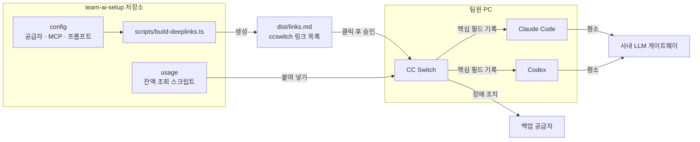

# CC Switch 활용 예시 ③ 팀 배포와 운영

> 팀원들에게 공급자·MCP·프롬프트 구성을 Deep Link로 나눠 주고, 사내 게이트웨이 잔액을 카드에 표시하고, 장애 조치와 업데이트를 운영하는 방법을 다룹니다. 마지막으로 작은 팀에 실제로 도입하는 과정을 따라갑니다.

## 팀·운영 관점에서의 활용

CC Switch는 서버에서 실행하는 프로그램이 아니라 팀원 각자의 PC에서 도는 데스크톱 앱입니다. 그래서 "서버에 무엇을 배포하는가"가 아니라 **"팀원 각자의 CC Switch에 같은 구성을 어떻게 넣고, 어떻게 유지하는가"**가 팀 관점의 핵심입니다.

### 활용 사례

- **Deep Link로 구성 배포**: `ccswitch://v1/import?...` 링크로 공급자, MCP 서버, 프롬프트, Skill 저장소를 한 번의 클릭으로 가져오게 합니다. 링크를 열면 확인 창이 뜨고, 사용자가 승인해야 가져옵니다.
- **사용량 조회 스크립트**: 사내 게이트웨이나 릴레이의 잔액 API를 호출하는 짧은 JavaScript를 공급자에 붙여, 남은 예산을 카드와 트레이에 표시합니다.
- **장애 조치 대기열**: 사내 게이트웨이가 점검 중일 때 백업 공급자로 넘어가도록 도구별 대기열을 정해 둡니다.
- **기기 간 동기화**: WebDAV나 S3 호환 저장소로 한 사람의 여러 기기(회사 노트북, 집 데스크톱)를 맞춥니다. DB에 개인 키가 들어 있으므로 팀 공용 동기화 저장소로 쓰지 않습니다.
- **서버·SSH 환경**: 데스크톱 앱이 없으므로 커뮤니티가 만든 CC Switch CLI(`SaladDay/cc-switch-cli`)를 씁니다. `~/.cc-switch` 데이터 디렉터리와 WebDAV 동기화를 공유하지만 별도 프로젝트라, 지원하는 DB 버전이 데스크톱 앱보다 늦을 수 있습니다.

### 애플리케이션 구조

팀 구성은 "원본 저장소 → 생성된 링크 → 각자의 CC Switch → 각 도구의 설정 파일" 순서로 흘러갑니다.

```text
팀 저장소 (team-ai-setup)
  공급자 정의, MCP 정의, 프롬프트, 사용량 스크립트  ← 키는 넣지 않음
 ↓  빌드 스크립트
Deep Link 목록 (dist/links.md)
 ↓  팀원이 클릭 → 확인 창에서 승인 → 자기 키 입력
각자의 CC Switch (~/.cc-switch/cc-switch.db)
 ↓  전환 / 동기화
각자의 도구 설정 (~/.claude/settings.json, ~/.codex/config.toml ...)
 ↓
사내 LLM 게이트웨이 / 백업 공급자
```

### 실제 코드

**사내 게이트웨이 잔액을 카드에 표시하는 사용량 조회 스크립트**

공급자 카드의 사용량 조회에서 "Custom"을 고르고 아래 스크립트를 붙여 넣습니다. CC Switch는 `{{apiKey}}`, `{{baseUrl}}`을 공급자의 값으로 바꿔서 요청을 보내고, `extractor`의 반환값을 카드에 표시합니다. 예시는 LiteLLM 계열 게이트웨이의 키 정보 API를 가정했으므로, 실제 게이트웨이 응답에 맞게 경로와 필드를 바꿔야 합니다.

```javascript
({
  request: {
    url: "{{baseUrl}}/key/info",
    method: "GET",
    headers: { Authorization: "Bearer {{apiKey}}" }
  },
  extractor: function (response) {
    const info = response.info || {};
    if (info.max_budget == null) {
      return { isValid: false, invalidMessage: "예산이 설정되지 않은 키입니다" };
    }
    return {
      planName: "사내 게이트웨이",
      total: info.max_budget,
      used: info.spend,
      remaining: info.max_budget - info.spend,
      unit: "USD"
    };
  }
})
```

저장하기 전에 "Test script"로 실제 응답이 원하는 값으로 바뀌는지 확인합니다. 자동 조회 간격은 0(끔)부터 1440분까지 정할 수 있고, 백그라운드 조회는 현재 활성 공급자일 때만 일어납니다. 조회도 게이트웨이에 요청을 보내므로 간격을 너무 짧게 잡지 않습니다.

**어느 도구에 어떤 운영 기능이 어울리는가**

| 위치 | 어울리는 CC Switch 기능 | 이유 |
|---|---|---|
| 팀원 PC의 Claude Code·Codex | Deep Link로 받은 공급자, 프로젝트 | 각자의 키로 같은 구성을 쓰게 하는 가장 가벼운 방법 |
| 사내 게이트웨이 앞단 | 사용량 조회 스크립트, 장애 조치 대기열 | 예산은 게이트웨이가 집행하고, CC Switch는 보여 주고 우회만 함 |
| 개인 기기 간 | 클라우드 동기화 | 공급자 목록은 원본(DB) 단위로 맞추고, live 상태는 기기마다 따로 |
| SSH 서버, 원격 컨테이너 | CC Switch CLI 또는 환경 변수 | 데스크톱 앱이 없는 곳 |
| CI | 환경 변수와 시크릿 | 재현 가능해야 하고 사람이 클릭할 수 없는 곳 |

---

## 실전 프로젝트 적용: 5명 팀의 AI 코딩 환경 표준화

### 요구사항

- 팀원 5명이 Claude Code와 Codex를 함께 씁니다.
- 업무에는 사내 LLM 게이트웨이(Anthropic 형식과 OpenAI Responses 형식을 모두 제공)를 쓰고, 키는 사람마다 따로 발급되며 예산이 걸려 있습니다.
- 게이트웨이 점검 시간에는 팀 공용 백업 공급자로 넘어가야 합니다.
- 사내 문서 검색 MCP 서버와 회사 코딩 규칙 프롬프트를 모두가 같은 버전으로 씁니다.
- 키는 저장소나 메신저에 절대 남기지 않습니다.

### 전체 구조



### 폴더 구조

```text
team-ai-setup/
├── package.json
├── config/
│   ├── providers.json          # 공급자 정의 (키 없음)
│   ├── mcp-servers.json        # MCP 서버 정의
│   └── prompts/
│       └── company-rules.md    # 회사 코딩 규칙 프롬프트
├── usage/
│   └── gateway-balance.js      # 사용량 조회 스크립트 (위 예시)
├── scripts/
│   └── build-deeplinks.ts      # Deep Link 생성기
└── dist/
    └── links.md                # 생성 결과 (커밋해서 공유)
```

### 구현

**1. 공급자 정의 (`config/providers.json`)**

```json
[
  {
    "app": "claude",
    "name": "사내 게이트웨이",
    "endpoint": "https://llm-gateway.example.com",
    "model": "claude-sonnet-5",
    "haikuModel": "claude-haiku-4-5",
    "homepage": "https://wiki.example.com/llm-gateway"
  },
  {
    "app": "codex",
    "name": "사내 게이트웨이",
    "endpoint": "https://llm-gateway.example.com/v1",
    "model": "gpt-5.6"
  }
]
```

`apiKey`를 일부러 넣지 않습니다. 링크를 연 사람이 가져오기 화면에서 자기 키를 입력하게 하기 위해서입니다. Codex 공급자 주소에 `/v1`을 붙일지는 게이트웨이 문서와 CC Switch의 Codex 프리셋 예시를 보고 맞춥니다. 처음 한 번은 링크로 가져온 공급자를 직접 전환해 보고 요청이 성공하는지 확인한 뒤 팀에 공지하는 것이 안전합니다.

**2. MCP 서버 정의 (`config/mcp-servers.json`)**

```json
{
  "apps": ["claude", "codex"],
  "mcpServers": {
    "company-docs": {
      "command": "npx",
      "args": ["-y", "@example/company-docs-mcp@1.4.0"]
    }
  }
}
```

**3. Deep Link 생성기 (`scripts/build-deeplinks.ts`)**

```ts
// 실행: npx tsx scripts/build-deeplinks.ts
import { readFileSync, writeFileSync, mkdirSync } from 'node:fs';

type ProviderDef = {
  app: 'claude' | 'codex' | 'gemini';
  name: string;
  endpoint: string;
  model?: string;
  haikuModel?: string;
  homepage?: string;
};

const readJson = <T>(path: string): T => JSON.parse(readFileSync(path, 'utf8'));
const base64 = (text: string) => Buffer.from(text, 'utf8').toString('base64');

// URLSearchParams가 값의 URL 인코딩(+, =, 한글 등)을 처리한다
const link = (params: Record<string, string | undefined>) => {
  const clean = Object.entries(params).filter((e): e is [string, string] => e[1] !== undefined);
  return `ccswitch://v1/import?${new URLSearchParams(clean).toString()}`;
};

const providers = readJson<ProviderDef[]>('config/providers.json');
for (const p of providers) {
  if ('apiKey' in p) throw new Error(`${p.name}: providers.json에 apiKey를 넣으면 안 됩니다`);
}

const providerLinks = providers.map((p) => ({
  title: `[${p.app}] ${p.name}`,
  url: link({ resource: 'provider', ...p }),
}));

const mcp = readJson<{ apps: string[]; mcpServers: Record<string, unknown> }>('config/mcp-servers.json');
const mcpLink = {
  title: `MCP: ${Object.keys(mcp.mcpServers).join(', ')}`,
  url: link({
    resource: 'mcp',
    apps: mcp.apps.join(','),
    config: base64(JSON.stringify({ mcpServers: mcp.mcpServers })), // 문서 규격: Base64 후 URL 인코딩
  }),
};

const promptLink = {
  title: '프롬프트: 회사 코딩 규칙 (Claude Code)',
  url: link({
    resource: 'prompt',
    app: 'claude',
    name: '회사 코딩 규칙',
    content: base64(readFileSync('config/prompts/company-rules.md', 'utf8')),
  }),
};

const all = [...providerLinks, mcpLink, promptLink];
const md = [
  '# CC Switch 팀 구성 링크',
  '',
  '각 링크를 클릭하고, 확인 창에서 내용을 검토한 뒤 가져오세요. 공급자는 가져오기 화면에서 본인 키를 입력합니다.',
  '',
  ...all.map((l) => `- [${l.title}](${l.url})`),
  '',
].join('\n');

mkdirSync('dist', { recursive: true });
writeFileSync('dist/links.md', md);
console.log(`${all.length}개 링크를 dist/links.md에 생성했습니다.`);
```

```json
// package.json (일부)
{
  "scripts": { "links": "tsx scripts/build-deeplinks.ts" },
  "devDependencies": { "tsx": "^4.0.0" }
}
```

**4. 장애 조치 대기열 정책 (각자 설정)**

대기열은 기기의 로컬 라우팅 설정이라 링크로 배포하지 않고, 저장소 README에 정책으로 적어 둡니다.

```md
## 장애 조치 정책
1. 로컬 라우팅에서 Claude Code와 Codex를 켠다.
2. 자동 장애 조치 대기열: P1 사내 게이트웨이 → P2 팀 백업 공급자
3. 백업 공급자로 넘어갔다면 #ai-tools 채널에 알린다 (예산이 따로 집계됨).
```

### 실제 실행 흐름

신입 팀원이 첫날 환경을 맞추는 과정입니다.

1. **사용자 행동**: 신입이 CC Switch를 Homebrew로 설치하고, 팀 위키에서 `dist/links.md`를 엽니다.
2. **공급자 가져오기**: `[claude] 사내 게이트웨이` 링크를 클릭하면 운영체제가 `ccswitch://` 처리를 CC Switch에 넘기고, 확인 창에 주소·모델이 표시됩니다. 신입은 게이트웨이 포털에서 발급받은 자기 키를 입력하고 가져옵니다. Codex용도 같은 방식으로 가져옵니다.
3. **MCP·프롬프트 가져오기**: MCP 링크는 `company-docs` 서버를 Claude Code와 Codex에 동기화 대상으로 등록하고, 프롬프트 링크는 "회사 코딩 규칙"을 라이브러리에 넣습니다. 프롬프트를 활성화하면 기존 `~/.claude/CLAUDE.md` 내용은 라이브러리에 먼저 저장된 뒤 새 내용이 기록됩니다.
4. **사용량 조회 붙이기**: 사내 게이트웨이 카드의 사용량 조회에 `usage/gateway-balance.js`를 붙여 넣고 Test script로 확인합니다. 카드에 "사내 게이트웨이 · 남은 예산"이 표시됩니다.
5. **장애 조치 설정**: README의 정책대로 로컬 라우팅과 대기열을 켜고, Claude Code를 새 터미널에서 다시 시작합니다. 이제 live 설정은 `127.0.0.1:15721`과 `PROXY_MANAGED`를 담고, 실제 키는 CC Switch 안에만 있습니다.
6. **장애 상황**: 어느 날 게이트웨이가 연속으로 503을 돌려주면, 로컬 라우팅이 대기열의 다음 공급자로 요청을 넘기고, 실패가 쌓인 게이트웨이는 circuit breaker가 잠시 후보에서 뺍니다. Claude Code 사용자는 요청 하나가 조금 늦어질 뿐 작업을 계속합니다.
7. **결과 반영과 갱신**: MCP 서버 버전을 올릴 때는 `config/mcp-servers.json`을 고치고 `pnpm links`로 링크를 다시 만들어 공지합니다. 팀원은 새 링크로 다시 가져오고, 4.0의 MCP 화면에서 동기화 실패가 있는 도구만 다시 시도합니다.

### 이 구조에서 지킨 원칙

- **키는 사람에게만 있습니다.** 저장소, 링크, 메신저 어디에도 키가 없고, 생성기는 `apiKey`가 섞이면 빌드를 멈춥니다. Deep Link 문서도 키가 든 링크를 공개된 곳에 공유하지 말라고 안내합니다.
- **예산 집행은 게이트웨이가 합니다.** CC Switch의 비용 표시는 추정치이므로 실제 한도는 게이트웨이에서 걸고, CC Switch는 잔액을 보여 주는 역할만 맡깁니다.
- **사람이 확인하는 단계를 남깁니다.** Deep Link는 확인 창을 거치고, 사용량 스크립트는 기본적으로 꺼진 채 가져오며(`usageEnabled` 기본값 false), 스크립트 전문을 보여 줍니다. 팀 저장소에서 온 링크라도 확인 창을 건너뛰지 않도록 안내합니다.

---

[← 활용 예시 ② 다른 회사 모델을 도구 안에서 쓰기](04-usage-cross-model-routing.md) · [목차](README.md) · [장단점과 대안 비교 →](06-comparison.md)
