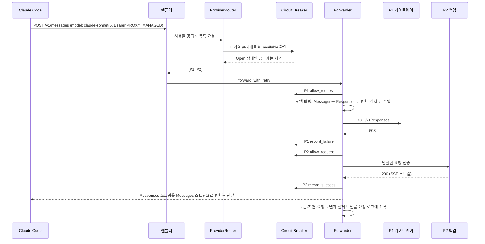
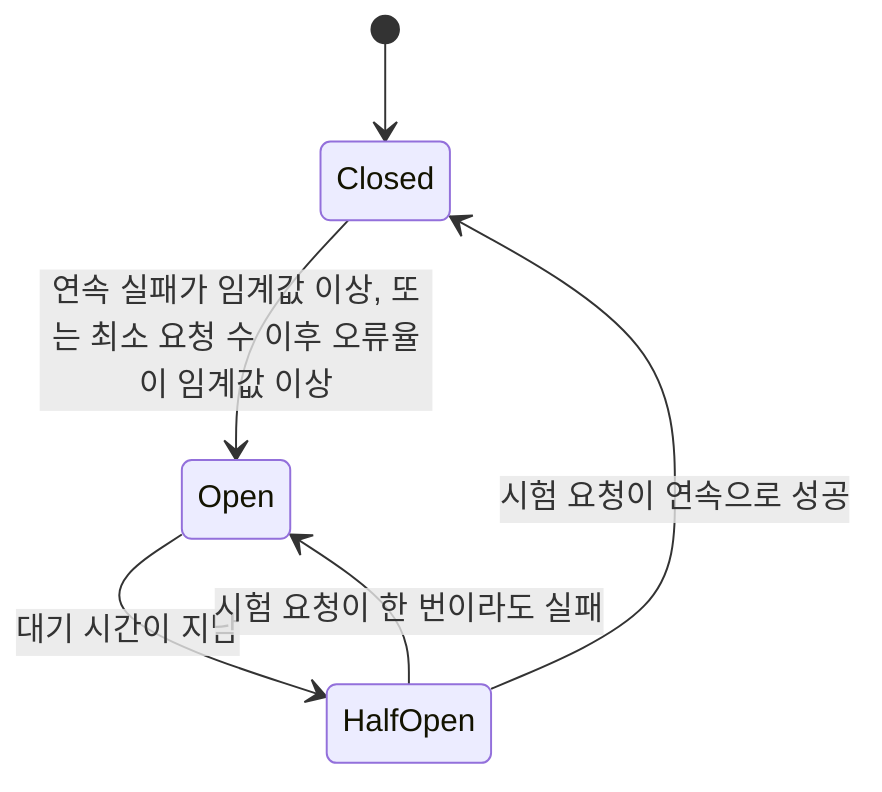

# CC Switch 로컬 라우팅 깊이 보기

> 로컬 라우팅이 도구 설정에 무엇을 써 넣는지, 요청 하나가 어떤 단계를 거쳐 공급자에게 가는지, 실패했을 때 어떤 오류는 다음 공급자로 넘기고 어떤 오류는 그대로 돌려주는지, circuit breaker가 언제 공급자를 빼고 되돌리는지를 실제 소스 코드 기준으로 다룹니다.

## 로컬 라우팅은 무엇을 하는가

### 한 줄로 정의하면

로컬 라우팅은 **CC Switch 앱 안에서 도는 HTTP 프록시**입니다. 도구는 공급자 대신 `http://127.0.0.1:15721`로 요청을 보내고, CC Switch가 지금 골라 둔 공급자에게 요청을 넘깁니다. 넘기는 과정에서 세 가지 일을 합니다.

1. **형식 변환**: Anthropic Messages, OpenAI Chat Completions, OpenAI Responses, Gemini Native 사이를 요청과 스트리밍 응답 모두 변환합니다.
2. **자격 증명 주입**: 도구 설정에는 자리표시자만 있고, 실제 키는 CC Switch가 보낼 때 붙입니다.
3. **장애 조치와 기록**: 실패하면 대기열의 다음 공급자로 넘기고, 요청마다 토큰·지연·오류를 로그로 남깁니다.

비유하면 회사 대표 번호의 교환원입니다. 직원(도구)은 항상 대표 번호(127.0.0.1)로만 전화하고, 교환원이 담당자에게 연결합니다. 담당자가 자리에 없으면 다음 담당자에게 돌리고, 외국 지사라면 통역도 합니다. 직원의 휴대폰에는 담당자들의 개인 번호(키)가 저장되지 않습니다.

### 직결과 무엇이 다른가

| 항목 | 직결 | 로컬 라우팅 |
|---|---|---|
| live 설정의 주소 | 공급자 주소 | `http://127.0.0.1:15721` |
| live 설정의 키 | 실제 키 | `PROXY_MANAGED` (자리표시자) |
| 공급자 전환 | live 파일의 핵심 필드 교체 | 라우팅 대상만 바뀜. 계약이 같으면 live 파일을 읽지도 쓰지도 않음 |
| 형식이 다른 공급자 | 사용 불가 | 변환해서 사용 |
| 장애 조치 | 없음 | 도구별 대기열 + circuit breaker |
| CC Switch가 꺼지면 | 도구는 계속 동작 | 종료 시 직결 공급자를 다시 써 놓고, 다음 실행 때 라우팅에 다시 연결 |

---

## 도구 설정에 무엇이 들어가는가: 라우팅 계약

라우팅을 켜면 CC Switch는 도구의 live 파일에 "라우팅 계약(contract)"을 씁니다. Claude Code를 예로 들면 쓰기 엔진의 Claude 투영 코드(`live/project/claude.rs`)가 다음 값을 만듭니다.

```json
{
  "env": {
    "ANTHROPIC_BASE_URL": "http://127.0.0.1:15721",
    "ANTHROPIC_AUTH_TOKEN": "PROXY_MANAGED",
    "ANTHROPIC_DEFAULT_SONNET_MODEL": "claude-sonnet-5",
    "ANTHROPIC_DEFAULT_OPUS_MODEL": "claude-opus-5",
    "ANTHROPIC_DEFAULT_HAIKU_MODEL": "claude-haiku-4-5"
  }
}
```

- **주소**: 로컬 라우팅 주소입니다. 포트와 리슨 주소는 설정에서 바꿀 수 있고, 기본값은 `127.0.0.1:15721`입니다.
- **인증 값**: 라우팅 대상 공급자가 `ANTHROPIC_AUTH_TOKEN`과 `ANTHROPIC_API_KEY` 중 무엇을 쓰는지 따라 같은 이름의 키에 `PROXY_MANAGED`를 씁니다. 둘 다 쓰면 Claude Code가 경고를 내고, Codex 계열 공급자는 `AUTH_TOKEN`이 없으면 로그인 창이 뜨는 문제가 있어서 코드에 공급자별 규칙이 있습니다.
- **모델**: 역할별로 **고정 별칭**을 씁니다. 공급자를 바꿔도 live 파일을 다시 쓰지 않아도 되도록, 실제 모델 이름은 라우팅이 요청을 보낼 때 모델 매핑으로 바꿉니다. `/model` 메뉴의 표시 이름은 라우팅 대상 공급자를 따라갑니다.
- **나머지 핵심 필드는 비웁니다**: Bedrock·Vertex 선택자나 `/model`로 고른 값이 남아 있으면 Claude Code가 라우팅을 우회하기 때문입니다.

이 설계 덕분에 라우팅 모드에서 공급자를 바꾸는 일은 **파일 쓰기 없이 메모리의 라우팅 대상만 바꾸는 일**이 됩니다. Claude Code뿐 아니라 Codex, Gemini CLI, Grok Build도 다음 요청부터 새 공급자로 갑니다(모델이 바뀌는 경우에는 도구가 모델 목록을 다시 읽도록 재시작이 필요할 수 있습니다). 장애 조치로 공급자가 바뀔 때도 클라이언트 파일은 건드리지 않습니다.

---

## 서버는 어떻게 생겼는가

로컬 라우팅은 Rust의 axum 라우터를 hyper HTTP/1.1 연결 루프 위에 올린 구조입니다(`proxy/server.rs`). 굳이 연결 루프를 직접 짠 이유가 소스 주석에 있습니다. 도구가 보낸 **헤더 이름의 대소문자를 그대로 보존**해서 업스트림에 보내기 위해서입니다. 일반적인 HTTP 서버는 헤더 이름을 소문자로 바꾸는데, 그러면 프록시를 거친 요청이 직접 보낸 요청과 미세하게 달라지고, 클라이언트 식별에 민감한 업스트림에서 문제가 될 수 있습니다.

주요 경로는 다음과 같습니다.

| 경로 | 받는 형식 | 누가 보내는가 |
|---|---|---|
| `/v1/messages`, `/claude/v1/messages` | Anthropic Messages | Claude Code |
| `/claude-desktop/v1/models`, `/claude-desktop/v1/messages` | Anthropic Messages | Claude Desktop(모델 매핑) |
| `/v1/chat/completions`, `/codex/v1/chat/completions` | OpenAI Chat Completions | Codex(Chat 공급자 설정) 등 |
| `/v1/responses`, `/codex/v1/responses` | OpenAI Responses (GET은 WebSocket 핸드셰이크) | Codex |
| `/v1/responses/compact` | Responses 원격 압축 | Codex |
| `/grokbuild/v1/responses` | Responses | Grok Build(별도 대기열) |
| `/v1/models` | 모델 목록 | Codex 연결 확인, 집계 모드의 모델 목록 |
| `/health`, `/status` | 상태 확인 | 사용자, UI |

`/v1/v1/...` 같은 중복 경로도 등록되어 있습니다. 도구 쪽 주소 설정에 `/v1`이 한 번 더 붙는 경우까지 받아 주려는 것으로 보입니다. 요청 본문 한도는 200MB입니다.

---

## 요청 하나가 처리되는 흐름

Claude Code가 OpenAI Responses 형식 게이트웨이를 라우팅 대상으로 쓰고, 장애 조치 대기열이 `P1 게이트웨이 → P2 백업`인 상황을 따라가 보겠습니다.



1. **진입**: 핸들러가 경로로 도구 종류를 알아냅니다. `/v1/messages`면 Claude Code입니다. 인증 헤더의 `PROXY_MANAGED`는 검사하지 않고, 업스트림에 보낼 때 실제 키로 바꿉니다.
2. **공급자 목록 만들기**(`proxy/provider_router.rs`의 `select_providers`):
   - 자동 장애 조치가 꺼져 있으면 지금 쓰는 공급자 하나만 돌려줍니다. 이때는 circuit breaker도 건너뜁니다.
   - 켜져 있으면 대기열 순서(P1, P2, ...)대로 공급자를 보면서, circuit breaker가 Open인 공급자는 뺍니다.
   - 모두 Open이면 "모든 공급자가 차단됨" 오류를, 대기열이 비었으면 "공급자 없음" 오류를 돌려줍니다.
   - Codex의 OpenAI Official 카드는 대기열에 넣어도 건너뜁니다. 사용자가 고른 ChatGPT 계정의 인증 헤더를 다른 카드로 다시 보내면 계정 경계를 넘기 때문입니다.
3. **시도 횟수 제한**: Forwarder는 목록을 순서대로 시도하되, 최대 `max_retries + 1`개 공급자까지만 시도합니다. 같은 공급자를 여러 번 재시도하는 것이 아니라 **다음 공급자로 넘어가는 횟수**라는 점이 중요합니다.
4. **변환과 전송**: 공급자의 API 형식에 맞는 변환기(`proxy/providers/transform_*.rs`)가 요청 본문을 바꾸고, 모델 매핑을 적용하고, 실제 키를 붙여 보냅니다. Bedrock 공급자에는 thinking 최적화나 캐시 주입 같은 전용 처리가 공급자마다 따로 적용됩니다(다른 공급자로 넘어갈 때 섞이지 않도록 본문을 복제해서 씁니다).
5. **응답 변환과 기록**: 스트리밍 응답을 도구가 기대하는 형식으로 다시 바꿔 흘려보내고, 사용량 로그에 기록합니다. 장애 조치로 다른 공급자가 성공하면 UI와 트레이에도 "지금 쓰는 공급자"가 바뀐 것으로 표시됩니다.

---

## 어떤 실패에서 다음 공급자로 넘어가는가

모든 실패에서 다음 공급자로 넘어가면 안 됩니다. 요청 자체가 잘못되었다면 어느 공급자로 보내도 실패하고, 그 실패가 멀쩡한 공급자들의 건강 기록까지 망가뜨립니다. Forwarder의 `categorize_proxy_error`는 오류를 두 갈래로 나눕니다.

| 분류 | 오류 | 동작 |
|---|---|---|
| 다음 공급자로 (Retryable) | 타임아웃, 연결 실패, 스트림 중간 멈춤, 변환·설정 오류, 인증 오류, 업스트림 401·403·404·408·409·429 및 모든 5xx | 실패를 circuit breaker와 DB에 기록하고 다음 공급자 시도 |
| 그대로 반환 (NonRetryable) | 업스트림 400, 405, 406, 413, 414, 415, 422, 501 | 공급자 건강 기록에 반영하지 않고 바로 오류 반환 |
| 그대로 반환 (클라이언트 중단) | 도구 쪽에서 연결을 끊음 | 위와 같음 |

몇 가지 판단이 눈에 띕니다.

- **401·403도 넘깁니다.** 다른 공급자는 다른 키, 다른 할당량을 갖고 있을 수 있기 때문입니다.
- **404도 넘깁니다.** 공급자마다 모델 이름이나 경로가 달라서 한 곳에서 없는 모델이 다른 곳에는 있을 수 있습니다.
- **400·422는 넘기지 않습니다.** 요청 본문 자체의 문제라서, 넘겨 봐야 오류율만 올리고 할당량만 씁니다.
- **예외도 있습니다.** Codex OpenAI Official 경로의 오류와 xAI OAuth 계정의 인증 오류는 넘기지 않습니다. 계정 단위 문제를 다른 공급자로 조용히 옮기면 사용자가 고른 계정에서 대화가 벗어나기 때문입니다.

넘기기 전에 **같은 공급자에서 한 번 고쳐서 다시 보내는 단계**도 있습니다. 이를 정류기(Rectifier)라고 부릅니다. 예를 들어 다른 공급자가 만든 thinking 서명을 거부하는 업스트림에는 서명을 정리해서, 이미지를 지원하지 않는 업스트림에는 이미지를 빼서, 검증할 수 없는 암호화 상태를 거부하는 Responses 업스트림에는 그 부분을 지워서 한 번 다시 보냅니다(4.0). 정류기 재시도는 공급자마다 한 번씩만 일어납니다.

---

## Circuit breaker는 언제 공급자를 빼고 되돌리는가

### 세 가지 상태

`proxy/circuit_breaker.rs`는 공급자마다(`앱:공급자ID` 단위) 차단기 하나를 둡니다.



- **Closed**: 정상입니다. 요청을 그대로 보냅니다. 성공하면 연속 실패 수를 0으로 되돌립니다.
- **Open**: 차단 상태입니다. 공급자 목록을 만들 때 이 공급자를 뺍니다.
- **HalfOpen**: 대기 시간이 지나면 시험 요청을 제한된 수만 보내 봅니다. 성공이 정해진 횟수 쌓이면 Closed로, 한 번이라도 실패하면 다시 Open으로 갑니다. 시험 요청 자리는 요청이 끝난 뒤 반드시 반납하도록 되어 있어서, 반납이 빠지면 그 공급자가 오래 복구되지 못합니다.

NonRetryable 오류와 클라이언트 중단은 여기에 실패로 세지 않습니다. 사용자가 Esc로 응답을 끊을 때마다 공급자가 "불안정"하다고 기록되면 안 되기 때문입니다.

### 기본값

앱마다 기본값이 다릅니다. DB 스키마(`database/schema.rs`)가 처음 만들 때 넣는 값입니다.

| 설정 | Claude | Codex | Gemini | Grok Build |
|---|---|---|---|---|
| 다음 공급자로 넘기는 최대 횟수(`max_retries`) | 6 | 3 | 5 | 3 |
| 차단까지 연속 실패 수 | 8 | 4 | 4 | 4 |
| 복구까지 연속 성공 수 | 3 | 2 | 2 | 2 |
| 차단 후 대기 시간(초) | 90 | 60 | 60 | 60 |
| 오류율 임계값 | 70% | 60% | 60% | 60% |
| 오류율 계산 최소 요청 수 | 15 | 10 | 10 | 10 |
| 스트리밍 첫 바이트 타임아웃(초) | 90 | 60 | 60 | 60 |
| 스트리밍 무응답 타임아웃(초) | 180 | 120 | 120 | 120 |
| 비스트리밍 타임아웃(초) | 600 | 600 | 600 | 600 |

Claude 쪽이 더 너그러운 이유는 요청이 길고 무거워서, 같은 기준이면 정상적인 느린 응답까지 실패로 판정하기 쉽기 때문입니다. 이 값들은 설정의 장애 조치 영역에서 바꿀 수 있고, 바꾸면 이미 만들어진 차단기에도 상태를 초기화하지 않고 바로 반영됩니다.

---

## 집계 모드에서는 무엇이 다른가

집계 모드(4.0, 코드 이름 Stack)는 같은 로컬 라우팅 서버를 쓰지만 요청 경로가 다릅니다.

- 모델 ID에 공급자 접두사가 붙어 있습니다. Claude Code는 `ccs-claude-<키>--<모델>`, Codex는 `ccs-<키>/<모델>`입니다.
- 접두사가 붙은 요청은 **그 공급자로 바로** 갑니다. circuit breaker, 상태 카운터, 장애 조치, 모델 매핑을 모두 건너뜁니다.
- 접두사가 없는 요청은 기본 공급자로만 갑니다.
- 집계 모드가 아닐 때 접두사가 붙은 모델 ID가 오면 라우팅 대상으로 대신 보내지 않고 오류를 돌려줍니다. 오래된 모델 목록을 가진 도구가 엉뚱한 공급자로 요청하는 것을 막기 위해서입니다.

라우팅이 "한 공급자 + 예비 공급자들"이라면, 집계는 "여러 공급자 중 사용자가 명시적으로 고른 곳"입니다. 사용자가 고른 것이므로 몰래 다른 곳으로 넘기지 않는 것이 설계 의도입니다.

---

## 직접 확인해 보기: 일부러 실패하는 공급자로 장애 조치 관찰하기

장애 조치와 오류 분류는 직접 보면 금방 이해됩니다. 항상 실패하는 가짜 공급자를 만들어 대기열 P1에 넣고 관찰합니다.

```ts
// scripts/fake-upstream.ts
// 실행: STATUS=503 npx tsx scripts/fake-upstream.ts
import { createServer } from 'node:http';

const status = Number(process.env.STATUS ?? 503);
let count = 0;

createServer((req, res) => {
  count += 1;
  console.log(`#${count} ${req.method} ${req.url} -> ${status}`);
  res.writeHead(status, { 'content-type': 'application/json' });
  res.end(JSON.stringify({ type: 'error', error: { type: 'fake_error', message: `forced ${status}` } }));
}).listen(18080, '127.0.0.1', () => console.log(`fake upstream on :18080, always ${status}`));
```

1. Claude Code에 사용자 설정 공급자 "Fake"를 추가합니다. 주소는 `http://127.0.0.1:18080`, 키는 아무 값, API 형식은 Anthropic Messages입니다.
2. 로컬 라우팅과 Claude Code 라우팅을 켜고, 자동 장애 조치 대기열을 `P1 Fake → P2 실제 공급자`로 만들고 장애 조치를 켭니다.
3. `STATUS=503`으로 가짜 서버를 띄우고 Claude Code에서 질문합니다. 가짜 서버 로그에 요청이 찍히고, 응답은 P2에서 정상으로 옵니다. 요청 로그에서 실패와 성공 공급자를 확인할 수 있습니다.
4. 몇 번 더 질문하면 Fake의 연속 실패가 임계값(Claude 기본 8)에 닿아 차단되고, 그 뒤로는 가짜 서버 로그에 요청이 찍히지 않습니다. 90초가 지나면 시험 요청이 한 번 들어오는 것도 볼 수 있습니다.
5. `STATUS=400`으로 다시 띄우면 이번에는 P2로 넘어가지 않고 Claude Code에 오류가 그대로 표시됩니다. 400은 "요청 자체의 문제"로 분류되기 때문입니다.

실습이 끝나면 Fake 공급자를 대기열에서 빼고 삭제합니다. P2로 넘어간 요청은 실제 토큰을 쓰므로, 짧은 질문으로 시험합니다.

---

## 정리: 로컬 라우팅을 쓸 때 기억할 것

- 로컬 라우팅은 **선택 기능**입니다. 형식이 같고 장애 조치가 필요 없다면 직결이 더 단순하고 실패 지점도 적습니다.
- 라우팅 중 live 파일에는 로컬 주소와 `PROXY_MANAGED`만 있습니다. CC Switch가 꺼진 상태에서 도구가 요청하면 연결 오류가 나는 것이 정상이며, 정상 종료라면 CC Switch가 직결 공급자를 다시 써 둡니다.
- 장애 조치는 "공급자를 넘기는 횟수"로 제한되고, 요청 자체의 문제(400·422 등)는 넘기지 않습니다.
- circuit breaker는 공급자 단위로 동작하며, 사용자가 끊은 요청이나 요청 오류는 실패로 세지 않습니다.
- 라우팅 포트는 인증 없이 실제 키를 붙여 보내므로, 리슨 주소를 `127.0.0.1`이 아닌 값으로 바꾸지 않습니다.

---

[← 장단점과 대안 비교](06-comparison.md) · [목차](README.md) · [주의할 점과 FAQ →](08-pitfalls-faq.md)
