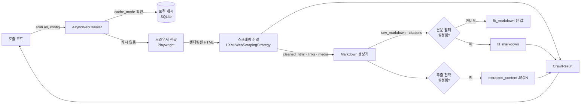
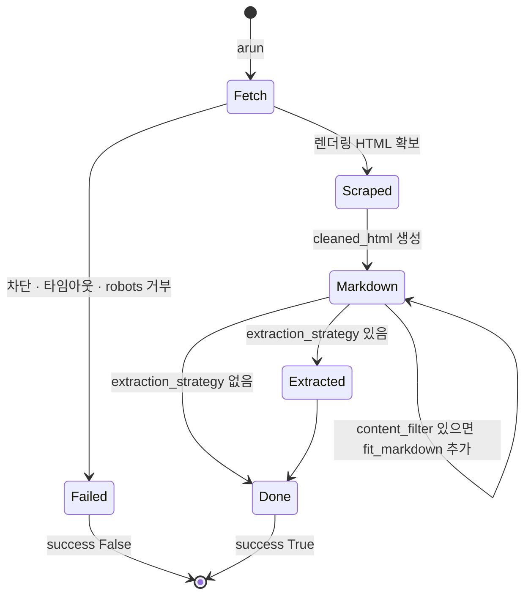

# Crawl4AI 핵심 개념과 동작 구조

> Crawl4AI를 이루는 크롤러 객체, 두 가지 설정 객체, 결과 객체, 전략 객체, 캐시 모드, 세 가지 실행 형태가 각각 무엇이고 어떻게 맞물려 동작하는지 다룹니다.

## 용어 한눈에 보기

| 키워드 | 설명 |
|---|---|
| `AsyncWebCrawler` | 브라우저를 띄우고 URL을 크롤링하는 비동기 크롤러 본체. `arun()`, `arun_many()` 제공 |
| `BrowserConfig` | 브라우저 단위 설정. 엔진 종류, headless, 프록시, 프로필, stealth 등 |
| `CrawlerRunConfig` | 크롤 한 번 단위 설정. 캐시, 대기 조건, 본문 필터, 추출 전략, deep crawl 등 |
| `CrawlResult` | 크롤 결과. HTML, 정제된 HTML, Markdown, 링크, 미디어, 추출 JSON, 성공 여부 |
| raw / fit Markdown | 정제된 HTML 전체를 변환한 Markdown / 본문 필터를 거친 Markdown |
| Strategy | 스크래핑·Markdown 생성·본문 필터·추출·청크 분할·deep crawl을 담당하는 교체 가능한 객체 |
| `CacheMode` | 로컬 캐시를 읽을지·쓸지 정하는 값. `CrawlerRunConfig` 기본값은 `BYPASS` |
| Dispatcher | `arun_many()`에서 동시 실행 수와 속도를 조절하는 객체 |
| Docker 서버 | 같은 엔진을 REST API와 MCP로 감싼 자체 호스팅 서버 (기본 포트 11235) |

---

## 1. AsyncWebCrawler (크롤러 본체)

### 쉽게 설명하면

웹 페이지를 대신 열어 주는 "브라우저 담당 직원"입니다. 출근할 때 브라우저를 한 번 켜 두고, 요청이 올 때마다 새 탭을 열어 페이지를 읽은 뒤, 퇴근할 때 브라우저를 닫습니다.

### 개발 관점에서는

`AsyncWebCrawler`는 Playwright 브라우저의 수명주기를 관리하는 asyncio 객체입니다. `async with` 블록에 들어갈 때 브라우저를 시작하고, 블록을 나올 때 정리합니다. 블록 안에서는 같은 브라우저를 재사용하므로, URL마다 크롤러를 새로 만드는 것보다 훨씬 빠릅니다.

- `arun(url, config)`: URL 하나를 크롤링합니다. `https://` 외에 `file://`(로컬 파일), `raw:`(HTML 문자열)도 받습니다.
- `arun_many(urls, config, dispatcher)`: 여러 URL을 동시에 크롤링합니다. 기본 dispatcher는 메모리 사용량을 보고 동시 실행 수를 조절하는 `MemoryAdaptiveDispatcher`입니다.

### 예제

```python
import asyncio
from crawl4ai import AsyncWebCrawler

async def main():
    async with AsyncWebCrawler() as crawler:  # 여기서 브라우저 시작
        a = await crawler.arun("https://example.com")
        b = await crawler.arun("raw:<h1>안녕하세요</h1><p>HTML 문자열도 됩니다.</p>")
        print(a.markdown[:200])
        print(b.markdown)
    # 블록을 나오면 브라우저 종료

asyncio.run(main())
```

### 핵심

> 크롤러는 "브라우저 하나를 오래 쓰는 객체"입니다. 요청마다 새로 만들지 말고, 작업 단위로 한 번 열어 여러 URL에 재사용합니다.

## 2. BrowserConfig와 CrawlerRunConfig (설정의 두 층)

### 쉽게 설명하면

"어떤 차를 탈지"와 "이번에 어디를 어떻게 갈지"를 나눈 것입니다. 차종·타이어·블랙박스는 한 번 정하면 계속 쓰고(BrowserConfig), 목적지·경유지·주차 방식은 매번 다르게 정합니다(CrawlerRunConfig).

### 개발 관점에서는

- **`BrowserConfig`**: 크롤러를 만들 때 한 번 넘깁니다. `browser_type`(chromium·firefox·webkit), `headless`, `proxy_config`, `user_data_dir` + `use_persistent_context`(로그인 프로필 유지), `enable_stealth`, `text_mode`(이미지 끄기) 같은 브라우저 자체의 성질을 정합니다.
- **`CrawlerRunConfig`**: `arun()`마다 넘깁니다. `cache_mode`, `wait_for`(특정 요소가 나타날 때까지 대기), `js_code`, `scan_full_page`(끝까지 스크롤), `excluded_tags`, `markdown_generator`, `extraction_strategy`, `deep_crawl_strategy`, `stream`, `check_robots_txt` 같은 "이번 크롤의 방식"을 정합니다.

두 설정을 나눈 덕분에, 브라우저는 하나만 띄워 두고 페이지 종류마다 다른 실행 설정을 쓸 수 있습니다. 설정 객체는 `clone()`으로 일부 값만 바꾼 사본을 만들 수 있습니다.

### 예제

```python
from crawl4ai import BrowserConfig, CrawlerRunConfig, CacheMode

browser_cfg = BrowserConfig(headless=True, text_mode=True)  # 이미지 로딩 끄기

base_run = CrawlerRunConfig(
    cache_mode=CacheMode.ENABLED,
    excluded_tags=["nav", "footer"],
)
# 목록 페이지는 끝까지 스크롤, 상세 페이지는 특정 요소를 기다림
list_run = base_run.clone(scan_full_page=True, scroll_delay=0.5)
detail_run = base_run.clone(wait_for="css:article.product-detail")
```

`wait_for`는 `css:` 접두사로 CSS 선택자를, `js:` 접두사로 참이 될 때까지 기다릴 JavaScript 식을 받습니다.

### 핵심

> 브라우저의 성질은 `BrowserConfig`, 크롤 한 번의 방식은 `CrawlerRunConfig`입니다. 예전 글에서 보이는 `arun(url, bypass_cache=True, ...)`처럼 키워드 인자를 직접 넘기는 방식은 하위 호환용이고, 지금은 설정 객체를 넘기는 방식이 권장됩니다.

## 3. CrawlResult와 두 종류의 Markdown

### 쉽게 설명하면

크롤링 결과는 "원본 사진 + 보정한 사진 + 요약 메모"가 한 봉투에 들어 있는 것과 같습니다. 원본 HTML, 군더더기를 뺀 HTML, 전체 Markdown, 본문만 남긴 Markdown, 추출한 데이터가 함께 들어 있습니다.

### 개발 관점에서는

`CrawlResult`의 주요 필드는 다음과 같습니다.

| 필드 | 내용 |
|---|---|
| `success`, `status_code`, `error_message` | 성공 여부와 실패 이유. **실패해도 예외가 아니라 결과로 돌아오므로 반드시 확인** |
| `html` / `cleaned_html` | 브라우저가 렌더링한 원본 HTML / 스크래핑 전략이 정제한 HTML |
| `markdown` | Markdown 결과. 문자열처럼 쓰면 `raw_markdown`이고, 속성으로 다른 버전에 접근 |
| `markdown.raw_markdown` | 정제된 HTML 전체를 변환한 Markdown |
| `markdown.markdown_with_citations` / `references_markdown` | 링크를 `⟨1⟩` 번호로 바꾼 본문 / 번호별 URL 목록 |
| `markdown.fit_markdown` / `fit_html` | 본문 필터를 거친 Markdown / 그 입력이 된 HTML 조각. **필터를 설정하지 않으면 빈 문자열** |
| `extracted_content` | 추출 전략의 결과(JSON 문자열) |
| `links`, `media`, `tables`, `metadata` | 내부·외부 링크, 이미지·영상, 표, 제목·설명 등 메타데이터 |

### 예제

```python
result = await crawler.arun("https://example.com", config=run_cfg)

if not result.success:
    print(result.status_code, result.error_message)
else:
    print(result.markdown)                     # raw_markdown과 같음 (str 하위 클래스)
    print(result.markdown.fit_markdown)        # 필터가 없으면 ""
    print(len(result.links["internal"]))       # 같은 도메인 링크 수
```

### 핵심

> `raw_markdown`은 "빠짐없이", `fit_markdown`은 "본문만"입니다. `fit_markdown`이 비어 있다면 버그가 아니라 본문 필터를 설정하지 않았기 때문입니다.

## 4. 전략(Strategy) 객체

### 쉽게 설명하면

조립 라인의 교체 가능한 부품입니다. "본문 거르는 부품"을 점수 기반에서 질의 기반으로 바꾸거나, "데이터 뽑는 부품"을 CSS 규칙에서 LLM으로 바꿔도 나머지 라인은 그대로 돌아갑니다.

### 개발 관점에서는

Crawl4AI의 처리 단계는 대부분 `CrawlerRunConfig`에 끼우는 전략 객체로 표현됩니다.

| 단계 | 설정 위치 | 대표 구현 |
|---|---|---|
| 스크래핑(HTML 정제·링크·미디어 수집) | `scraping_strategy` | `LXMLWebScrapingStrategy`(기본) |
| Markdown 생성 | `markdown_generator` | `DefaultMarkdownGenerator`(기본) |
| 본문 필터 | `DefaultMarkdownGenerator(content_filter=...)` | `PruningContentFilterLXML`, `BM25ContentFilter`, `LLMContentFilter` |
| 구조화 추출 | `extraction_strategy` | `JsonCssExtractionStrategy`, `JsonXPathExtractionStrategy`, `RegexExtractionStrategy`, `LLMExtractionStrategy`, `CosineStrategy` |
| 청크 분할(LLM 추출 입력) | `chunking_strategy` | `RegexChunking`, 문장·토픽 기반 청크 |
| 여러 페이지 탐색 | `deep_crawl_strategy` | `BFSDeepCrawlStrategy`, `DFSDeepCrawlStrategy`, `BestFirstCrawlingStrategy` |

### 예제

```python
from crawl4ai import CrawlerRunConfig, JsonCssExtractionStrategy
from crawl4ai.content_filter_strategy import BM25ContentFilter
from crawl4ai.markdown_generation_strategy import DefaultMarkdownGenerator

run_cfg = CrawlerRunConfig(
    # 질의와 관련 있는 문단만 fit_markdown에 남긴다
    markdown_generator=DefaultMarkdownGenerator(
        content_filter=BM25ContentFilter(user_query="refund policy", bm25_threshold=1.0)
    ),
    # 같은 크롤에서 FAQ 항목을 JSON으로도 뽑는다
    extraction_strategy=JsonCssExtractionStrategy({
        "name": "faq",
        "baseSelector": "details.faq-item",
        "fields": [
            {"name": "question", "selector": "summary", "type": "text"},
            {"name": "answer", "selector": "div.answer", "type": "text"},
        ],
    }),
)
```

### 핵심

> 무엇을 바꾸고 싶은지 먼저 정하고, 그 단계의 전략만 바꿉니다. Markdown 생성과 본문 필터의 내부 동작은 [Markdown 생성 파이프라인 깊이 보기](07-markdown-pipeline.md)에서 자세히 다룹니다.

## 5. CacheMode (로컬 캐시)

### 쉽게 설명하면

한 번 복사해 둔 페이지를 다시 복사하지 않고 서랍에서 꺼내 쓰는 기능입니다. 다만 Crawl4AI는 기본값이 "서랍을 쓰지 않음"입니다.

### 개발 관점에서는

크롤 결과는 `~/.crawl4ai/crawl4ai.db`(SQLite)에 캐시될 수 있습니다. 위치는 `CRAWL4_AI_BASE_DIRECTORY` 환경 변수로 바꿉니다. `CrawlerRunConfig`의 `cache_mode` 기본값은 **`CacheMode.BYPASS`**라서, 아무것도 지정하지 않으면 매번 새로 가져오고 캐시에 쓰지도 않습니다.

| 값 | 읽기 | 쓰기 | 용도 |
|---|:-:|:-:|---|
| `ENABLED` | O | O | 개발 중 같은 페이지를 반복 실험할 때, 재실행 가능한 배치 |
| `READ_ONLY` | O | X | 캐시된 결과로만 후처리를 다시 돌릴 때 |
| `WRITE_ONLY` | X | O | 항상 새로 받되 다음 실행을 위해 저장할 때 |
| `BYPASS` | X | X | 기본값. 매번 최신 페이지가 필요할 때 |
| `DISABLED` | X | X | 캐시 기능 자체를 쓰지 않을 때 |

`check_cache_freshness=True`를 주면 캐시를 쓰기 전에 ETag·Last-Modified로 원본이 바뀌었는지 확인합니다.

### 핵심

> 개발 중에는 `ENABLED`로 같은 사이트를 반복해서 두드리지 않게 하고, 운영 배치에서는 신선도 요구에 맞게 고릅니다.

## 6. 세 가지 실행 형태

### 쉽게 설명하면

같은 엔진을 "내 차에 직접 달기", "회사 차고에 한 대 두고 같이 쓰기", "택시 부르기" 중에서 고르는 것입니다.

### 개발 관점에서는

| 형태 | 브라우저를 돌리는 곳 | 호출 방식 | 비용 | 특징 |
|---|---|---|---|---|
| Python 라이브러리 | 내 Python 프로세스 | `AsyncWebCrawler` | 무료 | 모든 기능(JS 실행, 세션, hook 함수, deep crawl) 사용 가능 |
| Docker 서버 | 내가 운영하는 컨테이너 | REST, MCP, Python `Crawl4aiDockerClient` | 무료(호스팅 비용) | 다른 언어·에이전트가 공유. 보안상 일부 설정은 네트워크로 받지 않음 |
| Crawl4AI Cloud | 운영사 | REST(`api.crawl4ai.com`), MCP | 종량제 | 봇 차단·JS 페이지를 자동 처리, `/search`·`/answer` 같은 클라우드 전용 기능 |

Docker 서버는 v0.9.0부터 `js_code`, `proxy_config`, `cookies`, `headers`, `session_id`, `deep_crawl_strategy` 같은 필드를 네트워크 요청으로 받으면 HTTP 400으로 거부합니다. 이런 기능이 필요하면 서버 쪽 설정으로 고정하거나 라이브러리를 직접 써야 합니다. 자세한 내용은 [활용 예시 ③ 자체 서버·에이전트·운영](05-usage-self-hosted-server.md)에서 다룹니다.

### 핵심

> 기능이 가장 넓은 것은 라이브러리입니다. 서버와 클라우드는 "공유와 운영 편의"를 얻는 대신 요청으로 할 수 있는 일이 좁아집니다.

---

## 7. 전체 동작 구조

`arun()` 한 번이 처리되는 흐름은 다음과 같습니다.



1. **시작점**: 호출 코드가 `arun(url, config)`를 부릅니다. 크롤러가 아직 시작되지 않았다면 이때 브라우저를 띄웁니다.
2. **Crawl4AI가 개입하는 시점**: `cache_mode`가 읽기를 허용하면 로컬 캐시를 먼저 봅니다. 캐시가 없으면 `check_robots_txt`, 프록시 회전, 재시도 설정을 반영해 브라우저로 페이지를 엽니다. 이때 `wait_for`, `js_code`, `scan_full_page` 같은 페이지 조작이 실행됩니다.
3. **내부 처리**: 렌더링된 HTML을 스크래핑 전략이 정제해 `cleaned_html`, 링크, 미디어, 표, 메타데이터를 만듭니다. Markdown 생성기가 이를 `raw_markdown`으로 바꾸고 링크를 인용 번호로 정리합니다. 본문 필터가 있으면 같은 입력에서 `fit_markdown`을 따로 만듭니다.
4. **외부 시스템과의 연결**: 추출 전략이 있으면 지정한 입력 형식(HTML, Markdown, fit Markdown)으로 JSON을 만듭니다. LLM 추출이라면 이 단계에서 LiteLLM을 통해 외부 모델 API를 호출합니다. deep crawl이라면 결과의 링크가 다음 크롤 대기열로 들어갑니다.
5. **결과 반환**: 모든 결과를 `CrawlResult`에 담아 돌려주고, 캐시 쓰기가 허용되면 저장합니다. 실패도 `success=False`인 결과로 돌아옵니다.

결과의 상태 변화를 단계로 보면 다음과 같습니다.



---

[← 개요](README.md) · [설치와 첫 사용 →](02-getting-started.md)
