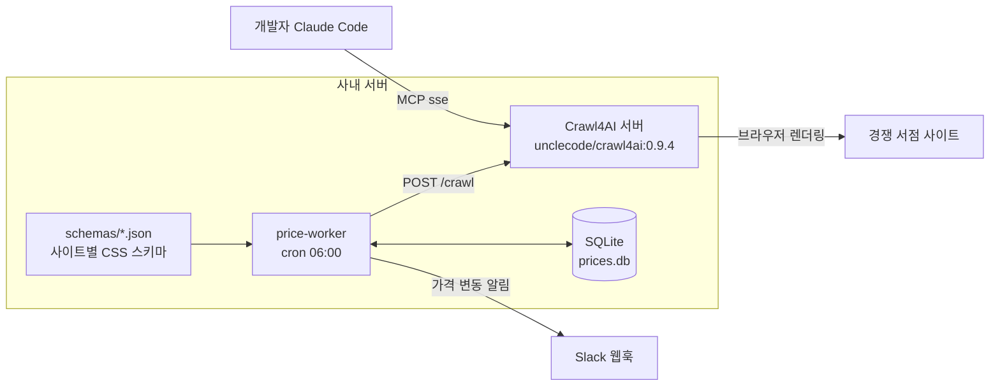

# Crawl4AI 활용 예시 ③ 자체 서버·에이전트·운영

> Crawl4AI를 Docker 서버로 띄워 여러 서비스와 AI 에이전트가 함께 쓰는 방법, 서버가 받아 주지 않는 요청과 그 이유, 그리고 작은 가격 모니터링 서비스에 실제로 적용하는 과정을 다룹니다.

## 서버 환경에서의 활용

Crawl4AI를 서버에서 쓰는 방법은 두 가지입니다.

- **라이브러리 내장**: 백엔드 워커 프로세스가 `AsyncWebCrawler`를 직접 import합니다. 기능 제약이 없고 네트워크 홉이 없지만, 워커마다 브라우저를 띄우므로 메모리를 많이 씁니다.
- **Docker 서버**: 크롤링을 별도 서비스로 분리하고, 다른 서비스와 에이전트는 REST·MCP로 호출합니다. 언어에 상관없이 쓸 수 있고 브라우저 풀을 한곳에서 관리하지만, 보안 경계 때문에 요청으로 넘길 수 있는 설정이 제한됩니다.

### 활용 사례

- **사내 공용 크롤링 서비스**: Node.js·Go 백엔드, 데이터 팀 노트북, 배치 작업이 같은 서버의 `/md`, `/crawl`을 호출합니다. 브라우저 설치와 업데이트는 서버 하나에서만 관리합니다.
- **에이전트의 웹 도구**: 서버의 MCP 엔드포인트(`/mcp/sse`, `/mcp/ws`)를 Claude Code 같은 에이전트에 연결하면 `md`, `html`, `screenshot`, `pdf`, `execute_js`, `crawl`, `ask` 도구가 생깁니다. `execute_js`는 서버에서 기본으로 꺼져 있습니다.
- **긴 작업 비동기 처리**: `/crawl/job`으로 작업을 큐에 넣고, 완료되면 웹훅으로 결과를 받거나 `/job/{task_id}`로 조회합니다.
- **LLM 키 중앙 관리**: LLM 제공자 키를 서버의 `.llm.env`와 `config.yml`에 두고, 요청은 제공자 이름만 고릅니다. 요청으로 LLM 엔드포인트(`base_url`)를 바꿀 수 없어 키가 외부로 새지 않습니다.
- **운영 관찰**: `/dashboard`와 `/monitor/*` API로 브라우저 풀, 진행 중 요청, 메모리를 확인합니다.

### 서버가 요청으로 받지 않는 것

v0.9.0부터 Docker 서버는 요청 본문을 "신뢰할 수 없는 입력"으로 다룹니다. 다음 필드를 네트워크로 보내면 HTTP 400을 돌려줍니다.

| 구분 | 거부되는 필드 | 이유 |
|---|---|---|
| 브라우저 | `proxy_config`, `extra_args`, `user_data_dir`, `cdp_url`, `cookies`, `headers`, `init_scripts` | 내부망 우회, 브라우저 실행 인자 주입, 서버 파일 접근 위험 |
| 실행 | `js_code`, `c4a_script`, `session_id`, `magic`, `simulate_user`, `deep_crawl_strategy` | 임의 코드 실행과 서버 자원 고갈 위험 |
| 전략 | `LLMExtractionStrategy`, `LLMContentFilter` 같은 LLM 설정 객체 | 서버 환경 변수(LLM 키) 노출 위험 |
| hook | Python 코드 문자열(`hooks.code`) | 원격 코드 실행. 대신 선언형 hook 5종(`block_resources`, `add_cookies`, `set_headers`, `scroll_to_bottom`, `wait_for_timeout`)을 `CRAWL4AI_HOOKS_ENABLED=true`일 때만 허용 |

CSS·XPath·정규식 추출, `PruningContentFilterLXML`, `BM25ContentFilter`, 캐시 모드처럼 데이터만 담긴 설정은 그대로 보낼 수 있습니다. **로그인 쿠키, 프록시, JS 조작, deep crawl이 필요한 작업은 라이브러리를 내장한 워커**로 처리하는 것이 원칙입니다.

### 애플리케이션 구조

```text
사용자 / 내부 서비스 / AI 에이전트
 ↓
리버스 프록시 (TLS 종료, 사내망만 허용)
 ↓
Crawl4AI Docker 서버 (토큰 인증, 요청 검증, egress 제한)
 ├─ /md · /crawl · /crawl/job      ← 백엔드·배치가 호출
 ├─ /mcp/sse                        ← 에이전트가 호출
 └─ 브라우저 풀 (페이지 200개마다 context 재활용)
 ↓
외부 웹사이트

복잡한 크롤링(로그인 · 프록시 · deep crawl)
 → 라이브러리를 내장한 전용 워커가 직접 처리
```

### 실제 코드

**에이전트에 MCP로 연결하기**

```bash
claude mcp add --transport sse c4ai https://crawl4ai.internal.example.com/mcp/sse \
  --header "Authorization: Bearer $CRAWL4AI_API_TOKEN"
claude mcp list
```

**다른 서비스에서 REST로 호출하기**

설정 객체는 `{"type": "클래스이름", "params": {...}}`, 일반 딕셔너리는 `{"type": "dict", "value": {...}}` 형식으로 감싸야 합니다.

```bash
curl -s https://crawl4ai.internal.example.com/crawl \
  -H "Authorization: Bearer $CRAWL4AI_API_TOKEN" \
  -H "Content-Type: application/json" \
  -d '{
    "urls": ["https://books.toscrape.com/"],
    "crawler_config": {
      "type": "CrawlerRunConfig",
      "params": {
        "cache_mode": "bypass",
        "extraction_strategy": {
          "type": "JsonCssExtractionStrategy",
          "params": {"schema": {"type": "dict", "value": {
            "name": "books", "baseSelector": "article.product_pod",
            "fields": [{"name": "title", "selector": "h3 a", "type": "attribute", "attribute": "title"}]
          }}}
        }
      }
    }
  }' | jq '.results[0].extracted_content | fromjson | .[0:3]'
```

**어느 계층에 두는가**

| 위치 | Crawl4AI 사용 방식 | 이유 |
|---|---|---|
| API 서버(요청 처리 경로) | 직접 크롤링하지 않음. DB나 캐시에 저장된 결과만 조회 | 크롤링은 수 초~수십 초가 걸리고 실패가 잦아 사용자 응답 시간을 망침 |
| 배치·워커 | REST 호출 또는 라이브러리 내장 | 정해진 시간에 반복 실행하고, 실패는 재시도·알림으로 처리 |
| 에이전트 도구 | MCP | 에이전트가 필요할 때 스스로 호출. 결과를 저장할 필요가 없음 |
| 인프라 | 별도 컨테이너, 사내망, 토큰, 리버스 프록시 | "남의 URL을 열어 주는 서버"라 SSRF와 남용의 표적이 됨 |

---

## 실전 프로젝트 적용: 온라인 서점 가격 모니터링

### 요구사항

다섯 명이 운영하는 온라인 서점에 Crawl4AI를 도입합니다.

- 매일 새벽 6시, 경쟁 서점 두 곳의 목록 페이지에서 도서 제목·가격·재고를 수집한다.
- 가격이 5% 이상 바뀌거나 재고 상태가 바뀐 도서는 Slack으로 알린다.
- 사이트별 CSS 스키마는 저장소에서 버전 관리하고, 수집에 LLM 비용을 쓰지 않는다.
- 개발자들의 Claude Code는 같은 서버를 MCP로 써서 경쟁사 페이지를 읽는다.
- 크롤링 서버는 사내망에만 열고, 토큰 없이는 쓸 수 없다.
- 수집 실패가 30%를 넘으면 작업을 실패로 처리해 운영자가 알 수 있게 한다.

### 전체 구조



### 폴더 구조

```text
price-monitor/
├── docker-compose.yml        # Crawl4AI 서버
├── .env                      # CRAWL4AI_API_TOKEN, SLACK_WEBHOOK_URL (커밋하지 않음)
├── targets.json              # 수집 대상: 서점 이름, 스키마 파일, URL 목록
├── schemas/
│   ├── store_a.json          # agenerate_schema로 초안 생성 후 사람이 검토
│   └── store_b.json
├── worker/
│   ├── crawl_client.py       # Crawl4AI REST 호출
│   ├── store.py              # 가격 스냅샷 저장과 변동 감지
│   └── run_price_job.py      # cron이 실행하는 진입점
└── data/
    └── prices.db
```

### 구현

**1. 크롤링 서버**

```yaml
# docker-compose.yml
services:
  crawl4ai:
    image: unclecode/crawl4ai:0.9.4          # latest 대신 버전 고정
    shm_size: "1g"                            # Chromium 공유 메모리
    environment:
      CRAWL4AI_API_TOKEN: ${CRAWL4AI_API_TOKEN:?CRAWL4AI_API_TOKEN is required}
    ports:
      - "10.0.0.5:11235:11235"                # 사내망 인터페이스에만 바인딩
    restart: unless-stopped
```

`${VAR:?message}` 문법은 토큰이 비어 있으면 컨테이너를 아예 띄우지 않습니다. 토큰 없이 떠서 "healthy인데 접속이 안 되는" 상태를 막기 위한 장치입니다.

**2. REST 호출 클라이언트**

```python
# worker/crawl_client.py
import json
import os

import httpx

C4AI_URL = os.environ.get("CRAWL4AI_URL", "http://10.0.0.5:11235")
TOKEN = os.environ["CRAWL4AI_API_TOKEN"]


def _typed(name: str, **params) -> dict:
    """Crawl4AI 서버가 요구하는 {"type", "params"} 형식으로 감싼다."""
    return {"type": name, "params": params}


def extract(urls: list[str], schema: dict) -> tuple[list[dict], list[str]]:
    payload = {
        "urls": urls,
        "browser_config": _typed("BrowserConfig", headless=True, text_mode=True),
        "crawler_config": _typed(
            "CrawlerRunConfig",
            cache_mode="bypass",
            extraction_strategy=_typed(
                "JsonCssExtractionStrategy", schema={"type": "dict", "value": schema}
            ),
        ),
    }
    resp = httpx.post(
        f"{C4AI_URL}/crawl",
        json=payload,
        headers={"Authorization": f"Bearer {TOKEN}"},
        timeout=300,                     # 서버의 크롤당 기본 상한(300초)과 맞춤
    )
    resp.raise_for_status()

    items, failed = [], []
    for result in resp.json()["results"]:
        rows = json.loads(result.get("extracted_content") or "[]") if result.get("success") else []
        if not rows:
            # 크롤 실패뿐 아니라 "성공했지만 0건"도 실패로 본다 (레이아웃 변경 감지)
            failed.append(result.get("url", "unknown"))
            continue
        for item in rows:
            item["page_url"] = result["url"]
            items.append(item)
    return items, failed
```

**3. 저장과 변동 감지**

```python
# worker/store.py
import sqlite3
from datetime import datetime, timezone

SCHEMA = """
CREATE TABLE IF NOT EXISTS prices (
    store TEXT NOT NULL, title TEXT NOT NULL,
    price REAL, availability TEXT, seen_at TEXT NOT NULL,
    PRIMARY KEY (store, title, seen_at)
)"""


def connect(path: str = "data/prices.db") -> sqlite3.Connection:
    conn = sqlite3.connect(path)
    conn.execute(SCHEMA)
    return conn


def latest(conn: sqlite3.Connection, store: str, title: str) -> tuple | None:
    return conn.execute(
        "SELECT price, availability FROM prices WHERE store=? AND title=? "
        "ORDER BY seen_at DESC LIMIT 1",
        (store, title),
    ).fetchone()


def save_and_diff(conn: sqlite3.Connection, store: str, items: list[dict], threshold: float = 0.05) -> list[str]:
    now = datetime.now(timezone.utc).isoformat()
    changes = []
    for item in items:
        title = item.get("title")
        price = float(item["price"]) if item.get("price") else None
        avail = (item.get("availability") or "").strip()
        if not title:
            continue                         # 필수 필드가 없으면 저장하지 않음
        prev = latest(conn, store, title)
        if prev:
            prev_price, prev_avail = prev
            if prev_price and price and abs(price - prev_price) / prev_price >= threshold:
                changes.append(f"[{store}] {title}: {prev_price} → {price}")
            elif prev_avail != avail:
                changes.append(f"[{store}] {title}: 재고 '{prev_avail}' → '{avail}'")
        conn.execute("INSERT INTO prices VALUES (?, ?, ?, ?, ?)", (store, title, price, avail, now))
    conn.commit()
    return changes
```

**4. 진입점**

```python
# worker/run_price_job.py
import json
import os
import sys

import httpx

from crawl_client import extract
from store import connect, save_and_diff

MAX_FAILURE_RATIO = 0.3


def notify(lines: list[str]) -> None:
    webhook = os.environ.get("SLACK_WEBHOOK_URL")
    if webhook and lines:
        httpx.post(webhook, json={"text": "\n".join(lines[:50])}, timeout=10)


def main() -> int:
    targets = json.load(open("targets.json", encoding="utf-8"))
    conn = connect()
    changes, total, failed = [], 0, 0

    for target in targets:
        schema = json.load(open(target["schema"], encoding="utf-8"))
        items, failed_urls = extract(target["urls"], schema)
        total += len(target["urls"])
        failed += len(failed_urls)
        changes += save_and_diff(conn, target["store"], items)

    notify(changes)
    print(f"urls={total} failed={failed} changes={len(changes)}")
    return 1 if total and failed / total > MAX_FAILURE_RATIO else 0


if __name__ == "__main__":
    sys.exit(main())
```

```cron
# crontab: 매일 06:00, 실패하면 cron 메일로 운영자에게 전달
0 6 * * * cd /opt/price-monitor/worker && ../.venv/bin/python run_price_job.py
```

### 실제 실행 흐름

1. **사용자 행동**: 06:00에 cron이 `run_price_job.py`를 실행합니다. 같은 시각 개발자 A는 Claude Code에서 "경쟁 서점 B의 신간 페이지를 읽고 요약해 줘"라고 요청합니다.
2. **설정 로드**: 워커가 `targets.json`과 서점별 CSS 스키마를 읽습니다. 스키마는 처음 한 번 `agenerate_schema`로 초안을 만들고 사람이 검토해 커밋한 파일입니다.
3. **서버 요청**: 워커가 `/crawl`에 URL 목록과 `JsonCssExtractionStrategy` 설정을 보냅니다. 서버는 토큰을 확인하고, 요청 설정을 허용 목록으로 검증하고, 목적지가 사내 IP·메타데이터 주소가 아닌지 확인합니다.
4. **크롤링**: 서버의 브라우저 풀이 페이지를 렌더링하고, HTML에서 스키마대로 도서 목록을 추출합니다. 같은 시각 들어온 개발자 A의 MCP `md` 요청도 같은 풀에서 처리됩니다. 풀의 context는 페이지 200개를 처리할 때마다 새로 만들어져 장시간 운영에도 느려지지 않습니다.
5. **결과 처리**: 워커가 결과를 받아 `success`와 `extracted_content`를 확인합니다. 크롤 자체가 실패한 URL뿐 아니라 "성공했지만 추출 0건"인 URL도 실패로 셉니다. CSS 스키마는 선택자가 맞지 않아도 오류 없이 빈 결과를 내기 때문입니다. 제목이 없는 항목은 저장하지 않습니다.
6. **변동 감지와 알림**: 직전 스냅샷과 비교해 5% 이상 가격 변동이나 재고 상태 변화를 찾아 Slack으로 보냅니다. 서점 웹사이트의 가격 화면은 이 DB만 읽습니다.
7. **실패 처리**: 서점 A가 레이아웃을 바꿔 결과가 비기 시작하면 실패 비율이 30%를 넘어 종료 코드 1로 끝나고, 운영자가 알림을 받습니다. 운영자는 스키마를 다시 생성·검토해 커밋하고, 다음 날 정상 수집되는지 확인합니다.

---

[← 활용 예시 ② 구조화 데이터 추출](04-usage-structured-extraction.md) · [목차](README.md) · [장단점과 대안 비교 →](06-comparison.md)
