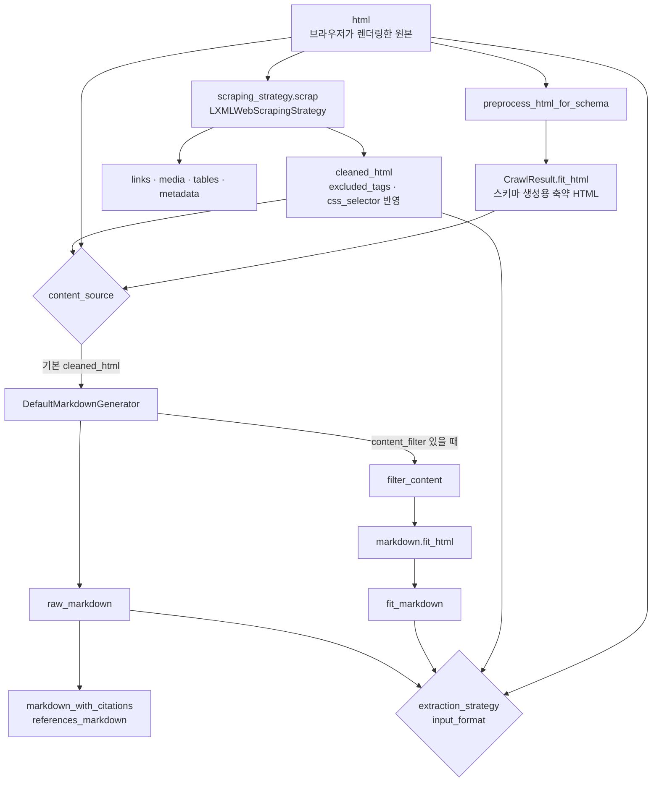

# Crawl4AI Markdown 생성 파이프라인 깊이 보기

> 렌더링된 HTML이 `raw_markdown`과 `fit_markdown`이 되기까지 어떤 단계를 거치는지, 본문 필터(Pruning·BM25·LLM)가 실제로 어떤 기준으로 내용을 자르는지를 v0.9.4 소스 코드 기준으로 다룹니다.

Crawl4AI를 쓰다 보면 "왜 이 문단이 빠졌지?", "왜 메뉴가 남았지?", "`fit_markdown`이 왜 비었지?"라는 질문을 반드시 만납니다. 답은 모두 이 파이프라인 안에 있습니다. 이 구조를 알면 설정값을 감으로 바꾸지 않고, 어느 단계를 고쳐야 하는지 정확히 고를 수 있습니다.

---

## 한 번의 크롤에서 HTML이 지나가는 길

페이지를 가져온 다음의 처리는 `AsyncWebCrawler.aprocess_html()` 한 함수에 모여 있습니다.



1. **스크래핑**: `LXMLWebScrapingStrategy`가 원본 HTML에서 스크립트·스타일, `excluded_tags`, `excluded_selector`를 제거하고, `css_selector`나 `target_elements`가 있으면 그 범위만 남겨 `cleaned_html`을 만듭니다. 링크·미디어·표·메타데이터도 이때 수집합니다.
2. **스키마용 축약 HTML**: 별도로 원본 HTML을 `preprocess_html_for_schema`에 넣어 `CrawlResult.fit_html`을 만듭니다. 긴 텍스트를 잘라 구조만 남긴 HTML(최대 30만 자)로, 주로 LLM에게 스키마를 만들게 할 때 쓰입니다.
3. **입력 선택**: Markdown 생성기의 `content_source`에 따라 `cleaned_html`(기본), `raw_html`, `fit_html` 중 하나를 고릅니다. 원본 HTML에 `<base href>`가 있으면 상대 링크의 기준 URL로 씁니다.
4. **Markdown 생성**: 선택한 HTML을 html2text 기반 변환기로 `raw_markdown`으로 바꾸고, 링크를 인용 번호로 바꾼 버전을 함께 만듭니다.
5. **본문 필터**: `content_filter`가 있으면 **같은 입력 HTML**을 필터에 넣어 남길 조각을 고르고, 그 조각만 다시 Markdown으로 바꿔 `fit_markdown`을 만듭니다.
6. **추출**: 추출 전략의 `input_format`에 따라 `markdown`(raw), `fit_markdown`, `html`, `cleaned_html`, `fit_html` 중 하나를 입력으로 씁니다. `fit_markdown`을 요청했는데 비어 있으면 `markdown`으로 자동 대체됩니다.

### 이름이 같은 두 개의 `fit_html`

파이프라인을 따라가면 헷갈리는 이름이 하나 보입니다.

| 위치 | 만드는 곳 | 내용 |
|---|---|---|
| `result.fit_html` | `preprocess_html_for_schema` | 원본 HTML을 스키마 생성용으로 축약한 것. 본문 필터와 무관하게 항상 생성 |
| `result.markdown.fit_html` | 본문 필터 | 필터가 남긴 HTML 조각. `fit_markdown`의 직접적인 입력. 필터가 없으면 빈 문자열 |

`fit_markdown`이 왜 이렇게 나왔는지 확인하려면 **`result.markdown.fit_html`** 을 봐야 합니다.

---

## DefaultMarkdownGenerator가 하는 일

### 변환 옵션

변환기는 다음 기본값으로 동작하고, `DefaultMarkdownGenerator(options={...})`로 덮어쓸 수 있습니다.

| 옵션 | 기본값 | 의미 |
|---|---|---|
| `body_width` | `0` | 줄바꿈 폭 제한 없음. 문장이 임의 위치에서 끊기지 않음 |
| `ignore_links` / `ignore_images` | `False` | 링크·이미지를 Markdown에 남김 |
| `mark_code` | `True` | 코드 블록을 펜스로 표시 |
| `single_line_break` | `True` | 단일 줄바꿈 유지 |
| `escape_snob` | `False` | 특수 문자를 과하게 이스케이프하지 않음 |

### 링크 인용 변환

`raw_markdown`의 링크를 정규식으로 찾아 본문에는 번호만 남기고, 번호별 URL을 따로 모읍니다. 같은 URL은 같은 번호를 씁니다.

```text
# raw_markdown
자세한 내용은 [설치 가이드](/docs/install)를 보세요.

# markdown_with_citations
자세한 내용은 설치 가이드⟨1⟩를 보세요.

# references_markdown
## References

⟨1⟩ https://example.com/docs/install: 설치 가이드
```

URL이 본문에서 빠지기 때문에 토큰이 줄고, LLM이 답변에 "⟨1⟩" 형태로 출처를 표시하게 만들기 쉽습니다. 다만 `fit_markdown`에는 인용 변환이 적용되지 않고 원래 링크 형식이 남습니다.

### 오류는 예외가 아니라 문자열로

변환 중 예외가 나면 생성기는 예외를 던지지 않고 결과 문자열 자리에 `"Error converting HTML to markdown: ..."`, `"Error generating fit markdown: ..."` 같은 메시지를 넣습니다. 크롤 자체는 `success=True`로 끝날 수 있으므로, 대량 수집에서는 Markdown이 `Error`로 시작하는 결과를 따로 걸러 내는 검사를 두는 편이 안전합니다.

---

## PruningContentFilter: 점수로 가지치기

### 동작 순서

`PruningContentFilterLXML`(v0.9.4 기본)과 이전 구현 `PruningContentFilter`는 같은 규칙으로 같은 결과를 냅니다.

1. HTML 주석을 지웁니다.
2. 의미가 확실한 태그를 통째로 지웁니다: `nav`, `footer`, `header`, `aside`, `script`, `style`, `form`, `iframe`, `noscript`.
3. `<body>`부터 **위에서 아래로** 노드마다 점수를 계산합니다. 점수가 기준보다 낮으면 그 노드와 **모든 자식을 함께** 지우고, 기준을 넘으면 자식으로 내려가 같은 검사를 반복합니다.
4. 남은 `<body>`의 직계 자식 중 텍스트가 있는 것을 HTML 조각 목록으로 돌려줍니다.

부모가 잘리면 자식은 검사 기회 없이 함께 사라진다는 점이 중요합니다. 본문 전체를 감싼 `div`가 낮은 점수를 받으면 본문이 통째로 빠질 수 있습니다.

### 점수 계산식

노드 하나의 점수는 다섯 지표의 가중 평균입니다.

| 지표 | 계산 | 가중치 |
|---|---|---|
| 텍스트 밀도 | 텍스트 길이 ÷ 내부 HTML 길이 | 0.4 |
| 링크 밀도 | 1 − (직계 `<a>` 텍스트 길이 ÷ 텍스트 길이) | 0.2 |
| 태그 가중치 | `article` 1.5, `h1` 1.2, `p`·`section` 1.0, `div`·`li` 0.5, `span` 0.3 등 | 0.2 |
| class·id 가중치 | `nav`, `footer`, `sidebar`, `ads`, `comment`, `share` 등으로 시작하면 감점 | 0.1 |
| 텍스트 길이 | log(텍스트 길이 + 1) | 0.1 |

```text
score = (0.4 × 텍스트밀도 + 0.2 × 링크밀도 + 0.2 × 태그가중치
         + 0.1 × max(0, class·id가중치) + 0.1 × log(텍스트길이 + 1)) ÷ 1.0
```

`min_word_threshold`를 주면, 공백 수로 센 단어 수가 그보다 적은 노드는 점수 계산 없이 -1(무조건 제거)을 받습니다.

### 숫자로 보기

기본 기준값 0.48로 몇 가지 노드를 계산해 보면 필터의 성격이 보입니다.

| 노드 | 텍스트 / 내부 HTML / 링크 텍스트(자) | 점수 | fixed 0.48 | dynamic 0.48 |
|---|---|---|---|---|
| 본문 `<p>` | 300 / 320 / 0 | 1.35 | 유지 | 유지 |
| `<article>` | 3000 / 6000 / 100 | 1.49 | 유지 | 유지 |
| 링크만 모인 `<div>` | 40 / 300 / 40 | 0.53 | **유지** | 제거(기준 0.58) |
| 짧은 `<span>` 배지 | 6 / 40 / 0 | 0.52 | 유지 | 유지 |
| 공유 버튼 `<div>` | 12 / 400 / 12 | 0.37 | 제거 | 제거 |

`log(텍스트 길이 + 1)` 항이 점수를 꽤 끌어올리기 때문에, **고정 기준 0.48에서는 링크만 모인 블록도 살아남을 수 있습니다.** 이럴 때 쓰는 것이 `threshold_type="dynamic"`입니다. 동적 기준은 노드마다 기준값을 조정합니다.

- 중요 태그(`article` 1.5, `main`·`h1` 1.4, `section`·`h2` 1.3, `p`·`h3` 1.2)면 기준 × 0.8 (남기기 쉽게)
- 텍스트 밀도가 0.4를 넘으면 기준 × 0.9
- 링크 텍스트 비율이 0.6을 넘으면 기준 × 1.2 (링크 덩어리는 지우기 쉽게)

### 소스에서 확인되는 특이점

- **class·id 감점은 사실상 점수에 반영되지 않습니다.** 감점 값은 0 이하인데 계산식에서 `max(0, ...)`로 잘리기 때문에 항상 0이 됩니다. 그런데 가중치 0.1은 분모에 남아 있어, 모든 노드의 점수가 조금씩 낮아지는 효과만 있습니다. lxml 구현의 문서 주석도 이 동작을 "기존 구현의 특이점을 그대로 재현했다"고 명시합니다. 즉 `class="sidebar"` 같은 이름만으로는 잘리지 않고, 실제로는 태그 제거 목록과 밀도 지표가 군더더기를 걸러 냅니다.
- **링크 밀도는 직계 자식 `<a>`만 셉니다.** `<ul><li><a>…</a></li></ul>`처럼 링크가 한 단계 아래에 있으면 `ul` 입장에서는 링크 텍스트가 0으로 계산됩니다. 목차형 목록이 남는 이유 중 하나입니다.
- **보존 목록이 있습니다.** `preserve_tags`, `preserve_classes`에 지정한 노드는 점수와 무관하게 남깁니다. 다만 2번 단계에서 통째로 지우는 태그에는 효과가 없습니다.

### 왜 lxml 구현으로 바뀌었나

이전 구현은 BeautifulSoup 위에서 노드마다 `get_text()`와 내부 HTML 직렬화를 다시 수행했습니다. 둘 다 하위 트리 전체를 도는 연산이라, 깊고 넓은 페이지에서는 작업량이 노드 수보다 훨씬 빠르게 늘었습니다. `PruningContentFilterLXML`은 모든 지표를 **아래에서 위로 한 번만** 계산해 캐시하고, 점수 계산과 가지치기는 위에서 아래로 한 번 돌면서 처리합니다. 공식 측정값은 중간 크기 페이지 134ms → 13ms, 카드 6,000개 페이지 2,200ms → 260ms입니다. 출력은 바이트 단위로 같고, 기존 `PruningContentFilter`를 직접 쓰면 v0.9.4부터 `DeprecationWarning`이 납니다.

---

## BM25ContentFilter: 질의와 관련 있는 조각만

Pruning이 "본문다운가"를 본다면, BM25 필터는 "질문과 관련 있는가"를 봅니다.

1. **질의 결정**: `user_query`가 있으면 그것을 쓰고, 없으면 페이지의 `<title>`, 첫 `<h1>`, `keywords`·`description` 메타 태그로 질의를 만듭니다. 메타 태그가 없으면 150자가 넘는 첫 문단 일부를 씁니다.
2. **후보 조각 추출**: 본문을 블록 단위 텍스트 조각으로 나눕니다.
3. **BM25 점수**: 질의와 조각을 소문자·공백 기준으로 토큰화하고(기본으로 영어 스테머 적용), 불용어를 걸러 BM25 점수를 매깁니다.
4. **태그 가중치**: 조각을 감싼 태그에 따라 점수를 곱합니다. `h1` 5.0, `h2`·`title` 4.0, `h3` 3.0, `strong`·`blockquote`·`code` 2.0, `b`·`em`·`pre`·`th` 1.5.
5. **선택**: 조정 점수가 `bm25_threshold`(기본 1.0) 이상인 조각만, **원본 문서 순서대로**, 중복 텍스트를 제거해 돌려줍니다.

토큰화가 공백 기준이고 기본 스테머가 영어라서, 조사가 붙는 한국어 문서에서는 "환불"과 "환불은"을 다른 단어로 봅니다. 한국어 페이지에서는 기대보다 적게 남거나 아무것도 남지 않을 수 있으므로, 질의어를 여러 활용형으로 넣거나 Pruning 필터를 먼저 고려합니다.

---

## LLMContentFilter: 모델이 고르게 하기

`LLMContentFilter`는 HTML을 청크로 나눠 LLM에 보내고, `instruction`에 따라 남길 내용을 모델이 골라 돌려주게 합니다. "가격 정책과 환불 조건만 남겨라"처럼 규칙으로 표현하기 어려운 기준을 쓸 수 있지만, 페이지마다 LLM 호출 비용이 들고 결과가 매번 같지 않습니다. `show_usage()`로 토큰 사용량을 확인할 수 있으며, Docker 서버에서는 보안상 요청으로 이 필터를 지정할 수 없습니다.

---

## 실제로 튜닝하는 방법

필터는 HTML을 받아 HTML 조각 목록을 돌려주는 평범한 객체라서, 브라우저 없이 바로 실험할 수 있습니다. 페이지를 한 번만 받아 두고 기준값을 바꿔 가며 비교합니다.

```python
# tune_filter.py
import asyncio
from crawl4ai import AsyncWebCrawler, CrawlerRunConfig, CacheMode
from crawl4ai.content_filter_strategy import PruningContentFilterLXML

URL = "https://en.wikipedia.org/wiki/Web_crawler"

async def main() -> None:
    async with AsyncWebCrawler() as crawler:
        result = await crawler.arun(URL, config=CrawlerRunConfig(cache_mode=CacheMode.ENABLED))
    html = result.cleaned_html                       # 생성기의 기본 입력과 같은 HTML

    for kind, threshold in [("fixed", 0.48), ("fixed", 0.6), ("dynamic", 0.48)]:
        blocks = PruningContentFilterLXML(threshold=threshold, threshold_type=kind).filter_content(html)
        kept = sum(len(b) for b in blocks)
        print(f"{kind:<8} {threshold:<5} blocks={len(blocks):<4} kept_html={kept:>7} / {len(html)}")

asyncio.run(main())
```

튜닝은 다음 순서로 하는 것이 효율적입니다.

1. **범위부터 줄입니다.** 본문 위치가 확실하면 `css_selector="main article"`이나 `target_elements`로 범위를 지정하는 것이 어떤 필터보다 정확합니다. 필터는 범위를 정할 수 없을 때 쓰는 도구입니다.
2. **확실한 군더더기는 태그로 지웁니다.** `excluded_tags`, `excluded_selector`로 쿠키 배너, 추천 목록 같은 반복 요소를 정제 단계에서 지웁니다.
3. **그다음에 필터를 고릅니다.** 범용 본문 추출은 Pruning, 특정 질문에 대한 근거 수집은 BM25, 규칙으로 표현할 수 없는 기준은 LLM 필터입니다.
4. **기준값은 `result.markdown.fit_html`을 보며 조정합니다.** 메뉴가 남으면 기준을 올리거나 `dynamic`으로, 본문이 잘리면 기준을 내리거나 `preserve_tags`를 씁니다.
5. **`raw_markdown`을 버리지 않습니다.** 필터는 휴리스틱입니다. `fit_markdown`이 비거나 지나치게 짧을 때 `raw_markdown`으로 대체하는 경로를 애플리케이션에 남겨 둡니다.

---

[← 장단점과 대안 비교](06-comparison.md) · [목차](README.md) · [주의할 점과 FAQ →](08-pitfalls-faq.md)
