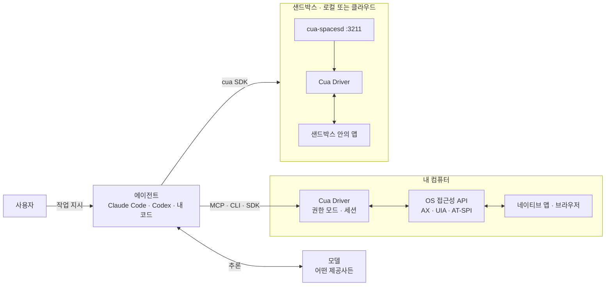
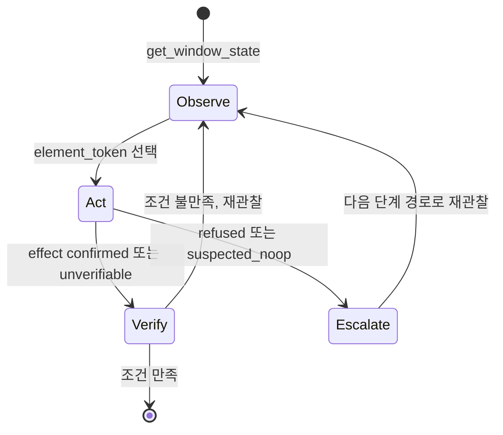

# Cua 핵심 개념과 동작 구조

> Cua Driver, 관찰(접근성 트리 + 스크린샷), `element_token`, 백그라운드 전달, 권한 모드, 샌드박스·cua-spacesd가 각각 무엇이고 어떻게 맞물려 동작하는지 다룹니다.

## 용어 한눈에 보기

| 키워드 | 설명 |
|---|---|
| Computer-Use 2.0 | 에이전트가 한 작업 안에서 코드 실행, API 호출, GUI 조작을 오가는 방식. Cua는 이 중 GUI 계층을 담당 |
| Cua Driver | 네이티브 앱·브라우저를 관찰하고 조작하는 Rust 런타임. CLI·MCP·SDK로 노출 |
| 접근성 트리 | 운영체제가 장애인 보조 기술용으로 제공하는 UI 구조(역할, 이름, 값, 가능한 동작) |
| `element_token` | 특정 스냅샷에서 발급된 요소 식별자. 다음 스냅샷이 나오면 무효가 됨 |
| 백그라운드 전달 | 실제 포인터·포커스·창 순서를 바꾸지 않고 대상 창에만 입력을 보내는 방식 |
| Action ladder | 백그라운드 요소 행동 → 픽셀 → 페이지(DOM) → 포그라운드로 올라가는 단계 |
| 권한 모드 | `standard`, `bounded`, `unrestricted`. 런타임을 소유한 프로세스가 시작 시 고정 |
| 샌드박스 | 로컬 컨테이너·VM 또는 클라우드에 만드는 격리된 컴퓨터 |
| cua-spacesd | 샌드박스 안에서 돌며 셸·파일·화면·입력·스트리밍을 제공하는 데몬(포트 3211) |
| Space | Cua Spaces 앱과 SDK가 관리하는, 사람과 에이전트가 함께 보는 데스크톱 |

---

## 1. Cua Driver (에이전트의 손과 눈)

### 쉽게 설명하면

원격 지원 프로그램을 떠올리면 됩니다. 다만 상담원이 사람 대신 AI이고, 화면을 "그림"으로만 보는 것이 아니라 "이 창에는 '저장' 버튼과 '금액' 입력창이 있다"는 목록까지 함께 받는다는 점이 다릅니다.

### 개발 관점에서는

Cua Driver는 운영체제별 자동화 API를 하나의 도구 체계로 감싼 Rust 런타임입니다.

| 플랫폼 | 관찰 | 입력 |
|---|---|---|
| macOS | Accessibility API, ScreenCaptureKit | 창 단위 CoreGraphics 이벤트, `AXPerformAction` |
| Windows | UI Automation, Win32 | 창 메시지, 네이티브 입력 |
| Linux | AT-SPI, X11/Wayland 캡처 | AT-SPI 동작, XTest, 포털 입력 |

같은 런타임을 네 가지 방식으로 쓸 수 있습니다.

| 연결 방식 | 쓰는 쪽 | 형태 |
|---|---|---|
| MCP 서버 | Claude Code, Codex, Cursor 같은 에이전트 | `cua-driver mcp` (stdio) |
| CLI | 셸 스크립트, 사람의 디버깅 | `cua-driver call <tool> '<json>'` 또는 `cua-driver <tool> '<json>'` |
| SDK | 내 애플리케이션 코드 | Python `cua_driver`, TypeScript `@trycua/cua-driver` |
| 데몬 | 여러 클라이언트가 공유 | `cua-driver serve` (macOS는 `CuaDriver.app`이 소유) |

중요한 경계가 하나 있습니다. **언어별 SDK는 애플리케이션용이고, 에이전트용이 아닙니다.** 에이전트는 이미 MCP 클라이언트를 갖고 있으므로 `cua-driver mcp`에 바로 붙고, SDK는 테스트 코드나 앱이 Driver를 프로세스 안에 직접 올릴 때 씁니다. 두 SDK 모두 UniFFI로 생성한 바인딩이 같은 Rust 런타임을 호출합니다.

### 예제

```bash
# 실행 중인 앱 목록 (사람이 직접 확인할 때)
cua-driver call list_apps

# 등록된 도구 목록과 특정 도구의 입력 스키마
cua-driver list-tools
cua-driver describe get_window_state
```

### 핵심

> Cua Driver는 "운영체제 접근성 API를 에이전트가 쓰기 좋은 도구로 바꾼 것"입니다. 에이전트는 MCP로, 내 코드는 SDK로 같은 런타임을 씁니다.

---

## 2. 관찰: 접근성 트리 + 스크린샷

### 쉽게 설명하면

길을 알려 줄 때 사진만 보여 주는 것보다 "사진 + 건물 이름이 적힌 지도"를 함께 주면 훨씬 정확합니다. 스크린샷이 사진이고, 접근성 트리가 지도입니다.

### 개발 관점에서는

관찰의 기본 단위는 **창 하나**입니다. `get_window_state({pid, window_id})`는 그 창의 접근성 트리와 스크린샷을 한 번에 돌려줍니다.

- **트리**는 행동할 수 있는 요소를 역할(button, text field), 이름(label), 값(value), 가능한 동작, 위치와 함께 알려 줍니다. 각 요소에는 `element_token`이 붙습니다.
- **스크린샷**은 트리에 드러나지 않는 것(캔버스, 아이콘만 있는 버튼)을 보여 주고, 픽셀 좌표 행동의 기준이 됩니다.

창 단위로 잡을 수 없을 때는 `get_desktop_state`로 주 디스플레이 전체를 캡처합니다. 다만 데스크톱 단위 입력은 항상 포그라운드이므로 더 큰 권한으로 취급됩니다.

### 예제

```bash
# 1) 대상 앱과 창 찾기
cua-driver call list_apps
cua-driver call list_windows '{"pid": 844}'

# 2) 창 하나 관찰. query로 관련 요소만 추리고, 스크린샷은 파일로 저장
cua-driver get_window_state '{"pid":844,"window_id":10725,"query":"금액","screenshot_out_file":"/tmp/run-1/before.png","session":"run-1"}'
```

응답의 요소 행에는 `element_token`, `role`, `label`, `value`, `actions`, `frame`(화면 좌표), `screenshot_frame`(같은 응답의 스크린샷 픽셀 좌표)이 들어갑니다. 트리가 너무 크면 `max_elements`, `max_depth`로 범위를 제한하는데, 잘렸다고 해서 "요소가 없다"는 증거는 아니라는 점을 기억해야 합니다.

### 핵심

> 관찰은 "창 하나의 구조 + 그림"입니다. 의미로 잡을 수 있으면 트리를, 안 되면 같은 응답의 스크린샷을 기준으로 삼습니다.

---

## 3. `element_token` (스냅샷에 묶인 요소 이름표)

### 쉽게 설명하면

번호표와 같습니다. 은행 창구에서 받은 번호표는 그날 그 지점에서만 유효합니다. 새로 번호표를 뽑으면 이전 번호는 쓸 수 없습니다.

### 개발 관점에서는

`element_token`은 `s0000002a:14`처럼 스냅샷 식별자와 요소 위치를 묶은 불투명한 값입니다. 규칙은 단순합니다.

- 행동은 **가장 최근 스냅샷의 토큰**으로만 합니다. 토큰을 직접 만들거나 고치지 않습니다.
- 같은 창을 다시 관찰하면 이전 토큰은 무효가 되고, 응답의 `invalidated_snapshot_ids`에 표시됩니다. 다른 에이전트가 같은 창을 관찰해도 마찬가지입니다.
- 오래된 토큰으로 행동하면 `stale_element_token` 오류가 나며, 다시 관찰하면 됩니다.
- 예전 방식인 `element_index`는 행동 도구에서 받지 않습니다.

```bash
cua-driver click '{"target":{"kind":"window","pid":844,"window_id":10725},"element_token":"s0000002a:14","session":"run-1"}'
```

### 핵심

> 토큰이 스냅샷에 묶여 있기 때문에 "예전 화면을 보고 지금 화면을 클릭하는" 실수가 구조적으로 막힙니다.

---

## 4. 백그라운드 전달과 Action ladder

### 쉽게 설명하면

옆자리 동료의 키보드를 빼앗아 치는 대신, 동료의 화면 속 특정 창에만 보이지 않는 손을 넣어 버튼을 누르는 것입니다. 그게 안 되는 앱이면 그때 "잠깐 키보드 좀 쓸게요"라고 하고 앞으로 가져옵니다.

### 개발 관점에서는

창 대상 입력의 기본값은 `delivery_mode: "background"`입니다. 창을 앞으로 가져오지 않고, 실제 포인터를 움직이지 않고, 포커스를 바꾸지 않습니다. 대신 에이전트 전용 커서 오버레이가 화면에 그려집니다.

백그라운드로 안 되는 경우를 위해 단계가 정해져 있습니다.

1. **요소, 백그라운드**: 접근성 동작으로 실행. Driver가 스스로 결과를 확인할 수 있는 유일한 단계
2. **픽셀, 백그라운드**: 같은 스크린샷의 x, y 좌표로 전달
3. **페이지**: 브라우저 탭이면 CDP로 DOM에 직접 동작
4. **포그라운드**: `delivery_mode: "foreground"`로 창을 앞으로 가져와 실행한 뒤 포커스를 되돌림

각 행동의 응답에는 결과(`effect`)와 다음 단계 제안(`escalation`)이 들어 있어서, 에이전트는 응답을 보고 한 단계 올릴지 결정합니다. 자세한 동작은 [관찰·행동·검증 루프 깊이 보기](07-observe-act-verify.md)에서 다룹니다.

### 핵심

> 기본은 "사용자를 방해하지 않는 경로"이고, 더 침범적인 경로는 결과를 보고 한 단계씩, 허락된 범위 안에서만 올라갑니다.

---

## 5. 권한 모드 (무엇까지 허용할 것인가)

### 쉽게 설명하면

건물 출입증의 등급과 같습니다. 일반 출입증(standard), 특정 층만 열리는 출입증(bounded), 마스터키(unrestricted)가 있고, 출입증은 입장할 때 한 번 정해지면 안에서 바꿀 수 없습니다.

### 개발 관점에서는

| 모드 | 용도 | 동작 |
|---|---|---|
| `standard` | 로컬 CLI·MCP 기본값 | 관찰, 입력, 격리 브라우저, 녹화, 검증된 파일 전송을 프롬프트 없이 허용. 로그인된 브라우저 프로필 연결은 별도 허가 필요 |
| `bounded` | 무인 에이전트, 내장 앱 | 검토된 매니페스트에 적힌 도구·앱·파일만 허용하고 나머지는 거부 |
| `unrestricted` | 일회용·완전 신뢰 환경 | 승인 검사를 건너뜀. `--dangerously-bypass-approvals` 필요 |

모드는 **런타임을 소유한 프로세스가 시작할 때 고정**합니다. `cua-driver serve`는 플래그로, `cua-driver mcp`나 내장 호스트는 `CUA_DRIVER_PERMISSION_MODE` 같은 환경 변수로 정합니다. MCP 서버를 에이전트에 등록하는 것만으로는 모드가 정해지지 않는다는 점이 자주 헷갈립니다.

### 예제

```yaml
# bounded 모드 매니페스트: 정산 앱 하나와 입력 폴더 하나만 허용
version: 3
expires_after: 8h
idle_timeout: 30m

allow:
  tools:
    - start_session
    - end_session
    - list_windows
    - get_window_state
    - click
    - type_text
    - verify_state

resources:
  apps:
    - executable: /opt/expense-desk/expense-desk   # macOS는 bundle_id 사용
      launch: true
      windows: all
      terminate: driver_launched
  files:
    read:
      - dir: /data/expenses
        recursive: true
```

```bash
export CUA_DRIVER_PERMISSION_MODE=bounded
export CUA_DRIVER_CAPABILITY_MANIFEST_FILE=/etc/cua/expense-agent.yaml
export CUA_DRIVER_CAPABILITY_MANIFEST_APPROVED=1
```

### 핵심

> 권한은 에이전트에게 묻는 것이 아니라 런타임을 띄울 때 정합니다. 무인으로 돌릴수록 `bounded`로 좁힙니다.

---

## 6. 샌드박스와 cua-spacesd (써도 되는 컴퓨터)

### 쉽게 설명하면

신입 사원에게 실제 운영 서버 대신 연습용 PC를 한 대 주는 것입니다. 망가져도 지우고 새로 받으면 됩니다.

### 개발 관점에서는

Cua SDK(`cua`, `cua-sandbox`)는 어떤 OCI 이미지든 샌드박스로 띄웁니다. 생성할 때 세 가지를 고릅니다.

| 축 | 값 | 기본값 |
|---|---|---|
| 어디서 (`on`) | `local`, `cloud`, `direct:<주소>` | `local` |
| 종류 (`kind`) | `container`, `vm`, `auto` | `auto` (이미지에 따라) |
| 엔진 (`runtime`) | 로컬: `gvisor`, `runc`, `qemu`, `lume` / 클라우드: `gvisor`, `kubevirt` | `auto` |

샌드박스는 내부에 에이전트가 없어도 만들어지고 지워집니다. 대신 **cua-spacesd**가 들어 있는 이미지(공식 `ghcr.io/trycua/linux:24.04` 등)라면 셸, 파일, 스크린샷, 입력, 창·접근성 조회, 화면 스트리밍을 추가로 쓸 수 있습니다. cua-spacesd는 입력과 접근성을 샌드박스 안의 Cua Driver에 맡깁니다. 즉 **샌드박스 = 격리된 컴퓨터, Cua Driver = 그 안에서 실제로 조작하는 손**입니다.

### 예제

```python
import asyncio
from cua_sandbox import Image, Sandbox

async def main():
    # 내 컴퓨터에 일회용 Linux 데스크톱을 띄우고, 블록이 끝나면 삭제
    async with Sandbox.ephemeral(Image.linux()) as sb:
        print((await sb.shell.run("uname -a")).stdout)
        open("desktop.png", "wb").write(await sb.screenshot())

asyncio.run(main())
```

### 핵심

> 에이전트를 내 컴퓨터에서 돌릴지(Cua Driver 직접), 격리된 컴퓨터에서 돌릴지(샌드박스 + 안의 Cua Driver)는 위험도와 작업 성격으로 고릅니다.

---

## 7. 주변 구성 요소: Spaces, Lume, Cua Bench, CUA-S1

- **Cua Spaces**: 샌드박스나 내 다른 기계를 "Space"로 등록해 메뉴 막대에서 보고, 사람과 에이전트가 각자 커서를 갖고 같은 데스크톱에서 일하게 하는 macOS 앱입니다. 로그인된 Chrome·Slack 세션을 승인 후 Space로 옮기는 teleport 기능이 있습니다. 앱은 MIT가 아니라 FSL-1.1-MIT 라이선스입니다.
- **Lume**: Apple Silicon Mac에서 macOS·Linux VM을 만드는 CLI입니다. 로컬 macOS 샌드박스의 기반이 됩니다.
- **Cua Bench**: 작업(setup, 오라클 solve, evaluate)을 Python으로 정의하고, 같은 채점 함수로 오라클·사람·에이전트를 평가합니다. OSWorld-Verified, MiniWoB++ 같은 기존 벤치마크 어댑터도 있습니다.
- **CUA-S1**: "이 입력칸에 어떤 값이 들어가야 하는가" 같은 좁은 결정을 빠르게 점수화하는 소형 모델군입니다. 첫 프로필은 폼 입력이며, 소스만 공개된 초기 연구 릴리스입니다.

---

## 8. 전체 동작 구조

Cua는 에이전트와 운영체제 사이에서 "관찰과 전달"을 담당하는 계층입니다.



한 번의 작업이 처리되는 순서는 다음과 같습니다.

1. **시작점**: 사용자가 에이전트에게 "정산 앱에 이번 달 경비를 입력해"처럼 지시합니다. 에이전트는 MCP 도구 목록에서 Cua Driver의 도구들을 봅니다.
2. **Cua가 개입하는 시점**: 에이전트가 `list_apps`, `list_windows`로 대상 창을 정하고 `get_window_state`를 호출하는 순간부터입니다. Driver는 권한 모드와 매니페스트를 확인한 뒤 창의 트리와 스크린샷을 돌려줍니다.
3. **내부 처리**: 에이전트(모델)가 트리에서 "금액" 입력창의 `element_token`을 고르고 `type_text`를 호출합니다. Driver는 백그라운드 접근성 경로로 값을 넣고, 결과를 `effect`와 `escalation`으로 보고합니다.
4. **외부 시스템과의 연결**: 실제 입력은 운영체제 접근성 API를 통해 앱에 전달됩니다. 샌드박스를 쓰는 경우에는 cua SDK → cua-spacesd(gRPC) → 샌드박스 안의 Cua Driver 순서로 같은 일이 일어납니다.
5. **결과 반환**: 에이전트는 `verify_state`나 새 스냅샷으로 값이 반영됐는지 확인하고, 확인된 경우에만 다음 건으로 넘어갑니다. 요청하면 `start_recording`으로 행동마다 전후 스크린샷이 남는 trajectory를 기록할 수 있습니다.

행동 하나를 상태 흐름으로 보면 다음과 같습니다.



---

[← 개요](README.md) · [설치와 첫 사용 →](02-getting-started.md)
