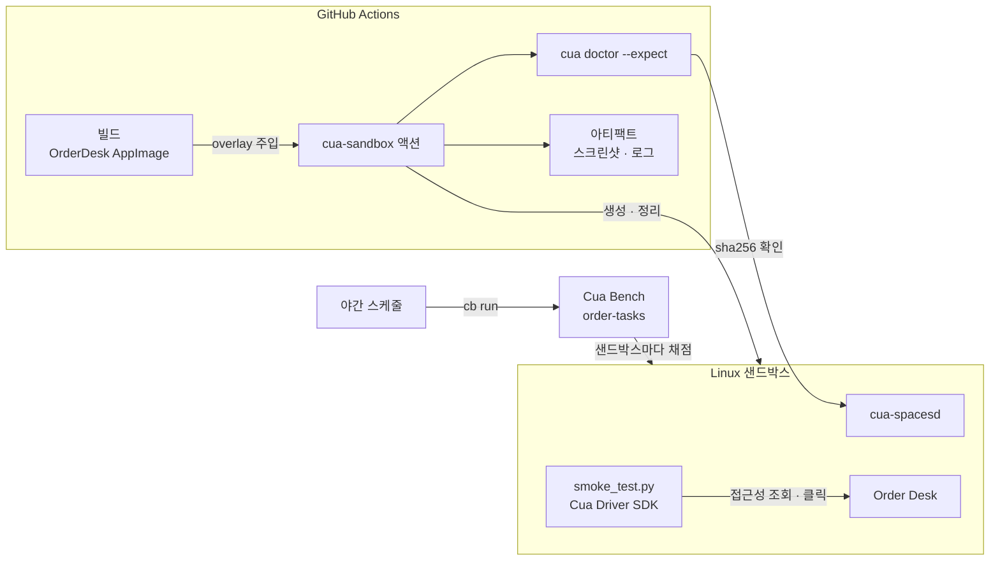

# Cua 활용 예시 ③ CI·평가·실전 프로젝트

> 팀과 서버 환경에서 Cua를 쓰는 방법(CI의 GUI 검증, 클라우드 용량, 에이전트 평가)과, 데스크톱 앱 팀이 Cua를 실제로 도입하는 과정을 다룹니다.

## 팀·CI·서버 환경에서의 활용

Cua는 서버 애플리케이션이 import하는 라이브러리라기보다, **"GUI가 필요한 작업을 서버와 CI에서 돌릴 수 있게 해 주는 실행 기반"**입니다.

### 활용 사례

- **CI의 데스크톱 앱 E2E**: GitHub Actions에서 `cua-sandbox` 액션으로 Linux 데스크톱 샌드박스를 띄우고, 이번 PR에서 빌드한 바이너리를 주입해 화면 단위로 검사합니다. 액션은 로그, 진단 보고서, 스크린샷을 아티팩트로 올리고 작업이 취소돼도 샌드박스를 지웁니다.
- **"테스트한 바이너리가 실제로 돈 바이너리인가" 확인**: `cua doctor --expect`로 샌드박스 안에서 실행 중인 파일의 sha256이나 git 커밋을 확인합니다. 옛 데몬이 재시작되지 않아 이전 빌드를 테스트하는 사고를 막습니다.
- **클라우드 용량**: Docker나 KVM이 없는 러너에서는 `on: cloud`로 클라우드 샌드박스를 씁니다. 동시 실행이 많으면 이름 있는 풀을 만들어 웜 용량을 유지합니다(Cua Fleets).
- **에이전트 평가**: Cua Bench로 작업과 채점 함수를 정의하고, 모델·프롬프트를 바꿀 때마다 같은 데이터셋으로 성공률을 비교합니다.
- **남는 Mac을 호스트로**: `cua host setup`으로 사무실의 Mac mini를 relay에 연결하면, 팀원과 에이전트가 포트 포워딩 없이 그 기계에 Space를 만들 수 있습니다.

### 애플리케이션 구조

```text
PR / 야간 스케줄
 ↓
GitHub Actions 러너
 ├─ 앱 빌드 (dist/)
 ├─ cua-sandbox 액션: linux 샌드박스 생성 (로컬 Docker 또는 cloud)
 │    ├─ overlay: 빌드 결과를 샌드박스 안에 주입
 │    ├─ guest-setup: 테스트 의존성 설치 (root)
 │    └─ guest-run: 샌드박스 안에서 GUI 스모크 테스트 (Cua Driver SDK)
 ├─ cua doctor --expect: 주입한 빌드가 실제로 실행 중인지 확인
 └─ 아티팩트: 로그 · 스크린샷 · 진단 보고서
 ↓
야간: cb run (Cua Bench) → 에이전트 성공률 리포트
```

### 실제 코드

**CI에서 샌드박스 띄우기 (최소 형태)**

```yaml
jobs:
  e2e:
    runs-on: ubuntu-latest
    steps:
      - uses: actions/checkout@v4
      - uses: dtolnay/rust-toolchain@1.97.1   # 액션이 cua CLI를 소스에서 빌드하는 기본 설정
      - uses: trycua/cua/.github/actions/cua-sandbox@<고정한-커밋-sha>
        with:
          image: linux
          run: |
            cua sb exec "$CUA_SANDBOX" uname -a
            cua sb screenshot "$CUA_SANDBOX" -o "$CUA_SANDBOX_ARTIFACTS/desktop.png"
```

`run`은 러너에서, `guest-run`은 샌드박스 안에서 실행됩니다. 공식 예제는 `@main`을 쓰지만, 의존하는 CI라면 커밋 SHA로 고정하라고 문서가 권합니다.

**전용 클라우드 용량 만들기**

```python
from cua_sandbox import Image, Pool, WarmPoolAutoscaling

# 수요에 따라 0~10대로 늘었다 줄어드는 이름 있는 풀
pool = await Pool.apply(
    Image.linux(),
    name="acme-desktop-e2e",          # 계정을 넘어 전역에서 유일해야 한다
    cpu=4,
    memory_mb=4096,
    autoscaling=WarmPoolAutoscaling(min_pool_size=0, initial_pool_size=2, max_pool_size=10),
)

async with pool.claim(name="job-123") as sb:
    await sb.shell.run("echo hello")
```

**에이전트 평가 실행**

```bash
uv tool install 'cua-bench[browser]'
cb run first-task --variant-id 0 --oracle                                  # 작업 자체가 맞는지 오라클로 확인
cb run dataset cua-bench-basic --agent cua-agent --model anthropic/claude-sonnet-4-20250514 --attempts 3
```

### 어느 계층에 두는가

| 위치 | 적합한 Cua 구성 요소 | 이유 |
|---|---|---|
| 개발자 PC | Cua Driver + MCP | 에이전트와 사람이 같은 기계를 쓰며 빠르게 시도 |
| 테스트 코드 | Driver SDK (in-process) | 타입 있는 API와 재관찰로 결정적인 검증 |
| CI 러너 | `cua-sandbox` 액션, `cua doctor --expect` | 매번 깨끗한 데스크톱, 빌드 일치 확인, 자동 정리 |
| 백엔드 워커 | cua SDK 클라우드 샌드박스, Fleets 풀 | 요청별 격리, 웜 용량, TTL로 비용 상한 |
| 평가 파이프라인 | Cua Bench | 같은 채점 함수로 모델·프롬프트 비교 |

---

## 실전 프로젝트 적용: 주문 관리 데스크톱 앱의 GUI 회귀 검증

### 요구사항

다섯 명이 개발하는 B2B 주문 관리 데스크톱 앱 "Order Desk"(Electron, Linux·Windows 배포)에 Cua를 도입합니다.

- PR마다 이번 빌드로 "주문 추가 → 합계 갱신" 핵심 흐름을 GUI 수준에서 검증한다.
- 테스트 러너에 설치된 다른 버전이 아니라 **이번 PR 빌드**가 테스트됐다는 증거가 남아야 한다.
- 실패하면 스크린샷이 PR 아티팩트로 남아야 한다.
- 매일 밤, 이 앱을 다루는 사내 AI 지원 에이전트가 주요 업무 작업을 얼마나 성공하는지 측정한다.

### 전체 구조



### 폴더 구조

```text
order-desk/
├── .github/workflows/
│   ├── desktop-e2e.yml          # PR마다 GUI 스모크 테스트
│   └── agent-eval.yml           # 야간 에이전트 평가
├── e2e/
│   ├── guest-setup.sh           # 샌드박스 안 의존성 설치
│   └── smoke_test.py            # 샌드박스 안에서 실행되는 Cua Driver SDK 테스트
├── bench/
│   └── add-order/
│       ├── main.py              # Cua Bench 작업: setup · solve · evaluate
│       └── pyproject.toml
├── src/                         # Electron 앱 소스
└── package.json
```

### 구현

**1. 샌드박스 안 준비 스크립트**

```bash
#!/bin/sh
# e2e/guest-setup.sh : guest-setup 단계에서 root로 실행된다
set -eu
apt-get update
apt-get install -y python3-venv libxi6 at-spi2-core libfuse2
python3 -m venv /opt/e2e
/opt/e2e/bin/pip install cua-driver
```

**2. 샌드박스 안에서 도는 스모크 테스트**

```python
# e2e/smoke_test.py
import asyncio
import os
import subprocess

from cua_driver import (
    ActionTarget, ClickButton, ClickInput, ClickPosition, CuaDriver,
    GetWindowStateInput, InputDeliveryMode, ListAppsInput, ListWindowsInput,
)

APP = "/opt/order-desk/OrderDesk.AppImage"


def unique(items, what):
    if len(items) != 1:
        raise SystemExit(f"FAIL: expected one {what}, found {len(items)}")
    return items[0]


def by_label(state, label):
    return unique([e for e in state.elements or [] if e.label == label], label)


async def main() -> None:
    # Electron이 접근성 트리를 노출하도록 강제한다
    subprocess.Popen([APP, "--no-sandbox", "--force-renderer-accessibility"], env=os.environ)

    driver = CuaDriver.create()
    try:
        for _ in range(30):  # 창이 뜰 때까지 제한된 횟수만 다시 찾는다
            apps = await driver.list_apps(ListAppsInput())
            running = [a for a in apps.apps if a.name == "Order Desk" and a.running]
            if running:
                windows = await driver.list_windows(ListWindowsInput(pid=running[0].pid, on_screen_only=True))
                if windows.windows:
                    break
            await asyncio.sleep(1)
        app = unique(running, "Order Desk process")
        window = unique([w for w in windows.windows if w.title.startswith("Order Desk")], "main window")

        capture = GetWindowStateInput(
            pid=app.pid, window_id=window.window_id, session=None, query=None,
            include_accessibility_tree=True, include_screenshot=True,
            screenshot_out_file="/tmp/e2e/after.png", max_elements=None, max_depth=None,
            max_dimension=None,
        )

        before = await driver.get_window_state(capture)
        total_before = by_label(before, "Order total").value

        await driver.click(ClickInput(
            target=ActionTarget.WINDOW(pid=app.pid, window_id=window.window_id),
            position=ClickPosition.ELEMENT(element_token=by_label(before, "Add sample order").element_token),
            delivery_mode=InputDeliveryMode.BACKGROUND,
            session=None, button=ClickButton.LEFT, count=1,
        ))

        after = await driver.get_window_state(capture)
        total_after = by_label(after, "Order total").value
        if total_after == total_before:
            raise SystemExit(f"FAIL: total stayed {total_before}")
        print(f"PASS: total {total_before} -> {total_after}")
    finally:
        await driver.shutdown()


asyncio.run(main())
```

**3. PR 워크플로**

```yaml
# .github/workflows/desktop-e2e.yml
name: desktop-e2e
on: [pull_request]

jobs:
  gui-smoke:
    runs-on: ubuntu-latest
    steps:
      - uses: actions/checkout@v4
      - uses: actions/setup-node@v4
        with:
          node-version: 22
      - run: npm ci && npm run build:appimage          # dist/OrderDesk.AppImage
      - uses: dtolnay/rust-toolchain@1.97.1
      - uses: trycua/cua/.github/actions/cua-sandbox@<고정한-커밋-sha>
        with:
          image: linux
          overlay: |
            order-desk=dist/OrderDesk.AppImage:/opt/order-desk/OrderDesk.AppImage
            smoke=e2e/smoke_test.py:/opt/e2e/smoke_test.py
            setup=e2e/guest-setup.sh:/opt/e2e/guest-setup.sh
          guest-setup: sh /opt/e2e/guest-setup.sh
          guest-run: |
            export DISPLAY=:1
            mkdir -p /tmp/e2e
            /opt/e2e/bin/python /opt/e2e/smoke_test.py
          run: |
            cua sb screenshot "$CUA_SANDBOX" -o "$CUA_SANDBOX_ARTIFACTS/final.png"
```

**4. 야간 에이전트 평가 작업 (Cua Bench)**

```python
# bench/add-order/main.py : cb task create 로 만든 뼈대에 업무 내용을 채운다
import cua_bench as cb

@cb.tasks_config(split="train")
def load(): ...        # 변형(고객사·품목·수량 조합)과 실행할 머신(Linux 샌드박스) 정의

@cb.setup_task(split="train")
async def start(task_cfg, session): ...     # 앱 설치·실행, 주문 데이터 초기화

@cb.solve_task(split="train")
async def solve(task_cfg, session): ...     # 오라클: 정답 순서로 주문을 추가

@cb.evaluate_task(split="train")
async def evaluate(task_cfg, session): ...  # 앱의 저장 파일에서 주문이 정확히 한 건 늘었으면 1.0
```

```yaml
# .github/workflows/agent-eval.yml (핵심 단계만)
      - run: uv tool install cua-bench
      - run: cb run bench/add-order --oracle                       # 작업이 깨지지 않았는지 먼저 확인
      - run: cb run bench/add-order --agent cua-agent --model anthropic/claude-sonnet-4-20250514
        env:
          ANTHROPIC_API_KEY: ${{ secrets.ANTHROPIC_API_KEY }}
```

### 실제 실행 흐름

"합계가 갱신되지 않는 회귀"가 들어간 PR을 예로 듭니다.

1. **사용자 행동**: 개발자가 합계 계산 로직을 리팩터링한 PR을 올립니다.
2. **빌드와 샌드박스 생성**: 러너가 AppImage를 빌드하고, `cua-sandbox` 액션이 로컬 Docker에 Linux 데스크톱 샌드박스를 만듭니다.
3. **빌드 주입과 확인**: overlay가 AppImage와 테스트 파일을 샌드박스 안에 원자적으로 넣고 sha256을 기록합니다. 액션이 `cua doctor`로 주입한 파일이 실제로 쓰이는지 확인합니다.
4. **샌드박스 안 준비**: `guest-setup`이 Python 가상 환경과 `cua-driver`를 설치합니다.
5. **GUI 검증**: `smoke_test.py`가 앱을 띄우고 Cua Driver SDK로 창을 찾아 "Add sample order"를 백그라운드로 클릭합니다. 새 스냅샷에서 "Order total" 값이 그대로여서 `FAIL: total stayed 0`으로 종료합니다.
6. **결과 반영**: `run` 단계가 마지막 화면을 스크린샷으로 남기고, 액션이 로그·진단 보고서와 함께 아티팩트로 올린 뒤 샌드박스를 지웁니다. 리뷰어는 PR에서 실패 화면을 바로 봅니다.
7. **야간 평가와의 연결**: 수정이 머지된 뒤 야간 `agent-eval`이 오라클 → 에이전트 순으로 `cb run`을 실행합니다. 오라클은 통과하는데 에이전트 성공률이 떨어지면 앱이 아니라 UI 라벨 변경이 에이전트를 헷갈리게 한 것인지 trajectory로 확인합니다.

> 샌드박스 이미지 구성(설치된 Python, AT-SPI 세션, 디스플레이 번호)은 이미지 버전에 따라 달라질 수 있습니다. 처음 도입할 때는 `cua sb create linux --name ci --wait desktop` → `cua sb shell ci`로 같은 단계를 손으로 한 번 실행해 보고 `guest-setup`을 맞추는 것이 안전합니다.

---

[← 활용 예시 ② 애플리케이션 코드에서 샌드박스 다루기](04-usage-sandbox-sdk.md) · [목차](README.md) · [장단점과 대안 비교 →](06-comparison.md)
