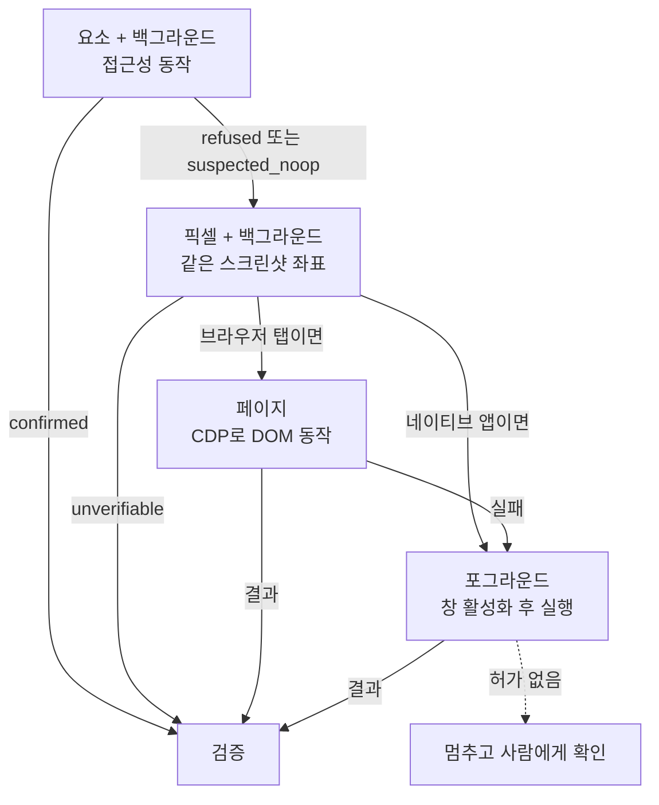

# Cua 관찰·행동·검증 루프 깊이 보기

> Cua Driver가 한 번의 행동을 어떻게 관찰하고, 어떤 경로로 전달하고, 결과를 어떤 계약으로 보고하는지 다룹니다. 이 루프를 이해하면 "클릭은 성공했는데 아무 일도 안 일어났다" 같은 문제를 왜 Cua가 구조적으로 다르게 다루는지 알 수 있습니다.

## 왜 이 루프가 Cua의 핵심인가

화면 자동화의 어려움은 클릭을 "보내는 것"이 아니라 **클릭이 "먹혔는지" 아는 것**에 있습니다. 운영체제에 이벤트를 보내는 함수는 거의 항상 성공을 반환합니다. 그러나 앱이 그 이벤트를 무시했을 수도, 다른 창이 받았을 수도, 값은 들어갔지만 저장은 안 됐을 수도 있습니다.

Cua Driver는 이 문제를 세 단계로 쪼개고, 각 단계에 규칙을 둡니다.

| 단계 | 규칙 | 지키지 않으면 생기는 일 |
|---|---|---|
| 관찰 | 행동 전에 정확한 창 하나를 관찰한다 | 예전 화면이나 다른 창을 기준으로 행동 |
| 행동 | 최신 스냅샷의 토큰으로, 정확한 대상에, 한 번만 | 엉뚱한 요소 클릭, 중복 입력 |
| 검증 | 행동의 결과 신호와 작업 완료 조건을 따로 확인 | "성공"이라 믿고 다음 단계로 진행 |

---

## 관찰: 무엇을 받고, 무엇을 믿지 말아야 하는가

### 정확한 대상 고르기

관찰은 `list_apps` → `list_windows({pid})` → `get_window_state({pid, window_id})` 순서로 좁혀 갑니다. 기억해 둔 PID가 아직 살아 있다고 가정하지 않고, 창 목록에서 첫 번째 항목을 무작정 고르지도 않습니다. 창 제목, 위치, 앱 identity는 후보를 고르는 데 쓰지만 최종 지정은 항상 `window_id`입니다. `list_windows`의 `z_index`는 클수록 앞에 있는 창이고, `null`은 0이 아니라 "모름"입니다.

### `get_window_state`의 응답 읽기

| 필드 | 의미 | 주의 |
|---|---|---|
| `elements[]` | 요소 행. `element_token`, `role`, `label`, `value`, `actions`, `enabled`, `frame`, `screenshot_frame` 등 | MCP에서는 `tree_markdown`을 파싱하지 말고 `structuredContent.elements`를 씀 |
| `frame` | 화면 좌표 | 데스크톱 단위 행동의 좌표계 |
| `screenshot_frame` | 같은 응답 스크린샷의 픽셀 좌표 | 창 단위 픽셀 행동의 좌표계 |
| `degraded`, `degraded_reason` | 접근성 브리지 문제 등으로 품질이 떨어짐 | 빈 트리가 "요소 없음"을 뜻하지 않음 |
| `truncated` | `max_elements`·`max_depth`로 잘림 | 잘린 결과로 부재를 증명할 수 없음 |
| `screenshot_error`, `screenshot_frame_valid` | 캡처 실패 정보 | 트리는 쓸 수 있어도 픽셀 행동의 근거는 없음 |
| `invalidated_snapshot_ids` | 이번 관찰로 무효가 된 이전 스냅샷 | 그 스냅샷의 토큰은 더 이상 쓸 수 없음 |

캡처 실패와 빈 접근성 트리는 서로 다른 실패입니다. 화면 기록 권한이 없으면 트리만 오고 스크린샷은 오지 않습니다. 이 경우 픽셀 행동으로 넘어가면 안 됩니다. **유효한 창 이미지가 없으면 그 창의 픽셀 행동도 없다**는 것이 규칙입니다.

### 세션과 토큰의 수명

MCP 연결이나 SDK 런타임마다 암묵적인 세션이 하나 생깁니다. 세션은 연결 종료, `end_session`, 또는 5분간 아무 호출이 없으면 정리되고, 이때 그 세션의 `element_token`도 무효가 됩니다. 세션은 수명 관리용 이름표이지 권한이나 캡처 범위가 아닙니다. 그래서 "세션을 만들었으니 이 창만 다룬다"가 아니라, **매 행동마다 대상을 다시 지정**합니다.

---

## 행동: 대상, 위치, 전달 방식

### 하나의 행동이 담는 정보

입력 도구(`click`, `type_text`, `press_key`, `hotkey`, `scroll`, `drag`, `move_cursor`)는 호출 하나에 대상 하나를 지정합니다.

```json
{
  "target": { "kind": "window", "pid": 844, "window_id": 10725 },
  "element_token": "s0000002a:14",
  "delivery_mode": "background",
  "session": "run-1"
}
```

| 구성 | 값 | 설명 |
|---|---|---|
| 대상 (`target`) | `window` 또는 `desktop` | 데스크톱 대상은 `{"kind":"desktop","display_id":"primary"}`이며 항상 포그라운드 |
| 위치 | `element_token` 또는 `x`, `y` | 픽셀은 같은 창의 최신 스크린샷 기준. 창 좌표에 창 위치를 더하지 않음 |
| 전달 (`delivery_mode`) | `background`(기본) 또는 `foreground` | 포그라운드는 창을 앞으로 가져오고 끝나면 포커스를 되돌림 |

### Action ladder

백그라운드 요소 행동이 안 되면 단계를 올립니다. 단, **응답이 단계를 제안할 뿐 자동으로 올라가지는 않습니다.**



1. **요소, 백그라운드**: macOS `AXPerformAction`, Windows UI Automation, Linux AT-SPI 동작을 씁니다. Driver가 값 읽기 등으로 스스로 결과를 확인할 수 있는 유일한 단계입니다.
2. **픽셀, 백그라운드**: 같은 스크린샷의 좌표로 보냅니다. 키보드 도구는 포커스를 위해 먼저 클릭합니다. 픽셀로 지정해도 내부적으로 접근성 hit-test를 쓸 수 있으므로, 실제로 어떤 경로였는지는 응답의 `route`로 확인합니다.
3. **페이지**: 브라우저 탭이라면 창 포커스 없이 CDP로 DOM에 동작합니다. 브라우저 조작은 항상 정확한 `(pid, window_id)` 바인딩에서 시작합니다.
4. **포그라운드**: `delivery_mode: "foreground"`로 재시도합니다. 사용자의 화면을 침범하므로 별도 허가가 있을 때만 씁니다. "백그라운드가 안 된다"는 사실이 포그라운드 허가를 뜻하지는 않습니다.

---

## 결과 계약: `ActionResult`

Cua Driver의 Rust 계약 크레이트(`cua-driver-contract`)는 행동 결과를 다음 타입으로 정의합니다. 이 타입에서 JSON 스키마와 Python·TypeScript 바인딩이 생성되므로, MCP·CLI·SDK가 같은 구조를 봅니다.

```rust
// libs/cua-driver/rust/crates/cua-driver-contract/src/outputs.rs (요약)
pub enum ActionEffect { Confirmed, Partial, Unverifiable, SuspectedNoop, Refused }

pub enum ActionRoute { Accessibility, SyntheticEvents, GlobalInput, SystemApi, Dom, TrustedInput }

pub enum ActionEscalationTarget { Pixel, Foreground, Page, Session }
pub enum ActionEscalationReason {
    RouteUnavailable, DeliveryFailed, EffectUnconfirmed, SuspectedNoop, PermissionRequired,
}

pub struct ActionResult {
    pub effect: ActionEffect,                     // 필수
    pub route: ActionRoute,                       // 필수: 실제로 쓴 전달 경로
    pub delivery: Option<ActionDelivery>,         // 백그라운드·포그라운드, 전달된 개수
    pub evidence: Option<Vec<ActionEvidence>>,    // 값 읽기, 창 변화 같은 근거
    pub escalation: Option<ActionEscalation>,     // 다음 단계 제안 (target + reason)
    pub summary: Option<String>,                  // 사람이 읽는 요약
    pub error: Option<ActionError>,               // refused 일 때만: code + hint
}
```

이 구조에서 눈여겨볼 것은 **불변 조건(invariant)**입니다. 같은 파일의 `validate_invariants()`는 다음 조합을 오류로 거부합니다.

| 불변 조건 | 의미 |
|---|---|
| `confirmed`인데 `evidence`가 비어 있음 → 오류 | 증거 없는 "확인됨"은 존재할 수 없다 |
| `partial`인데 `delivered_count`가 없음 → 오류 | 부분 성공이면 어디까지 갔는지 반드시 말해야 한다 |
| `refused`인데 `delivery`나 `evidence`가 있음 → 오류 | 거부했다면 아무것도 보내지 않았어야 한다 |
| `refused`가 아닌데 `error`가 있음 → 오류 | 오류 정보는 거부에만 붙는다 |

또 `deny_unknown_fields`로 정의되어 있어 계약에 없는 필드를 섞은 응답은 역직렬화에서 실패합니다. 즉 "성공"이라는 말의 무게가 타입 수준에서 정해져 있습니다.

### 결과를 읽는 방법

| `effect` | 의미 | 다음 행동 |
|---|---|---|
| `confirmed` | 접근성 값 읽기 등 근거가 있음 | 그래도 작업 완료 조건은 따로 확인 |
| `partial` | `delivered_count`만큼만 전달됨 | 현재 상태를 관찰한 뒤 나머지만 보완 |
| `unverifiable` | 전달은 했지만 효과를 증명할 수 없음 | 즉시 재시도하지 말고 먼저 재관찰 |
| `suspected_noop` | 근거상 아무 변화가 없어 보임 | `escalation` 제안을 보고 다음 단계 검토 |
| `refused` | 일부러 전달하지 않음 (`error.code`, `hint`) | 원인 해결 또는 다른 경로. 거부가 더 큰 권한을 주지는 않음 |

`unverifiable`에서 바로 재시도하면 위험한 이유가 있습니다. 텍스트 입력처럼 지연 반영되는 경로는 호출이 끝난 뒤에 값이 나타날 수 있어서, 즉시 다시 입력하면 같은 글자가 두 번 들어갑니다. 전송 중 연결이 끊긴 경우도 입력은 이미 전달됐을 수 있습니다. 그래서 **부분·취소·결과 불명 행동은 자동으로 재생하지 않는다**가 Cua의 기본 원칙입니다.

---

## 검증: 행동 결과와 작업 완료는 다르다

`effect: confirmed`는 "이 버튼이 눌렸다"까지입니다. "주문이 저장됐다"는 작업 완료 조건이고, 이것은 따로 확인합니다.

```bash
cua-driver verify_state '{"pid":844,"window_id":10725,"expect":[{"element":{"selector":{"label_contains":"Saved"},"exists":true}}],"include_screenshot":true,"session":"run-1"}'
```

- 결과는 `satisfied`, `unsatisfied`, `unknown` 중 하나입니다. `unknown`은 실패도 성공도 아니며 `unknown_reason`(모호한 매칭, 관찰 불가, 신뢰할 수 없는 웹 상태, 안정 샘플 부족)을 확인해야 합니다.
- 웹 콘텐츠 안의 텍스트는 `untrusted_source`로 `unknown` 처리됩니다. 페이지가 "저장 완료"라고 써 놓았다고 해서 그것을 증거로 삼지 않는다는 뜻입니다.
- 술어 언어로 표현할 수 없는 조건은 새 `get_window_state`를 받아 직접 판단합니다.

---

## 이 동작은 어떻게 보장되는가

Cua는 지원 범위를 "구현했다"가 아니라 **"검증했다"**로 정의합니다. 하나의 Rust 카탈로그가 `행동 × 요소/픽셀 × 백그라운드/포그라운드 × 창/데스크톱 × 화면 종류` 조합을 만들고, 이를 실제 데스크톱 세션의 테스트용 앱(Electron, Tauri, AppKit, SwiftUI, GTK 등)에서 실행합니다.

- 한 칸이 통과하려면 **앱이나 데스크톱이 소유한 상태가 실제로 바뀌어야** 합니다.
- 백그라운드 칸은 추가로 **포커스, 창 순서, 실제 커서, 전면 앱이 바뀌지 않았어야** 통과합니다.
- 통과하지 못한 조합은 문서의 지원 표에서 "제한" 또는 "실험"으로 표시되고, 런타임에서는 거부로 돌려줍니다.

이 방식 덕분에 "가끔 되는" 동작이 "지원"으로 표시되지 않습니다. 반대로, 표에 없는 조합은 동작하지 않는다고 가정하는 것이 안전합니다.

---

## 코드로 보는 최소 루프

Driver SDK로 위 원칙을 지키는 클릭 헬퍼를 만들면 다음과 같습니다. 포그라운드 승격은 호출자가 명시적으로 허가했을 때만 합니다.

```python
from cua_driver import (
    ActionEffect, ActionTarget, ClickButton, ClickInput, ClickPosition,
    DriverError, InputDeliveryMode,
)


async def click_and_verify(driver, pid, window_id, snapshot, label, check, allow_foreground=False):
    """label 요소를 클릭하고 check(새 스냅샷)가 참인지 확인한다. 자동 재생은 하지 않는다."""
    before = await snapshot()
    [element] = [e for e in before.elements or [] if e.label == label]
    target = ActionTarget.WINDOW(pid=pid, window_id=window_id)

    for mode in [InputDeliveryMode.BACKGROUND] + ([InputDeliveryMode.FOREGROUND] if allow_foreground else []):
        try:
            result = await driver.click(ClickInput(
                target=target,
                position=ClickPosition.ELEMENT(element_token=element.element_token),
                delivery_mode=mode, session=None, button=ClickButton.LEFT, count=1,
            ))
        except DriverError.Tool:
            continue  # refused: 아무것도 전달되지 않았으므로 다음 단계를 검토해도 안전하다

        after = await snapshot()            # unverifiable 이든 confirmed 이든 판단은 새 관찰로
        if check(after):
            return result
        if result.effect is not ActionEffect.SUSPECTED_NOOP:
            # 전달은 됐는데 조건이 안 맞는다: 같은 행동을 반복하지 않고 사람에게 넘긴다
            raise RuntimeError(f"{label} 클릭 후 조건 불만족: {result.summary}")
        # 다음 반복에 쓸 토큰은 방금 받은 스냅샷에서 다시 고른다
        [element] = [e for e in after.elements or [] if e.label == label]

    raise RuntimeError(f"{label}: 허가된 경로로는 효과를 확인하지 못함")
```

핵심은 세 가지입니다. 거부(`refused`)만 안전하게 다음 경로로 넘어가고, 결과가 무엇이든 판단은 새 관찰로 하며, 전달이 된 뒤의 불일치는 반복하지 않고 멈춘다는 것입니다.

---

[← 장단점과 대안 비교](06-comparison.md) · [목차](README.md) · [주의할 점과 FAQ →](08-pitfalls-faq.md)
