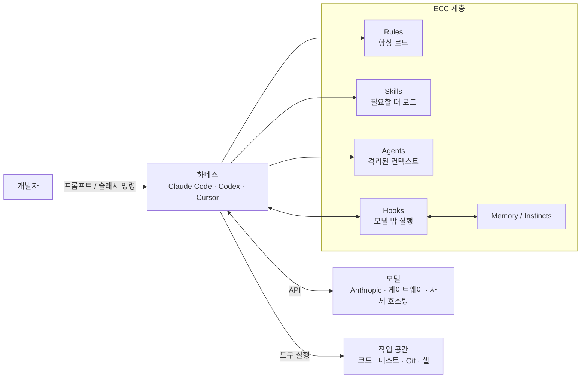
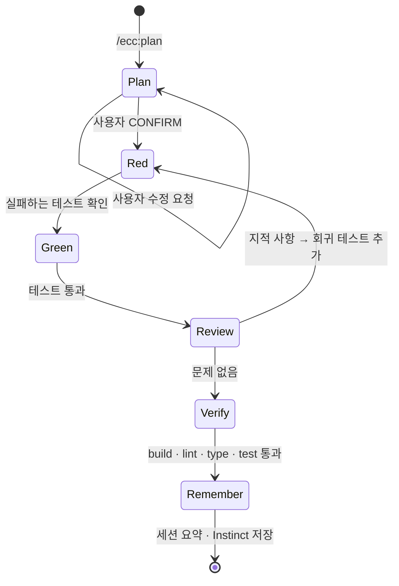

# ECC 핵심 개념과 동작 구조

> ECC를 이루는 Agent, Skill, Rule, Hook, Instinct·Memory, 설치 프로필이 각각 무엇이고 어떻게 맞물려 동작하는지 다룹니다.

## 용어 한눈에 보기

| 키워드 | 설명 |
|---|---|
| Harness | 모델에 도구를 붙여 실제 작업을 수행하게 하는 실행 환경. Claude Code, Codex, Cursor 등 |
| Agent | 특정 작업만 위임받아 처리하는 서브에이전트. 자기만의 컨텍스트와 도구 권한을 가짐 |
| Skill | 필요할 때만 로드되는 재사용 워크플로 정의(`SKILL.md`) |
| Rule | 매 세션 항상 로드되는 코딩 표준. 언어별로 골라서 설치 |
| Hook | 도구 실행 같은 이벤트에 맞춰 모델 밖에서 실행되는 스크립트 |
| Instinct | 실제 세션에서 학습한 패턴. 신뢰도 점수를 갖고 관련 있을 때만 다시 주입됨 |
| Memory Vault | 여러 하네스가 공유하는 로컬 Markdown 기반 기억 저장소 |
| Profile | 무엇을 얼마나 설치할지 정하는 묶음(minimal, core, full 등) |

---

## 1. Agent (서브에이전트)

### 쉽게 설명하면

팀장이 모든 일을 혼자 하지 않고 "이 PR 리뷰는 리뷰 담당에게", "빌드 깨진 건 빌드 담당에게" 넘기는 것과 같습니다. 담당자는 자기 일에 필요한 자료만 받아서 일하고, 결과만 보고합니다.

### 개발 관점에서는

Agent는 메인 에이전트가 작업을 위임하는 **서브에이전트 정의 파일**입니다. 각 Agent는 자기만의 컨텍스트 창에서 실행되고, 사용할 수 있는 도구와 모델이 제한됩니다. 그래서 다음 두 가지 효과가 생깁니다.

- 계획·구현 단계의 긴 대화가 리뷰 단계에 섞이지 않습니다(fresh-context review).
- 리뷰 Agent에게는 읽기 도구만 주는 식으로 권한을 좁힐 수 있습니다.

ECC에는 planner, architect, tdd-guide, code-reviewer, security-reviewer, build-error-resolver, e2e-runner, refactor-cleaner 같은 범용 Agent와 typescript-reviewer, python-reviewer, go-reviewer, react-reviewer 같은 언어별 Agent가 68개 있습니다.

### 예제

Claude Code의 서브에이전트 정의 형식은 Markdown + frontmatter입니다. ECC의 리뷰 Agent도 이 형식을 따릅니다.

```md
---
name: payment-reviewer
description: 결제 도메인 코드 리뷰 전문가. src/payments/** 변경 시 반드시 사용.
tools: ["Read", "Grep", "Glob", "Bash"]
model: sonnet
---

당신은 결제 시스템 코드 리뷰어입니다.

## 확인 항목
- 금액은 number가 아니라 정수(원 단위) 또는 Decimal로 다루는가
- 외부 PG 호출에 멱등성 키(idempotency key)가 있는가
- 재시도 로직이 중복 결제를 만들 수 있는가

## 출력
CRITICAL / HIGH / MEDIUM 으로 분류해서 파일:줄 형식으로 보고합니다.
```

`tools`에 `Edit`, `Write`가 없으므로 이 Agent는 코드를 고칠 수 없고 읽고 보고만 합니다.

### 핵심

> Agent는 "역할 + 격리된 컨텍스트 + 제한된 권한"입니다. 리뷰를 별도 Agent에 맡기는 이유는 작성자의 맹점을 리뷰어가 물려받지 않게 하기 위해서입니다.

## 2. Skill (필요할 때만 로드되는 워크플로)

### 쉽게 설명하면

회사 위키의 "업무 매뉴얼"과 같습니다. 모든 매뉴얼을 출근할 때마다 읽지 않고, 배포할 때는 배포 매뉴얼, 장애가 나면 장애 대응 매뉴얼을 펼쳐 봅니다.

### 개발 관점에서는

Skill은 `skills/<이름>/SKILL.md` 형태의 **재사용 워크플로 정의**입니다. 하네스는 평소에 Skill의 이름과 짧은 설명만 알고 있다가, 작업이 그 설명과 맞을 때 본문을 로드합니다. 그래서 Skill이 많아도 본문은 필요할 때만 컨텍스트에 들어옵니다.

ECC는 새로운 워크플로를 명령(command)이 아니라 Skill로 먼저 만드는 **skills-first** 방향으로 옮겨 가고 있습니다. `/tdd`, `/eval` 같은 예전 짧은 명령은 `legacy-command-shims/`로 옮겨졌고, 명시적으로 켜야 쓸 수 있습니다.

### 예제

```md
---
name: payment-tdd
description: 결제 관련 기능을 추가하거나 수정할 때 사용. 금액 계산, 환불, 재시도 로직 작업 시 자동 적용.
---

# Payment TDD

1. 변경할 동작을 테스트 이름으로 먼저 적는다.
2. 실패하는 테스트를 작성하고 실행해 RED 출력을 남긴다.
3. 테스트를 통과시키는 최소 구현을 작성한다(GREEN).
4. 금액 경계값(0원, 음수, 최대 한도)과 중복 요청 케이스를 추가한다.
5. `npm test`, `npm run typecheck`가 모두 통과해야 완료로 본다.
```

### 핵심

> Skill은 "평소에는 이름만, 필요할 때만 본문"입니다. 설명(description)에 언제 써야 하는지를 정확히 적어야 제때 로드됩니다.

## 3. Rule (항상 로드되는 규칙)

### 쉽게 설명하면

사무실 벽에 붙어 있는 "기본 수칙"입니다. 어떤 일을 하든 항상 눈에 들어옵니다. 그래서 벽에 붙일 내용은 신중하게 골라야 합니다.

### 개발 관점에서는

Rule은 세션마다 **항상** 컨텍스트에 로드되는 코딩 표준입니다. ECC의 `rules/`는 `common/`과 언어별 디렉터리(`typescript/`, `python/`, `golang/` 등)로 나뉘어 있고, 언어별 규칙이 공통 규칙을 구체화하거나 덮어쓰는 구조입니다.

항상 로드된다는 점이 장점이자 비용입니다. 한 줄 한 줄이 모든 턴의 컨텍스트를 차지하므로, 공식 문서도 `rules/common`과 **실제로 쓰는 언어 하나**부터 시작하라고 권장합니다.

### 예제

```bash
# 프로젝트 하나에만 적용하고 싶다면 프로젝트 로컬 .claude/rules 에 설치
mkdir -p .claude/rules/ecc
cp -R ECC/rules/common .claude/rules/ecc/
cp -R ECC/rules/typescript .claude/rules/ecc/

# 디렉터리 구조를 유지해야 한다 (평탄화하면 언어별 규칙이 common을 덮어쓰는 구조가 깨진다)
ls .claude/rules/ecc
# common  typescript
```

Claude 플러그인 설치(`/plugin install ecc@ecc`)는 Rule을 자동으로 배포하지 않으므로, Rule은 위처럼 직접 복사하거나 설치 스크립트의 프로필로 설치해야 합니다.

### 핵심

> Rule은 비싼 자리입니다. "어떤 작업에서든 반드시 지켜야 하는 것"만 Rule에 두고, 특정 작업 절차는 Skill로 내립니다.

## 4. Hook (모델 밖에서 실행되는 강제 장치)

### 쉽게 설명하면

공장 기계의 안전 센서와 같습니다. 작업자가 "조심해야지"라고 기억하는 것과 별개로, 손이 들어가면 기계가 멈춥니다.

### 개발 관점에서는

Hook은 하네스 이벤트(도구 실행 전 `PreToolUse`, 실행 후 `PostToolUse`, 세션 시작 `SessionStart`, 종료 `Stop` 등)에 연결된 **셸 명령**입니다. 모델이 아니라 하네스가 실행하므로 컨텍스트를 쓰지 않고, 모델이 잊어버릴 수도 없습니다. Claude Code에서는 `PreToolUse` Hook이 종료 코드 2를 반환하면 해당 도구 호출이 차단되고, stderr 내용이 모델에게 이유로 전달됩니다.

ECC의 대표 Hook은 다음과 같습니다.

- **GateGuard**: `rm`, 강제 `git checkout`, 파괴적 `find -exec`, PowerShell 파괴 명령 등을 실행 전에 막습니다. 세션 첫 Bash 실행이나 새 파일 생성 전에 "현재 요청이 무엇이고, 이 작업이 무엇을 위한 것인지"를 먼저 밝히도록 요구하는 사실 확인 게이트도 있습니다.
- **세션 요약·학습**: 세션 시작 시 이전 요약과 Instinct를 주입하고, 종료 시 세션을 요약해 저장합니다.
- **편집 후 검사**: 파일 수정 뒤 포맷·타입 체크를 자동으로 돌립니다.

Hook 강도는 `ECC_HOOK_PROFILE`로 조절합니다.

| 프로필 | 의미 |
|---|---|
| `minimal` | 꼭 필요한 Hook만 |
| `standard` | 기본값 |
| `strict` | 검사를 가장 엄격하게 |

특정 Hook만 끄려면 `ECC_DISABLED_HOOKS`에 Hook ID를 쉼표로 나열합니다.

### 예제

Claude Code Hook의 동작 원리를 보여주는 최소 예제입니다. 운영 DB 접속 명령을 막습니다.

```json
// .claude/settings.json (수동 Hook 예시)
{
  "hooks": {
    "PreToolUse": [
      {
        "matcher": "Bash",
        "hooks": [{ "type": "command", "command": "node .claude/hooks/block-prod-db.js" }]
      }
    ]
  }
}
```

```js
// .claude/hooks/block-prod-db.js
// 하네스가 stdin으로 도구 호출 정보를 JSON으로 넘겨준다
let input = '';
process.stdin.on('data', (chunk) => (input += chunk));
process.stdin.on('end', () => {
  const { tool_input } = JSON.parse(input);
  const command = tool_input?.command ?? '';

  if (/psql\s+.*prod/i.test(command)) {
    console.error('운영 DB 접속은 사람이 직접 실행해야 합니다.');
    process.exit(2); // 2 = 도구 호출 차단, stderr가 모델에게 전달됨
  }
  process.exit(0);
});
```

ECC의 Hook을 직접 쓸 때는 저장소의 `hooks/hooks.json`을 `settings.json`에 복사하지 말고 설치 스크립트(`--modules hooks-runtime --enable-hooks`)를 써야 합니다. 경로가 플러그인 기준으로 작성되어 있어서 그대로 복사하면 동작하지 않습니다.

### 핵심

> "하지 마"를 프롬프트에 적는 것은 부탁이고, Hook으로 막는 것은 강제입니다. 반드시 지켜야 하는 규칙은 Hook으로 옮깁니다.

Hook이 어떤 파일로 구성되고, 한 번의 도구 호출에서 어떤 순서로 실행되는지는 [Hook 깊이 보기](07-hooks.md#hook은-어떻게-이루어져-있는가)에서 자세히 다룹니다.

## 5. Instinct와 Memory (세션을 넘어 남는 기억)

### 쉽게 설명하면

일을 오래 하면 "이 프로젝트에서는 이렇게 하더라"는 감이 생깁니다. Instinct는 에이전트의 그런 감을 기록해 둔 것이고, Memory Vault는 여러 도구가 함께 보는 업무 일지입니다.

### 개발 관점에서는

- **세션 요약**: 세션 종료 시 결정 사항과 진행 상황을 요약해 저장하고, 다음 세션 시작 시 주입합니다. 크기는 `ECC_SESSION_START_MAX_CHARS`(기본 8,000자)로 제한하고, `ECC_SESSION_START_CONTEXT=off`로 끌 수 있습니다.
- **Instinct**(continuous-learning v2): 세션에서 관찰한 패턴을 신뢰도 점수와 함께 저장합니다. 다음 세션에는 신뢰도 0.7 이상(`ECC_INSTINCT_CONFIDENCE_THRESHOLD`), 최대 6개(`ECC_MAX_INJECTED_INSTINCTS`)만, 현재 프로젝트·스택과 관련 높은 순으로 주입합니다. `/evolve`로 비슷한 Instinct를 모아 Skill로 승격할 수 있습니다.
- **Memory Vault**: Claude, Codex, Kimi, Hermes 등 여러 하네스가 공유하는 로컬 Markdown 저장소입니다. 프로젝트 기억은 `.ecc/memory/`, 개인 기억은 `~/.ecc/memory/`에 저장됩니다.

### 예제

```bash
# Memory Vault CLI는 플러그인 설치만으로는 PATH에 없으므로 별도 설치
npm install -g ecc-universal@2.2.3

ecc memory init --scope project
ecc memory search "결제 재시도 정책" --target-harness codex
ecc memory doctor
```

```text
# Claude Code 안에서 Instinct 확인·관리
/instinct-status     -> 학습된 Instinct와 신뢰도 확인
/evolve              -> 비슷한 Instinct를 묶어 Skill 후보로 만들기
/prune               -> 오래된 미승인 Instinct 정리
```

### 핵심

> 기억은 "실행 정책"이 아니라 "검증되지 않은 참고 자료"입니다. 중요한 내용은 사람이 확인한 뒤 프로젝트 문서나 Rule로 승격합니다.

## 6. 설치 프로필과 선택 설치

### 쉽게 설명하면

공구 세트를 통째로 사지 않고, 지금 필요한 드라이버와 렌치만 꺼내 쓰는 것입니다.

### 개발 관점에서는

ECC는 설치 범위를 프로필과 모듈로 고릅니다.

- `minimal`: Hook 런타임 없이 핵심 워크플로만. 컨텍스트가 작은 로컬 모델에 적합
- `core`: 일반적인 기본 구성
- `full`: 전체 카탈로그
- `--skills tdd-workflow,security-review`: 원하는 Skill만
- `--with capability:machine-learning`: 특정 도메인 묶음 추가

Claude Code 플러그인은 설치된 카탈로그 목록을 모델에게 알리므로, 많이 설치할수록 그 목록만으로도 컨텍스트를 씁니다. 컨텍스트가 중요한 환경이면 선택 설치가 유리합니다.

### 예제

```bash
# 무엇을 설치할지 먼저 찾아보기
npx ecc-universal@2.2.3 consult "security reviews" --target claude

# Hook 없이 최소 구성 + 필요한 Skill만
npx ecc-universal@2.2.3 install --profile minimal --target claude
./install.sh --target claude --skills tdd-workflow,security-review
```

### 핵심

> 전체 설치에서 줄여 나가지 말고, 최소 구성에서 빈틈이 보일 때만 늘려 갑니다.

---

## 7. 전체 동작 구조

ECC는 애플리케이션 코드에 import되는 라이브러리가 아니라, **개발자와 모델 사이의 하네스 안에 설치되는 계층**입니다.



한 번의 작업이 처리되는 순서는 다음과 같습니다.

1. **시작점**: 세션이 시작되면 `SessionStart` Hook이 이전 세션 요약과 관련 Instinct를 정해진 크기 안에서 컨텍스트에 넣습니다. 설치된 Rule도 함께 로드됩니다.
2. **ECC가 개입하는 시점**: 개발자가 `/ecc:plan "..."`을 입력하거나, 작업 내용이 어떤 Skill의 설명과 맞으면 해당 Skill 본문이 로드됩니다.
3. **내부 처리**: Skill이 정한 절차에 따라 메인 에이전트가 planner, tdd-guide, code-reviewer 같은 Agent에 작업을 위임합니다. 각 Agent는 자기 컨텍스트에서 일하고 결과만 돌려줍니다.
4. **외부 시스템과의 연결**: 에이전트가 파일 수정·셸 명령 같은 도구를 호출할 때마다 `PreToolUse` / `PostToolUse` Hook이 끼어들어 위험 명령을 막거나 타입 체크를 돌립니다. 모델 호출 자체는 하네스 설정(공식 API, 게이트웨이, 자체 호스팅 모델)을 그대로 따릅니다.
5. **결과 반환**: 작업 결과는 코드 변경과 함께 "계획 → 실패한 테스트 → 통과한 테스트 → 리뷰 결과 → 최종 검증"이라는 증거 흐름으로 남습니다. 세션 종료 시 `Stop` Hook이 요약과 Instinct를 저장합니다.

기능 하나를 만드는 사이클을 상태 흐름으로 보면 다음과 같습니다.



---

[← 개요](README.md) · [설치와 첫 사용 →](02-getting-started.md)
