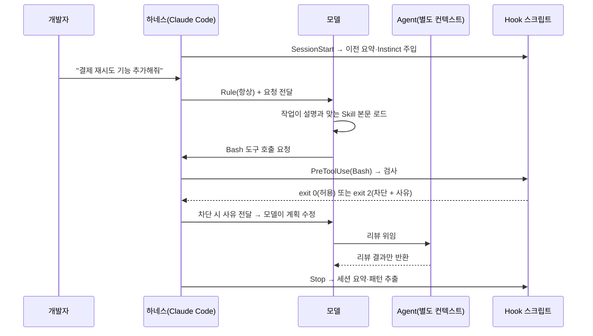
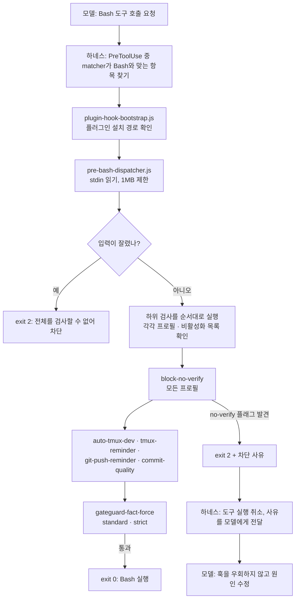

# ECC Hook 깊이 보기

> Skill·Agent·Rule과 Hook이 어떻게 다른지, 그리고 Hook이 어떤 파일로 이루어져 있고 한 번의 도구 호출에서 어떤 순서로 실행되는지 다룹니다.

## Skill·Agent·Rule과 Hook은 무엇이 다른가

### 한 줄로 구분하면

Skill, Agent, Rule은 **모델이 읽는 글**이고, Hook은 **하네스가 실행하는 프로그램**입니다.

Skill·Agent·Rule은 모두 Markdown으로 작성되어 모델의 컨텍스트에 들어갑니다. 모델은 그 내용을 읽고 따르려고 하지만, 따를지 말지는 결국 모델의 판단입니다. 반면 Hook은 모델의 컨텍스트 밖에서 하네스(Claude Code)가 직접 실행하는 스크립트입니다. 모델이 무엇을 기억하든, 어떻게 판단하든 정해진 이벤트가 오면 반드시 실행되고, 결과에 따라 도구 호출을 막을 수도 있습니다.

비유하면 Rule·Skill·Agent는 신입 사원에게 주는 업무 매뉴얼, 업무 절차서, 담당자 지정입니다. Hook은 출입문의 보안 게이트입니다. 매뉴얼은 읽고 잊을 수 있지만, 게이트는 출입증 없이는 열리지 않습니다.

### 항목별 비교

| 항목 | Rule | Skill | Agent | Hook |
|---|---|---|---|---|
| 정체 | 항상 지켜야 하는 표준 | 특정 작업의 절차 | 위임받은 작업자 | 이벤트에 붙은 스크립트 |
| 형식 | Markdown | `SKILL.md` (frontmatter + Markdown) | Markdown (frontmatter에 도구·모델 지정) | `hooks.json`의 명령 + Node.js 스크립트 |
| 누가 해석·실행하나 | 모델 | 모델 | 별도 컨텍스트의 모델 | 하네스 (모델 아님) |
| 언제 동작하나 | 매 턴 항상 로드 | 작업이 설명과 맞을 때 로드 | 메인 에이전트가 위임할 때 | 도구 호출 전후, 세션 시작·종료, 응답 종료 등 이벤트 발생 시 |
| 컨텍스트 소비 | 매 턴 전부 | 로드될 때만 본문 | 별도 컨텍스트 (메인에는 결과만) | 거의 없음 (차단 사유나 추가 정보만 전달) |
| 강제력 | 없음 (모델이 놓칠 수 있음) | 없음 | 도구 권한 제한만 강제됨 | 있음 (종료 코드 2로 도구 호출 차단) |
| 판단 능력 | 맥락을 이해하고 적용 | 맥락을 이해하고 적용 | 맥락을 이해하고 적용 | 정해진 규칙(패턴 매칭 등)만 적용 |
| 대표 예 | `rules/common`, `rules/typescript` | `tdd-workflow`, `security-review` | `code-reviewer`, `planner` | GateGuard, config-protection, 세션 요약 |

핵심 차이는 **판단력과 강제력의 교환**입니다. 모델이 읽는 세 가지는 "이 상황에서는 이게 맞다"는 맥락 판단을 할 수 있지만 강제할 수 없습니다. Hook은 반드시 실행되지만 정해진 규칙 이상의 판단은 하지 못합니다. 문서 안의 heredoc 본문을 실제 명령으로 오인해 막는 GateGuard 오탐이 바로 이 한계에서 나옵니다. 비슷하게, 커밋을 하지 않고 `echo '... git commit --no-verify ...'`처럼 문자열만 출력하는 명령도 `block-no-verify` Hook은 차단합니다. Hook은 명령의 의도를 이해하지 못하고 문자열 패턴만 보기 때문입니다.

### 한 번의 작업에서 각각 개입하는 지점



### 무엇을 어디에 둘지 고르는 기준

| 이런 요구라면 | 여기에 둔다 | 이유 |
|---|---|---|
| 판단이 필요한 코딩 원칙 ("함수는 한 가지 일만") | Rule | 모든 작업에 적용되지만 상황 판단이 필요함 |
| 특정 작업의 긴 절차 ("결제 기능은 이 순서로 TDD") | Skill | 그 작업을 할 때만 필요하므로 평소 컨텍스트를 아낌 |
| 다른 시선이나 좁은 권한이 필요한 일 ("읽기 전용으로 리뷰") | Agent | 작성자의 맥락과 분리하고 도구 권한을 제한함 |
| 어기면 사고가 나는 금지 사항 ("`--no-verify`로 커밋 훅 우회 금지") | Hook | 모델이 잊어도 반드시 막아야 함 |
| 결과를 기계적으로 확인할 수 있는 검사 ("편집 후 타입 체크") | Hook | 사람이 매번 시킬 필요 없이 항상 실행되어야 함 |

한 요구를 둘로 나누는 경우도 많습니다. ECC의 `config-protection` Hook이 좋은 예입니다. 에이전트는 린트 오류를 만나면 코드를 고치는 대신 ESLint·Prettier 설정 파일을 수정해 검사를 통과시키려는 경향이 있습니다. "린트 설정을 바꾸지 말고 코드를 고쳐라"를 Rule에만 적으면 모델이 놓칠 수 있으므로, ECC는 기존 린트·포매터 설정 파일 수정을 Hook으로 차단하고 차단 메시지로 "원본 코드를 고치라"고 방향을 돌려줍니다. **왜 그래야 하는지는 Rule로 설명하고, 반드시 지켜야 하는 선은 Hook으로 긋는** 방식입니다.

---

## Hook은 어떻게 이루어져 있는가

### Hook 하나의 구성: 이벤트 · matcher · 명령

Hook 설정은 "**어떤 이벤트**에서, **어떤 도구**에 대해, **어떤 명령**을 실행할지"의 세 가지로 이루어집니다.

```json
{
  "hooks": {
    "PreToolUse": [
      {
        "matcher": "Edit|Write|MultiEdit",
        "hooks": [
          {
            "type": "command",
            "command": "node scripts/hooks/run-with-flags.js pre:config-protection scripts/hooks/config-protection.js standard,strict",
            "timeout": 5
          }
        ]
      }
    ]
  }
}
```

| 필드 | 의미 |
|---|---|
| 이벤트 키 (`PreToolUse`) | 언제 실행할지. 도구 실행 전, 실행 후, 세션 시작 등 |
| `matcher` | 어떤 도구에 반응할지. 도구 이름에 대한 정규식 (`Bash`, `Edit\|Write`, `^mcp__`, `.*`) |
| `type` | 실행 방식. ECC는 모두 `command`(셸 명령) |
| `command` | 실제로 실행할 명령 |
| `timeout` | 최대 실행 시간(초). 넘으면 중단됨 |
| `async` | `true`면 백그라운드 실행. 작업 흐름을 기다리게 하지 않는 대신 차단도 할 수 없음 |

### ECC가 사용하는 이벤트

| 이벤트 | 실행 시점 | 차단 가능 | ECC에서의 용도 |
|---|---|---|---|
| `PreToolUse` | 도구 실행 직전 | O | GateGuard, `--no-verify` 차단, 설정 파일 보호, MCP 상태 확인, 행동 관찰 (9개 항목) |
| `PostToolUse` | 도구 실행 직후 | X | 편집 후 품질 검사, 포맷, 타입 체크, PR 생성 기록 |
| `PostToolUseFailure` | 도구 실행이 실패한 직후 | X | 실패한 MCP 호출 상태 기록, Skill 실행 추적 |
| `PreCompact` | 컨텍스트 압축 직전 | X | 압축으로 사라질 상태를 파일로 저장 |
| `SessionStart` | 세션 시작 | X | 이전 세션 요약·Instinct 주입, 열려 있는 Plan Canvas 리뷰 안내 |
| `Stop` | 모델 응답이 끝날 때마다 | X | `console.log` 감사, 세션 요약 저장, 패턴 추출, 비용 기록, 데스크톱 알림 (7개 항목) |
| `SessionEnd` | 세션 종료 | X | 종료 기록과 정리 |

차단할 수 있는 것은 `PreToolUse`뿐입니다. 이미 실행된 도구를 되돌릴 수는 없으므로, "막아야 하는 것"은 반드시 실행 전 단계에 걸어야 합니다.

### 입력과 출력 약속

Hook 스크립트와 하네스는 표준 입출력과 종료 코드로 대화합니다.

**입력 (stdin)**: 하네스가 도구 호출 정보를 JSON으로 넘겨줍니다.

```json
{
  "tool_name": "Bash",
  "tool_input": { "command": "git commit --no-verify -m \"fix\"" }
}
```

`Edit`/`Write`라면 `tool_input`에 `file_path`, `old_string`, `new_string`, `content`가 들어오고, `PostToolUse`에서는 실행 결과(`tool_output`)도 함께 들어옵니다.

**출력 (종료 코드 + stderr + stdout)**

| 신호 | 의미 |
|---|---|
| 종료 코드 `0` | 통과. 도구가 그대로 실행됨 |
| 종료 코드 `2` | 차단 (`PreToolUse`에서만). stderr 내용이 차단 사유로 모델에게 전달됨 |
| 그 외 종료 코드 | Hook 자체의 오류. 기록만 되고 도구 실행은 막지 않음 |
| stderr (종료 코드 0) | 차단하지 않는 경고 메시지 |
| stdout | 명시적인 결정이나 모델에게 추가로 줄 정보(`additionalContext`)가 있을 때만 사용. 할 말이 없으면 비워 둠 |

stdout을 비워 두는 규칙이 중요합니다. 받은 입력을 그대로 stdout에 다시 출력하면 하네스가 그것을 Hook의 응답으로 해석할 수 있습니다.

### ECC의 Hook 파일 구성

```text
ECC/
├── hooks/
│   ├── hooks.json             # 실행 그래프: 이벤트 · matcher · 명령 (하네스가 읽는 파일)
│   ├── hooks.metadata.json    # 각 항목의 고정 ID · 설명 · fingerprint (사이드카)
│   ├── codex-hooks.json       # Codex 하네스용 Hook 정의
│   └── memory-persistence/    # 세션 시작·압축·종료 시 기억 저장 동작의 명세
└── scripts/
    ├── hooks/
    │   ├── plugin-hook-bootstrap.js  # 플러그인 설치 경로를 찾아 실제 스크립트로 연결
    │   ├── run-with-flags.js         # 공통 실행기: 프로필 · 비활성화 목록 · 입력 크기 검사
    │   ├── pre-bash-dispatcher.js    # Bash 호출 검사를 한 프로세스에서 순서대로 실행
    │   ├── gateguard-fact-force.js   # GateGuard
    │   ├── config-protection.js      # 린트·포매터 설정 파일 보호
    │   ├── block-no-verify.js        # git 훅 우회 플래그 차단
    │   └── ...                       # 그 밖의 개별 Hook 로직
    └── lib/
        └── hook-flags.js             # 프로필(minimal/standard/strict)과 활성화 여부 판단
```

설정과 로직이 분리되어 있다는 점이 핵심입니다. `hooks.json`은 "언제 무엇을 부를지"만 정하고, 실제 판단은 모두 `scripts/hooks/`의 Node.js 스크립트가 합니다. Node.js로 작성한 덕분에 Windows, macOS, Linux에서 같은 로직이 돌아갑니다.

`hooks.metadata.json`이 따로 있는 이유도 알아 둘 만합니다. Claude Code는 플러그인의 `hooks.json`을 자체 스키마로 검증하고, `id`·`description`·`$schema` 같은 모르는 키가 있으면 로드할 때 경고를 냅니다. 그래서 ECC는 하네스가 받아들이는 키만 `hooks.json`에 두고, 사람이 관리할 ID와 설명은 같은 순서의 사이드카 파일로 분리했습니다. 각 항목에는 matcher와 명령으로 계산한 fingerprint가 있어서, 한쪽만 순서를 바꾸거나 명령을 수정하면 CI 검증(`validate-hooks.js`)에서 실패합니다.

### 공통 실행기 `run-with-flags.js`

`hooks.json`의 명령을 보면 대부분 같은 형태입니다.

```text
node scripts/hooks/run-with-flags.js <Hook ID> <스크립트 경로> <허용 프로필>
node scripts/hooks/run-with-flags.js pre:config-protection scripts/hooks/config-protection.js standard,strict
```

각 Hook이 스크립트를 직접 실행하지 않고 이 실행기를 거치는 이유는 공통 처리를 한곳에 모으기 위해서입니다.

1. **활성화 여부 판단**: `ECC_HOOKS_ENABLED`(전체 스위치), `ECC_HOOK_PROFILE`(현재 프로필), `ECC_DISABLED_HOOKS`(개별 끄기)를 보고 이번 Hook을 실행할지 정합니다. 현재 프로필이 허용 목록에 없거나 ID가 비활성화 목록에 있으면 아무것도 하지 않고 통과시킵니다.
2. **입력 크기 제한**: stdin을 `ECC_HOOK_INPUT_MAX_BYTES`(기본·최대 1MB)까지만 읽습니다.
3. **안전 Hook의 fail-closed 처리**: 입력이 잘려서 전체를 검사할 수 없으면 GateGuard와 MCP 상태 확인 같은 안전 Hook은 **통과가 아니라 차단**으로 처리합니다. 검사하지 못한 요청을 통과시키는 것보다 다시 시도하게 하는 편이 안전하기 때문입니다.
4. **결과 정리**: 스크립트의 결과를 종료 코드, stderr, stdout 형식에 맞춰 하네스에 돌려주고, 출력이 끝까지 전달된 다음에 종료합니다. 큰 출력이 중간에 잘려 하네스가 Hook을 실패로 처리하던 문제를 고친 부분입니다.

### 한 번의 Bash 호출이 처리되는 흐름

모델이 `git commit --no-verify -m "fix"`를 실행하려 할 때를 따라가 보겠습니다.



1. 하네스는 `PreToolUse` 항목 중 matcher가 `Bash`와 맞는 것을 모두 찾습니다. Bash 검사는 `pre-bash-dispatcher.js` 하나로 묶여 있고, `.*`(모든 도구)나 `Bash|PowerShell|Write|Edit|MultiEdit`처럼 범위가 넓은 다른 항목(행동 관찰, 거버넌스 기록)도 함께 호출됩니다.
2. 디스패처는 Bash 관련 검사 여러 개를 한 프로세스 안에서 정해진 순서로 실행합니다. 각 검사는 자기 ID와 허용 프로필을 갖고 있어서, 예를 들어 `pre:bash:tmux-reminder`는 `strict`에서만 실행됩니다.
3. `block-no-verify`가 `--no-verify`를 발견하면 종료 코드 2와 차단 사유를 돌려줍니다. 이 검사는 `minimal` 프로필에서도 실행되는 핵심 안전장치입니다.
4. 하네스는 Bash를 실행하지 않고 사유를 모델에게 전달합니다. 모델은 커밋 훅을 우회하지 않고 훅이 실패한 원인을 고치는 쪽으로 계획을 바꿉니다.
5. 디스패처 자체가 예외로 죽으면 그것도 종료 코드 2로 처리합니다. 검사기가 고장 났을 때 검사 없이 통과시키지 않도록 하기 위해서입니다.

### 프로필별로 켜지는 Hook

`ECC_HOOK_PROFILE`이 바꾸는 것은 "어떤 Hook ID가 실행되는가"입니다. 프로필을 지정하지 않은 Hook은 기본적으로 `standard`와 `strict`에서 실행됩니다.

| Hook ID | minimal | standard | strict | 하는 일 |
|---|:-:|:-:|:-:|---|
| `pre:bash:dispatcher` | O | O | O | Bash 검사 묶음의 입구 |
| `pre:bash:block-no-verify` | O | O | O | `--no-verify`, `core.hooksPath` 변경으로 git 훅을 우회하는 명령 차단 |
| `pre:bash:gateguard-fact-force` | | O | O | Bash 실행 전 사실 확인 요구 |
| `pre:edit-write:gateguard-fact-force` | | O | O | 파일 편집·생성 전 사실 확인 요구 |
| `pre:config-protection` | | O | O | 기존 린트·포매터 설정 파일 수정 차단 |
| `pre:write:doc-file-warning` | | O | O | 정해진 위치 밖에 `.md`/`.txt` 파일을 만들면 경고 |
| `pre:edit-write:suggest-compact` | | O | O | 도구 호출이 많이 쌓이면 수동 `/compact` 제안 |
| `pre:mcp-health-check` | | O | O | MCP 도구 실행 전 서버 상태 확인 (실패하면 `PostToolUseFailure`에서 비정상 표시 후 재연결 시도) |
| `pre:observe` | | O | O | Instinct 학습을 위한 행동 관찰 기록 |
| `pre:bash:tmux-reminder` | | | O | 오래 걸리는 명령은 tmux에서 실행하라고 안내 |
| `pre:bash:git-push-reminder` | | | O | `git push` 전에 변경 사항 확인 안내 |
| `pre:bash:commit-quality` | | | O | 커밋 전 staged 파일 린트, 커밋 메시지 형식, `console.log`·비밀값 검사 |

`minimal`에서는 GateGuard도 꺼진다는 점에 주의해야 합니다. `minimal`은 "가장 안전한 설정"이 아니라 "가장 가벼운 설정"입니다.

### GateGuard: "정말 괜찮아요?" 대신 사실을 요구하는 Hook

GateGuard는 ECC Hook의 설계 방향을 가장 잘 보여줍니다. 모델에게 "정말 실행해도 괜찮나요?"라고 물으면 거의 항상 "네"라고 답합니다. 그래서 GateGuard는 확인 질문 대신 **구체적인 사실을 먼저 제시하게** 합니다.

| 상황 | 요구하는 것 |
|---|---|
| 파일 편집·생성 전 (파일당 처음 한 번) | 이 파일을 import하는 곳, 영향받는 공개 함수·클래스, 다루는 데이터의 필드 구조, 사용자 지시 원문 |
| 파괴적인 Bash·PowerShell 명령 전 | 영향받는 대상 목록, 되돌리는 방법, 사용자 지시 원문 |
| 일반 Bash 명령 (세션당 처음 한 번) | 현재 요청을 한 문장으로, 이 명령이 무엇을 확인하거나 만드는지 |

실제로 세션 첫 Bash 명령을 실행하려고 하면 다음과 같은 차단 메시지가 돌아옵니다.

```text
PreToolUse:Bash hook error: [Fact-Forcing Gate]

Before the first Bash command this session, present these facts:

1. The current user request in one sentence
2. What this specific command verifies or produces

Present the facts, then retry the same operation.
```

모델은 이 사실들을 정리해서 밝힌 다음 같은 작업을 다시 시도해야 합니다. 조사하는 과정 자체가 "이 파일을 누가 쓰는지 모른 채 고치는" 실수를 줄여 줍니다. 대신 매 세션 첫 작업이 한 단계 늘어나므로, 설치·복구 작업 중에는 `ECC_GATEGUARD=off`로 GateGuard만 잠시 끄거나 `GATEGUARD_EXEMPT_GLOBS`로 특정 경로를 제외할 수 있습니다.

### Hook을 직접 다룰 때의 원칙

- **설정 파일을 복사하지 않습니다.** 저장소의 `hooks.json`은 플러그인 경로 기준이어서 `settings.json`에 붙여 넣으면 경로가 맞지 않습니다. 수동 설치는 `install.sh --modules hooks-runtime --enable-hooks`를 쓰면 경로를 실제 환경에 맞게 바꿔 등록합니다.
- **끌 때는 파일이 아니라 환경 변수로 끕니다.** `ECC_DISABLED_HOOKS="pre:bash:tmux-reminder,post:edit:typecheck"`처럼 ID로 끄면 업데이트해도 설정이 유지됩니다.
- **느린 작업은 `async`로 돌립니다.** 빌드 분석이나 비용 기록처럼 결과를 기다릴 필요가 없는 작업을 동기로 실행하면 모든 도구 호출이 그만큼 느려집니다. 단, `async` Hook은 차단할 수 없습니다.
- **막아야 하는 것만 종료 코드 2를 씁니다.** 단순 안내는 종료 코드 0과 stderr로 충분합니다. 차단이 잦으면 모델이 작업을 진행하지 못하고 같은 시도를 반복합니다.
- **Hook만 따로 실행해서 확인합니다.** Hook은 stdin으로 JSON을 받는 일반 스크립트이므로, 모델 없이도 ECC 저장소 루트에서 바로 테스트할 수 있습니다.

```bash
# 테스트 입력을 파일로 준비 (차단 대상 문자열은 조립해서 만든다)
node -e '
const flag = "--no-" + "verify";
require("fs").writeFileSync("block.json", JSON.stringify({ tool_name: "Bash", tool_input: { command: `git commit ${flag} -m x` } }));
require("fs").writeFileSync("pass.json",  JSON.stringify({ tool_name: "Bash", tool_input: { command: "git status" } }));
'

node scripts/hooks/pre-bash-dispatcher.js < block.json; echo "exit code: $?"
# BLOCKED: --no-verify flag is not allowed with git commit. Git hooks must not be bypassed.
# exit code: 2

node scripts/hooks/pre-bash-dispatcher.js < pass.json; echo "exit code: $?"
# exit code: 0
```

  차단 대상 문자열을 명령에 그대로 쓰지 않고 조립하는 데는 이유가 있습니다. ECC가 설치된 에이전트에게 이 테스트를 시키면, `echo '... --no-verify ...'`처럼 문자열이 그대로 들어간 테스트 명령 자체를 설치된 Hook이 먼저 막습니다.

---

[← 장단점과 대안 비교](06-comparison.md) · [목차](README.md) · [주의할 점과 FAQ →](08-pitfalls-faq.md)
