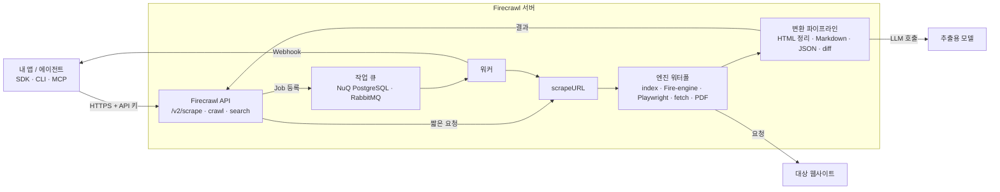
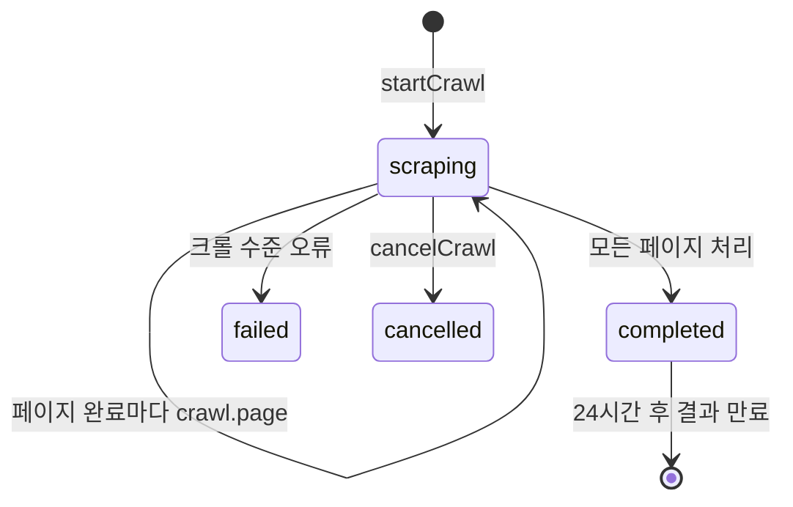

# Firecrawl 핵심 개념과 동작 구조

> Firecrawl을 이루는 Scrape·Format, Map·Crawl, Search, 비동기 Job·Webhook, 엔진·캐시, Agent·Interact가 각각 무엇이고 한 번의 요청이 서버 안에서 어떻게 처리되는지 다룹니다.

## 용어 한눈에 보기

| 키워드 | 설명 |
|---|---|
| Scrape | URL 하나를 가져와 요청한 형식으로 변환하는 가장 기본 동작 |
| Format | 결과 형태. `markdown`, `html`, `links`, `screenshot`, `json`, `summary`, `changeTracking` 등 |
| Map | 사이트의 URL 목록만 빠르게 찾는 동작. 본문은 가져오지 않음 |
| Crawl | 시작 URL에서 링크를 따라가며 여러 페이지를 Scrape하는 비동기 작업 |
| Search | 웹을 검색해 상위 페이지 목록을 받고, 원하면 각 페이지의 본문까지 Scrape |
| Batch Scrape | 이미 알고 있는 URL 여러 개를 한 번에 비동기로 Scrape |
| Job | Crawl·Batch·Agent처럼 오래 걸리는 작업의 ID. 상태 조회나 Webhook으로 결과를 받음 |
| Engine | 실제로 페이지를 가져오는 수단. 캐시 인덱스, Fire-engine(브라우저), Playwright, fetch, PDF·문서 파서 등 |
| `maxAge` | 캐시된 결과를 얼마나 오래된 것까지 재사용할지 정하는 값(밀리초) |
| Credit | 클라우드 과금 단위. 기본 Scrape 1페이지 = 1 credit, JSON 추출 등은 추가 |

---

## 1. Scrape와 Format

### 쉽게 설명하면

브라우저의 "읽기 모드"를 API로 만든 것입니다. 주소를 주면 광고·메뉴·쿠키 배너를 걷어낸 본문을 돌려줍니다. 여기에 "본문 말고 표에 있는 가격만 JSON으로 줘" 같은 주문도 할 수 있습니다.

### 개발 관점에서는

`scrape(url, options)`는 동기 호출입니다. 응답을 기다리면 `Document` 하나가 옵니다. 무엇을 받을지는 `formats` 배열로 정합니다.

- **문자열 포맷**: `markdown`(기본), `html`(정리된 HTML), `rawHtml`(원본), `links`, `images`, `screenshot`, `summary`
- **객체 포맷**: `{ type: 'json', schema }`(구조화 추출), `{ type: 'changeTracking', modes }`(이전 결과와 비교), `{ type: 'screenshot', fullPage: true }` 등

`onlyMainContent`(기본 `true`)는 헤더·푸터·내비게이션을 걷어낼지, `includeTags`·`excludeTags`는 특정 CSS 선택자만 남기거나 뺄지 정합니다. `formats`에 넣지 않은 필드는 응답에서 지워집니다. 내부에서 Markdown을 만들었더라도 요청하지 않았다면 돌려주지 않습니다.

### 예제

```ts
import { Firecrawl } from 'firecrawl';
import { z } from 'zod';

const firecrawl = new Firecrawl({ apiKey: process.env.FIRECRAWL_API_KEY });

const doc = await firecrawl.scrape('https://firecrawl.dev/pricing', {
  formats: [
    'markdown',
    {
      type: 'json',
      schema: z.object({
        plans: z.array(z.object({ name: z.string(), monthlyPrice: z.number().nullable() })),
      }),
    },
  ],
});

console.log(doc.metadata?.title, doc.metadata?.statusCode);
console.log(doc.json); // { plans: [{ name: 'Hobby', monthlyPrice: ... }, ...] }
```

같은 페이지에서 사람이 읽을 Markdown과 프로그램이 쓸 JSON을 한 번에 받습니다. JSON 추출은 서버가 LLM을 호출하므로 기본 1 credit에 추가 비용이 붙습니다.

### 핵심

> Scrape는 "URL 하나 → Document 하나"입니다. 무엇을 받을지는 `formats`가 결정하고, 요청하지 않은 형식은 오지 않습니다.

## 2. Map과 Crawl

### 쉽게 설명하면

Map은 서점의 "도서 목록"만 받아 보는 것이고, Crawl은 목록을 따라가며 책 내용까지 전부 복사해 오는 것입니다.

### 개발 관점에서는

- **Map**은 사이트맵과 링크 탐색으로 URL 목록(`{ url, title, description }[]`)을 빠르게 돌려줍니다. `search` 옵션을 주면 그 단어와 관련 높은 순으로 정렬합니다. 본문을 가져오지 않으므로 싸고 빠릅니다.
- **Crawl**은 비동기 Job입니다. 시작 URL에서 링크를 따라가며 각 페이지를 Scrape합니다. 범위는 `limit`(최대 페이지 수), `includePaths`·`excludePaths`(경로 정규식), `maxDiscoveryDepth`(링크 홉 수), `sitemap`(`include`·`skip`·`only`), `crawlEntireDomain`, `allowSubdomains`로 제한합니다. 각 페이지에 적용할 Scrape 옵션은 `scrapeOptions`로 넘깁니다.

실무에서는 **Map으로 범위를 먼저 확인하고, 필요한 경로만 Crawl**하는 순서가 비용을 아낍니다.

### 예제

```ts
const { links } = await firecrawl.map('https://docs.firecrawl.dev', { search: 'webhook', limit: 20 });
links.forEach((l) => console.log(l.url));

const job = await firecrawl.crawl('https://docs.firecrawl.dev', {
  limit: 50,
  includePaths: ['^/features/.*'],
  scrapeOptions: { formats: ['markdown'] },
});
console.log(job.status, job.completed, '/', job.total);
```

SDK의 `crawl()`은 Job을 시작하고 완료될 때까지 상태를 폴링해 모든 페이지를 모아 돌려줍니다. 기다리지 않으려면 `startCrawl()`로 ID만 받습니다.

### 핵심

> Map은 "어디가 있는지", Crawl은 "거기 무엇이 있는지"입니다. Crawl 범위는 반드시 `limit`과 경로 필터로 묶어야 비용이 예측됩니다.

## 3. Search

### 쉽게 설명하면

검색 엔진에서 결과 목록을 받은 다음, 각 링크를 눌러 본문까지 읽어 오는 일을 한 번에 하는 것입니다.

### 개발 관점에서는

`search(query, { limit, sources, includeDomains, scrapeOptions })`는 웹·뉴스·이미지 검색 응답을 돌려줍니다. 응답은 `web`, `news`, `images` 배열로 나뉩니다(REST API에서는 `data` 아래에 들어 있습니다). `scrapeOptions`를 주면 각 결과 URL을 Scrape해서 Markdown까지 채웁니다. 2026년 7월에는 결과마다 질문과 관련된 발췌문을 돌려주는 자체 관련도 모델이 도입되어, 전체 본문을 받지 않고도 답할 수 있는 경우가 늘었습니다.

### 예제

```ts
const results = await firecrawl.search('Next.js 15 caching changes', {
  limit: 3,
  scrapeOptions: { formats: ['markdown'] },
});
for (const r of results.web ?? []) {
  if ('markdown' in r) console.log(r.metadata?.sourceURL, r.markdown?.slice(0, 200));
}
```

### 핵심

> Search는 "URL을 모르는 상태"의 입구입니다. 에이전트 도구로 쓸 때 가장 먼저 붙이는 기능입니다.

## 4. 비동기 Job과 Webhook

### 쉽게 설명하면

택배를 보내고 운송장 번호를 받는 것과 같습니다. 바로 결과가 나오지 않는 일은 번호(Job ID)를 받아 두고, 조회하거나 도착 알림(Webhook)을 받습니다.

### 개발 관점에서는

Crawl, Batch Scrape, Agent는 Job으로 처리됩니다. 결과를 받는 방법은 세 가지입니다.

| 방법 | 동작 | 어울리는 곳 |
|---|---|---|
| SDK 대기 (`crawl`, `batchScrape`) | SDK가 완료될 때까지 폴링 | 스크립트, 작은 작업 |
| 상태 조회 (`getCrawlStatus`) / watcher | ID로 직접 조회하거나 WebSocket으로 이벤트 수신 | 진행률 표시 |
| Webhook | `crawl.started`, `crawl.page`, `crawl.completed`, `crawl.failed` 이벤트를 내 서버로 POST | 운영 서버, 긴 작업 |

Webhook 요청에는 `X-Firecrawl-Signature: sha256=<HMAC>` 헤더가 붙으므로 원문 바디로 서명을 검증해야 합니다. 완료된 Job 결과는 API로 24시간 동안 조회할 수 있으니, 결과는 받는 즉시 내 저장소에 옮겨야 합니다.

### 예제

```ts
const { id } = await firecrawl.startCrawl('https://docs.example.com', {
  limit: 200,
  webhook: {
    url: 'https://api.myapp.com/webhooks/firecrawl',
    events: ['page', 'completed', 'failed'],
    metadata: { sourceId: 'docs-main' }, // 이벤트에 그대로 돌려받는 값
  },
});
```

서버 쪽 수신·검증 코드는 [서버 수집 파이프라인과 운영](05-usage-server-pipeline.md)에서 다룹니다.

### 핵심

> 오래 걸리는 작업은 "기다리기"가 아니라 "ID를 받고 이벤트로 결과 받기"로 설계합니다.

## 5. Engine과 캐시

### 쉽게 설명하면

같은 페이지라도 그냥 문을 두드리면 열리는 곳(HTTP), 직접 들어가 봐야 보이는 곳(브라우저), 이미 복사본이 있는 곳(캐시)이 있습니다. Firecrawl은 요청마다 가장 알맞은 방법을 먼저 쓰고, 안 되면 다음 방법으로 넘어갑니다.

### 개발 관점에서는

서버는 요청을 기능 플래그(`actions`, `screenshot`, `pdf`, `stealthProxy` 등)로 바꾼 다음, 그 기능을 지원하는 엔진만 골라 품질 순으로 시도합니다. 클라우드에서는 캐시 인덱스가 가장 먼저 시도되고, 그다음 Fire-engine의 Chrome 브라우저 엔진이 시도됩니다. 일반 웹페이지에서는 브라우저가 실패했을 때 단순 HTTP 요청으로 내려가면 차단 페이지를 받기 쉬워서, 클라우드는 fetch로 폴백하지 않습니다. 셀프호스팅 기본 스택에는 캐시 인덱스와 Fire-engine이 없어서 Playwright와 fetch가 쓰입니다.

`maxAge`는 캐시 재사용 기준입니다. 기본값은 172,800,000ms(2일)이고, `0`이면 항상 새로 가져옵니다. 가격처럼 신선도가 중요한 페이지는 `maxAge`를 줄이고, 문서처럼 자주 안 바뀌는 페이지는 기본값을 두어 속도와 비용을 아낍니다. 응답의 `metadata.cacheState`로 캐시 적중 여부를 볼 수 있습니다.

엔진 선택과 폴백의 실제 알고리즘은 [스크랩 엔진 워터폴 깊이 보기](07-scrape-engine-waterfall.md)에서 소스 코드와 함께 다룹니다.

### 핵심

> 같은 URL이라도 요청 옵션에 따라 다른 엔진이 선택됩니다. 결과가 이상하면 "어떤 엔진과 캐시가 쓰였는가"부터 의심합니다.

## 6. Agent와 Interact

### 쉽게 설명하면

Agent는 "이런 정보를 찾아와"라고만 말하면 알아서 검색하고 돌아다니는 조수이고, Interact는 이미 열어 둔 페이지에서 "검색창에 입력하고 첫 결과를 눌러"처럼 조작을 이어 가는 원격 브라우저입니다.

### 개발 관점에서는

- **Agent**(`/v2/agent`)는 URL 없이 `prompt`(선택적으로 `urls`, `schema`)를 받아 검색·탐색·추출을 수행하는 비동기 Job입니다. 예전 `/extract` 엔드포인트를 대체했고, 모델은 `spark-2`로 통일되었으며 `effort`(`low`·`medium`·`high`)로 추론량을 조절합니다. `maxCredits`로 비용 상한을 둡니다.
- **Interact**는 `scrape`가 돌려준 `scrapeId`로 같은 브라우저 세션을 이어 쓰며, 자연어 `prompt`나 Playwright 코드로 페이지를 조작합니다. `profile`로 쿠키·로그인 상태를 세션 간에 유지할 수 있습니다.

둘 다 **클라우드 전용**이며, 셀프호스팅 기본 스택에서는 쓸 수 없습니다.

### 예제

```ts
const result = await firecrawl.agent({
  prompt: 'Firecrawl 공동 창업자 이름과 역할을 찾아줘',
  schema: z.object({ founders: z.array(z.object({ name: z.string(), role: z.string().nullable() })) }),
  effort: 'low',
});
console.log(result.data);
```

### 핵심

> Scrape·Crawl은 "어디를 가져올지 내가 정한다", Agent는 "무엇이 필요한지만 말한다"입니다. 통제가 필요하면 전자, 탐색이 필요하면 후자를 씁니다.

---

## 7. 전체 동작 구조

Firecrawl은 애플리케이션에 내장되는 파서가 아니라, **SDK가 HTTP로 호출하는 원격 서비스**입니다.



한 번의 요청이 처리되는 순서는 다음과 같습니다.

1. **시작점**: 앱이 SDK로 `scrape`나 `startCrawl`을 호출합니다. 짧은 Scrape는 API 프로세스에서 바로 처리되고, Crawl·Batch는 큐에 Job으로 등록된 뒤 ID가 먼저 반환됩니다.
2. **요청 해석**: 서버는 옵션과 URL 확장자를 기능 플래그로 바꿉니다. `actions`가 있으면 `actions`, `.pdf`로 끝나면 `pdf`, `proxy: 'stealth'`면 `stealthProxy` 같은 식입니다. robots.txt와 차단 도메인 검사도 이 단계에서 이뤄집니다.
3. **엔진 실행**: 기능 플래그를 지원하는 엔진 목록을 품질 순으로 정렬해 차례로 시도합니다. 한 엔진이 너무 오래 걸리면 다음 엔진을 동시에 출발시키고, 먼저 성공한 결과를 씁니다.
4. **변환**: 원본 HTML에서 정리된 HTML → Markdown → 링크·이미지·메타데이터를 만들고, 요청에 따라 PII 제거, LLM JSON 추출, 요약, 이전 결과와의 diff를 차례로 수행합니다. 마지막에 요청하지 않은 필드를 지웁니다.
5. **결과 반환**: Scrape는 응답으로 `Document`를 돌려주고, Crawl은 페이지마다 Job 결과에 쌓이며 Webhook이 설정되어 있으면 `crawl.page` 이벤트를 보냅니다. 결과는 24시간 동안 조회할 수 있습니다.

Crawl Job 하나의 상태 변화는 다음과 같습니다.



---

[← 개요](README.md) · [설치와 첫 사용 →](02-getting-started.md)
