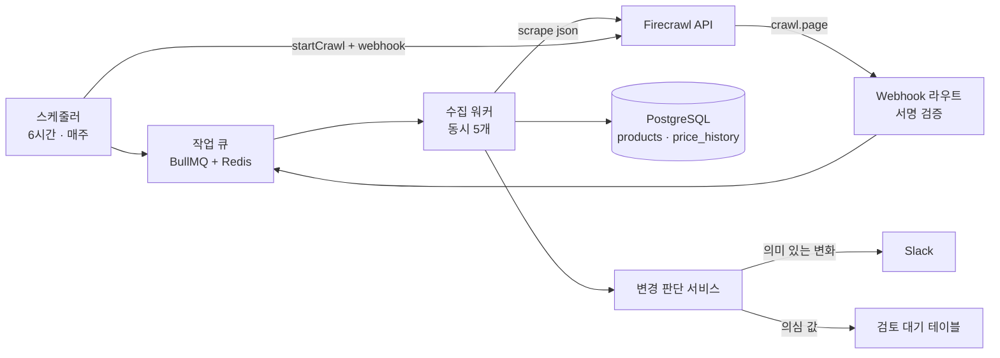

# Firecrawl 활용 예시 ③ 서버 수집 파이프라인과 운영

> 백엔드에서 Firecrawl을 어느 계층에 두고 어떻게 호출하는지, Webhook을 안전하게 받는 방법, 그리고 경쟁사 가격 모니터링 서비스에 실제로 적용하는 과정을 다룹니다.

## 서버에서의 활용

Firecrawl을 가장 많이 쓰는 곳은 서버입니다. API 키를 안전하게 보관할 수 있고, 오래 걸리는 Job과 Webhook을 다룰 수 있기 때문입니다.

### 활용 사례

- **정기 수집 배치**: 스케줄러가 정해진 URL 목록을 Scrape·Batch Scrape해서 DB에 적재합니다.
- **대량 크롤 + Webhook**: 수천 페이지 Crawl을 시작하고, 페이지 단위 `crawl.page` 이벤트를 받아 바로 처리합니다.
- **구조화 추출 API**: 사용자가 URL을 입력하면 서버가 `json` 포맷으로 상품·회사 정보를 뽑아 폼을 자동으로 채웁니다.
- **변경 감지**: 같은 페이지를 주기적으로 추출해 이전 값과 비교하고, 의미 있는 변화만 알립니다.

### 애플리케이션 구조

Firecrawl은 **외부 시스템 어댑터 계층**에 둡니다. 결제 PG나 메일 발송 API를 다루는 것과 같은 위치입니다.

```text
Controller / Route  ── 사용자 요청, Webhook 수신 (서명 검증)
 ↓
Service             ── "무엇을 언제 수집할지" 업무 규칙, 변경 판단
 ↓
Queue / Worker      ── 재시도, 동시성 제한, 스케줄
 ↓
Firecrawl Adapter   ── SDK 호출, 옵션 기본값, 오류 분류 (여기에만 SDK import)
 ↓
Repository / DB     ── 수집 결과, 이력, 해시
```

| 위치 | 하는 일 | 이유 |
|---|---|---|
| Adapter | SDK 생성, `formats`·`maxAge`·`timeout` 기본값, 오류를 재시도 가능·불가로 분류 | SDK 교체나 셀프호스팅 전환 시 이 파일만 바꾸면 됨 |
| Worker | 동시 호출 수 제한, 실패 재시도, Job 상태 저장 | 플랜별 rate limit(429)과 동시 브라우저 한도를 넘지 않기 위해 |
| Route | Webhook 서명 검증 후 큐에 넣고 즉시 200 응답 | Webhook 처리 중 오래 걸리는 작업을 하면 타임아웃과 중복 수신이 생김 |
| Service | 추출 결과 검증, 이전 값과 비교, 알림 여부 결정 | LLM 추출 결과는 틀릴 수 있으므로 업무 규칙으로 한 번 더 거름 |

### 실제 코드: Webhook 수신과 서명 검증

```ts
// src/webhooks/firecrawl.ts
import crypto from 'node:crypto';
import express from 'express';
import { pageQueue } from '../queue';

export const firecrawlWebhook = express.Router();

// 서명은 원문 바이트로 계산되므로 JSON 파싱 전에 raw body가 필요하다
firecrawlWebhook.post('/webhooks/firecrawl', express.raw({ type: 'application/json' }), async (req, res) => {
  const signature = req.get('X-Firecrawl-Signature') ?? '';
  const [algo, hash] = signature.split('=');
  const expected = crypto
    .createHmac('sha256', process.env.FIRECRAWL_WEBHOOK_SECRET!)
    .update(req.body)
    .digest('hex');

  const valid =
    algo === 'sha256' &&
    hash?.length === expected.length &&
    crypto.timingSafeEqual(Buffer.from(hash, 'hex'), Buffer.from(expected, 'hex'));
  if (!valid) return res.status(401).send('invalid signature');

  const event = JSON.parse(req.body.toString('utf8'));
  // { success, type: 'crawl.page' | 'crawl.completed' | ..., id, data, metadata }
  if (event.type === 'crawl.page') {
    for (const doc of event.data ?? []) {
      await pageQueue.add('page', { crawlId: event.id, sourceId: event.metadata?.sourceId, doc });
    }
  }
  res.status(200).send('ok'); // 무거운 처리는 워커에서
});
```

1. 서명 비밀값은 Firecrawl 계정 설정의 Advanced 탭에서 확인합니다.
2. `express.json()`이 먼저 바디를 파싱하면 원문이 사라져 서명 검증이 항상 실패하므로, 이 경로에만 `express.raw()`를 씁니다.
3. 같은 이벤트가 두 번 올 수 있다고 가정하고, 워커는 `crawlId + sourceURL` 기준으로 멱등하게 처리합니다.

---

## 실전 프로젝트 적용: 경쟁사 가격 모니터링

### 요구사항

온라인 가전 쇼핑몰이 경쟁사 3곳의 가격을 추적합니다.

- 추적 대상: 경쟁사별 주요 상품 페이지 약 300개
- 6시간마다 가격·재고·할인 여부를 추출해 이력으로 저장
- 가격이 5% 이상 바뀌거나 품절·재입고되면 Slack으로 알림
- 매주 한 번 경쟁사 카탈로그를 Crawl해 새 상품 URL을 찾아 추적 목록 후보에 추가
- 추출 결과가 이상하면(가격 0원, 이전 대비 90% 하락 등) 알림 대신 검토 대기로 보냄
- 월 비용 상한을 둔다

### 전체 구조



### 폴더 구조

```text
price-watch/
├── src/
│   ├── firecrawl/
│   │   └── adapter.ts          # SDK 호출은 이 파일에만
│   ├── jobs/
│   │   ├── schedule.ts         # 6시간 가격 수집, 주간 카탈로그 크롤 등록
│   │   ├── check-price.ts      # 상품 하나의 가격 추출 워커
│   │   └── discover.ts         # crawl.page 이벤트에서 새 상품 URL 추출
│   ├── domain/
│   │   └── price-change.ts     # 변경 판단 규칙 (Firecrawl과 무관한 순수 함수)
│   ├── webhooks/
│   │   └── firecrawl.ts        # 위의 Webhook 수신 코드
│   ├── notify/slack.ts
│   └── queue.ts
├── db/schema.sql
└── package.json
```

### 파일 단위 구현

**`src/firecrawl/adapter.ts`**: 추출 스키마와 SDK 호출을 한곳에 모읍니다.

```ts
import { Firecrawl } from 'firecrawl';
import { z } from 'zod';

const firecrawl = new Firecrawl({ apiKey: process.env.FIRECRAWL_API_KEY, timeoutMs: 90_000, maxRetries: 2 });

export const ProductSnapshot = z.object({
  name: z.string(),
  price: z.number().describe('현재 판매가, 원 단위 정수. 할인 적용가가 있으면 그 값'),
  listPrice: z.number().nullable().describe('정가. 표시되지 않으면 null'),
  inStock: z.boolean(),
});
export type ProductSnapshot = z.infer<typeof ProductSnapshot>;

export async function extractProduct(url: string): Promise<ProductSnapshot> {
  const doc = await firecrawl.scrape(url, {
    formats: [{ type: 'json', schema: ProductSnapshot }],
    maxAge: 60 * 60 * 1000, // 1시간 이내 캐시는 재사용 (6시간 주기라 충분히 신선)
    location: { country: 'KR', languages: ['ko-KR'] },
  });
  // LLM 추출 결과는 반드시 다시 검증한다
  return ProductSnapshot.parse(doc.json);
}

export async function startCatalogCrawl(competitorId: string, rootUrl: string) {
  return firecrawl.startCrawl(rootUrl, {
    limit: 2000,
    includePaths: ['^/products/.*'],
    scrapeOptions: { formats: ['links'], onlyMainContent: true },
    webhook: {
      url: `${process.env.PUBLIC_BASE_URL}/webhooks/firecrawl`,
      events: ['page', 'completed', 'failed'],
      metadata: { sourceId: competitorId },
    },
  });
}
```

**`src/domain/price-change.ts`**: 업무 규칙은 Firecrawl과 분리된 순수 함수로 둡니다.

```ts
import type { ProductSnapshot } from '../firecrawl/adapter';

export type Verdict = 'none' | 'notify' | 'review';

export function judgeChange(prev: ProductSnapshot | null, next: ProductSnapshot): Verdict {
  if (next.price <= 0) return 'review';
  if (!prev) return 'none';
  if (prev.inStock !== next.inStock) return 'notify';

  const ratio = (next.price - prev.price) / prev.price;
  if (ratio <= -0.9) return 'review';            // 90% 하락은 추출 오류일 가능성이 큼
  return Math.abs(ratio) >= 0.05 ? 'notify' : 'none';
}
```

**`src/jobs/check-price.ts`**: 워커는 추출 → 판단 → 저장 → 알림 순서로 처리합니다.

```ts
import { Worker } from 'bullmq';
import { extractProduct } from '../firecrawl/adapter';
import { judgeChange } from '../domain/price-change';
import { db } from '../db';
import { notifySlack } from '../notify/slack';

new Worker(
  'check-price',
  async (job) => {
    const { productId, url } = job.data as { productId: string; url: string };
    const next = await extractProduct(url);
    const prev = await db.latestSnapshot(productId);
    const verdict = judgeChange(prev, next);

    await db.insertSnapshot(productId, next, verdict);
    if (verdict === 'notify') await notifySlack(productId, prev, next);
  },
  {
    connection: { url: process.env.REDIS_URL },
    concurrency: 5,                          // 플랜의 동시 브라우저 한도보다 낮게
    limiter: { max: 60, duration: 60_000 },  // 분당 호출 상한
  },
);
```

**`db/schema.sql`**

```sql
CREATE TABLE products (
  id TEXT PRIMARY KEY,
  competitor_id TEXT NOT NULL,
  url TEXT UNIQUE NOT NULL,
  tracked BOOLEAN NOT NULL DEFAULT false
);

CREATE TABLE price_history (
  product_id TEXT REFERENCES products(id),
  captured_at TIMESTAMPTZ NOT NULL DEFAULT now(),
  price INTEGER NOT NULL,
  list_price INTEGER,
  in_stock BOOLEAN NOT NULL,
  verdict TEXT NOT NULL,
  PRIMARY KEY (product_id, captured_at)
);
```

### 실제 실행 흐름

"경쟁사 B의 TV 가격 인하 감지"를 예로 듭니다.

1. **스케줄 등록**: 06:00에 `schedule.ts`가 추적 중인 상품 300개를 `check-price` 큐에 넣습니다.
2. **워커 처리**: 워커가 동시 5개씩 꺼내 `extractProduct(url)`을 호출합니다. 분당 60건 제한 덕분에 429 응답 없이 약 5분 안에 끝납니다.
3. **Firecrawl 처리**: 서버는 1시간 이내 캐시가 없으므로 브라우저 엔진으로 상품 페이지를 렌더링하고, Markdown을 만든 뒤 LLM으로 스키마에 맞는 JSON을 추출합니다. 이 호출은 기본 1 credit + JSON 추출 추가 credit이 듭니다.
4. **검증**: 어댑터가 `ProductSnapshot.parse`로 타입을 다시 확인합니다. 가격이 문자열로 오는 등 스키마가 깨지면 예외가 나고, BullMQ가 백오프 후 재시도합니다.
5. **변경 판단**: 이전 가격 1,290,000원, 새 가격 1,190,000원으로 7.8% 하락이므로 `judgeChange`가 `notify`를 돌려줍니다. 같은 시각 다른 상품이 9,900원으로 잡혔다면 `review`로 분류되어 알림 대신 검토 대기에 들어갑니다.
6. **결과 저장과 알림**: `price_history`에 기록하고 Slack에 "B사 TV 7.8% 인하"를 보냅니다.
7. **주간 탐색**: 일요일에는 `startCatalogCrawl`이 B사 `/products/` 경로를 크롤합니다. `crawl.page` 이벤트가 올 때마다 Webhook 라우트가 서명을 검증해 큐에 넣고, `discover.ts`가 아직 없는 상품 URL을 `tracked=false`로 등록합니다. 담당자가 확인해 추적을 켜면 다음 6시간 주기부터 수집됩니다.

### 비용과 대안 메모

300개 × 하루 4회 × 30일이면 월 36,000회 추출입니다. JSON 추출은 기본 Scrape보다 credit이 더 들기 때문에, 같은 사이트의 같은 템플릿을 반복 추출한다면 LLM 없이 사이트별 추출기를 만들어 캐시하는 `deterministicJson` 포맷이나, 변경 감지 자체를 맡기는 Monitor 기능을 검토할 만합니다. 두 기능은 2026년에 추가된 비교적 새로운 기능이므로, 도입 전에 공식 문서에서 현재 과금과 제약을 확인합니다.

---

[← 활용 예시 ② AI 에이전트에 웹 도구 연결하기](04-usage-agent-tools.md) · [목차](README.md) · [장단점과 대안 비교 →](06-comparison.md)
