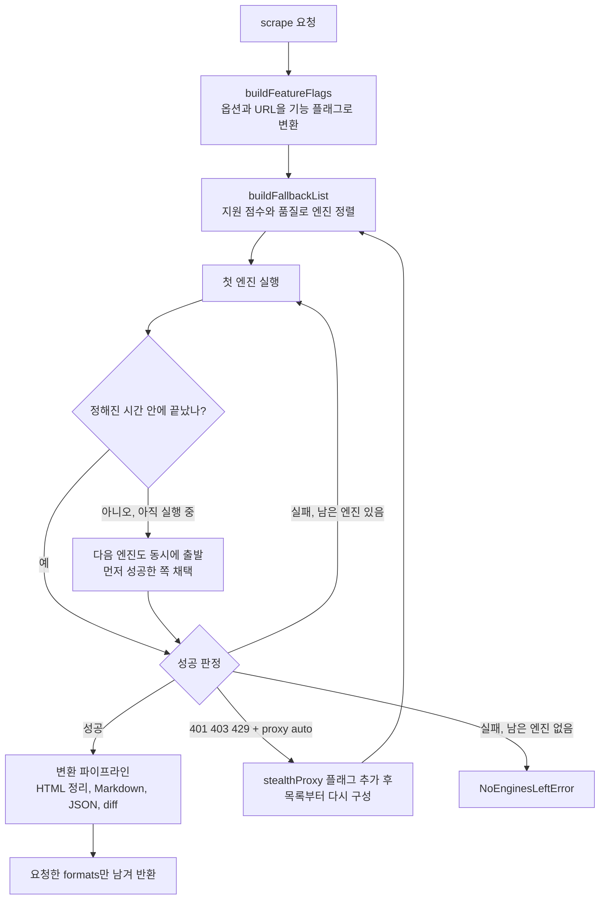

# Firecrawl 스크랩 엔진 워터폴 깊이 보기

> `scrape` 요청 하나가 서버 안에서 어떤 기준으로 엔진을 고르고, 실패하거나 느릴 때 어떻게 다음 엔진으로 넘어가며, 결과를 어떤 순서로 변환하는지 실제 소스 코드(`apps/api/src/scraper/scrapeURL/`)를 따라가며 다룹니다.

이 문서의 코드 설명은 2026년 10월 초 `main` 브랜치 기준입니다. 내부 구현이므로 숫자와 이름은 바뀔 수 있지만, 구조 자체는 Firecrawl을 이해하는 핵심입니다.

## 왜 엔진이 여러 개인가

웹 페이지를 가져오는 "정답 하나"는 없습니다.

- 정적 HTML 페이지는 단순 HTTP 요청이 가장 빠르고 쌉니다.
- 클라이언트 렌더링 페이지는 브라우저로 JavaScript를 실행해야 본문이 나옵니다.
- 봇 차단이 강한 사이트는 브라우저에 stealth 프록시까지 붙여야 열립니다.
- PDF·DOCX는 브라우저가 아니라 문서 파서가 필요합니다.
- 최근에 누군가 이미 가져간 페이지라면 캐시에서 꺼내는 것이 가장 빠릅니다.

Firecrawl은 이 수단들을 **엔진(Engine)** 으로 나누고, 요청마다 "이 요청을 처리할 수 있는 엔진"을 골라 **품질 순으로 줄 세운 뒤 차례로 시도**합니다. 이것을 소스 코드에서는 워터폴(waterfall)이라고 부릅니다.



---

## 1단계: 요청을 기능 플래그로 바꾼다

엔진을 고르기 전에 서버는 요청을 "어떤 능력이 필요한가"로 번역합니다. `scrapeURL/index.ts`의 `buildFeatureFlags()`가 이 일을 합니다.

| 요청 내용 | 추가되는 플래그 | 우선순위 |
|---|---|---|
| `actions`가 있음 | `actions` | 20 |
| `screenshot` 포맷 (`fullPage`면 `screenshot@fullScreen`) | `screenshot` | 10 |
| `waitFor`가 0이 아님 | `waitFor` | 1 |
| `proxy: 'stealth'` 또는 `'enhanced'` | `stealthProxy` | 20 |
| `location`, `mobile`, `skipTlsVerification` | 같은 이름 | 10 |
| URL 경로가 `.pdf`로 끝남 | `pdf` | 100 |
| URL 경로가 `.docx` 등 문서 확장자 | `document` | 100 |
| `branding` 포맷 | `branding` | 20 |
| `audio`·`video` 포맷 | 같은 이름 | 100 |
| `blockAds: false` | `disableAdblock` | 10 |

우선순위는 "이 능력이 얼마나 필수인가"입니다. PDF 파싱(100)은 못 하면 결과 자체가 무의미하지만, `waitFor`(1)는 지원하지 않아도 대체로 결과를 얻을 수 있습니다.

눈여겨볼 점은 **확장자로 판단한다**는 것입니다. `https://example.com/report.pdf`는 `pdf` 플래그가 붙지만, `https://example.com/download?id=42`처럼 확장자가 없는 PDF는 일단 일반 웹페이지로 시작합니다. 이 경우 엔진이 받은 응답이 PDF라는 것을 알아채면 `pdf` 플래그를 추가해 달라는 신호(`AddFeatureError`)를 보내고, 전체 과정이 다시 시작됩니다.

## 2단계: 사용 가능한 엔진 목록

`engines/index.ts`는 서버 설정에 따라 쓸 수 있는 엔진을 먼저 정합니다.

```ts
const engines: Engine[] = [
  ...(useIndex ? ["index", "index;documents"] : []),        // INDEX_DATABASE_URL이 있을 때
  ...(useFireEngine ? ["fire-engine;chrome-cdp", /* ... */] : []), // FIRE_ENGINE_BETA_URL이 있을 때
  ...(usePlaywright ? ["playwright"] : []),                  // PLAYWRIGHT_MICROSERVICE_URL이 있을 때
  "fetch",
  "pdf",
  "document",
];
```

각 엔진은 **지원하는 기능 목록**과 **품질 점수**를 갖습니다.

| 엔진 | 품질 | 성격 |
|---|---:|---|
| `index` | 1000 | 캐시 인덱스. 항상 가장 먼저 시도 |
| `fire-engine;chrome-cdp` | 50 | 클라우드 브라우저 엔진. actions·스크린샷 등 대부분 지원 |
| `fire-engine(retry);chrome-cdp` | 45 | 같은 엔진의 재시도 슬롯 |
| `playwright` | 20 | 셀프호스팅용 브라우저. `waitFor` 정도만 지원 |
| `fire-engine;tlsclient` | 10 | 브라우저 없이 TLS 지문을 흉내 내는 HTTP 클라이언트 |
| `fetch` | 5 | 단순 HTTP 요청 |
| `index;documents` | -1 | 문서 파일용 캐시 |
| `…;stealth` 계열 | -2 ~ -15 | stealth 프록시를 쓰는 변형 |
| `pdf`, `document`, `image` | -20 | 파일 파서 |

소스 주석에 따르면 **음수 품질은 특수 엔진용**입니다. 일반 웹페이지 요청에서는 자동으로 선택되지 않고, PDF나 stealth처럼 그 기능이 꼭 필요할 때만 후보에 남습니다.

클라우드처럼 Fire-engine이 있는 환경에서는 일반 요청의 목록에서 `fetch`와 `tlsclient`를 빼 버립니다. 주석의 설명은 "브라우저가 실패한 뒤 단순 HTTP로 내려가면 봇 차단 페이지나 품질이 낮은 내용을 받기 쉬워서, 차라리 실패시키는 편이 낫다"입니다. 즉 **클라우드에서 실패는 "더 나쁜 결과를 돌려주지 않겠다"는 선택**이기도 합니다.

## 3단계: 지원 점수와 품질로 줄 세우기

`buildFallbackList()`는 엔진마다 **지원 점수**를 계산합니다. 요청의 기능 플래그 중 그 엔진이 지원하는 것들의 우선순위 합입니다.

```ts
const priorityThreshold = Math.floor(prioritySum / 2);
// ...
const supportScore = [...supportedFlags].reduce((a, x) => a + featureFlagOptions[x].priority, 0);
if (supportScore >= priorityThreshold) {
  selectedEngines.push({ engine, supportScore, unsupportedFeatures });
}
```

규칙을 정리하면 다음과 같습니다.

1. **문턱 통과**: 요청한 기능 우선순위 합의 절반 이상을 지원하는 엔진만 후보가 됩니다. 일부 기능이 빠지더라도 핵심 기능을 지원하면 남습니다. 빠진 기능은 `unsupportedFeatures`로 기록되어 응답 경고로 이어집니다.
2. **양수 품질 우선**: 후보 중에 인덱스가 아닌 양수 품질 엔진이 하나라도 있으면 음수 품질 엔진은 모두 제외합니다.
3. **stealth 요청 존중**: 사용자가 `proxy: 'stealth'`를 명시하면 stealth를 지원하는 엔진만 남깁니다. 그렇지 않으면 2번 규칙 때문에 음수 품질인 stealth 엔진이 조용히 빠져 버리기 때문입니다.
4. **정렬**: 지원 점수가 높은 순, 같으면 품질이 높은 순입니다.

예를 들어 클라우드에서 `formats: ['markdown', 'screenshot']`을 요청하면 기능 플래그는 `screenshot`(10) 하나이고 문턱은 5입니다. `index`와 `fire-engine;chrome-cdp`는 스크린샷을 지원해 점수 10으로 남고, 품질 순으로 `index` → `chrome-cdp` → `chrome-cdp(retry)`가 됩니다. 같은 요청을 셀프호스팅에 보내면 `playwright`와 `fetch`는 스크린샷을 지원하지 않아 점수 0으로 문턱을 넘지 못합니다. 셀프호스팅에서 스크린샷이 안 되는 이유가 바로 이것입니다.

로그인 상태를 유지하는 `profile`을 쓰면 브라우저(`chrome-cdp`) 엔진만 남깁니다. 인증된 세션으로 요청했는데 익명 HTTP로 폴백해 다른 내용을 받는 일을 막기 위해서입니다.

## 4단계: 워터폴 실행과 "느린 엔진 따라잡기"

목록이 정해지면 `scrapeURLLoop()`가 엔진을 하나씩 실행합니다. 단순히 "실패하면 다음"이 아니라 **시간 기반 병렬 출발**을 씁니다.

```ts
const waitUntilWaterfall =
  getEngineMaxReasonableTime(meta, engine) + config.SCRAPEURL_ENGINE_WATERFALL_DELAY_MS;

result = await Promise.race([
  ...enginePromises.map((x) => x.promise),             // 이미 출발한 엔진들
  ...(remainingEngines.length > 0
    ? [timeout(waitUntilWaterfall, WaterfallNextEngineSignal)] // 이 시간이 지나면 다음 엔진 출발
    : []),
  timeout(meta.abort.scrapeTimeout() ?? 300000, ScrapeJobTimeoutError), // 전체 상한
]);
```

1. 첫 엔진을 출발시키고, 그 엔진의 "합리적인 최대 시간(MRT)"만큼 기다립니다.
2. 그 안에 성공하면 끝입니다.
3. 실패하면 경주에서 빼고 다음 엔진을 출발시킵니다.
4. **실패하지 않았지만 MRT를 넘기면**, 첫 엔진을 멈추지 않은 채 다음 엔진도 출발시킵니다. 이제 두 엔진이 경주하고 먼저 성공한 쪽을 씁니다.
5. 결과가 나오면 아직 달리는 엔진들은 취소 신호(`snipeAbort`)로 정리합니다.
6. `timeout`을 지정하지 않으면 전체 상한은 5분입니다.

이 방식 덕분에 캐시 조회가 느리거나 브라우저가 한 페이지에서 멈춰도, 전체 응답 시간이 "모든 엔진 시간의 합"으로 늘어나지 않습니다.

## 5단계: 무엇을 "성공"으로 보는가

엔진이 응답을 돌려줬다고 바로 성공은 아닙니다. `scrapeURLLoopIter()`는 결과를 검사합니다.

- **본문이 있는가**: 요청에 Markdown이 필요하면 HTML을 실제로 Markdown으로 바꿔 보고, 비어 있으면 `onlyMainContent: false`로 한 번 더 바꿔 봅니다. 본문 추출 규칙 때문에 빈 결과가 된 것인지 구분하기 위해서입니다. HTML이 300KB를 넘으면 속도를 위해 이 변환 검사를 건너뛰고 HTML 자체로 판단합니다.
- **상태 코드가 정상인가**: 2xx 또는 304입니다. 404처럼 정상이 아닌 상태 코드는 본문이 짧아도 "그 페이지의 진짜 결과"로 보고 돌려줍니다.
- **프록시 문제로 보이는가**: 401·403·429를 받았고 `proxy`가 기본값 `auto`이며 아직 stealth를 쓰지 않았다면, 엔진 실패로 끝내지 않고 `AddFeatureError(['stealthProxy'])`를 던집니다. 바깥 루프는 이 신호를 받아 기능 플래그에 `stealthProxy`를 추가하고 **3단계부터 다시** 목록을 만듭니다. 이번에는 stealth 엔진만 후보로 남습니다.

이 구조가 `proxy: 'auto'`의 실체입니다. 처음부터 비싼 stealth 프록시를 쓰지 않고, 차단 신호가 보일 때만 올라갑니다. 대신 차단되는 사이트에서는 한 번의 요청이 내부적으로 두 바퀴를 돌기 때문에 시간과 credit이 더 듭니다.

## 6단계: 변환 파이프라인

성공한 원본은 `transformers/index.ts`의 `transformerStack` 순서대로 처리됩니다.

```text
deriveHTMLFromRawHTML      원본 HTML → 정리된 HTML (onlyMainContent, include/excludeTags 적용)
deriveMarkdownFromHTML     정리된 HTML → Markdown (Markdown이 필요한 포맷이 있을 때만)
performCleanContent        onlyCleanContent: 광고·쿠키 배너 등 비의미 요소 추가 제거
performRedactPII           redactPII: 이름·이메일·전화번호 등 제거
deriveLinksFromHTML / deriveImagesFromHTML / deriveMetadataFromRawHTML
(sendDocumentToIndex)      캐시 인덱스에 저장 (인덱스가 설정된 서버만)
performLLMExtract          json 포맷: LLM으로 스키마 추출
performDeterministicJson / performSummary / performQuery / performAttributes / performAgent
removeBase64Images / deriveDiff (changeTracking) / fetchAudio / fetchVideo
coerceFieldsToFormats      요청하지 않은 필드 삭제
```

순서에서 읽을 수 있는 사실이 몇 가지 있습니다.

- **JSON 추출의 입력은 Markdown입니다.** LLM은 원본 HTML이 아니라 정리된 Markdown을 읽습니다. 그래서 `onlyMainContent`가 필요한 정보(예: 사이드바의 가격)를 잘라 내면 JSON 추출도 그 값을 찾지 못합니다. 이럴 때는 `onlyMainContent: false`나 `includeTags`를 조정합니다.
- **PII 제거는 캐시 저장보다 앞에 있습니다.** 다만 캐시가 어떤 형태로 저장·재사용되는지는 서버 정책에 따르므로, 민감한 데이터는 Zero Data Retention 같은 옵션을 별도로 검토해야 합니다.
- **마지막 단계에서 필드를 지웁니다.** 내부에서 Markdown을 만들었더라도 `formats`에 없으면 응답에서 빠집니다.

---

## 이 구조를 알면 달라지는 것

| 현상 | 원인 | 대응 |
|---|---|---|
| 셀프호스팅에서 스크린샷·actions 요청이 실패 | 해당 기능을 지원하는 엔진(Fire-engine)이 없어 후보가 비거나 actions 미지원 오류 | 클라우드를 쓰거나, 셀프호스팅에서는 기능을 빼고 요청 |
| 어떤 사이트는 유독 느리고 credit이 더 듦 | 401·403·429 → stealthProxy 추가 → 워터폴 재시작 | 차단이 확실한 사이트는 처음부터 `proxy: 'stealth'` 지정 |
| 같은 URL인데 결과가 가끔 다름 | 캐시 인덱스와 실시간 엔진 중 어느 쪽이 이겼는지에 따라 다름 | 최신성이 중요하면 `maxAge`를 줄이고 `metadata.cacheState` 확인 |
| JSON 추출이 사이드바 값을 못 찾음 | 추출 입력이 `onlyMainContent` 적용된 Markdown | `onlyMainContent: false` 또는 `includeTags` 조정 |
| 확장자 없는 PDF 링크가 느림 | 웹페이지로 시작했다가 PDF 감지 후 재시작 | 가능하면 파일 URL을 직접 쓰거나 `/parse`로 업로드 |
| 클라우드에서 "가져오긴 했는데 엉뚱한 차단 페이지" 대신 실패가 옴 | 브라우저 실패 후 fetch로 내려가지 않도록 설계됨 | 재시도 시점을 늦추거나 stealth 프록시 사용 |

Firecrawl을 블랙박스로 쓰면 "가끔 느리고 가끔 실패하는 API"로 보입니다. 엔진 워터폴을 알고 나면 그 동작이 **기능 요구 → 후보 엔진 → 시간 기반 경주 → 성공 판정 → 기능 추가 후 재시도**라는 일관된 규칙에서 나온다는 것을 알 수 있고, 요청 옵션을 어떻게 바꿔야 할지도 보입니다.

---

[← 장단점과 대안 비교](06-comparison.md) · [목차](README.md) · [주의할 점과 FAQ →](08-pitfalls-faq.md)
