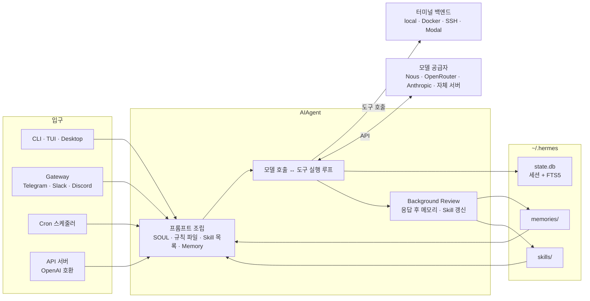
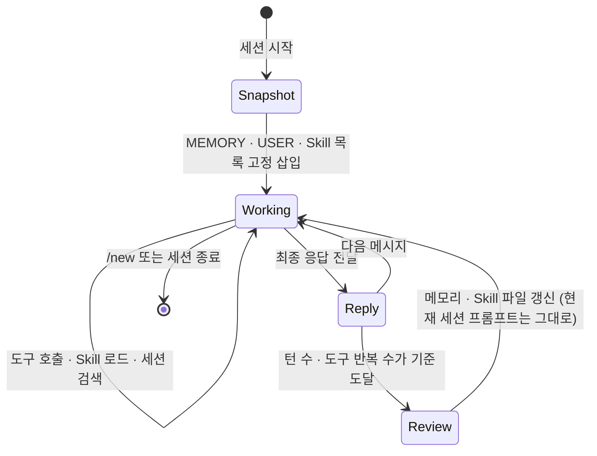

# Hermes Agent 핵심 개념과 동작 구조

> Hermes Agent를 이루는 AIAgent 루프, Tool·Toolset, Skill, Memory·Session Search, Gateway·Cron, Profile이 각각 무엇이고 어떻게 맞물려 동작하는지 다룹니다.

## 용어 한눈에 보기

| 키워드 | 설명 |
|---|---|
| AIAgent | 프롬프트 조립 → 모델 호출 → 도구 실행 → 반복을 담당하는 에이전트 코어 클래스. 모든 입구가 공유 |
| Tool / Toolset | 에이전트가 호출하는 기능(터미널, 파일, 웹, 브라우저 등)과 그 묶음. 입구별로 켜고 끔 |
| Terminal Backend | 셸 명령이 실제로 실행되는 곳. local, Docker, SSH, Modal, Daytona 등 7종 |
| Skill | 필요할 때만 로드되는 작업 절차 문서(`SKILL.md`). 에이전트가 직접 만들고 고침 |
| Memory | `MEMORY.md`(환경 사실)와 `USER.md`(사용자 프로필). 세션 시작 시 시스템 프롬프트에 고정 삽입 |
| Session Search | 모든 과거 대화를 저장한 SQLite(FTS5)에서 필요한 대화를 찾아보는 도구 |
| Gateway | Telegram·Slack·Discord 등 메신저와 API 서버를 한 프로세스로 처리하는 상주 프로세스 |
| Cron | 게이트웨이가 60초마다 확인하는 예약 작업. 셸 스크립트가 아니라 "에이전트 작업" |
| Profile | 설정·키·메모리·세션·Skill이 완전히 분리된 독립 에이전트 홈 디렉터리 |
| Background Review | 응답이 끝난 뒤 대화를 다시 읽고 메모리·Skill을 갱신하는 별도 에이전트 포크 |

---

## 1. AIAgent (에이전트 루프)

### 쉽게 설명하면

비서 한 명이 일하는 방식과 같습니다. 요청을 받으면 생각하고, 필요하면 전화를 걸거나 서류를 찾아보고(도구 사용), 그 결과를 보고 다시 생각한 뒤, 일이 끝나면 답을 줍니다. 이 반복을 하는 비서 한 명이 `AIAgent`입니다.

### 개발 관점에서는

`AIAgent`는 하나의 대화 턴을 다음 순서로 처리하는 **동기식 오케스트레이션 루프**입니다.

1. 시스템 프롬프트를 조립하거나 캐시된 것을 재사용합니다.
2. 컨텍스트가 모델 한도의 50%를 넘으면 먼저 압축합니다.
3. 공급자에 맞는 형식(Chat Completions, Codex Responses, Anthropic Messages 중 하나)으로 모델을 호출합니다.
4. 응답에 도구 호출이 있으면 실행하고 결과를 붙여 3으로 돌아갑니다. 여러 도구 호출은 스레드 풀로 병렬 실행합니다.
5. 텍스트 응답이 나오면 세션을 SQLite에 저장하고 반환합니다.

중요한 점은 **CLI, 메신저 게이트웨이, 크론, API 서버, IDE 연동(ACP)이 모두 같은 `AIAgent`를 쓴다**는 것입니다. 입구마다 다른 것은 "어떻게 입력을 받고 결과를 돌려주는가"뿐입니다. 그래서 터미널에서 만든 Skill이 Telegram 대화에서도 그대로 쓰입니다.

또한 한 턴의 반복 횟수 상한(`agent.max_turns`, 기본 500), 주 모델이 429·5xx로 실패할 때 넘어갈 `fallback_providers`, 사용자가 새 메시지를 보내면 진행 중인 모델 호출을 버리는 인터럽트 처리도 이 루프가 담당합니다.

### 예제

Python 코드에서 직접 부를 수도 있습니다. Hermes가 설치된 Python 환경(소스 체크아웃)에서 실행해야 합니다.

```python
from run_agent import AIAgent

agent = AIAgent(model="anthropic/claude-opus-4.7")

# 간단한 형태: 최종 응답 문자열만 받기
print(agent.chat("이 디렉터리의 main 진입점이 어디인지 알려 줘"))

# 전체 형태: 메시지 목록, 사용량 등 메타데이터까지 받기
result = agent.run_conversation(user_message="pytest를 실행하고 실패한 테스트만 요약해 줘")
print(result["final_response"])
```

### 핵심

> 입구가 몇 개든 에이전트는 하나입니다. Hermes를 이해하는 출발점은 "모든 기능이 같은 `AIAgent` 루프 위에 있다"는 사실입니다.

## 2. Tool과 Toolset, 터미널 백엔드

### 쉽게 설명하면

비서에게 주는 업무 권한 목록입니다. 사내 메신저 담당 비서에게는 일정 조회 권한만 주고, 개발 보조 비서에게는 서버 접속 권한까지 주는 식으로, 입구마다 쓸 수 있는 도구를 다르게 정할 수 있습니다.

### 개발 관점에서는

도구는 `tools/` 아래 파일마다 하나씩 있고, import될 때 중앙 레지스트리에 스스로 등록됩니다. 2026년 10월 기준 공식 문서는 70개 이상의 도구와 약 28개 Toolset을 안내합니다. Toolset은 도구 묶음(`terminal`, `file`, `web`, `browser`, `skills`, `memory`, `cron` 등)이고, `hermes tools`로 **입구(플랫폼)별로** 켜고 끕니다.

셸 명령이 실제로 실행되는 위치는 터미널 백엔드로 고릅니다.

| 백엔드 | 실행 위치 | 위험 명령 승인 |
|---|---|---|
| `local` | Hermes가 돌아가는 호스트 | 적용 |
| `ssh` | 별도 원격 서버 | 적용 |
| `docker` | 지속되는 샌드박스 컨테이너 | 생략(컨테이너가 경계) |
| `modal`, `daytona`, `vercel_sandbox` | 클라우드 샌드박스 | 생략 |
| `singularity` | HPC 컨테이너 | 생략 |

### 예제

```bash
hermes tools                                  # 플랫폼별 Toolset 켜기/끄기 (대화형)
hermes config set terminal.backend docker     # 셸 명령을 Docker 샌드박스에서 실행
hermes chat -t terminal,file -q "로그 디렉터리 용량을 확인해 줘"   # 이번 실행에만 Toolset 지정
```

### 핵심

> 도구가 많을수록 도구 스키마가 매 호출마다 프롬프트를 차지합니다. 입구별로 꼭 필요한 Toolset만 켜는 것이 비용과 안전 모두에 유리합니다.

## 3. Skill (절차 기억)

### 쉽게 설명하면

비서가 직접 쓰는 업무 매뉴얼입니다. "스테이징 배포는 이 순서로, 이 명령으로, 이 함정을 피해서"를 한 번 알아내면 매뉴얼로 남기고, 다음에 같은 일이 오면 그 매뉴얼을 펼쳐 봅니다.

### 개발 관점에서는

Skill은 `~/.hermes/skills/<카테고리>/<이름>/SKILL.md` 형태의 문서입니다. agentskills.io 공개 규격과 호환되고, **점진적 공개(progressive disclosure)** 방식으로 로드됩니다.

- 평소에는 이름·설명·카테고리로 된 **Skill 목록**만 시스템 프롬프트에 들어갑니다.
- 작업이 어떤 Skill과 맞으면 에이전트가 `skill_view(name)`으로 본문을 엽니다.
- 본문이 참조하는 `references/`, `templates/`, `scripts/` 파일은 필요할 때 따로 엽니다.

Hermes의 Skill이 다른 도구와 가장 다른 점은 **에이전트가 `skill_manage` 도구로 Skill을 직접 만들고(create), 고치고(patch), 지운다**는 것입니다. 사람도 `/learn` 명령으로 문서·디렉터리·방금 한 작업을 Skill로 만들게 할 수 있고, Skills Hub에서 보안 검사를 거쳐 설치할 수도 있습니다. 설치된 Skill은 모두 `/skill-name` 슬래시 명령이 됩니다.

### 예제

```markdown
---
name: staging-deploy
description: 스테이징 서버 배포와 롤백 절차
version: 1.0.0
metadata:
  hermes:
    tags: [deploy, docker]
    category: devops
---

# Staging Deploy

## When to Use
스테이징에 새 이미지를 배포하거나 직전 버전으로 되돌릴 때.

## Procedure
1. `docker compose -f deploy/staging.yml pull api`
2. `docker compose -f deploy/staging.yml up -d api`
3. `curl -fsS https://staging.example.com/health` 로 200 확인

## Pitfalls
- 마이그레이션이 포함된 릴리스는 2단계 전에 `make migrate ENV=staging` 을 먼저 실행한다 — 새 코드가 없는 컬럼을 읽으면 바로 500이 난다.

## Verification
헬스 체크 200, 그리고 최근 5분 에러 로그 0건.
```

### 핵심

> Skill은 "평소에는 목록만, 필요할 때 본문"입니다. 그리고 Hermes에서는 사람이 쓰는 문서이기 전에 **에이전트가 경험에서 스스로 쓰는 절차 기억**입니다.

## 4. Memory와 Session Search (사실 기억과 대화 기록)

### 쉽게 설명하면

Memory는 비서 책상 위에 붙여 둔 포스트잇 몇 장이고, Session Search는 지난 업무 일지 전체를 검색하는 것입니다. 포스트잇은 항상 눈에 보이지만 몇 장 못 붙이고, 업무 일지는 다 남아 있지만 찾아봐야 보입니다.

### 개발 관점에서는

| 구분 | Memory | Session Search |
|---|---|---|
| 저장 위치 | `~/.hermes/memories/MEMORY.md`, `USER.md` | `~/.hermes/state.db` (SQLite + FTS5) |
| 용량 | `MEMORY.md` 2,200자, `USER.md` 1,375자 | 모든 세션 |
| 컨텍스트 진입 | 세션 시작 시 시스템 프롬프트에 고정 삽입 | 에이전트가 `session_search`를 호출할 때만 |
| 비용 | 매 호출 약 1,300토큰 고정 | 검색할 때만, LLM 호출 없음 |
| 관리 | 에이전트가 `memory` 도구로 add/replace/remove | 자동 저장 |

Memory에는 두 가지 중요한 성질이 있습니다.

- **고정 스냅샷**: 세션 도중 메모리를 고쳐도 파일에는 바로 저장되지만, 시스템 프롬프트에는 **다음 세션부터** 반영됩니다. 프롬프트 캐시를 깨지 않기 위한 설계입니다.
- **자동 압축 없음**: 용량을 넘기면 오류가 나고, 에이전트가 같은 턴 안에서 항목을 합치거나 지운 뒤 다시 저장해야 합니다.

### 예제

```text
# 에이전트가 내부적으로 호출하는 형태 (사용자가 직접 쓰지는 않음)
memory(action="add", target="memory",
       content="api 저장소는 PostgreSQL 16, 마이그레이션은 `make migrate` 로 실행")
memory(action="replace", target="user", old_text="간결",
       content="사용자는 짧은 답과 명령어 위주 설명을 선호")
```

```bash
cat ~/.hermes/memories/MEMORY.md   # 실제로 저장됐는지 확인
hermes sessions list               # 저장된 과거 세션 보기
```

### 핵심

> 모든 세션에 필요한 짧은 사실은 Memory, 특정 작업의 긴 절차는 Skill, "지난주에 뭐라고 했더라"는 Session Search입니다.

## 5. Gateway와 Cron (상주와 예약)

### 쉽게 설명하면

Gateway는 비서의 전화·메신저 수신 창구이고, Cron은 비서의 업무 달력입니다. 창구가 열려 있어야 밖에서 연락할 수 있고, 달력에 적힌 일은 시간이 되면 비서가 알아서 합니다.

### 개발 관점에서는

`hermes gateway`는 오래 실행되는 프로세스로, 25개 이상의 플랫폼 어댑터(Telegram, Discord, Slack, WhatsApp, Signal, 이메일, Teams 등)와 OpenAI 호환 API 서버를 함께 띄웁니다. 메시지가 오면 사용자를 인가하고, 세션 키를 정하고, 그 세션 기록으로 `AIAgent`를 만들어 실행한 뒤 같은 채널로 답을 보냅니다.

Cron 스케줄러도 게이트웨이 안에서 60초마다 돕니다. 실행 시점이 된 작업마다 **기록이 없는 새 AIAgent**를 만들고, 붙어 있는 Skill을 로드한 뒤 프롬프트를 실행하고, 최종 응답을 지정한 채널로 보냅니다. 따라서 **게이트웨이가 꺼져 있으면 크론도 돌지 않습니다.**

### 예제

```bash
hermes gateway setup                 # 메신저 플랫폼 연결 (대화형)
hermes gateway install && hermes gateway start   # 백그라운드 서비스로 등록·시작
hermes cron create "every 1d at 09:00" "어제 에러 로그를 요약해 줘" --deliver telegram
hermes cron list
```

### 핵심

> Hermes를 "상주형"으로 만드는 것은 게이트웨이입니다. 메신저도 크론도 API 서버도 게이트웨이 프로세스가 살아 있어야 동작합니다.

## 6. Profile (에이전트 단위 격리)

### 쉽게 설명하면

한 사무실에 비서를 여러 명 두되, 책상·서류함·업무 노트를 완전히 따로 쓰게 하는 것입니다.

### 개발 관점에서는

Profile은 독립된 Hermes 홈 디렉터리(`~/.hermes/profiles/<이름>/`)입니다. 각자 `config.yaml`, `.env`, `SOUL.md`, 메모리, 세션 DB, Skill, 크론 작업, 게이트웨이 상태를 따로 가집니다. 만들면 이름이 곧 명령이 됩니다(`coder chat`, `coder gateway start`).

공식 문서는 **두 에이전트 프로세스가 같은 홈을 공유하지 말라**고 강하게 경고합니다. 메모리 쓰기가 자동이라 서로의 기록이 섞여, 누구도 의도하지 않은 상태가 다음 세션 프롬프트에 들어가기 때문입니다.

### 예제

```bash
hermes profile create coder      # 코딩 전용 에이전트
hermes profile create ops        # 운영 알림 전용 에이전트
coder setup
ops gateway start
```

### 핵심

> 용도가 다른 에이전트는 Profile로 나눕니다. "같은 에이전트를 두 군데서 동시에 띄우기"는 Profile이 막으려는 바로 그 상황입니다.

---

## 7. 전체 동작 구조

Hermes는 애플리케이션에 import하는 라이브러리라기보다, **여러 입구가 하나의 에이전트 코어와 로컬 상태 저장소를 공유하는 상주 애플리케이션**입니다.



한 번의 요청이 처리되는 순서는 다음과 같습니다.

1. **시작점**: 사용자가 터미널에 입력하거나, Telegram 메시지를 보내거나, 크론 시각이 되거나, HTTP 요청이 들어옵니다. 게이트웨이 입구라면 먼저 허용 목록·DM 페어링으로 사용자를 인가합니다.
2. **프롬프트 조립**: 세션이 새로 시작되면 `SOUL.md`(정체성), 프로젝트 규칙 파일(`.hermes.md` → `AGENTS.md` → `CLAUDE.md` → `.cursorrules` 중 처음 찾은 것), Skill 목록, `MEMORY.md`·`USER.md` 스냅샷을 순서대로 묶어 시스템 프롬프트를 만듭니다. 이 프롬프트는 세션 동안 바뀌지 않습니다.
3. **내부 처리**: 모델이 도구 호출을 요청하면 위험 명령 검사와 승인 절차를 거쳐 터미널 백엔드에서 실행하고, 결과를 다시 모델에게 줍니다. 작업이 Skill과 맞으면 `skill_view`로 본문을 불러오고, 과거 맥락이 필요하면 `session_search`를 씁니다.
4. **외부 시스템 연결**: 모델 호출은 설정한 공급자로, 명령 실행은 설정한 백엔드로, 필요하면 MCP 서버와 웹·브라우저 도구로 나갑니다. 주 모델이 실패하면 대체 공급자로 넘어갑니다.
5. **결과 반환과 학습**: 최종 응답은 입구에 맞게 전달되고(터미널 출력, 메신저 답장, 크론 전달, HTTP 응답), 대화는 `state.db`에 저장됩니다. 조건이 맞으면 응답이 나간 **뒤에** Background Review가 별도 스레드에서 대화를 다시 읽고 메모리와 Skill을 갱신합니다.

학습 루프 관점에서 세션을 상태 흐름으로 보면 다음과 같습니다.



세부 동작과 실제 소스 코드는 [학습 루프 깊이 보기](07-learning-loop.md)에서 다룹니다.

---

[← 개요](README.md) · [설치와 첫 사용 →](02-getting-started.md)
