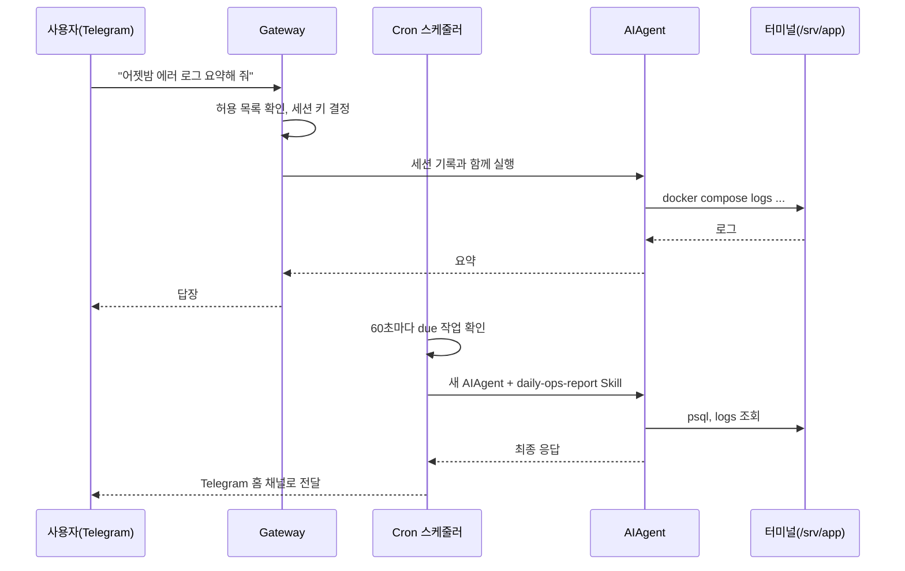

# Hermes Agent 활용 예시 ② 메신저와 예약 작업

> 사용자가 에이전트를 만나는 접점(Client) 관점에서, Telegram으로 상주 에이전트와 대화하고 크론으로 정기 리포트와 감시 작업을 맡기는 방법을 다룹니다.

Hermes에는 브라우저에 넣는 클라이언트 SDK가 없습니다. 대신 사용자가 에이전트를 만나는 화면, 즉 **터미널·데스크톱 앱·메신저**가 클라이언트 역할을 합니다. 이 문서는 그중 가장 Hermes다운 사용 방식인 메신저와 예약 작업을 다룹니다.

## 활용할 수 있는 기능

- **메신저 게이트웨이**: Telegram, Discord, Slack, WhatsApp, Signal, 이메일, Teams 등 25개 이상 플랫폼을 프로세스 하나로 처리합니다. 음성 메모를 받아 적고, 에이전트가 만든 이미지·파일 경로를 메신저 첨부로 바꿔 보냅니다.
- **사용자 인가**: 플랫폼별 허용 목록(`TELEGRAM_ALLOWED_USERS` 등)과 DM 페어링 코드로 누가 봇에게 말할 수 있는지 정합니다. 아무것도 설정하지 않으면 **모두 거부**가 기본입니다.
- **크론**: 자연어 또는 cron 식으로 일회성·반복 작업을 등록하고, 결과를 원래 대화방이나 지정 채널로 보냅니다. Skill을 붙이거나 특정 저장소 디렉터리에서 실행할 수 있습니다.
- **스크립트 전용 크론(no-agent)**: LLM 없이 스크립트만 정해진 주기로 돌리고, 출력이 있을 때만 메시지를 보냅니다. 토큰이 들지 않습니다.
- **공통 슬래시 명령**: `/new`, `/model`, `/compress`, `/stop`, `/<skill-name>`이 터미널과 메신저에서 똑같이 동작합니다.

## 실제 예제

1인 개발자가 운영하는 SaaS에 대해 "휴대폰으로 운영 상황을 묻고, 매일 아침 리포트를 받고, 서버 이상은 즉시 알림받는" 구성을 만듭니다.

### 1. Telegram 봇 연결

BotFather로 봇을 만들고 토큰과 내 사용자 ID를 `~/.hermes/.env`에 넣습니다.

```bash
# ~/.hermes/.env
TELEGRAM_BOT_TOKEN=123456789:ABCdefGHIjklMNOpqrSTUvwxYZ
TELEGRAM_ALLOWED_USERS=123456789        # 여러 명이면 쉼표로 구분
```

```bash
hermes gateway setup      # 또는 위처럼 직접 설정한 뒤
hermes gateway install    # systemd(Linux)·launchd(macOS) 사용자 서비스로 등록
hermes gateway start      # 백그라운드 서비스 시작
hermes gateway status
```

허용 목록에 없는 사람이 DM을 보내면 기본적으로 8자리 페어링 코드를 받습니다. 주인이 서버에서 승인해야만 대화할 수 있습니다.

```bash
hermes pairing list
hermes pairing approve telegram ABC12DEF
```

### 2. 운영 정보를 메모리와 Skill로 알려 주기

Telegram에서 한 번만 알려 줍니다.

```text
기억해 줘: 운영 서버는 /srv/app 에 있고 docker compose 로 돌아. DB는 PostgreSQL 16, 접속은 `docker compose exec db psql -U app`.
```

에이전트가 `memory` 도구를 실제로 호출했는지는 서버에서 확인할 수 있습니다. "기억했어요"라는 답만으로는 저장되었다고 볼 수 없습니다.

```bash
cat ~/.hermes/memories/MEMORY.md
```

### 3. 매일 아침 리포트: Skill이 붙은 크론 작업

리포트 절차는 Skill로 고정해 두고, 크론은 그 Skill을 불러 실행만 하게 합니다.

```markdown
<!-- ~/.hermes/skills/ops/daily-ops-report/SKILL.md -->
---
name: daily-ops-report
description: 지난 24시간 가입·결제 실패·에러 로그 요약 리포트
---

# Daily Ops Report

## Procedure
1. `docker compose exec -T db psql -U app -At -c "select count(*) from users where created_at > now() - interval '1 day'"` 로 신규 가입 수를 구한다.
2. 같은 방식으로 `payments` 테이블의 `status = 'failed'` 건수를 구한다.
3. `docker compose logs --since 24h api | grep -c ERROR` 로 에러 로그 수를 구한다.
4. 결제 실패가 최근 7일 평균의 2배를 넘으면 실패 사유 상위 3개를 함께 조회한다.

## Output
- 다섯 줄 이내. 숫자는 전일 대비 증감을 괄호로 붙인다.
- 이상 징후가 있을 때만 "확인 필요" 섹션을 추가한다.
```

```bash
hermes cron create "every 1d at 09:00" \
  "daily-ops-report 절차대로 오늘 운영 리포트를 만들어 줘" \
  --skill daily-ops-report \
  --workdir /srv/app \
  --deliver telegram \
  --name "아침 운영 리포트"
```

`--workdir`를 주면 그 디렉터리의 `AGENTS.md`가 로드되고 셸·파일 도구가 그 위치에서 실행됩니다. 결과는 Telegram 홈 채널로 전달되며, 전달 직전에 API 키·토큰 모양의 문자열은 자동으로 가려집니다.

### 4. 서버 감시: 스크립트 전용 크론

디스크 사용량처럼 판단이 필요 없는 감시는 LLM을 쓰지 않는 편이 싸고 확실합니다. 스크립트는 반드시 `~/.hermes/scripts/` 안에 둡니다.

```bash
# ~/.hermes/scripts/disk-watchdog.sh
#!/usr/bin/env bash
# 출력이 없으면 아무 메시지도 보내지 않는다 (조용한 tick)
usage=$(df --output=pcent / | tail -1 | tr -dc '0-9')
if [ "$usage" -ge 85 ]; then
  echo "⚠️ 루트 디스크 사용량 ${usage}% — /srv/app/logs 정리 필요"
fi
```

```bash
hermes cron create "every 5m" --no-agent --script disk-watchdog.sh \
  --deliver telegram --name "disk-watchdog"
```

판단이 필요한 감시라면 에이전트 크론에 `[SILENT]` 규칙을 씁니다.

```bash
hermes cron create "every 30m" \
  "api 컨테이너 헬스체크와 최근 30분 5xx 비율을 확인해. 정상이면 [SILENT] 한 단어만 답하고, 이상하면 원인 후보와 함께 보고해." \
  --workdir /srv/app --deliver telegram --name "api-health"
```

### 5. 상태 확인

```bash
hermes cron list          # 다음 실행 시각, 고정 모델 여부
hermes cron status        # 스케줄러가 살아 있는지 (게이트웨이 heartbeat)
```

## 동작 순서



## 실제 서비스에서는

> 출근길 지하철에서 사용자가 Telegram으로 "결제 실패가 왜 늘었어?"라고 보냅니다. 게이트웨이가 사용자 ID를 허용 목록과 대조한 뒤, 이 대화방의 세션 기록과 `MEMORY.md`에 적힌 서버 위치를 바탕으로 에이전트를 실행합니다. 에이전트는 VPS에서 `psql`로 실패 사유를 집계하고, PG사 응답 코드별로 묶어 "카드사 점검 시간대에 집중"이라고 답합니다. 같은 날 아침 9시에는 크론이 `daily-ops-report` Skill로 만든 리포트를 이미 보내 두었고, 5분마다 도는 디스크 감시 스크립트는 문제가 없어서 아무 메시지도 보내지 않았습니다.

이 구성에서 꼭 챙길 점이 있습니다.

- **메신저 대화는 하나의 긴 세션입니다.** 재부팅해도 이어집니다. 그래서 대화가 몇 주씩 이어지면 압축이 반복되어 비싸지고, 새로 저장한 메모리도 세션이 끝나야 반영됩니다. 작업 단위가 끝날 때마다 `/new`를 보내는 습관이 좋습니다.
- **크론은 사람이 승인할 수 없습니다.** 위험 명령을 만나면 기본값(`approvals.cron_mode: deny`)으로 차단되고 에이전트는 다른 방법을 찾습니다. 이 기본값을 `approve`로 바꾸는 것은 신중해야 합니다.
- **크론 안에서는 크론을 만들 수 없습니다.** 예약 작업이 예약 작업을 계속 만드는 폭주를 막기 위한 제한입니다.
- **크론은 실행 시점의 주 모델을 따릅니다.** `/model`로 대화 모델을 바꾸면 고정하지 않은 크론도 함께 바뀝니다. 리포트용 모델을 고정하려면 `hermes cron edit <id> --pin` 또는 `cron.model` 설정을 씁니다.

---

[← 활용 예시 ① 터미널 코딩 에이전트](03-usage-coding-workflow.md) · [목차](README.md) · [활용 예시 ③ API 서버와 팀 운영 →](05-usage-api-server.md)
