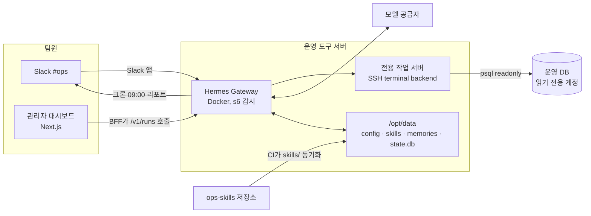

# Hermes Agent 활용 예시 ③ API 서버와 팀 운영

> Hermes를 서버에 상주시켜 OpenAI 호환 API·Runs API로 다른 서비스에 붙이는 방법과, 작은 팀의 사내 운영 도우미로 실제 도입하는 과정을 다룹니다.

## 서버·팀 환경에서의 활용

### 활용 사례

- **사내 채팅 UI의 백엔드**: Open WebUI, LobeChat 같은 OpenAI 호환 프런트엔드를 `http://<host>:8642/v1`에 연결하면, 모델만 응답하는 것이 아니라 터미널·파일·웹·Skill·메모리를 가진 에이전트가 응답합니다.
- **사내 도구에 "에이전트 실행" 버튼 붙이기**: Runs API(`POST /v1/runs`)로 작업을 시작하고, SSE 이벤트 스트림으로 도구 실행 과정을 화면에 보여 줍니다.
- **팀 Slack 운영 봇**: 같은 게이트웨이 프로세스가 Slack 메시지와 HTTP 요청을 함께 처리하므로, Slack에서 물은 내용과 대시보드에서 시킨 작업이 같은 Skill과 메모리를 씁니다.
- **용도별 에이전트 격리**: Profile마다 다른 키·메모리·Skill·API 키를 주고, 멀티 프로필 라우팅(`/p/<profile>/...`)으로 한 리스너에서 나눠 받습니다.
- **Docker 상주 배포**: 공식 이미지는 게이트웨이를 s6로 감시해 프로세스가 죽으면 몇 초 안에 다시 띄웁니다. 데이터는 마운트한 `/opt/data` 하나에만 있습니다.

### 애플리케이션 구조

Hermes는 웹 서비스 코드 안에 들어가는 라이브러리가 아니라 **옆에 두는 별도 서비스**입니다. 웹 서비스는 Hermes를 "도구를 쓸 줄 아는 외부 AI 서비스"로 호출합니다.

```text
브라우저 (사내 대시보드)
 ↓  fetch /api/agent/runs   (Hermes 키는 브라우저에 절대 노출하지 않음)
웹 서버 (Next.js Route Handler)
 ↓  POST /v1/runs, GET /v1/runs/{id}/events   (Authorization: Bearer API_SERVER_KEY)
Hermes Gateway (Docker, 127.0.0.1:8642)
 ↓
AIAgent → Skill · Memory · 도구
 ↓
터미널 백엔드 / 사내 API / DB (읽기 전용 계정)
```

### 실제 코드

**1. API 서버 켜기**

```bash
# ~/.hermes/.env
API_SERVER_ENABLED=true
API_SERVER_KEY=change-me-to-a-long-random-value   # openssl rand -hex 32
# API_SERVER_HOST=127.0.0.1  (기본값. 외부 노출이 필요할 때만 바꾼다)
```

```bash
hermes gateway
# [API Server] API server listening on http://127.0.0.1:8642
```

**2. OpenAI SDK로 호출하기 (TypeScript)**

API 서버가 OpenAI 형식을 그대로 따르므로 공식 `openai` 패키지를 그대로 씁니다.

```ts
// lib/hermes.ts
import OpenAI from 'openai';

export const hermes = new OpenAI({
  baseURL: process.env.HERMES_BASE_URL ?? 'http://127.0.0.1:8642/v1',
  apiKey: process.env.HERMES_API_KEY!, // = Hermes 쪽 API_SERVER_KEY
});

export async function askOps(question: string, sessionId: string) {
  const res = await hermes.chat.completions.create(
    {
      model: 'hermes-agent',
      messages: [
        // 프런트엔드의 system 메시지는 Hermes 기본 프롬프트 "위에" 덧붙는다
        { role: 'system', content: '답은 한국어 다섯 줄 이내로. 실행한 명령은 마지막에 목록으로.' },
        { role: 'user', content: question },
      ],
    },
    // 같은 세션 ID를 계속 보내면 서버 쪽 세션 기록을 이어서 쓴다
    { headers: { 'X-Hermes-Session-Id': sessionId } },
  );
  return res.choices[0].message.content;
}
```

`/v1/chat/completions`는 원래 상태가 없는(stateless) 형식이라 매번 `messages` 전체를 보내야 합니다. `X-Hermes-Session-Id` 헤더를 붙이면 Hermes가 서버에 저장된 세션 기록을 이어 쓰고, 백그라운드 하위 에이전트 결과도 그 세션에 쌓입니다.

**3. 오래 걸리는 작업은 Runs API + SSE로**

몇 분씩 걸리는 작업을 HTTP 요청 하나로 기다리면 타임아웃과 재연결 문제가 생깁니다. Runs API는 작업을 시작하고 `run_id`를 바로 돌려준 뒤, 진행 상황을 SSE로 흘려보냅니다.

```ts
// lib/hermes-runs.ts
const BASE = process.env.HERMES_BASE_URL ?? 'http://127.0.0.1:8642/v1';
const auth = { Authorization: `Bearer ${process.env.HERMES_API_KEY}` };

export async function startRun(input: string, sessionId: string, requestId: string) {
  const res = await fetch(`${BASE}/runs`, {
    method: 'POST',
    headers: {
      ...auth,
      'Content-Type': 'application/json',
      'Idempotency-Key': requestId, // 재시도해도 같은 run_id를 돌려받아 중복 실행을 막는다
    },
    body: JSON.stringify({ input, session_id: sessionId }),
  });
  if (res.status === 429) throw new Error('Hermes 동시 실행 한도 초과, 잠시 후 재시도');
  if (!res.ok) throw new Error(`run 시작 실패: ${res.status}`);
  const { run_id } = (await res.json()) as { run_id: string };
  return run_id;
}

type RunEvent = { event: string; seq: number; delta?: string; tool?: string; output?: string; error?: string };

export async function* streamRun(runId: string): AsyncGenerator<RunEvent> {
  const res = await fetch(`${BASE}/runs/${runId}/events`, { headers: auth });
  const reader = res.body!.pipeThrough(new TextDecoderStream()).getReader();
  let buffer = '';
  for (;;) {
    const { value, done } = await reader.read();
    if (done) return;
    buffer += value;
    const frames = buffer.split('\n\n');
    buffer = frames.pop() ?? '';
    for (const frame of frames) {
      // ': keepalive' 같은 주석 줄은 건너뛰고 data 줄만 JSON으로 읽는다
      const data = frame.split('\n').find((line) => line.startsWith('data: '));
      if (data) yield JSON.parse(data.slice(6)) as RunEvent;
    }
  }
}
```

이벤트의 `event` 값은 `message.delta`(응답 토큰), `tool.started`·`tool.completed`(도구 실행), `run.completed`·`run.failed`·`run.cancelled`(종료) 등입니다. 승인이 필요한 도구를 만나면 `approval.request` 이벤트가 오고, `POST /v1/runs/{id}/approval`로 결정할 때까지 기다립니다. 중단은 `POST /v1/runs/{id}/stop`입니다.

**4. 어느 계층에 두는가**

| 위치 | Hermes와의 관계 | 이유 |
|---|---|---|
| 브라우저 | Hermes를 직접 호출하지 않음 | API 키가 터미널 명령까지 가능한 전권 키이므로 노출하면 안 됨 |
| 웹 서버 (Route Handler, BFF) | Hermes API 클라이언트를 둠 | 인증·권한 확인, 요청 ID 발급, 사용자별 세션 ID 매핑을 여기서 처리 |
| 도메인 서비스 / DB | Hermes가 도구로 접근 | 읽기 전용 DB 계정·사내 API 토큰만 작업 서버나 `env_passthrough`로 좁혀서 제공 |
| 배치·정기 작업 | Hermes 크론 또는 `/api/jobs` | 판단이 필요한 정기 작업은 Hermes에, 단순 집계는 기존 배치에 |

---

## 실전 프로젝트 적용: 사내 운영 도우미

### 요구사항

다섯 명이 일하는 B2B SaaS 팀에 Hermes를 운영 도우미로 도입합니다.

- 팀원은 Slack `#ops` 채널에서 "어제 결제 실패 원인 봐 줘"처럼 묻는다.
- 사내 관리자 대시보드(Next.js)에는 "고객사 데이터 점검 실행" 버튼이 있고, 진행 과정이 화면에 실시간으로 보인다.
- 매일 아침 9시 운영 리포트를 `#ops`에 올린다.
- 에이전트는 운영 DB에 **읽기 전용**으로만 접근하고, 셸 명령은 Hermes와 분리된 전용 작업 서버에서만 실행한다.
- 운영 절차(점검 순서, 확인 쿼리)는 Git으로 리뷰한 Skill로만 바뀐다.

### 전체 구조



### 폴더 구조

```text
ops-assistant/
├── docker-compose.yml
├── hermes-data/                 # 컨테이너의 /opt/data 로 마운트
│   ├── .env                     # 모델 키, Slack 토큰, API_SERVER_KEY (커밋 금지)
│   ├── config.yaml              # 승인 정책, 터미널 백엔드, 쓰기 승인
│   └── skills/ops/              # ops-skills 저장소에서 동기화
├── ops-skills/                  # 별도 Git 저장소 (PR 리뷰 필수)
│   └── customer-data-check/
│       └── SKILL.md
└── admin-dashboard/             # Next.js
    └── app/api/agent/runs/route.ts
```

### 구현

**1. Docker Compose**

```yaml
# docker-compose.yml
services:
  hermes:
    image: nousresearch/hermes-agent:v2026.9.24   # latest 대신 태그 고정
    restart: unless-stopped
    command: gateway run
    ports:
      - "127.0.0.1:8642:8642"   # 사내 대시보드 서버에서만 접근
    volumes:
      - ./hermes-data:/opt/data
    environment:
      - API_SERVER_ENABLED=true
      - API_SERVER_HOST=0.0.0.0   # 컨테이너 안에서는 0.0.0.0, 호스트 포트는 127.0.0.1로 제한
```

게이트웨이(메신저·API 연결)와 명령 실행 위치를 분리하기 위해 터미널 백엔드는 `ssh`로 둡니다. 공식 보안 문서가 권하는 네트워크 격리 방식으로, 에이전트가 무엇을 실행하든 Hermes 컨테이너와 그 안의 비밀값에는 닿지 않습니다. 작업 서버에는 `psql`과 읽기 전용 DB 접속 정보(`~/.pg_service.conf`의 `ops_readonly` 항목)만 둡니다.

**2. Hermes 설정**

```yaml
# hermes-data/config.yaml
terminal:
  backend: ssh                   # 접속 정보는 .env 의 TERMINAL_SSH_* 로
approvals:
  mode: manual                   # 위험 명령은 사람이 승인
  cron_mode: deny
  unattended_mode: deny          # API 요청 중 위험 명령은 즉시 거부
skills:
  write_approval: true           # 에이전트의 Skill 생성·수정은 스테이징 후 승인
memory:
  write_approval: true           # 메모리 쓰기도 승인 후 반영
```

```bash
# hermes-data/.env  (커밋 금지, chmod 600)
OPENROUTER_API_KEY=sk-or-...
SLACK_BOT_TOKEN=xoxb-...
SLACK_APP_TOKEN=xapp-...
SLACK_ALLOWED_USERS=U01AAA,U01BBB,U01CCC,U01DDD,U01EEE
API_SERVER_KEY=...
TERMINAL_SSH_HOST=ops-worker.internal
TERMINAL_SSH_USER=hermes
TERMINAL_SSH_KEY=/opt/data/ssh/ops_worker_ed25519
SLACK_HOME_CHANNEL=C0OPS12345        # #ops 채널 ID (크론 기본 전달 위치)
```

`write_approval`을 켜 두면, 대화 뒤 자동 검토가 만든 메모리·Skill 변경은 `/memory pending`, `/skills pending`에 쌓이고 사람이 승인해야 반영됩니다. 여러 사람이 쓰는 에이전트에서는 한 사람의 잘못된 지시가 모두의 에이전트 행동으로 굳는 것을 막는 장치입니다.

**3. 리뷰된 운영 Skill**

```markdown
<!-- ops-skills/customer-data-check/SKILL.md -->
---
name: customer-data-check
description: 고객사 단위 데이터 정합성 점검 (주문·결제·정산 불일치)
---

# Customer Data Check

## Procedure
1. 입력에서 고객사 ID를 확인한다. 없으면 clarify로 묻는다.
2. `psql "service=ops_readonly" -At -f ~/ops/orders_vs_payments.sql -v tenant=<ID>` 로 불일치 주문을 구한다.
3. 불일치가 있으면 상위 20건의 주문 ID, 금액 차이, 생성 시각을 표로 만든다.

## Pitfalls
- 쓰기 쿼리를 만들지 않는다 — 이 Skill은 점검 전용이며 계정도 읽기 전용이다.
- 금액은 원 단위 정수로 비교한다 — 소수 변환 시 반올림 차이가 불일치로 잡힌다.
```

**4. 대시보드 BFF (Next.js Route Handler)**

```ts
// admin-dashboard/app/api/agent/runs/route.ts
import { NextResponse } from 'next/server';
import { getSessionUser } from '@/lib/auth';
import { startRun } from '@/lib/hermes-runs';

export async function POST(req: Request) {
  const user = await getSessionUser(req);
  if (!user?.roles.includes('ops')) {
    return NextResponse.json({ error: 'forbidden' }, { status: 403 });
  }

  const { tenantId } = (await req.json()) as { tenantId: string };
  const runId = await startRun(
    `/customer-data-check 고객사 ${tenantId} 점검`,
    `dashboard:${user.id}`,      // 사용자별 세션
    crypto.randomUUID(),         // Idempotency-Key
  );
  return NextResponse.json({ runId }, { status: 202 });
}
```

이벤트 스트림은 같은 방식의 `GET /api/agent/runs/[id]/events` 핸들러에서 앞의 `streamRun()`을 브라우저용 SSE로 그대로 중계합니다.

**5. 크론 리포트와 Skill 동기화**

```bash
docker compose exec -u hermes hermes \
  hermes cron create "every 1d at 09:00" "daily-ops-report 절차로 리포트 작성" \
  --skill daily-ops-report --deliver slack --name "아침 리포트"
```

`ops-skills` 저장소의 CI는 main 병합 시 `skills/` 디렉터리를 서버의 `hermes-data/skills/ops/`로 복사합니다. Skill 변경은 다음 세션부터 반영됩니다.

### 실제 실행 흐름

"고객사 데이터 점검" 버튼을 누른 경우입니다.

1. **사용자 행동**: 운영 담당자가 대시보드에서 고객사 `t-1042`를 고르고 "점검 실행"을 누릅니다.
2. **웹 서버 처리**: Route Handler가 로그인 사용자의 `ops` 권한을 확인하고, 요청 ID를 `Idempotency-Key`로 붙여 `POST /v1/runs`를 호출합니다. Hermes 키는 서버에만 있습니다.
3. **Hermes 처리**: API 서버가 `202`와 `run_id`를 즉시 돌려주고, 백그라운드에서 `AIAgent`를 실행합니다. `/customer-data-check`로 시작했으므로 해당 Skill 본문이 로드됩니다.
4. **도구 실행**: 에이전트가 SSH로 전용 작업 서버에 접속해 `psql`을 실행합니다. 작업 서버에는 읽기 전용 DB 접속 정보만 있고, 모델 공급자 키나 Slack 토큰 같은 Hermes 쪽 비밀값은 없습니다. SSH 백엔드에서도 위험 명령 검사와 승인 절차는 그대로 적용됩니다.
5. **실시간 표시**: 대시보드는 SSE로 `tool.started`(psql), `tool.completed`, `message.delta` 이벤트를 받아 진행 상황과 응답을 화면에 그립니다.
6. **결과 반환**: `run.completed` 이벤트의 `output`에 불일치 주문 표가 담기고, 사용량(`usage`)과 실제로 응답한 모델(`runtime`)도 함께 와서 비용을 기록할 수 있습니다.
7. **학습과 검토**: 응답 뒤 자동 검토가 "t-1042는 정산 주기가 월 2회"라는 사실을 메모리 후보로 만들지만, `write_approval: true`이므로 바로 저장되지 않고 대기열에 쌓입니다. 다음 날 담당자가 Slack에서 `/memory pending`을 보고 승인하거나 거절합니다.

---

[← 활용 예시 ② 메신저와 예약 작업](04-usage-messaging-cron.md) · [목차](README.md) · [장단점과 대안 비교 →](06-comparison.md)
