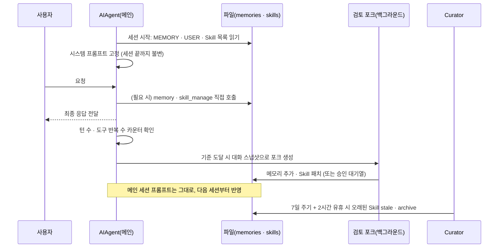

# Hermes Agent 학습 루프 깊이 보기

> Hermes가 "스스로 배운다"고 할 때 실제로 어떤 코드가 언제 실행되는지 다룹니다. 세션 시작 시 기억이 프롬프트에 들어가는 방식, 대화 후 자동 검토가 켜지는 조건, 검토 에이전트가 쓸 수 있는 도구와 지침, 그리고 쌓인 Skill을 정리하는 Curator까지 소스 코드 기준으로 따라갑니다.

## 학습 루프는 무엇으로 이루어져 있는가

### 한 줄로 정리하면

Hermes의 학습은 모델 가중치를 바꾸는 것이 아니라, **파일에 적어 두고 다음 세션의 프롬프트에 다시 넣는 것**입니다. "배운다"는 말은 결국 네 가지 저장소에 무엇을, 언제, 누가 쓰는가의 문제입니다.

| 저장소 | 담는 것 | 쓰는 주체 | 다음 세션에 들어가는 방식 |
|---|---|---|---|
| `MEMORY.md` | 환경 사실 (경로, 버전, 설정의 함정) | 대화 중 에이전트, 대화 후 검토 | 시스템 프롬프트에 전문 고정 삽입 |
| `USER.md` | 사용자 프로필 (선호, 말투, 습관) | 대화 중 에이전트, 대화 후 검토 | 시스템 프롬프트에 전문 고정 삽입 |
| `skills/` | 작업 절차와 함정 | 대화 중 에이전트, 대화 후 검토, `/learn`, Curator | 목록만 삽입, 본문은 필요할 때 로드 |
| `state.db` | 모든 대화 원문 | 자동 저장 | 에이전트가 `session_search`로 찾을 때만 |

비유하면 `MEMORY.md`·`USER.md`는 모니터에 붙인 포스트잇, Skill은 업무 매뉴얼 서가, `state.db`는 지난 업무 일지 보관함입니다. 대화 후 검토는 하루 일을 마치고 "포스트잇에 붙일 것, 매뉴얼에 고칠 것이 있나" 돌아보는 시간이고, Curator는 몇 주에 한 번 서가를 정리하는 사람입니다.

### 전체 흐름



---

## 1단계. 세션 시작: 기억이 프롬프트에 들어가는 방식

시스템 프롬프트는 세 층으로 조립되고 이 순서로 이어 붙습니다(`agent/system_prompt.py`, `agent/prompt_builder.py`).

| 층 | 들어가는 것 |
|---|---|
| stable | 정체성(`SOUL.md` 또는 기본 문구), 도구 사용 지침, 코딩 지침 |
| context | 프로젝트 규칙 파일(`.hermes.md` → `AGENTS.md` → `CLAUDE.md` → `.cursorrules` 중 하나), git 작업 공간 정보, 플랫폼 힌트 |
| volatile | Skill 목록, `MEMORY.md` 스냅샷, `USER.md` 스냅샷, 외부 메모리 공급자 블록, 시각·세션·모델 정보, 실행 환경 |

메모리는 사용량과 함께 이런 모양으로 들어갑니다.

```text
══════════════════════════════════════════════
MEMORY (your personal notes) [67% — 1,474/2,200 chars]
══════════════════════════════════════════════
User's project is a Rust web service at ~/code/myapi using Axum + SQLx
§
This machine runs Ubuntu 22.04, has Docker and Podman installed
```

핵심은 **고정 스냅샷(frozen snapshot)**입니다. 세션 도중 에이전트가 메모리를 고치면 파일에는 즉시 저장되지만, 이미 만들어진 시스템 프롬프트는 바꾸지 않습니다. 시스템 프롬프트가 바뀌면 공급자의 프롬프트 캐시가 깨져 매 호출마다 전체 입력 비용을 다시 내야 하기 때문입니다. 그래서 다음 성질이 생깁니다.

- 오늘 저장한 사실은 **다음 세션**부터 보입니다. 메신저처럼 세션이 몇 주씩 이어지는 곳에서는 `/new`를 해야 학습이 반영됩니다.
- 메모리 용량(`MEMORY.md` 2,200자, `USER.md` 1,375자)은 곧 매 호출의 고정 비용입니다. 그래서 자동 압축 없이 **넘치면 오류**를 내고, 에이전트가 같은 턴에서 항목을 합치거나 지우게 합니다.
- 메모리 항목은 저장 전에 프롬프트 인젝션·유출 패턴과 보이지 않는 유니코드 문자를 검사합니다. 다음 세션 시스템 프롬프트에 그대로 들어가는 내용이기 때문입니다.

---

## 2단계. 대화 중: 에이전트가 직접 쓰는 경우

시스템 프롬프트의 도구 지침은 에이전트에게 두 가지를 구분하라고 말합니다. **모든 세션에 해당하는 사실만 메모리에, 작업에서 배운 절차·함정·선호는 Skill에** 두라는 것입니다. 그래서 대화 중에도 에이전트는 `memory`나 `skill_manage`를 직접 호출할 수 있습니다.

이때 중요한 연결 고리가 있습니다. 에이전트가 직접 저장하면 **자동 검토 카운터가 0으로 돌아갑니다**(`agent/tool_executor.py`).

```python
if ref.name == "memory":
    agent._turns_since_memory = 0
elif ref.name == "skill_manage":
    agent._iters_since_skill = 0
```

방금 스스로 기록했으니 곧바로 같은 내용을 다시 검토할 필요가 없다는 뜻입니다.

---

## 3단계. 응답 후: 자동 검토가 켜지는 조건

자동 검토(background review)는 매 턴 도는 것이 아니라 **두 개의 카운터**가 기준에 닿을 때만 켜집니다. 둘은 세는 단위가 다릅니다.

| 카운터 | 세는 것 | 기본 기준 | 설정 키 | 켜지는 검토 |
|---|---|---|---|---|
| `_turns_since_memory` | 사용자 턴 수 | 10 | `memory.nudge_interval` | 메모리 검토 |
| `_iters_since_skill` | 도구 호출 반복(모델 호출 단위) 수 | 10 | `skills.creation_nudge_interval` | Skill 검토 |

메모리 카운터는 사용자 메시지가 들어올 때마다 1씩 오릅니다(`agent/turn_context.py`).

```python
def _tick_memory_nudge(agent) -> bool:
    if (agent._memory_nudge_interval > 0
            and "memory" in agent.valid_tool_names
            and agent._memory_store):
        agent._turns_since_memory += 1
        if agent._turns_since_memory >= agent._memory_nudge_interval:
            agent._turns_since_memory = 0
            return True
    return False
```

Skill 카운터는 한 턴 안에서 모델을 다시 부를 때마다 오르고(`agent/turn_iteration_prep.py`), 턴이 끝날 때 기준을 넘었는지 확인합니다(`agent/turn_finalizer.py`). 즉 **도구를 많이 쓴 복잡한 작업일수록 Skill 검토가 켜지기 쉽습니다.** "복잡한 작업 뒤에 Skill을 만든다"는 README 문구는 대화 중 시스템 프롬프트의 지침과 함께, 이 반복 횟수 카운터로 구현되어 있습니다.

검토 실행 조건은 턴이 끝나는 지점에 모여 있습니다.

```python
if (
    final_response
    and not interrupted
    and not getattr(agent, "skip_background_review", False)
    and (_should_review_memory or _should_review_skills)
):
    agent._spawn_background_review(
        messages_snapshot=list(messages),
        review_memory=_should_review_memory,
        review_skills=_should_review_skills,
    )
```

여기서 읽을 수 있는 규칙은 다음과 같습니다.

1. **응답을 보낸 뒤에** 실행됩니다. 사용자는 검토를 기다리지 않습니다.
2. 사용자가 중간에 끊은 턴(`interrupted`)은 검토하지 않습니다.
3. `skip_background_review`가 켜진 실행(크론 등)은 검토하지 않습니다. 코드 주석은 사람이 없는 실행에서 이벤트마다 약 3만 토큰을 쓰는 것이 이득이 없다고 설명합니다.
4. 대화를 이어 받을 때(`/resume`, 메신저 재시작)는 저장된 사용자 턴 수로 카운터를 복원하므로, 재시작해도 주기가 초기화되지 않습니다.

---

## 4단계. 검토 포크는 무엇을 할 수 있는가

`_spawn_background_review`는 메인 에이전트를 **포크**해 데몬 스레드에서 실행합니다(`agent/background_review.py`). 설계의 핵심은 두 가지입니다.

### 캐시를 그대로 재사용한다

같은 모델로 검토할 때 포크는 부모의 공급자, 모델, 자격 증명, **캐시된 시스템 프롬프트**, 추론 강도, 도구 목록을 바이트 단위로 똑같이 물려받습니다. 그래서 대화 전체를 다시 보내도 대부분 캐시 읽기로 처리되어 싸게 끝납니다. 같은 모델 검토에서 추론 강도를 따로 낮출 수 없는 이유도 이것입니다. 바꾸는 순간 캐시가 깨집니다.

다른(더 싼) 모델로 보내면(`auxiliary.background_review`) 어차피 캐시를 공유할 수 없으므로, 최근 턴 원문과 오래된 턴 요약으로 된 **다이제스트**만 보냅니다. 공식 문서는 이 방식이 3~5배 저렴하고 메모리 포착 결과는 같았다고 설명합니다.

### 광고하는 도구와 허용하는 도구를 분리한다

포크가 모델에게 보여 주는 도구 목록은 부모와 똑같지만(캐시 유지), **실제로 실행을 허용하는 도구는 화이트리스트로 제한**합니다.

```python
memory_on = review_agent._memory_enabled or review_agent._user_profile_enabled
review_toolsets = ["memory", "skills"] if memory_on and review_memory else ["skills"]
whitelist = {t["function"]["name"] for t in get_tool_definitions(enabled_toolsets=review_toolsets, quiet_mode=True)}
whitelist |= {"read_file", "search_files"}
```

- Skill 검토만 켜진 경우에는 `memory` 도구가 아예 허용되지 않습니다. 사람이 보지 않는 검토가 "용량이 꽉 찼으니 정리하라"는 오류 안내를 따라 메모리 항목을 지우는 일을 막기 위해서입니다.
- 읽기 전용 파일 도구는 허용합니다. 처음에는 막았는데, Skill을 고치기 전에 읽어야 한다는 규칙(read-before-write) 때문에 거부가 폭주해 패치가 거의 성공하지 못했다는 운영 경험이 주석에 남아 있습니다.
- `terminal`, `write_file`, `patch` 같은 쓰기 도구는 계속 막습니다. 자동 유지보수는 반드시 `skill_manage`의 검증을 거쳐야 합니다.
- 꼭 필요한 도구는 `auxiliary.background_review.extra_tools`로 이름을 지정해 추가할 수 있습니다.

### 무엇을 남기고 무엇을 버리라고 지시하는가

검토 프롬프트는 Skill의 모양을 꽤 구체적으로 정합니다.

- Skill은 **클래스 단위**로 만든다. 세션 하나마다 좁은 Skill을 만들지 말고, 이미 로드했던 Skill이나 기존 상위 Skill을 먼저 패치한다.
- 함정(pitfall)은 **일반화된 규칙 + 이유 한 구절**로 쓴다. 이번 세션에 무슨 일이 있었는지 서술하지 않는다. PR·이슈 번호, 날짜, 사용자 발언 인용은 넣지 않는다.
- 사용자의 말투·형식 지적("너무 길어", "이렇게 하지 마")도 Skill 신호로 본다.

반대로 **남기지 말라**고 명시하는 것도 있습니다.

- 바이너리 미설치, 자격 증명 미설정 같은 **환경 문제로 인한 실패** — 사용자가 고칠 수 있는 일시적 상태입니다.
- "이 도구는 안 된다" 같은 **부정적 주장** — 문제가 고쳐진 뒤에도 몇 달씩 스스로 거부하는 근거가 됩니다.
- 끝내 해결하지 못한 시도들을 "권장 절차"로 포장하는 것.

이 지침들은 "자동으로 배우는 에이전트"가 실제로 겪는 실패 모양, 즉 일회성 사건이 영구 규칙으로 굳는 문제를 그대로 보여 줍니다.

### 비용 상한과 로컬 모델 배려

- `auxiliary.background_review.max_input_tokens`로 한 번의 검토가 다시 보내는 입력 토큰 합계를 제한합니다. 지정하지 않으면 검토 모델 컨텍스트의 75%(최대 60만 토큰)가 상한입니다.
- 관리형 로컬 llama-server를 쓰는 경우 검토는 기본적으로 **유휴 시간까지 미뤄집니다**(`defer: auto`). 다음 프롬프트가 같은 GPU를 기다리지 않게 하기 위해서입니다.
- `auxiliary.background_review.enabled: false`로 자동 검토를 끌 수 있고, 이때도 수동 `/refine`은 동작합니다.

---

## 5단계. 쓰기 게이트: 사람이 끼어드는 지점

기본값은 "자유롭게 쓰기"입니다. 여러 사람이 쓰는 에이전트나 작은 모델에서는 승인 게이트를 켭니다.

```yaml
memory:
  write_approval: true    # 대화형 CLI는 즉석 확인, 그 외(메신저·자동 검토)는 대기열
skills:
  write_approval: true    # Skill 쓰기는 출처와 관계없이 항상 대기열
display:
  memory_notifications: verbose   # 메신저에 무엇이 바뀌었는지 미리보기 표시
```

```text
/memory pending      /memory approve <id|all>      /memory reject <id|all>
/skills pending      /skills diff <id>             /skills approve <id|all>
```

메모리 대기열의 `replace`·`remove`는 대상 항목 전문을 함께 기록해 두고, 승인 시점에 그 항목이 바뀌었으면 적용을 거부합니다. 오래된 제안이 그사이 사람이 고친 내용을 덮어쓰지 않게 하기 위해서입니다.

---

## 6단계. Curator: 쌓인 Skill 정리하기

자동 생성이 계속되면 비슷하고 좁은 Skill이 수십 개 쌓여 목록이 프롬프트를 차지하고, 엉뚱한 Skill이 로드됩니다. Curator는 이것을 정리하는 백그라운드 작업입니다.

**언제 도는가**: 크론이 아니라 비활성 검사로 돕니다. CLI 세션 시작, 게이트웨이 정리 작업, 데스크톱 백엔드의 정기 타이머에서 "마지막 실행 후 `interval_hours`(기본 168시간 = 7일)가 지났고, `min_idle_hours`(기본 2시간) 동안 사용이 없었는가"를 확인합니다. 새로 설치하면 첫 실행은 한 주기 뒤로 미뤄, 사람이 먼저 Skill을 살펴보고 고정(pin)할 시간을 줍니다.

**무엇을 하는가**:

1. **결정적 전이(LLM 없음, 항상)**: 사용하지 않은 지 14일이면 `stale`, 30일이면 `~/.hermes/skills/.archive/`로 보관합니다. 고정한 Skill과 **크론 작업이 참조하는 Skill**(일시 정지된 작업 포함)은 건너뜁니다. 한 번도 쓰이지 않은 Skill도 최소 14일은 유예합니다.
2. **LLM 통합(기본 꺼짐)**: `curator.consolidate: true`일 때만, 보조 모델이 에이전트가 만든 Skill들을 훑어 겹치는 것을 상위 Skill로 합치거나 고칩니다. 한 번에 50~100번의 API 호출이 들 수 있어 기본값이 꺼짐입니다.

**지키는 선**: Curator는 기본적으로 **에이전트가 만든 Skill만** 다룹니다. Hub에서 설치한 Skill과 저장소의 프로젝트 Skill은 건드리지 않고, 번들 Skill은 `prune_builtins: true`일 때만 보관 대상이 됩니다. 그리고 **절대 삭제하지 않습니다.** 최악의 결과는 복구 가능한 보관입니다.

```bash
hermes curator status            # 마지막 실행, 개수, 고정 목록
hermes curator run --dry-run     # 실제로 바꾸지 않고 보고서만
hermes curator pin deploy-k8s    # 자동 전이에서 제외
hermes curator restore old-skill # 보관된 Skill 되살리기
hermes curator rollback          # 최근 스냅샷으로 skills/ 전체 복원
```

---

## 학습 결과를 확인하고 바로잡기

자동으로 배운 것은 주기적으로 사람이 봐야 합니다.

```bash
cat ~/.hermes/memories/MEMORY.md ~/.hermes/memories/USER.md
hermes journey               # 메모리·Skill이 언제 생겼는지 타임라인
hermes journey list          # 노드 ID 목록
hermes journey edit <node>   # $EDITOR 로 Skill 또는 메모리 항목 수정
hermes journey delete <node> # Skill은 보관, 메모리 항목은 삭제
hermes prompt-size           # 메모리·Skill 목록이 고정 프롬프트를 얼마나 차지하는지
```

### 설정 요약

| 목적 | 설정 |
|---|---|
| 메모리 검토 빈도 | `memory.nudge_interval` (기본 10 사용자 턴, 0이면 끔) |
| Skill 검토 빈도 | `skills.creation_nudge_interval` (기본 10 도구 반복, 0이면 끔) |
| 자동 검토 끄기 | `auxiliary.background_review.enabled: false` |
| 검토를 싼 모델로 | `auxiliary.background_review.provider` / `model` |
| 검토 비용 상한 | `auxiliary.background_review.max_input_tokens` |
| 사람 승인 | `memory.write_approval`, `skills.write_approval` |
| Curator | `curator.enabled`, `interval_hours`, `stale_after_days`, `archive_after_days`, `consolidate` |

> **핵심:** Hermes의 학습 루프는 "응답 후, 카운터가 찼을 때, 캐시를 공유하는 포크가, 허용된 도구로만, 정해진 모양으로" 파일을 고치는 장치입니다. 무엇이 쓰이는지 이해하고 승인 게이트와 Curator를 함께 쓰면, 자동 학습의 이점은 살리고 잘못 굳은 규칙은 줄일 수 있습니다.

---

[← 장단점과 대안 비교](06-comparison.md) · [목차](README.md) · [주의할 점과 FAQ →](08-pitfalls-faq.md)
