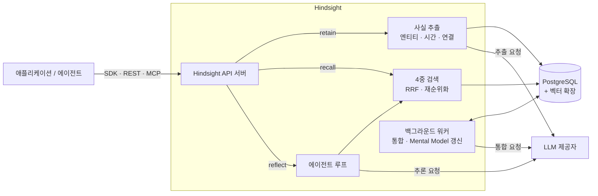
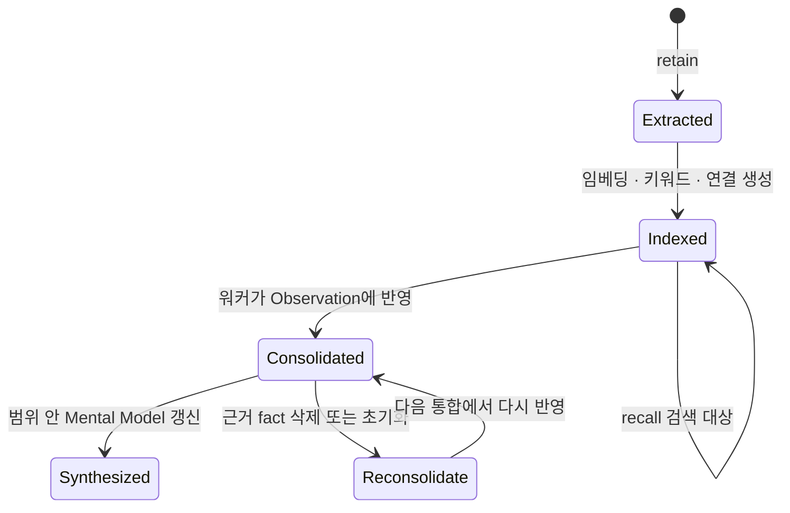

# Hindsight 핵심 개념과 동작 구조

> Hindsight를 이루는 Memory Bank, 기억의 네 가지 층(Fact·Observation·Mental Model·Knowledge Page), 세 연산(Retain·Recall·Reflect)이 각각 무엇이고 어떻게 맞물려 동작하는지 다룹니다.

## 용어 한눈에 보기

| 키워드 | 설명 |
|---|---|
| Memory Bank | 사용자·에이전트·프로젝트 하나에 대응하는 격리된 기억 저장소. bank 사이에는 기억이 섞이지 않음 |
| World fact | 바깥 세상에 대한 사실. "민지는 연간 구독 중이다" |
| Experience fact | bank 주인인 에이전트 자신이 한 일. "나는 민지에게 웹 결제를 안내했다" |
| Observation | 여러 사실을 백그라운드에서 통합한, 근거와 증거 개수(proof count)가 달린 믿음 |
| Mental Model | 개발자가 정한 질문에 대해 Hindsight가 써 두고 계속 고쳐 쓰는 "상시 답변" 문서 |
| Knowledge Page | 폴더 구조로 정리된 Mental Model. 위키처럼 탐색·검색하고 Markdown 파일로 내보낼 수 있음 |
| Retain | 기억 저장. LLM이 사실·시간·엔티티·관계를 추출 |
| Recall | 기억 검색. 네 가지 전략을 병렬 실행 후 순위 결합 |
| Reflect | 기억을 근거로 답을 만드는 에이전트 루프 |
| Tag | 한 bank 안에서 기억의 공개 범위를 나누는 라벨. `user:minji`, `team:cs` 등 |
| Disposition | reflect의 해석 성향. 회의감·문자 그대로 해석·공감을 1~5로 지정 |

---

## 1. Memory Bank (격리된 기억 저장소)

### 쉽게 설명하면

사람마다 머릿속이 따로 있는 것처럼, bank는 "뇌 하나"입니다. 상담원 A의 기억이 상담원 B에게 새지 않듯이, 사용자 민지의 bank에 들어간 내용은 다른 사용자의 bank에서 검색되지 않습니다.

### 개발 관점에서는

모든 API가 `bank_id`를 첫 인자로 받습니다. 처음 `retain`할 때 bank가 없으면 자동으로 만들어지므로, 사용자 ID를 그대로 bank ID로 쓰는 패턴이 가장 흔합니다. bank는 기억만이 아니라 설정도 가집니다.

- **retain 설정**: 무엇을 추출할지(`retain_mission`), 추출 모드(`concise`, `verbose`, `verbatim`, `chunks` 등)
- **통합 설정**: Observation을 어떤 기준으로 만들지(`observations_mission`), 자동 통합 여부
- **reflect 설정**: 정체성(`reflect_mission`), 반드시 지킬 규칙(Directive), 성향(Disposition)
- **검색 설정**: 키워드·시간·그래프 검색과 재순위화를 bank별로 끄고 켜기

설정은 "전역 환경 변수 → 테넌트 → bank" 순서로 덮어씁니다. 한 서버에서 bank마다 다른 정책을 둘 수 있다는 뜻입니다.

### 예제

```ts
import { HindsightClient } from '@vectorize-io/hindsight-client';

const client = new HindsightClient({ baseUrl: 'http://localhost:8888' });

// bank 생성 또는 갱신: 이 bank가 무엇을 기억하고 어떻게 답할지 정한다
await client.createBank('user-minji', {
  retainMission: '결제, 구독, 사용 기기, 불편 사항을 중심으로 기억한다. 인사말은 무시한다.',
  reflectMission: '나는 쇼핑몰 상담 에이전트다. 고객의 이전 문의와 현재 상태를 근거로 답한다.',
});
```

`createBank`의 `mission`, `disposition` 옵션은 Deprecated입니다. 지금은 `reflectMission`을 쓰고, 성향은 `updateBankConfig({ dispositionSkepticism, ... })`로 지정합니다.

### 핵심

> bank는 "누구의 기억인가"를 정하는 가장 강한 경계입니다. 섞이면 안 되는 단위(사용자, 고객사, 저장소)는 태그가 아니라 bank로 나눕니다.

## 2. Fact (World와 Experience)

### 쉽게 설명하면

일기장에 "오늘 민지 씨가 연간 구독으로 바꿨다"(남에 대한 사실)와 "오늘 내가 민지 씨에게 할인 쿠폰을 보냈다"(내가 한 일)를 구분해서 적는 것과 같습니다.

### 개발 관점에서는

`retain`에 넣은 텍스트는 원문 그대로 저장되지 않고, LLM이 다음을 뽑아 **fact** 단위로 저장합니다.

- 핵심 사실과 그 이유·감정 같은 맥락
- 엔티티(사람, 조직, 장소, 제품, 개념)와 엔티티 정규화("Alice", "Alice Chen"을 한 사람으로)
- 사실 사이의 연결: 같은 엔티티, 가까운 시간, 비슷한 의미, 원인과 결과
- 두 종류의 시간: **사건이 일어난 시점**과 **Hindsight가 그 사실을 알게 된 시점**

world와 experience를 가르는 기준은 문법이 아니라 **누가 말했는가**입니다. 사용자가 "저 테슬라 샀어요"라고 하면 그것은 에이전트의 경험이 아니라 사용자에 대한 world fact입니다. 그래서 `context`에 화자를 적어 주는 것이 중요합니다.

### 예제

```ts
await client.retain(
  'user-minji',
  [
    '민지 (2026-03-12T10:02:00Z): iOS 앱에서 카드 결제가 계속 실패해요.',
    '상담봇 (2026-03-12T10:03:00Z): 웹에서 결제하시면 우회하실 수 있어요.',
  ].join('\n'),
  {
    context: '고객 민지와 상담봇의 대화. "상담봇"의 1인칭 발화만 에이전트 자신의 경험이다',
    timestamp: '2026-03-12T10:03:00Z',
    documentId: 'chat-2026-03-12-minji',
  },
);
```

메시지마다 `이름 (시각): 내용` 형식으로 적는 것은 공식 예제가 권하는 방식입니다. 이렇게 하면 LLM이 사실을 올바른 사람에게 붙이고 "지난주" 같은 상대 시간을 실제 날짜로 풀 수 있습니다.

### 핵심

> Hindsight는 대화를 저장하지 않고 대화에서 나온 **사실**을 저장합니다. 추출 품질은 `context`와 시각 정보를 얼마나 잘 주느냐에 크게 좌우됩니다.

## 3. Observation (통합된 믿음)

### 쉽게 설명하면

같은 이야기를 여러 번 들으면 메모를 열 장 쓰지 않고 "민지 씨는 원래 앱을 썼는데 지금은 웹만 쓴다" 한 줄로 정리합니다. 새 이야기를 들으면 그 한 줄을 고쳐 씁니다.

### 개발 관점에서는

`retain`이 끝나면 백그라운드 워커가 **consolidation**을 실행합니다.

1. 새 fact를 기존 Observation과 비교합니다.
2. 관련 fact를 묶어 새 Observation을 만들거나 기존 것을 다듬습니다.
3. Observation마다 근거 fact(정확한 인용 포함)와 proof count를 기록합니다.
4. 새 증거가 기존 믿음과 충돌하면 덮어쓰지 않고 **변화 자체를 기록**합니다. "React를 좋아했지만 지금은 Vue로 옮겼다"처럼요.

통합이 아직 따라오지 못한 상태에서는 `reflect`가 해당 Observation을 "오래됨(stale)"으로 보고 원본 fact로 다시 확인합니다. 원본 fact를 지우면 거기서 나온 Observation도 함께 정리되고, 남은 fact는 다시 통합 대상이 됩니다.

### 예제

| 시점 | 들어온 사실 | Observation |
|---|---|---|
| 3월 | "iOS 앱 결제가 실패한다" | "민지는 iOS 앱 결제 문제를 겪었다" |
| 4월 | "연간 구독으로 바꿨다" | (별도 Observation) "민지는 연간 구독 중이다" |
| 6월 | "이제 웹으로만 들어온다" | "민지는 iOS 앱에서 결제 문제를 겪은 뒤 웹으로 옮겨 지금은 웹만 쓴다" |

### 핵심

> Observation은 "요약"이 아니라 **근거가 달린 믿음**입니다. 그래서 recall 결과에 같은 내용이 반복되는 문제와, 옛 사실과 새 사실이 충돌하는 문제를 함께 줄입니다.

## 4. Mental Model과 Knowledge Page (미리 써 둔 답)

### 쉽게 설명하면

자주 받는 질문의 답을 매번 새로 생각하지 않고, 정리된 답안지를 서랍에 넣어 두었다가 꺼내 읽는 것입니다. 새 정보가 생기면 답안지를 고쳐 둡니다.

### 개발 관점에서는

**Mental Model**은 "이 고객의 현재 상태와 주의할 점은?"처럼 개발자가 정한 질문(`source_query`)에 대해 Hindsight가 백그라운드에서 답을 써 두는 문서입니다.

- 읽기는 **DB 조회 한 번**입니다. 검색도 LLM 호출도 없습니다.
- 갱신은 통합 직후 또는 cron 일정으로 일어나며, **자기 범위(태그) 안에서 변경이 있을 때만** 실행됩니다.
- delta 모드에서는 문서를 통째로 다시 쓰지 않고 바뀐 부분만 고칩니다. LLM에게 "나머지는 그대로 둬"라고 부탁하면 표현이 조금씩 흘러가는 문제를 피하기 위해서입니다.
- 이전 버전과 근거(어떤 fact·Observation으로 썼는지)를 보존합니다.

**Knowledge Page**는 Mental Model을 위키처럼 쓰기 쉽게 감싼 형태입니다. 폴더 트리로 정리되고, Observation만을 재료로 쓰며, 다른 페이지를 읽지 않아서 서로를 인용하는 순환이 생기지 않습니다. CLI의 `hindsight fs mount`로 실제 Markdown 파일로 내려받아 `grep`이나 에디터로 볼 수도 있습니다.

### 예제

```ts
// 매일 03:00(UTC)에 확인하고, 범위 안의 기억이 바뀌었을 때만 다시 쓴다
await client.createMentalModel(
  'user-minji',
  '고객 현황',
  '이 고객의 현재 구독 상태, 사용 환경, 미해결 문의는 무엇인가?',
  { trigger: { refreshCron: '0 3 * * *' } },
);
```

### 핵심

> Observation이 자동으로 생기는 "한 줄짜리 믿음"이라면, Mental Model은 개발자가 고른 질문에 대한 "항상 최신인 문서"입니다. 응답 지연이 중요한 화면에서는 reflect 대신 Mental Model을 읽습니다.

## 5. Retain · Recall · Reflect (세 가지 연산)

### 쉽게 설명하면

- Retain: 기억하기
- Recall: 떠올리기 (관련 기억을 꺼내 보여 주기)
- Reflect: 곰곰이 생각해서 답하기

### 개발 관점에서는

| 연산 | 입력 | 출력 | LLM 호출 | 대표 지연 |
|---|---|---|---|---|
| `retain` | 텍스트(또는 이미지가 섞인 블록), 시각, context, 태그 | 저장 결과(비동기면 operation ID) | 있음 (사실 추출) | 배치당 0.5~2초 |
| `recall` | 질문, 토큰 예산, 검색 깊이, 타입·태그 필터 | 순위가 매겨진 기억 목록 | 없음 (임베딩·재순위화 모델만) | 0.1~0.6초 |
| `reflect` | 질문, context, 태그 | 답변 텍스트, 근거, 선택적으로 구조화 출력 | 있음 (에이전트 루프) | 0.8~3초 |

지연 수치는 공식 성능 문서가 제시하는 대표 범위입니다. 무거운 일(사실 추출, 엔티티 정리, 연결 생성)을 **쓰기 시점에 미리** 끝내서 읽기 경로를 빠르게 만드는 것이 기본 설계입니다.

`reflect`는 단일 검색이 아니라 도구를 가진 에이전트 루프입니다. Mental Model 검색 → Observation 검색 → 원본 fact recall 순서로 내려가며 최대 10회까지 근거를 모으고, 실제로 가져온 ID만 인용하도록 검증합니다. 같은 사실이라도 bank의 mission, directive, disposition에 따라 답의 관점이 달라집니다. 반면 `recall`은 누가 물어도 같은 기억을 돌려줍니다.

### 예제

```ts
const memories = await client.recall('user-minji', '지난봄에 문의한 결제 문제', {
  budget: 'mid',
  maxTokens: 2048,
});
for (const m of memories.results) console.log(m.type, m.text);

const answer = await client.reflect('user-minji', '이 고객에게 지금 무엇을 안내해야 할까?');
console.log(answer.text);
```

### 핵심

> 내 코드가 직접 추론하려면 `recall`, Hindsight가 근거를 모아 답까지 써 주길 원하면 `reflect`입니다. 검색 내부 동작은 [Recall 파이프라인 깊이 보기](07-recall-pipeline.md)에서 다룹니다.

## 6. Tag와 Observation Scope (bank 안의 칸막이)

### 쉽게 설명하면

같은 서랍장 안에서 칸을 나누는 것입니다. 서랍장(bank)을 따로 두기는 과하지만, 내용은 구분하고 싶을 때 씁니다.

### 개발 관점에서는

`retain` 때 `tags`를 붙이고, `recall`·`reflect`에서 `tags`와 `tagsMatch`로 거릅니다. `tagsMatch`의 기본값 `any`는 **태그가 없는 기억도 함께 돌려준다**는 점이 중요합니다. 태그 있는 기억만 원하면 `any_strict`나 `all_strict`를 씁니다.

Observation도 태그 범위(scope)별로 따로 통합됩니다. 그래서 세션 ID처럼 매번 달라지는 태그를 붙이면 세션마다 거의 같은 Observation이 하나씩 생깁니다. 이런 경우 retain에 `observationScopes: 'shared'`를 주면 Observation은 전역 하나로 모으고, 원본 fact에는 세션 태그를 남겨 검색 필터로만 씁니다.

### 핵심

> 보안 경계는 bank, 검색 범위 조절은 tag입니다. 태그로 사용자를 나눌 때는 `tagsMatch` 기본값이 태그 없는 기억까지 섞는다는 점을 반드시 기억합니다.

---

## 7. 전체 동작 구조

Hindsight는 애플리케이션 안에 import되는 라이브러리가 아니라, **애플리케이션과 LLM 사이에 놓이는 별도의 메모리 서버**입니다.



한 번의 대화가 기억으로 바뀌고 다시 쓰이는 순서는 다음과 같습니다.

1. **시작점**: 애플리케이션이 대화나 문서를 `retain`으로 보냅니다. `async: true`면 즉시 반환되고 작업은 큐에 들어갑니다.
2. **Hindsight가 개입하는 시점**: LLM이 사실·엔티티·시간을 추출하고, 엔티티를 기존 것과 맞춰 정규화하며, 임베딩과 키워드 인덱스, 엔티티·시간·의미·인과 연결을 만들어 PostgreSQL에 저장합니다.
3. **내부 처리**: 저장이 끝나면 워커가 consolidation을 돌려 Observation을 만들거나 다듬고, 범위 안에서 바뀐 것이 있는 Mental Model·Knowledge Page를 갱신합니다.
4. **외부 시스템과의 연결**: 다음 대화에서 애플리케이션이 `recall`이나 `reflect`를 호출합니다. recall은 LLM 없이 DB와 임베딩·재순위화 모델만 쓰고, reflect와 retain·통합은 설정한 LLM 제공자(OpenAI, Anthropic, Groq, Ollama 등)를 호출합니다.
5. **결과 반환**: recall은 토큰 예산에 맞춘 기억 목록을, reflect는 답변과 근거(`based_on`)를 돌려줍니다. 애플리케이션은 이것을 자기 LLM 프롬프트에 넣거나 그대로 사용자에게 보여 줍니다.

하나의 fact가 거치는 상태 변화를 보면 "기억이 정리되는 흐름"이 더 잘 보입니다.



---

[← 개요](README.md) · [설치와 첫 사용 →](02-getting-started.md)
