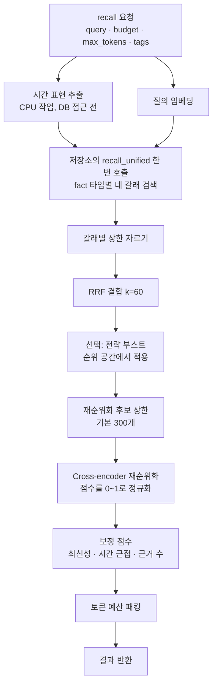

# Hindsight Recall 파이프라인 깊이 보기

> `recall()` 한 번이 질의 분석, 네 갈래 병렬 검색, RRF 결합, cross-encoder 재순위화, 보정 점수, 토큰 예산 패킹을 거쳐 결과가 되기까지를 실제 소스 코드와 함께 따라갑니다.

Recall은 Hindsight에서 가장 자주 호출되는 연산이고, `reflect`의 에이전트 루프와 Observation 통합도 내부에서 같은 검색을 씁니다. 그래서 recall이 어떻게 순위를 매기는지 알면 "왜 이 기억이 나왔고 저 기억은 안 나왔는가"를 설명할 수 있게 됩니다. 아래 코드 인용은 `hindsight-api-slim/hindsight_api/engine/search/` 아래 파일(2026년 10월, v0.10.2 기준)에서 가져왔습니다.

## 왜 검색을 네 갈래로 나누는가

질문의 종류마다 잘 맞는 검색 방식이 다릅니다.

| 질문 | 필요한 능력 | 담당 검색 |
|---|---|---|
| "민지의 직업이 뭐였지?" | 표현이 달라도 뜻이 같은 문장 찾기 | Semantic (벡터 유사도) |
| "주문번호 A-20391 건" | 정확한 문자열 일치 | Keyword (BM25) |
| "민지가 겪은 문제" | 민지라는 단어가 없어도 연결된 사실 찾기 | Graph (엔티티·의미·인과 연결) |
| "지난봄에 무슨 일이 있었지?" | 시간 표현을 날짜 범위로 바꿔 거르기 | Temporal (시간 범위) |

어느 하나도 모든 질문을 잘 처리하지 못하므로, Hindsight는 네 가지를 **모두 실행하고 결과를 합칩니다.** 공식 문서에서는 이 구성을 TEMPR라는 이름으로 설명합니다.

---

## 전체 흐름



---

## 1단계. 시간 표현 추출: 검색 전에 끝낸다

```python
# search/retrieval.py (요약)
temporal_constraint = None
if enable_temporal_retrieval:
    if temporal_window is not None:
        # 호출자가 범위를 이미 알고 있으면 분석하지 않는다
        temporal_constraint = (temporal_window.start, temporal_window.end)
    else:
        # 순수 CPU 작업이므로 이벤트 루프 밖에서 실행한다
        temporal_constraint = await extract_temporal_constraint_async(
            query_text, reference_date=question_date, analyzer=query_analyzer
        )
```

"지난봄", "2023년에", "작년" 같은 표현을 `(시작, 끝)` 날짜 범위로 바꿉니다. 기준 시각은 `query_timestamp`(없으면 서버 현재 시각)입니다. 이 단계에서 범위가 나오지 않으면 시간 검색 갈래는 아예 실행되지 않습니다.

여기서 알아 둘 점이 두 가지 있습니다.

- 소스 주석에 따르면 이 분석은 단일 워커에서 직렬로 도는 CPU 작업이라, 문서 길이의 질의 텍스트에서는 최대 1.3초 정도 걸릴 수 있습니다. 질의가 길거나 기간을 이미 알고 있다면 `temporalWindow`를 직접 넘기는 편이 빠릅니다.
- `temporalWindow`는 범위 밖 기억을 **버리는 필터가 아닙니다.** 범위 안 기억의 순위를 올리는 신호입니다. 특정 기간만 보고 싶다면 태그나 다른 필터를 함께 씁니다.

## 2단계. 네 갈래를 한 번의 저장소 호출로 실행한다

```python
# search/retrieval.py (요약)
unified = await get_memories().recall_unified(
    conn=pool, bank_id=bank_id, fact_types=fact_types,
    query_embedding=query_embedding_str, query_text=query_text,
    limit=thinking_budget,                 # budget(low/mid/high)이 정한 검색 깊이
    temporal_window=temporal_constraint,
    tags=tags, tags_match=tags_match,
    enable_text_search=enable_text_search,
    enable_graph=enable_graph_retrieval,
)
```

world·experience·observation 같은 fact 타입마다 네 갈래 결과를 한꺼번에 받아 옵니다. 갈래를 각각 따로 호출하지 않고 저장소 인터페이스 하나(`recall_unified`)로 모은 덕분에, PostgreSQL에서는 SQL 조합으로, 자체 인덱스를 가진 저장소에서는 단일 질의로 구현할 수 있습니다.

각 갈래가 하는 일은 다음과 같습니다.

- **Semantic**: pgvector 등의 근사 최근접 검색. 후보 수만큼 `hnsw.ef_search`를 맞춥니다(최대 1000).
- **Keyword**: 다섯 가지 백엔드 중 하나. 기본 `native`는 PostgreSQL `tsvector` + `ts_rank_cd`로, 엄밀한 BM25가 아니라 TF-IDF 계열입니다. 진짜 BM25가 필요하면 `vchord`, `pg_search`(ParadeDB, Citus 호환), `pgroonga`, `pg_textsearch`를 고릅니다.
- **Graph**: 질의와 엔티티를 공유하거나 의미·인과 연결로 이어진 기억을 찾습니다.
- **Temporal**: 범위 안 기억을 **최신순이 아니라 질의 관련도 순**으로 고르고, 범위를 시간 구간으로 나눠 각 구간의 최선 후보부터 뽑습니다. "2023년에 무슨 일이"에 12월 기억만 몰려 나오지 않게 하기 위해서입니다.

`budget`은 이 단계의 깊이를 정합니다.

| budget | 검색 깊이(고정 모드) | 영향 |
|---|---|---|
| `low` | 100 | 각 갈래 SQL의 `LIMIT`, 그래프 탐색 노드 수 |
| `mid` (기본) | 300 | 위와 같음 |
| `high` | 1000 | 위와 같음. 여러 단계 건너 연결된 사실까지 탐색 |

`HINDSIGHT_API_RECALL_BUDGET_FUNCTION=adaptive`로 바꾸면 `max_tokens`에 비례해(low 2.5%, mid 7.5%, high 25%) 20~2000 사이에서 정해집니다.

## 3단계. RRF로 합친다: 점수가 아니라 순위로

```python
# search/fusion.py (요약)
def reciprocal_rank_fusion(result_lists, k: int = 60):
    source_names = ["semantic", "bm25", "graph", "temporal"]
    for source_idx, results in enumerate(result_lists):
        for rank, retrieval in enumerate(results, start=1):
            doc_id = retrieval.id
            rrf_scores[doc_id] = rrf_scores.get(doc_id, 0.0) + 1.0 / (k + rank)
            source_ranks[doc_id][f"{source_names[source_idx]}_rank"] = rank
    # rrf_score 내림차순으로 정렬해 MergedCandidate 목록을 만든다
```

갈래마다 점수 체계가 다릅니다. 코사인 유사도 0.85와 BM25 12.5는 같은 척도가 아니어서 더하거나 비교할 수 없습니다. RRF는 점수를 버리고 **각 갈래 안의 순위만** 씁니다.

```text
score(d) = Σ 1 / (60 + rank_i(d))     (d가 등장한 갈래 i에 대해서만 합산)

의미 검색 1위 + 키워드 5위인 기억 : 1/61 + 1/65 = 0.0318
의미 검색 1위에만 있는 기억       : 1/61         = 0.0164
```

여러 갈래가 동시에 찾은 기억이 위로 올라갑니다. "합의(consensus)"가 곧 관련성의 증거가 되는 구조입니다. 네 갈래의 가중치는 같고, 결합 전에 `cap_per_source`로 갈래별 결과 수를 잘라 한 갈래가 후보 풀을 독차지하지 못하게 합니다.

### 선택 단계: 전략 부스트는 왜 "순위 공간"에서 적용할까

`HINDSIGHT_API_RECALL_STRATEGY_BOOSTS=graph:high`처럼 특정 갈래를 우대할 수 있습니다. `search/recall_boost.py`의 주석은 이 기능이 왜 지금 모양이 되었는지 설명합니다.

- 처음에는 해당 갈래의 RRF 기여분 `1/(k+rank)`에 가중치 `w`를 곱했습니다(일반적인 weighted RRF).
- 그런데 k=60인 RRF는 300개 후보 구간 전체에서 점수 폭이 `1/61 → 1/360`, 약 5.9배밖에 되지 않습니다. `high`의 가중치 7은 이 폭을 넘어서, 정렬이 사실상 "부스트된 갈래가 무조건 먼저"로 바뀌었고, 큰 bank에서는 300개 자리를 그 갈래가 모두 차지했습니다.
- 그래서 지금은 점수를 곱하는 대신 **순위를 나눠서**(`rank / rank_divisor`) 그 갈래 후보가 더 높은 순위에 있었던 것처럼 계산합니다. 다른 갈래의 상위 결과를 밀어내지 않으면서 우대한 갈래를 더 깊이 살릴 수 있습니다.

이 부스트는 RRF 점수 자체를 바꾸지 않고, 재순위화 후보를 자르기 직전과 cross-encoder 재순위화 직후에만 적용됩니다.

## 4단계. Cross-encoder 재순위화

RRF는 질의와 기억을 실제로 함께 읽지 않습니다. 키워드 갈래에서 흔한 단어 덕분에 1위가 된, 의도와 무관한 기억도 위에 남을 수 있습니다. 그래서 상위 후보만 골라 cross-encoder가 **(질의, 기억) 쌍을 함께 읽고** 관련도를 다시 매깁니다.

- **후보 상한**: RRF 상위 300개(`HINDSIGHT_API_RERANKER_MAX_CANDIDATES`)만 재순위화합니다. 이 값은 `budget`과 **독립적**이라, `high`로 1000개를 찾아도 재순위화는 300개까지만 됩니다.
- **점수 정규화**: 이미 0~1 범위인 점수(Cohere, Jina 같은 외부 재순위화 API)는 그대로 쓰고, 범위 밖의 원시 logit은 시그모이드 `1 / (1 + e^-x)`로 0~1로 바꿉니다.
- **배치**: 로컬 모델은 32쌍, TEI는 128쌍씩 처리합니다.
- **재순위화 모델이 없을 때**: slim 이미지에 외부 재순위화를 연결하지 않았다면, RRF 순위를 0.1~1.0 사이의 합성 점수로 바꿔 다음 단계가 계속 동작하게 합니다.

기본 모델은 `cross-encoder/ms-marco-MiniLM-L-6-v2`이고, 공식 문서는 CPU에서는 이 단계가 recall 지연의 주된 병목이라고 설명합니다. 운영에서 recall이 느리면 GPU나 외부 재순위화 서비스로 옮기거나 `budget`을 낮추는 것이 첫 번째 조치입니다.

## 5단계. 보정 점수: 관련도를 넘지 않게 곱한다

```python
# search/reranking.py (요약)
_RECENCY_ALPHA = 0.2
_TEMPORAL_ALPHA = 0.2
_PROOF_COUNT_ALPHA = 0.1   # 근거 수는 보수적으로 최대 ±5%

recency_boost     = 1 + recency_alpha     * (recency     - 0.5)
temporal_boost    = 1 + temporal_alpha    * (temporal    - 0.5)
proof_count_boost = 1 + proof_count_alpha * (proof_norm  - 0.5)
combined_score    = CE_normalized * recency_boost * temporal_boost * proof_count_boost
```

| 신호 | 계산 | 최대 영향 |
|---|---|---|
| 최신성 | 기준 시각부터 365일에 걸쳐 1.0 → 0.1로 선형 감소. 날짜 없으면 0.5 | ±10% |
| 시간 근접성 | 질의에 시간 표현이 있을 때만. 범위 중심 1.0, 경계 0.0, 그 외 0.5 | ±10% |
| 근거 수 | Observation에만 적용. `0.5 + ln(proof_count)/10`을 0~1로 자름 | ±5% |

세 신호가 모두 최대여도 약 +27%, 모두 최소여도 약 -23%입니다. **더하지 않고 곱하는 이유**가 핵심입니다. `CE + 0.1 × 최신성`처럼 더하면 관련 없는 최신 기억이 관련 높은 옛 기억을 앞지를 수 있습니다. 곱하면 보정 폭이 원래 관련도에 비례하므로, 부가 신호가 관련도 판단을 뒤집지 못합니다. 최신성 곡선은 `exponential`(기본 반감 기준 90일)이나 `none`으로 바꿀 수 있습니다.

## 6단계. 토큰 예산 패킹

```text
final_score 내림차순으로 정렬
 → 위에서부터 기억 텍스트의 토큰 수를 더해 max_tokens(기본 4096)까지 채움
 → 남은 예산보다 긴 기억은 건너뛰고 다음 기억으로 계속
 → 하나도 들어가지 않으면 1위 기억 하나는 통째로 반환
```

에이전트는 컨텍스트를 "몇 개"가 아니라 "몇 토큰"으로 계산하므로 결과도 토큰 예산으로 받습니다. 메타데이터는 예산에 포함되지 않고 기억 텍스트만 셉니다. 긴 기억 하나 때문에 뒤의 짧은 기억들을 잃지 않도록 건너뛰기 방식으로 채우는 점도 눈여겨볼 만합니다.

---

## 그래프 갈래의 점수는 왜 더할까

보정 점수는 곱하는데, 그래프 갈래 내부 점수는 세 신호를 **더합니다.**

```text
graph_score = tanh(공유 엔티티 수 × 0.5) + 의미 연결 가중치(0.7~1.0) + 인과 연결 가중치(0~1.0)
```

- 그래프 신호들은 "기본 점수를 조정하는 값"이 아니라 **서로 독립된 증거 경로**입니다. 인과 연결로만 이어진 기억은 공유 엔티티가 0인데, 곱하면 점수가 0이 되어 사라집니다.
- 공유 엔티티 수에 `tanh`를 씌우는 이유는 "사용자" 같은 흔한 엔티티가 50개씩 겹쳐 다른 신호를 덮는 것을 막기 위해서입니다. 1개면 0.46, 2개면 0.76, 3개면 0.91로 빠르게 포화됩니다.

같은 파이프라인 안에서도 "독립 증거는 더하고, 보조 신호는 곱한다"는 원칙이 일관되게 적용되어 있습니다.

## 같은 검색을 다른 목적에 쓸 때: 통합용 interleave 결합

`search/fusion.py`에는 RRF 말고 `interleave_fusion`도 있습니다. Observation 통합에서 "새 사실과 거의 같은 기존 Observation"을 찾을 때 쓰입니다.

RRF는 여러 갈래의 순위를 합산하므로, 의미 검색에서 1위지만 다른 갈래에는 없는 기억이 평균에 묻혀 밀려납니다. 통합에서는 바로 그 기억이 합쳐야 할 쌍둥이인 경우가 많아서, 놓치면 중복 Observation이 생깁니다. interleave는 각 갈래의 1위, 각 갈래의 2위 순서로 번갈아 뽑아 **모든 갈래의 상위 결과에 자리를 보장**합니다. 사용자 질의에는 합의를 중시하는 RRF가, 중복 탐지에는 어느 한 갈래의 강한 신호도 놓치지 않는 interleave가 맞다는 판단입니다.

---

## 실전에서 recall을 다루는 방법

**결과를 이해하려면 trace부터 켭니다.**

```ts
const res = await client.recall('support::c-1024', '지난봄 결제 문제', { budget: 'mid', trace: true });
// trace에는 단계별 시간, 갈래별 순위, 재순위화 후보에서 잘린 개수 등이 들어 있다
```

**질문 성격에 맞게 두 축을 따로 조절합니다.** `budget`은 얼마나 깊이 찾을지, `maxTokens`는 얼마나 많이 돌려받을지입니다. 챗봇 응답은 `low` + 2048 안팎, 여러 단계 연결을 따라가야 하는 분석 질의는 `high` + 8192처럼 조합합니다.

**필요 없는 갈래는 bank 단위로 끕니다.** 시간 표현이 없는 도메인이면 `enableTemporalRetrieval: false`로 시간 분석 비용을 없애고, 순수 벡터 검색만 원하면 `enableTextSearch: false`로 키워드 갈래를 SQL에서 아예 뺍니다. 재순위화 없이 RRF 순서를 그대로 쓰려면 `enableReranking: false`입니다.

**품질이 낮은 결과는 하한으로 자릅니다.** `minScores: { semantic: 0.2, final: 0.5 }`처럼 단계별 최소 점수를 둘 수 있습니다. semantic·keyword는 검색 단계에서, reranker·final은 재순위화 뒤에 적용됩니다.

**Observation과 원본 fact가 겹치면 하나만 받습니다.** `types`에 observation과 world·experience를 함께 넣고 `preferObservations: true`를 주면, 반환된 Observation의 근거가 된 원본 fact는 빠집니다. 같은 내용이 두 번 프롬프트에 들어가는 것을 막습니다.

---

[← 장단점과 대안 비교](06-comparison.md) · [목차](README.md) · [주의할 점과 FAQ →](08-pitfalls-faq.md)
