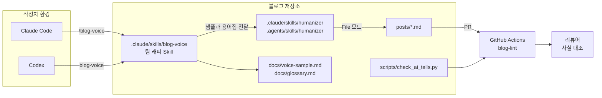

# Humanizer 활용 예시 ③ 팀 글쓰기 흐름에 넣기

> 팀 저장소에 Humanizer를 같은 버전으로 고정해 공유하는 방법, PR 설명·커밋 메시지에 Embedded 모드로 연결하는 방법, 그리고 기술 블로그 팀에 실제로 도입하는 과정을 다룹니다.

## 팀·운영 환경에서의 활용

Humanizer는 서버 런타임에서 import하는 라이브러리가 아닙니다. 그래서 "서버에서의 활용" 대신, **여러 사람이 같은 기준으로 글을 다듬도록 저장소와 리뷰 흐름에 넣는 방법**을 봅니다.

### 활용 사례

- **버전 고정 공유**: Skill을 프로젝트 범위로 복사 설치하고 저장소에 커밋해서, 팀원 모두의 에이전트가 같은 버전의 `SKILL.md`를 읽게 합니다.
- **Embedded 모드 연결**: 저장소의 에이전트 지시 파일(`CLAUDE.md`, `AGENTS.md`)에 "PR 설명과 커밋 메시지는 Humanizer를 거친다"를 적어, 다른 작업 중에 최종본만 받아 쓰게 합니다.
- **팀 문체 샘플**: 팀이 좋다고 합의한 글 두세 문단을 파일로 두고, Voice 샘플로 항상 같이 넘깁니다.
- **팀 규칙 래퍼 Skill**: Humanizer 원본은 그대로 두고, 팀 고유 규칙(용어집, 존댓말, 예외)을 담은 작은 Skill이 Humanizer를 부르게 합니다.
- **기계적 검사는 CI로**: Humanizer는 모델이 따르는 지침이라 결과가 매번 같지 않습니다. "본문에 대시 금지"처럼 기계로 확인할 수 있는 몇 가지는 별도 스크립트로 CI에서 검사합니다.

### 애플리케이션 구조

Humanizer가 "코드의 어느 계층에 들어가느냐"가 아니라, **글이 만들어져 배포되는 흐름의 어느 단계에 개입하느냐**로 보는 것이 맞습니다.

```text
작성자 / 에이전트 (초안 작성)
 ↓
팀 래퍼 Skill (팀 문체 샘플 + 용어집 + 예외 규칙)
 ↓
Humanizer Skill (흔적 표시 → 초안 → 점검 → 최종본)
 ↓
저장소 (posts/*.md, PR 설명, 커밋 메시지)
 ↓
CI (기계적으로 확인 가능한 흔적만 검사)
 ↓
사람 리뷰 (사실 대조, 최종 승인)
```

### 실제 코드

**팀 저장소에 같은 버전 고정하기**

```bash
# --global 없이 설치하면 프로젝트 범위, --copy는 symlink 대신 파일 복사
npx skills add blader/humanizer --agent claude-code codex --copy -y

git add .claude/skills/humanizer .agents/skills/humanizer skills-lock.json
git commit -m "chore: humanizer skill 프로젝트 범위로 추가"
```

이렇게 설치하면 Claude Code용 `.claude/skills/humanizer/`와 Codex용 `.agents/skills/humanizer/`에 파일이 복사되고, 원본 저장소와 내용 해시를 기록한 `skills-lock.json`이 생깁니다. 기본값인 symlink 방식은 각자의 로컬 경로를 가리키므로, 저장소에 커밋해서 공유할 때는 `--copy`를 씁니다. 업데이트는 `npx skills update --project`로 하고, 바뀐 `SKILL.md`를 PR로 리뷰한 뒤 머지합니다.

**에이전트 지시 파일에 Embedded 모드 연결하기**

```md
<!-- CLAUDE.md (Codex를 함께 쓰면 AGENTS.md에도 같은 내용) -->
## 글쓰기

- PR 설명, 커밋 메시지 본문, 릴리스 노트를 쓸 때는 humanizer skill을 거쳐 최종본만 사용한다.
- 커밋 메시지 제목 줄(`feat: ...`)과 코드, 명령, 경로는 바꾸지 않는다.
- 사실(수치, 이슈 번호, 날짜)이 필요한데 diff나 대화에 없으면 지어내지 말고 질문한다.
```

`SKILL.md`의 Embedded 모드는 "다른 작업이 PR, 커밋 메시지, 문서를 위해 이 Skill을 쓸 때 최종본만 돌려준다"는 규칙입니다. 지시 파일에 연결해 두면 개발자가 매번 `/humanizer`를 입력하지 않아도 됩니다. 다만 `SKILL.md` 전체가 그때마다 읽히므로, 한 줄짜리 커밋 메시지까지 거치게 하면 비용과 시간이 늘어납니다. 위 예시처럼 "본문"으로 범위를 좁히는 것이 좋습니다.

**계층별로 어디에 두는가**

| 단계 | 두는 것 | 이유 |
|---|---|---|
| 초안 작성 | 아무것도 두지 않음 | 처음부터 규칙을 걸면 내용보다 문장에 신경을 쓰게 됨. 내용이 정해진 뒤 다듬는 편이 나음 |
| 다듬기 | Humanizer + 팀 래퍼 Skill | 판단이 필요한 편집(구조 변경, 사실 보존, 목소리)은 모델이 해야 함 |
| 저장소 | 고정된 `SKILL.md`, `skills-lock.json`, 문체 샘플 | 팀원과 에이전트가 같은 기준을 보게 함 |
| CI | 대시·챗봇 잔여물 같은 기계적 검사 | 결과가 매번 같아야 하는 검사는 모델이 아니라 스크립트로 |
| 리뷰 | 사람 | 사실이 맞는지는 최종적으로 사람이 확인 |

---

## 실전 프로젝트 적용: 사내 기술 블로그

### 요구사항

네 명의 개발자가 돌아가며 글을 쓰는 사내 기술 블로그에 Humanizer를 도입합니다.

- 저장소: 정적 사이트 생성기 기반, 글은 `posts/*.md`
- 팀원 세 명은 Claude Code, 한 명은 Codex 사용
- 글은 AI로 초안을 써도 되지만, 블로그 문체(존댓말, 짧은 문장, 과장 없음)로 통일한다
- 팀 용어집(`docs/glossary.md`)에 있는 용어는 바꾸지 않는다
- 본문에 대시와 챗봇 인사말이 남은 채로 머지되면 안 된다
- 수치와 날짜는 작성자가 준 것만 쓰고, 최종 사실 확인은 리뷰어가 한다

### 전체 구조



### 폴더 구조

```text
tech-blog/
├── .claude/
│   └── skills/
│       ├── humanizer/            # npx skills add --copy 로 고정한 원본 (직접 수정하지 않음)
│       └── blog-voice/
│           └── SKILL.md          # 팀 래퍼 Skill
├── .agents/
│   └── skills/
│       ├── humanizer/            # Codex용 사본 (같은 버전)
│       └── blog-voice/
│           └── SKILL.md          # .claude 쪽과 같은 내용
├── docs/
│   ├── voice-sample.md           # 팀이 합의한 문체 샘플 2~3문단
│   └── glossary.md               # 바꾸면 안 되는 용어
├── posts/
│   └── 2026-10-payment-retry.md
├── scripts/
│   └── check_ai_tells.py         # CI용 기계적 검사
├── .github/workflows/
│   └── blog-lint.yml
├── CLAUDE.md
├── AGENTS.md
└── skills-lock.json
```

### 구현

**1. 팀 래퍼 Skill**

Humanizer 원본을 고치면 업데이트할 때마다 팀 수정분을 다시 합쳐야 합니다. 그래서 원본은 그대로 두고, 팀 규칙만 담은 작은 Skill이 Humanizer를 부르게 합니다.

```md
<!-- .claude/skills/blog-voice/SKILL.md -->
---
name: blog-voice
description: 사내 기술 블로그 원고(posts/*.md)를 팀 문체로 다듬을 때 사용. humanizer skill을 팀 샘플과 용어집과 함께 실행한다.
---

# Blog voice

posts/ 아래 원고를 다듬을 때 다음 순서를 따른다.

1. docs/voice-sample.md를 읽고, 이 내용을 humanizer의 writing sample로 사용한다.
2. docs/glossary.md의 용어는 철자와 표기를 바꾸지 않는다.
3. humanizer skill을 File 모드로 실행해 대상 원고를 고친다.
4. 원고에 필요한 수치나 날짜가 없으면 지어내지 말고, 원고 끝에 `<!-- TODO: 확인 필요: ... -->` 주석으로 남긴다.
5. 끝나면 바꾼 패턴 종류와 TODO 목록만 짧게 보고한다.

## 팀 예외
- 존댓말 서술체("~합니다")를 유지한다.
- 글 첫머리의 "TL;DR" 한 줄 요약은 팀 형식이므로 §24(제목 반복)로 보지 않는다.
```

**2. 문체 샘플**

```md
<!-- docs/voice-sample.md -->
배치 서버를 옮기면서 cron 설정을 모두 걷어냈습니다. 처음에는 간단한 작업이라고 생각했는데,
새벽 3시에 돌던 정산 잡이 어디서 시작되는지 아는 사람이 없었습니다. 결국 이틀을 로그를 찾는 데 썼습니다.

다음부터는 옮기기 전에 잡 목록부터 만들기로 했습니다. 목록을 만드는 데 반나절이면 충분했을 일입니다.
```

**3. 기계적 검사 스크립트**

Humanizer 패턴 중 정규식으로 찾을 수 있는 강한 신호만 골라 팀 기준으로 옮긴 스크립트입니다. Humanizer의 일부가 아니라 팀이 직접 만드는 보조 도구입니다.

```python
#!/usr/bin/env python3
"""scripts/check_ai_tells.py
블로그 원고에서 강한 AI 글쓰기 흔적을 찾는다. 코드 블록과 인라인 코드는 검사하지 않는다."""

import re
import sys
from pathlib import Path

# (이름, 정규식): 기계적으로 찾기 쉬운 것만 팀 기준으로 옮긴 목록
TELLS = [
    ("§8 대시", re.compile(r"[—–]| -- ")),
    ("§22 챗봇 잔여물", re.compile(r"도움이 되셨길|궁금한 점이 있으면 언제든|좋은 질문|I hope this helps|Great question", re.I)),
    ("§2 한 줄 마무리", re.compile(r"^(이것이 핵심입니다|바로 이것이 .+입니다|Let that sink in)\.?$", re.M)),
    ("§1 Not X but Y", re.compile(r"단순한 .{1,20}(이|가) 아니라|not just .{1,40}(,|;) (it's|but)", re.I)),
]

FENCE = re.compile(r"^(```|~~~).*?^\1", re.M | re.S)
INLINE = re.compile(r"`[^`\n]+`")
FRONTMATTER = re.compile(r"\A---\n.*?\n---\n", re.S)


def prose_only(text: str) -> str:
    # 코드는 같은 줄 수의 빈 줄로 바꿔서 줄 번호를 유지한다
    blank = lambda m: "\n" * m.group(0).count("\n")
    text = FRONTMATTER.sub(blank, text)
    text = FENCE.sub(blank, text)
    return INLINE.sub("", text)


def find_tells(text: str) -> list[tuple[int, str, str]]:
    hits = []
    for lineno, line in enumerate(prose_only(text).splitlines(), start=1):
        for name, pattern in TELLS:
            if pattern.search(line):
                hits.append((lineno, name, line.strip()))
    return hits


def main(paths: list[str]) -> int:
    total = 0
    for path in paths:
        for lineno, name, line in find_tells(Path(path).read_text(encoding="utf-8")):
            print(f"{path}:{lineno}: [{name}] {line[:80]}")
            total += 1
    return 1 if total else 0


if __name__ == "__main__":
    sys.exit(main(sys.argv[1:]))
```

```bash
python3 scripts/check_ai_tells.py posts/2026-10-payment-retry.md
# posts/2026-10-payment-retry.md:12: [§8 대시] 배포 파이프라인을 바꿨습니다 — 빌드가 40% 빨라졌습니다.
# posts/2026-10-payment-retry.md:20: [§2 한 줄 마무리] 이것이 핵심입니다.
```

외부 의존성 없이 표준 라이브러리만 씁니다. 코드 블록과 frontmatter를 같은 줄 수의 빈 줄로 바꿔서, 코드 안의 `--` 주석은 검사하지 않으면서 원래 줄 번호는 그대로 보고합니다. 3개 나열(§6)이나 과장된 의미 부여(§13)처럼 판단이 필요한 패턴은 넣지 않았습니다. 정규식으로 잡으려 하면 오탐이 많아서 작성자가 CI를 무시하게 되기 때문입니다.

**4. CI**

```yaml
# .github/workflows/blog-lint.yml
name: blog-lint
on:
  pull_request:
    paths: ['posts/**.md']

jobs:
  ai-tells:
    runs-on: ubuntu-latest
    steps:
      - uses: actions/checkout@v4
        with:
          fetch-depth: 0
      - uses: actions/setup-python@v5
        with:
          python-version: '3.12'
      - name: 바뀐 원고만 검사
        run: |
          files=$(git diff --name-only --diff-filter=AM origin/${{ github.base_ref }}...HEAD -- 'posts/*.md')
          [ -z "$files" ] && exit 0
          python3 scripts/check_ai_tells.py $files
```

CI에서는 Humanizer를 실행하지 않습니다. 모델 호출은 비용이 들고 결과가 매번 달라서, 같은 PR이 어떤 때는 통과하고 어떤 때는 실패하는 검사가 되기 때문입니다. CI는 "다듬기를 거쳤는지"를 결정적인 신호로만 확인합니다.

### 실제 실행 흐름

"결제 재시도 로직 개선기" 원고를 예로 듭니다.

1. **사용자 행동**: 개발자 A가 Claude Code로 초안을 쓴 뒤 `/blog-voice posts/2026-10-payment-retry.md`를 입력합니다.
2. **래퍼 Skill 처리**: `blog-voice`가 로드되어 `docs/voice-sample.md`와 `docs/glossary.md`를 읽고, 샘플과 용어집 조건을 붙여 Humanizer를 부릅니다.
3. **Humanizer 처리**: `SKILL.md`가 로드됩니다. 샘플 문체(존댓말, 짧은 문장)를 기준으로 흔적을 표시하고, 초안을 쓰고, 원고의 수치(장애 40분, 재시도 5번에서 3번)를 대조한 뒤 File 모드로 최종본만 파일에 씁니다.
4. **빈칸 처리**: "영향받은 주문 수"를 쓰면 좋을 문장이 있었지만 원고에 수치가 없어서, 원고 끝에 `<!-- TODO: 확인 필요: 영향받은 주문 수 -->`가 남습니다. A가 운영 대시보드에서 수치를 확인해 채웁니다.
5. **PR과 CI**: A가 PR을 올리면 `blog-lint`가 바뀐 원고만 검사합니다. 인용 블록 안에 남은 대시 하나가 걸려서, A는 인용문이 아닌 자기 문장이었음을 확인하고 쉼표로 바꿉니다.
6. **리뷰**: 리뷰어 B는 문장보다 사실을 봅니다. 날짜, 수치, 이슈 번호가 사내 장애 기록과 맞는지 대조하고 승인합니다.
7. **업데이트 관리**: 한 달 뒤 Humanizer 새 버전이 나오면 C가 `npx skills update --project`를 실행하고, 바뀐 `SKILL.md`와 `CHANGELOG.md`를 PR로 올립니다. 팀은 패턴 번호가 바뀌었는지 확인하고, 바뀌었다면 `blog-voice`의 "§24" 같은 번호 참조와 `check_ai_tells.py`의 라벨을 함께 고칩니다.

---

[← 활용 예시 ② 문서 파일 직접 고치기](04-usage-docs-files.md) · [목차](README.md) · [장단점과 대안 비교 →](06-comparison.md)
