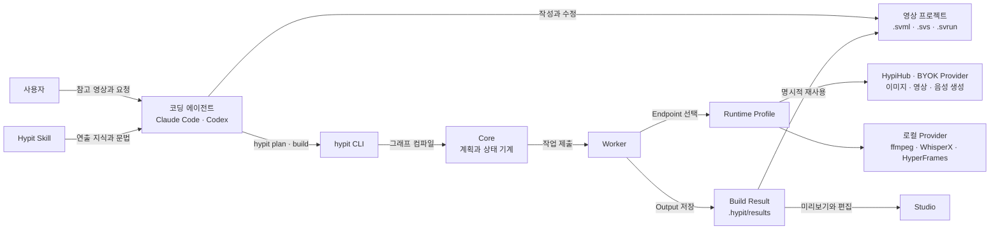
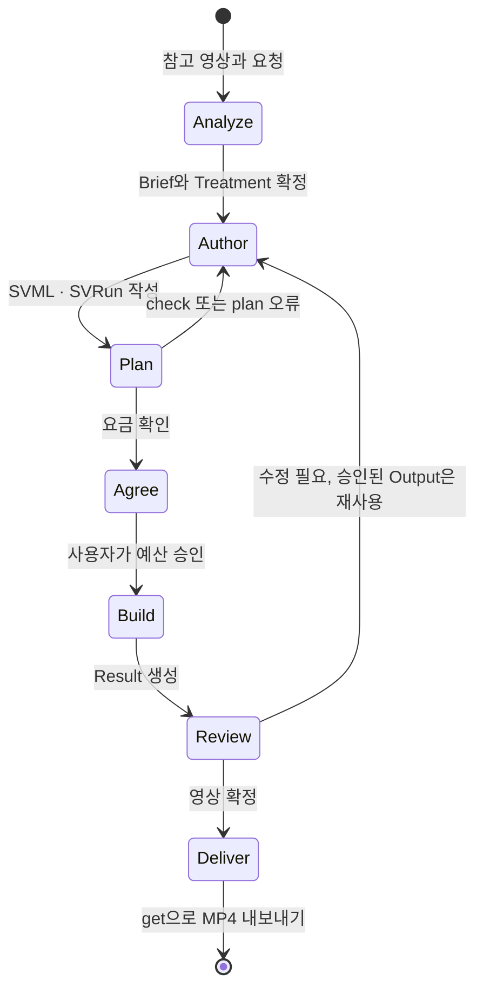

# Hypit 핵심 개념과 동작 구조

> Hypit을 이루는 소스 형식(SVML·SVS·SVRun), Script와 단어 앵커, SemanticTake와 Timeline, Track과 Film, Run과 Build, Model과 Provider가 각각 무엇이고 어떻게 맞물려 동작하는지 다룹니다.

## 용어 한눈에 보기

| 키워드 | 설명 |
|---|---|
| SVML (`.svml`) | 영상의 대사, 소재, 컴포넌트, 합성을 기술하는 Author Source |
| SVS (`.svs`) | 색, 크기, 위치, 등장 모션 같은 재사용 스타일(Recipe)을 모은 스타일시트 |
| SVRun (`.svrun`) | 이번 실행에서 무엇을 만들지(Target)와 무엇을 재사용할지(Candidate)를 고르는 Run Source |
| Script | 출연자가 말하는 모든 단어. 타임코드·스타일 없이 문장만 담음 |
| Selection / Moment | Script 안에 표시한 단어 구간 / 단어 시점. 시간 대신 쓰는 의미 앵커 |
| SemanticTake | 영상 한 테이크를 Script의 한 Segment와 단어 단위로 정렬한 결과 |
| Timeline | 테이크들을 프레임 축 위에 배치한 전체 시간축. 앵커를 프레임으로 바꾸는 기준 |
| Track / Film | 자막·B-roll·그래픽 같은 레이어 / 그 레이어들을 쌓아 만든 최종 합성 |
| Build / Result | 한 번의 실행 시도 / 그 실행이 남긴 Output과 기록 |
| Model / Provider / Endpoint | 무엇을 생성할지 / 어떤 서비스로 실행할지 / 그 서비스의 설정된 인스턴스 |
| Runtime Profile | 어떤 Endpoint와 자격 증명을 쓸지 고르는 `hypit.runtime.json` |

---

## 1. 소스 세 가지: SVML · SVS · SVRun

### 쉽게 설명하면

영화 제작에 비유하면 SVML은 **시나리오와 콘티**, SVS는 **미술팀의 스타일 가이드**, SVRun은 **오늘 촬영할 장면 목록**입니다. 시나리오가 같아도 오늘은 1장만 찍을 수도 있고, 어제 찍은 장면을 그대로 쓸 수도 있습니다.

### 개발 관점에서는

- **SVML**은 HTML과 비슷한 마크업으로, `<import>`로 컴포넌트 패키지를 불러오고 각 요소가 그래프의 노드가 됩니다. `{take.video}`처럼 다른 요소의 출력을 중괄호로 참조하면 그것이 의존성 간선이 됩니다.
- **SVS**는 CSS와 비슷한 문법으로 `caption.base { size: 58; fill: #FFFFFF; }` 같은 Recipe를 정의하고, SVML에서 `{recipes.caption.base}`로 참조합니다.
- **SVRun**은 SVML 하나를 가리키고, 만들 결과(`<target>`)와 재사용할 이전 결과(`<build-record>`, `<satisfy>`)를 적습니다.

세 파일을 나눈 이유는 **"무엇을 만드는가", "어떻게 보이는가", "이번에 무엇을 실행하는가"가 서로 다른 속도로 바뀌기 때문**입니다. 스타일만 바꿔서 다시 렌더링하거나, 같은 SVML로 이미지 생성용 Run과 최종 렌더용 Run을 따로 둘 수 있습니다.

### 예제

```svml
<!-- build.svrun -->
<?svml using="@hypit/run-markup@1"?>

<svrun version="1">
  <author source="./main.svml"/>
  <target output="final.video"/>
</svrun>
```

`final.video`는 `main.svml` 안의 `<render:Video id="final" .../>`가 내보내는 출력입니다. Run은 이 Target까지 가는 데 필요한 작업만 실행합니다.

### 핵심

> SVML은 영상의 정의, SVS는 외형, SVRun은 실행 의도입니다. 세 파일 모두 평범한 텍스트라서 에이전트가 읽고 고치고 Git으로 관리할 수 있습니다.

## 2. Script: 문장만 담는 대사 원본

### 쉽게 설명하면

방송 대본에서 "누가 무슨 말을 하는지"만 적힌 페이지입니다. 언제 자막이 뜨는지, 어떤 색인지는 적지 않습니다.

### 개발 관점에서는

`<script>`는 `@hypit/script@1`을 import하면 활성화되는 요소로, 다음 구성만 가집니다.

- **Segment**: `<opening>`, `<answer>`처럼 태그 이름이 곧 id인 대사 블록. 중첩할 수 없고, 보통 한 Segment가 생성 영상 한 테이크에 대응합니다.
- **Role Cue**: `<HOST>`, `<ALICE>`처럼 닫는 태그 없이 "누가 말하는지"만 표시합니다. 목소리나 캐릭터를 고르지는 않습니다.
- **Dual Text**: `<BCC | B C C>`처럼 화면에 보일 글자(왼쪽)와 실제로 발음할 말(오른쪽)을 나눕니다.
- **Cue Break** `||`: 자막 한 덩어리를 끊는 위치입니다.

Script 하나에서 세 가지 텍스트 투영이 나옵니다. `dialogue`(화자 이름 포함, 영상 생성 프롬프트용), `speech`(발음용), `caption`(자막용 CaptionDocument)입니다.

### 예제

```svml
<import from="@hypit/script@1"/>

<script id="story">
  <hook>
    <HOST> 이거 아직도 안 먹어? || 크레아틴은 <3g | 삼 그램>이면 충분해.
  </hook>
</script>
```

화면 자막에는 "3g"이, 음성 생성 프롬프트에는 "삼 그램"이 들어갑니다. 두 표현은 하나의 정렬 단위로 묶여서 "삼 그램"이 발음되는 동안 "3g"가 강조됩니다.

### 핵심

> Script는 다른 어떤 것도 읽지 않고, 나머지 모든 단계가 Script를 읽습니다. 그래서 대사를 고치면 그 영향이 자막·생성 프롬프트·타이밍으로 자연스럽게 퍼집니다.

## 3. Selection과 Moment: 시간 대신 쓰는 단어 앵커

### 쉽게 설명하면

편집자에게 "3.2초에 제품 컷 넣어 주세요"가 아니라 **"'매일'이라고 말하는 순간에 제품 컷 넣어 주세요"**라고 말하는 것입니다. 배우가 말을 조금 빠르게 해도 지시는 여전히 맞습니다.

### 개발 관점에서는

Script 안에 `@{...}` 마커로 이름 붙은 구간(Selection)과 시점(Moment)을 선언합니다.

| 마커 | 의미 |
|---|---|
| `@{name}` ... `@{/name}` | Selection: 다음 단어 시작부터 이전 단어 끝까지 |
| `@{name!}` | Moment: 다음 단어가 시작하는 순간 |
| `~` 접두·접미 | 경계를 왼쪽·오른쪽 단어 중 어디에 붙일지 선택 |

마커는 텍스트에 아무것도 추가하지 않는 0폭 표시이고, 컴파일되면 "어느 앵커에서 어느 앵커까지"라는 식별자만 남습니다. 초나 프레임 숫자는 Script에 전혀 없습니다.

### 예제

```svml
<script id="story">
  <hook>
    <HOST> @{problem}운동하는데 근육이 안 붙어?@{/problem}
    @{reveal!}답은 크레아틴이야.
  </hook>
</script>

<!-- 다른 컴포넌트에서 -->
<media-track:Item image={product.image} during={story.selection.problem} .../>
```

`during={story.selection.problem}`은 "problem 구간이 실제 영상에서 몇 프레임부터 몇 프레임까지인지"를 Timeline이 계산한 뒤에 정해집니다.

### 핵심

> 앵커는 "언제"를 "무엇을 말할 때"로 바꿉니다. 대사 속도, 문장 길이, 언어가 바뀌어도 연출 의도가 그대로 유지되는 이유입니다. 계산 과정은 [단어 앵커와 시맨틱 타이밍 깊이 보기](07-semantic-timing.md)에서 소스 코드와 함께 다룹니다.

## 4. SemanticTake와 Timeline: 앵커를 프레임으로

### 쉽게 설명하면

녹음된 대사를 들으면서 대본의 단어마다 "몇 초에 시작해서 몇 초에 끝났는지" 형광펜으로 표시하는 작업이 SemanticTake이고, 그렇게 표시된 테이크들을 순서대로 이어 붙인 것이 Timeline입니다.

### 개발 관점에서는

말하는 영상은 세 단계로 시간 정보를 얻습니다.

1. `pipeline:Normalize`: 생성된 영상을 지정한 프레임 레이트(`Clock`)의 정확한 미디어로 정규화합니다.
2. `whisperx:SemanticTake`: 정규화된 테이크 하나를 Script Segment 하나와 정렬해 단어마다 로컬 프레임 구간을 붙입니다. 언어 코드(`language="ko"`)는 자동 감지하지 않고 직접 적어야 합니다.
3. `time:Timeline`: SemanticTake들을 순서대로(또는 `at` 위치에) 배치해 전체 프레임 축을 만듭니다.

말이 없는 순수 애니메이션은 테이크 없이 `end="8s"`만 가진 Timeline을 쓰고, 이벤트를 초나 프레임으로 적습니다.

### 예제

```svml
<program:Clock id="clock" frame-rate="30"/>
<pipeline:Normalize id="hook-media" source={hook-take.video}
  video="primary-moving" audio="default" span-authority="video" clock={clock}/>
<whisperx:SemanticTake id="hook-semantic" narrative={story}
  segment={story.segment.hook} media={hook-media.media} language="ko"/>
<time:Timeline id="speech" clock={clock}>
  <time:Take source={hook-semantic.take}/>
</time:Timeline>
```

### 핵심

> Timeline은 "의미(앵커)"와 "물리 시간(프레임)"을 잇는 유일한 기준입니다. 모든 Track은 같은 `{speech.timeline}`을 입력으로 받습니다.

## 5. Component, Track, Film, Render

### 쉽게 설명하면

포토샵의 레이어와 같습니다. 출연자 영상 레이어, B-roll 레이어, 자막 레이어, 제목 레이어를 겹쳐서 한 장면을 만들고, 그 결과를 영상 파일로 내보냅니다.

### 개발 관점에서는

- **Component**: `caption-fine`, `media-track`, `ranking`처럼 패키지로 제공되는 시각 요소입니다. 입력(Timeline, 앵커, 이미지, Recipe)을 받아 Track을 출력합니다. 프로젝트 전용 컴포넌트를 TypeScript로 직접 만들 수도 있습니다.
- **Track**: 시간에 따라 나타나고 사라지는 레이어입니다. `stack-order`가 낮을수록 뒤에 그려집니다.
- **Film**: Track들을 모아 하나의 Composition으로 검증·합성합니다.
- **Render**: `render:Video`가 Composition을 HyperFrames 렌더러로 프레임마다 HTML로 그리고, headless Chromium으로 캡처하고, 오디오를 섞어 MP4로 만듭니다.

### 예제

```svml
<film:Film id="main" canvas={vertical} timeline={speech.timeline} appearance={recipes.film.vertical}>
  <film:Track source={performance.visual}/>  <!-- 출연자 영상 -->
  <film:Track source={voice.audio}/>         <!-- 음성 -->
  <film:Track source={cards.visual}/>        <!-- B-roll -->
  <film:Track source={captions.track}/>      <!-- 자막 -->
</film:Film>
<render:Video id="final" composition={main.composition} timeline={speech.timeline}/>
```

### 핵심

> 함께 움직여야 하는 요소는 한 컴포넌트(한 장면) 안에, 독립적인 요소는 별도 Track으로 둡니다. Film의 자식 순서가 아니라 Recipe의 `stack-order`가 그리기 순서를 정합니다.

## 6. Run, Build, Result: 명시적 재사용

### 쉽게 설명하면

사진관에서 "지난번에 찍은 증명사진 원판으로 다시 뽑아 주세요"라고 말하는 것과 같습니다. 말하지 않으면 사진관은 새로 찍습니다. 대신 무엇을 다시 썼는지가 분명히 남습니다.

### 개발 관점에서는

- `hypit build`를 실행할 때마다 **새 Build id**가 생깁니다. 소스가 그대로여도 마찬가지입니다. 생성 모델은 같은 입력에도 다른 결과를 내기 때문입니다.
- Hypit에는 **암묵적 캐시가 없습니다.** 이전 결과를 쓰려면 `.svrun`에 `<build-record>`로 "어느 Build의 어느 Output"인지 지정하고, `<satisfy>`로 지금 소스의 어떤 출력을 그것으로 대신할지 연결해야 합니다.
- 결과는 기본적으로 `.hypit/results/<날짜>/<build-id>/`에 `result.json`, `files/`, `values/`로 저장됩니다. 실패한 Build에서도 완료된 Output은 남아 재사용할 수 있습니다.
- Build는 백그라운드 Worker가 실행합니다. `--follow`는 관찰만 하므로 터미널을 닫아도 Build는 계속됩니다.

### 예제

```svml
<svrun version="1">
  <author source="./main.svml"/>
  <target output="final.video"/>

  <!-- 지난 Build에서 승인한 훅 테이크를 그대로 쓴다 -->
  <build-record id="approved-hook"
    build="bld_20260930T101500000Z_0000000001" output="hook-take.video"/>
  <satisfy output="hook-take.video" candidate="approved-hook"/>
</svrun>
```

### 핵심

> "무엇을 다시 쓰는지"를 사람이 읽을 수 있는 파일에 남기는 것이 Hypit 재사용의 원칙입니다. 이 덕분에 바뀐 부분만 비용을 내고 다시 생성합니다.

## 7. Model, Provider, Endpoint, Runtime Profile

### 쉽게 설명하면

Model은 **주문서**("9:16 비율 이미지 한 장, 이런 프롬프트로")이고, Provider는 **배달 업체**, Endpoint는 **내 계정으로 등록된 그 업체의 지점**입니다. Runtime Profile은 "이 주문은 이 지점으로 보낸다"는 배정표입니다.

### 개발 관점에서는

- **Model**(예: `@hypit/seedance@1`, `@hypit/gpt-image@1`)은 요청의 입력·파라미터·출력 타입을 정의하고 SVML에서 import합니다.
- **Provider**(예: `@hypit/provider-hypihub`, `@hypit/provider-media-local`)는 그 요청을 특정 API나 로컬 도구로 실행합니다.
- **Endpoint**는 `hypit.runtime.json`의 `endpoints`에 등록한 Provider 인스턴스로, 주소·자격 증명 참조·동시성 한도를 가집니다.
- 같은 기능을 여러 Endpoint가 제공하면 `bindings`로 하나를 고릅니다. 실패해도 **다른 계정으로 조용히 넘어가지 않습니다.**
- 비밀값은 Profile과 소스에 넣지 않고 Credential Store(OS 키체인, 환경 변수, 플랫폼 OAuth)에서 이름으로 참조합니다.

### 예제

```json
{
  "format": "hypit.runtime-local@1",
  "dataRoot": ".hypit/runtimes/local",
  "credentials": { "platform": { "use": "@hypit/credential-store-platform" } },
  "endpoints": {
    "hypihub.default": {
      "use": "@hypit/provider-hypihub",
      "config": { "apiKey": { "store": "platform", "key": "hypihub.oauth" } }
    },
    "media.local": { "use": "@hypit/provider-media-local" }
  },
  "bindings": {}
}
```

### 핵심

> 소스(SVML)는 "무엇을"만, Profile은 "어디서"만 정합니다. 그래서 같은 영상 소스를 HypiHub로 돌리다가 자체 API 키나 로컬 모델로 바꿔도 소스는 수정하지 않습니다.

---

## 8. 전체 동작 구조

Hypit은 애플리케이션 코드에 import하는 라이브러리가 아니라, **에이전트가 소스를 쓰고 CLI가 그래프를 실행하는 제작 시스템**입니다.



한 번의 영상 제작이 처리되는 순서는 다음과 같습니다.

1. **시작점**: 사용자가 에이전트에 `/hypit`으로 참고 영상과 바꿀 내용을 전달합니다. 에이전트는 Skill을 읽고 참고 영상을 프레임과 단어 단위 대본으로 분석해 프로젝트 노트(Analysis, Brief, Treatment)에 기록합니다.
2. **Hypit이 개입하는 시점**: 에이전트가 Script, 생성 프롬프트, 컴포넌트 배치를 SVML로 작성하고 `hypit check`, `hypit plan`으로 그래프를 검증합니다. `hypit pricing`으로 예상 요금을 보여 주고 사용자와 예산을 합의합니다.
3. **내부 처리**: `hypit build`가 Author Graph와 Run Graph를 함께 계획해 Target까지 필요한 작업만 고르고, Worker가 의존성 순서대로 실행합니다. 이미지 생성 → 영상 생성 → 정규화 → WhisperX 정렬 → Timeline 조립 → Track 계산 → Film 합성 → 렌더링 순으로 진행됩니다.
4. **외부 시스템과의 연결**: 생성과 전사 요청은 Runtime Profile이 고른 Endpoint로 나갑니다. 원격 작업은 제출 → 폴링 → 수집으로 나뉘어 처리되고, 렌더링은 로컬 headless Chromium에서 병렬로 진행됩니다.
5. **결과 반환**: 완료된 Output은 Build Result에 쌓이고, `hypit get`으로 MP4를 내보내거나 `hypit studio`로 타임라인을 보며 수정합니다. 다음 변형은 승인된 Output을 `.svrun`에서 재사용해 바뀐 부분만 다시 실행합니다.

하나의 영상이 다듬어지는 흐름을 상태로 보면 다음과 같습니다.



---

[← 개요](README.md) · [설치와 첫 사용 →](02-getting-started.md)
