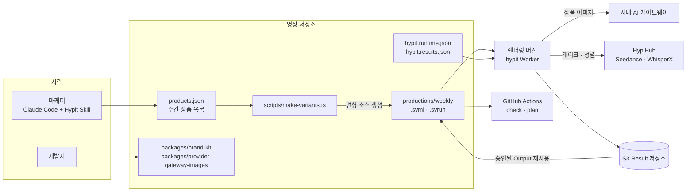

# Hypit 활용 예시 ③ 팀·운영·실전 적용

> 여러 사람이 같은 영상 프로젝트를 다룰 때의 Runtime Profile·자격 증명·Result 저장소 구성, CI 검증, 사내 모델 게이트웨이 연결, 그리고 쇼핑몰 상품 숏폼 변형 파이프라인에 실제로 도입하는 과정을 다룹니다.

## 팀·운영 환경에서의 활용

Hypit은 서버 코드에서 import하는 라이브러리가 아닙니다. 대신 **영상 프로젝트를 팀이 공유하고, 렌더링을 사내 머신에서 실행하고, 결과를 공용 저장소에 모으는 운영 단위**로 쓰입니다.

### 활용 사례

- **팀 공용 Profile**: `hypit.runtime.json`을 저장소에 커밋해서 모두가 같은 Endpoint 구성을 쓰고, 자격 증명은 각자의 Credential Store에 둡니다.
- **공용 Result 저장소**: `hypit.results.json`으로 S3 호환 버킷을 지정하면, 한 사람이 만든 Build Output을 다른 사람이 `build-record`로 재사용할 수 있습니다.
- **브랜드 컴포넌트 패키지**: 브랜드 자막 스타일, 가격 카드, 로고 엔딩 같은 컴포넌트를 프로젝트 `packages/`에 두고, 필요하면 사내 npm 레지스트리로 버전을 붙여 배포합니다.
- **사내 모델 게이트웨이 연결**: 회사가 쓰는 이미지·영상 생성 게이트웨이를 프로젝트 Provider 패키지로 연결하고, Profile의 `bindings`로 특정 Model 요청을 그쪽으로 보냅니다.
- **CI 정적 검증**: PR마다 `hypit check`와 그래프 전용 `hypit plan`을 돌려서 문법 오류나 끊어진 참조를 비용 없이 잡습니다.
- **사내 렌더링 머신**: 고성능 머신 한 대에서 Worker를 띄워 렌더링과 로컬 WhisperX를 처리합니다. 자기 조직용 단일 테넌트 배포는 라이선스상 허용됩니다.

### 애플리케이션 구조

"서버 코드의 어느 계층에 넣느냐"보다 **영상 제작 흐름의 어느 경계에 무엇을 두느냐**로 보는 것이 맞습니다.

```text
사람 / 에이전트
 ↓
영상 소스 (.svml · .svs · .svrun)          ← Git으로 공유, PR 리뷰
 ↓
프로젝트 패키지 (브랜드 컴포넌트, 사내 Provider)  ← 버전 고정, lockfile 커밋
 ↓
Runtime Profile (Endpoint · bindings · 자격 증명 참조) ← 커밋, 비밀값은 Store에
 ↓
Worker (렌더링 머신)                         ← 단일 테넌트
 ↓
외부 생성 서비스 / 로컬 도구
 ↓
Result 저장소 (S3 호환 버킷)                 ← 팀 전체가 읽고 재사용
```

### 실제 코드

**공용 Result 저장소** (`hypit.results.json`)

```json
{
  "format": "hypit.build-results@1",
  "use": "@hypit/build-result-s3",
  "config": {
    "bucket": "acme-video-results",
    "prefix": "projects/weekly-shorts",
    "region": "ap-northeast-2"
  }
}
```

S3 자격 증명은 AWS SDK의 기본 자격 증명 체인을 그대로 쓰므로 이 파일에 들어가지 않습니다. Result 저장소를 바꿔도 이전 Build 기록이 자동으로 옮겨지지는 않습니다.

**사내 게이트웨이를 쓰는 Runtime Profile** (`hypit.runtime.json`)

```json
{
  "format": "hypit.runtime-local@1",
  "dataRoot": ".hypit/runtimes/local",
  "credentials": {
    "env": { "use": "@hypit/credential-store-env" },
    "platform": { "use": "@hypit/credential-store-platform" }
  },
  "endpoints": {
    "gateway.images": {
      "use": "@acme/provider-gateway-images",
      "config": {
        "baseUrl": "https://ai-gateway.acme.internal",
        "apiKey": { "store": "env", "key": "ACME_GATEWAY_KEY" }
      }
    },
    "hypihub.default": {
      "use": "@hypit/provider-hypihub",
      "config": { "apiKey": { "store": "platform", "key": "hypihub.oauth" } }
    },
    "media.local": { "use": "@hypit/provider-media-local" },
    "hyperframes.local": {
      "use": "@hypit/provider-hyperframes-local",
      "config": { "workers": 4, "quality": "standard" }
    }
  },
  "bindings": {
    "@hypit/gpt-image@1#gpt-image-2": "gateway.images"
  }
}
```

`@acme/provider-gateway-images`는 Distribution에 포함된 `examples/provider-package/packages/provider-images`를 복사해 사내 게이트웨이 API에 맞게 고친 프로젝트 패키지입니다. 이미지 요청만 게이트웨이로 보내고, 영상 생성과 전사는 HypiHub를 그대로 씁니다. 게이트웨이가 지원하는 해상도·길이가 Model보다 좁다면 Provider의 `supports`에서 그 차이를 보고해야 `plan` 단계에서 이유와 함께 거절됩니다.

**CI에서 비용 없이 검증하기**

```yaml
# .github/workflows/video-source-check.yml
name: video-source-check
on: [pull_request]

jobs:
  check:
    runs-on: ubuntu-latest
    steps:
      - uses: actions/checkout@v4
      - uses: actions/setup-node@v4
        with:
          node-version: 22
      - run: npm ci                                  # 프로젝트 컴포넌트·Provider 패키지
      - run: npm install -g @hypit/hypit@0.2.17     # 팀이 검토한 버전으로 고정
      - run: hypit check productions/weekly/authors/main.svml
      # Runtime을 선택하지 않은 plan은 그래프만 계산하므로 자격 증명이 필요 없다
      - run: hypit plan productions/weekly/runs/final.svrun
```

**계층별로 어떤 구성 요소가 어울리는가**

| 위치 | 적절한 구성 요소 | 이유 |
|---|---|---|
| 영상 정의 | `.svml`, `.svs`, `.svrun` | 사람이 리뷰하는 텍스트. 연출 결정과 재사용 선택이 diff로 남음 |
| 브랜드 표현 | 프로젝트 Author Package | 여러 영상이 같은 자막·카드·엔딩을 쓰므로 한 곳에서 버전 관리 |
| 실행 경로 | Runtime Profile + Provider 패키지 | 어떤 서비스와 계정을 쓸지는 소스와 분리해 환경별로 바꿈 |
| 비밀값 | Credential Store (env, OS, platform) | 소스·Profile·Git 어디에도 비밀값이 남지 않게 함 |
| 결과물 | S3 Result 저장소 | 팀 전체가 같은 `build + output` 주소로 재사용 |

---

## 실전 프로젝트 적용: 쇼핑몰 주간 상품 숏폼 파이프라인

### 요구사항

건강식품 쇼핑몰의 마케팅팀(3명)과 개발자(1명)가 Hypit을 도입합니다.

- 매주 신상품 5개에 대해 15초 세로 숏폼을 만든다.
- 상품마다 훅 문장만 다른 변형 3개를 만들어 광고 A/B 테스트를 한다.
- 출연자(브랜드 모델) 이미지와 엔딩 로고 장면은 한 번 승인한 것을 계속 재사용한다.
- 상품 이미지는 사내 AI 게이트웨이로 생성하고, 영상·전사는 HypiHub를 쓴다.
- 주간 생성 예산은 20달러를 넘지 않는다.
- 렌더링은 사무실의 렌더링 머신 한 대에서 처리하고, 결과는 S3에 모은다.

### 전체 구조



### 폴더 구조

```text
weekly-shorts/
├── package.json                      # 프로젝트 경계 + 워크스페이스
├── hypit.runtime.json                # 팀 공용 Endpoint 구성
├── hypit.results.json                # S3 Result 저장소
├── products.json                     # 이번 주 상품과 훅 문장
├── scripts/
│   └── make-variants.ts              # 상품 × 훅 조합의 소스 생성
├── packages/
│   ├── brand-kit/                    # 브랜드 자막·가격 카드·엔딩 컴포넌트
│   └── provider-gateway-images/      # 사내 게이트웨이 Provider
├── productions/weekly/
│   ├── BRIEF.md                      # 목표, 주간 예산 합의
│   ├── template.svml                 # 공통 구성 (에이전트와 함께 작성)
│   ├── approved.json                 # 재사용할 승인 Output 목록
│   ├── authors/                      # 생성된 상품별 .svml
│   ├── runs/                         # 생성된 변형별 .svrun
│   └── recipes/brand.svs
└── .gitignore                        # .hypit/, output/
```

### 구현

**1. 공통 템플릿**

마케터가 에이전트와 함께 첫 상품으로 영상 한 편을 완성한 뒤, 그 SVML에서 상품마다 달라지는 부분을 자리표시자로 바꿉니다.

```svml
<!-- productions/weekly/template.svml (발췌) -->
<!-- brand:PriceCard는 packages/brand-kit에 팀이 직접 만든 프로젝트 컴포넌트 -->
<import as="brand" from="@acme/brand-kit@1"/>

<script id="story">
  <hook>
    <MODEL> @{hook}{{HOOK}}@{/hook}
  </hook>
  <pitch>
    <MODEL> @{product}{{PRODUCT_LINE}}@{/product} || @{price!}지금 {{PRICE}}.
  </pitch>
</script>

<wording:Value id="product-look">{{PRODUCT_PROMPT}}</wording:Value>
<gpt:Image id="product-shot" prompt={product-look} aspect-ratio="9:16" resolution="1K"/>
<brand:PriceCard id="price-card" timeline={speech.timeline} at={story.moment.price} price="{{PRICE}}"/>
```

**2. 상품 × 훅 조합 생성 스크립트**

```ts
// scripts/make-variants.ts
import { readFileSync, writeFileSync, mkdirSync } from 'node:fs';

type Product = { slug: string; line: string; price: string; prompt: string; hooks: string[] };
type Approved = Record<string, { build: string; output: string }>; // 재사용할 Output

const base = 'productions/weekly';
const template = readFileSync(`${base}/template.svml`, 'utf8');
const products: Product[] = JSON.parse(readFileSync('products.json', 'utf8'));
const approved: Approved = JSON.parse(readFileSync(`${base}/approved.json`, 'utf8'));

// Script 안에 들어갈 값은 SVML 예약 문자를 이스케이프한다
const escape = (text: string) => text.replace(/[\\@<|]/g, (c) => `\\${c}`);

mkdirSync(`${base}/authors`, { recursive: true });
mkdirSync(`${base}/runs`, { recursive: true });

for (const product of products) {
  product.hooks.forEach((hook, index) => {
    const id = `${product.slug}-h${index + 1}`;
    const svml = template
      .replaceAll('{{HOOK}}', escape(hook))
      .replaceAll('{{PRODUCT_LINE}}', escape(product.line))
      .replaceAll('{{PRICE}}', escape(product.price))
      .replaceAll('{{PRODUCT_PROMPT}}', product.prompt);
    writeFileSync(`${base}/authors/${id}.svml`, svml);

    // 브랜드 모델 이미지·엔딩 장면은 승인된 Output을 그대로 쓴다
    const reuse = Object.entries(approved)
      .map(([output, rec], i) =>
        `  <build-record id="r${i}" build="${rec.build}" output="${rec.output}"/>\n` +
        `  <satisfy output="${output}" candidate="r${i}"/>`)
      .join('\n');

    writeFileSync(`${base}/runs/${id}.svrun`, `<?svml using="@hypit/run-markup@1"?>

<svrun version="1">
  <author source="../authors/${id}.svml"/>
  <target output="final.video"/>
${reuse}
</svrun>
`);
  });
}
```

**3. 실행 전 비용 확인과 제출**

```bash
npx tsx scripts/make-variants.ts
for run in productions/weekly/runs/*.svrun; do
  hypit plan "$run" || exit 1          # 준비 상태와 외부 요청 목록 확인
done
hypit pricing productions/weekly/runs/vitamin-d-h1.svrun   # 대표 변형 하나로 단가 확인
# 마케터가 BRIEF.md의 주간 예산 범위 안인지 확인한 뒤 제출
for run in productions/weekly/runs/*.svrun; do
  hypit build "$run" --title "$(basename "$run" .svrun)"
done
hypit activity --verbose                # 공유 동시성 한도와 진행 중 작업 확인
```

### 코드 설명

- **템플릿 치환은 "사람이 승인한 구조"를 복제하는 용도로만 씁니다.** 새로운 연출이 필요한 상품은 템플릿에 억지로 맞추지 말고 에이전트와 별도 production으로 만듭니다.
- **이스케이프가 필요합니다.** Script에서 `@`, `<`, `|`, `\`는 문법 문자이므로, 상품명에 들어간 `@`나 `|`를 그대로 넣으면 컴파일 오류가 나거나 의도하지 않은 마커가 됩니다.
- **`approved.json`이 재사용의 단일 출처입니다.** 브랜드 모델 이미지를 다시 뽑으면 이 파일의 Build id 하나만 바꾸면 되고, 그 변경이 PR로 리뷰됩니다.
- **`build`는 제출만 하고 바로 돌아옵니다.** 실행은 렌더링 머신의 Worker가 맡으므로 15개 Build를 연달아 제출해도 터미널이 묶이지 않습니다. Endpoint의 동시성 한도가 실제 병렬 수를 정합니다.

### 실제 실행 흐름

1. **사용자 행동**: 월요일 아침 마케터가 `products.json`에 이번 주 상품 5개와 훅 문장 3개씩을 적고 PR을 올립니다.
2. **소스 생성과 검증**: 위 CI 예시를 확장한 GitHub Actions가 `make-variants.ts`로 15개 변형 소스를 만들고 `hypit check`, 그래프 전용 `hypit plan`을 실행합니다. 상품명에 이스케이프되지 않은 문자가 있으면 여기서 실패합니다.
3. **비용 합의**: 렌더링 머신에서 `hypit pricing`으로 변형 하나의 단가를 확인합니다. 출연자 이미지·엔딩은 재사용되므로 외부 요청은 상품 이미지 1장, 훅·피치 테이크, WhisperX 정렬뿐입니다. 15개 합계가 주간 예산 20달러 안인지 확인하고 `BRIEF.md`에 기록합니다.
4. **실행**: `hypit build` 15번으로 제출합니다. Worker는 상품 이미지 요청을 Profile의 `bindings`에 따라 사내 게이트웨이로, 테이크 생성과 정렬을 HypiHub로 보내고, 렌더링은 로컬 headless Chromium으로 처리합니다.
5. **외부 서비스 오류 처리**: HypiHub 폴링 중 5xx나 429가 오면 작업은 실패하지 않고 대기 상태로 남아 다음 폴링에서 다시 확인합니다(0.2.11~0.2.12에서 개선). API 키 누락 같은 설정 오류는 즉시 실패합니다. 실패한 Build에서도 완료된 이미지·테이크는 S3 Result에 남습니다.
6. **검토**: 마케터가 `hypit studio --run productions/weekly/runs/vitamin-d-h1.svrun`의 Comments 화면에서 시점별 피드백을 남기고, 에이전트가 `FEEDBACK.json`을 읽어 Script 마커나 브랜드 Recipe를 수정합니다. 수정본은 기존 테이크를 재사용하는 Run으로 다시 렌더링됩니다.
7. **결과 반영**: 확정된 변형은 `hypit get <build-id> --output final.video --to output/<변형>.mp4`로 내보내 광고 플랫폼에 올립니다. 성과가 좋은 훅의 테이크는 `approved.json`에 추가되어 다음 주 변형의 재사용 소재가 됩니다.

---

[← 활용 예시 ② SVML 직접 작성](04-usage-svml-authoring.md) · [목차](README.md) · [장단점과 대안 비교 →](06-comparison.md)
