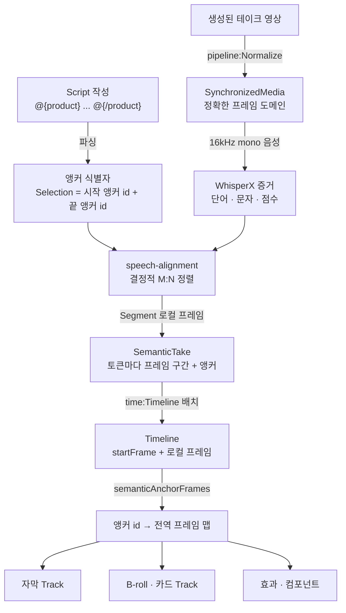

# Hypit 단어 앵커와 시맨틱 타이밍 깊이 보기

> `@{product}` 같은 단어 앵커가 Script 파싱, 테이크 정렬, Timeline 조립, 프레임 투영을 거쳐 실제 몇 번째 프레임이 되는지를 공식 패키지 소스 코드와 함께 따라가고, 이 구조가 왜 대사 수정에 강한지 설명합니다.

## 왜 이 주제인가

Hypit의 다른 기능(재사용, Provider 교체, Studio)은 다른 도구에도 비슷한 개념이 있습니다. 하지만 **"시간을 초가 아니라 단어에 묶는다"**는 설계는 Hypit을 Hypit답게 만드는 핵심이고, 동시에 가장 많은 오해가 생기는 부분입니다.

- "앵커가 있으면 Hypit이 알아서 타이밍을 맞춰 주는 거죠?" → 맞추는 것은 **실제 음성 정렬 결과**입니다. 정렬 전에는 앵커에 시간이 없습니다.
- "WhisperX가 영상 전체를 한 번에 전사하나요?" → 아닙니다. **Segment 하나와 테이크 하나**씩만 정렬합니다.
- "Selection 시작과 끝이 같은 프레임이 되면 어떻게 되나요?" → 자동으로 늘려 주지 않고 **거부**합니다.

이 문서는 이런 동작이 어디서 결정되는지 따라갑니다.

---

## 전체 흐름 한눈에 보기



핵심은 **각 단계가 자기 책임만 진다**는 점입니다. Script는 시간을 모르고, 정렬은 Segment 하나만 알고, Timeline은 배치만 하고, 소비하는 컴포넌트는 Timeline을 입력으로 받아 프레임을 조회만 합니다.

---

## 1단계. Script: 앵커는 "위치의 이름"이다

Script를 파싱하면 단어(Token)마다 시작·끝 앵커 두 개, Segment마다 시작·끝 앵커 두 개, 그리고 전체 프로그램의 시작·끝 앵커가 생깁니다. 토큰이 M개, Segment가 N개면 앵커는 정확히 **2M + 2N + 2개**입니다.

Selection과 Moment는 새 시간 정보를 만드는 것이 아니라, 이 앵커들 중 어느 것을 가리키는지만 기록합니다. `@hypit/script`의 투영 코드가 이를 그대로 보여 줍니다.

```ts
// packages/script/src/narrative.ts (발췌)
export function narrativeSelectionValue(selection, narrativeId) {
  return canonicalize({
    narrativeId,
    id: selection.id,
    startAnchorId: selection.open.boundary.anchorId,  // 어느 앵커에서
    endAnchorId: selection.close.boundary.anchorId,   // 어느 앵커까지
  });
}

export function narrativeMomentValue(moment, narrativeId) {
  return canonicalize({ narrativeId, id: moment.id, anchorId: moment.boundary.anchorId });
}
```

출력 어디에도 초나 프레임이 없습니다. `{story.selection.product}`가 다른 컴포넌트로 전달될 때 실제로 넘어가는 값은 "이 Narrative의 앵커 A부터 앵커 B까지"라는 식별자 쌍뿐입니다.

### `~`가 고르는 것: 경계의 소속

같은 위치처럼 보여도 앵커는 다릅니다. "운동하는데" 다음에 "근육이"가 오면, "운동하는데"의 끝 앵커와 "근육이"의 시작 앵커는 별개입니다. 실제 음성에서는 그 사이에 숨 쉬는 0.3초가 있을 수 있기 때문입니다.

| 마커 | 붙는 앵커 | 효과 |
|---|---|---|
| `@{x}` | 다음 단어의 시작 | 숨 쉬는 구간 뒤, 말이 시작될 때 등장 |
| `@{~x}` | 이전 단어의 끝 | 앞 단어가 끝나자마자 등장 (쉼 구간 포함) |
| `@{/x}` | 이전 단어의 끝 | 말이 끝나는 순간 퇴장 |
| `@{/x~}` | 다음 단어의 시작 | 다음 말이 시작될 때까지 유지 |

예를 들어 B-roll을 "말이 끝나도 다음 문장이 시작될 때까지 화면에 남기고" 싶다면 `@{/broll~}`를 씁니다. 정렬 후 두 앵커의 프레임이 우연히 같아질 수는 있어도, 작성자가 의도한 소속은 식별자로 구분되어 남습니다.

### 자막 단위도 Script가 정한다

자막은 음성 인식 결과의 구두점이나 띄어쓰기를 따르지 않습니다. Script가 만든 CaptionDocument가 표시 단어(Display Word), 정렬 단위(Alignment Unit), Cue 경계를 모두 정합니다. Dual Text `<3g | 삼 그램>`은 "표시 1단어 : 발음 2단어"인 하나의 N:M 단위가 되고, Segment가 끝나는 곳은 `||`가 없어도 항상 Cue 경계가 됩니다.

```ts
// packages/script/src/narrative.ts (발췌)
// Segment 끝은 강제 Cue 경계: 서로 다른 테이크의 단어가 한 자막에 섞이지 않게 한다
for (let index = 0; index < units.length - 1; index += 1) {
  if (units[index]!.segmentId === units[index + 1]!.segmentId) continue;
  breaks.add(units[index]!.id);
}
```

---

## 2단계. SemanticTake: 테이크 하나와 Segment 하나만 정렬한다

`whisperx:SemanticTake`는 다음 순서로 동작합니다.

1. `pipeline:Normalize`가 만든 정규화 미디어에서 오디오를 **16kHz 모노**로 투영합니다. WhisperX는 이 바이트만 봅니다.
2. 선택된 Endpoint(HypiHub 또는 로컬 WhisperX)가 단어·문자 단위 타임스탬프와 점수를 담은 **공급자 중립 증거**(`AlignedTranscriptEvidence`)를 돌려줍니다.
3. `@hypit/speech-alignment`가 이 증거와 Script Segment를 **로컬에서 결정적으로** 정렬합니다. 이 단계는 Python도, 음성 서비스도, LLM도 호출하지 않습니다.

정렬 알고리즘은 단조 증가하는 M:N 동적 계획법입니다. 정확히 일치, 하나를 둘로 나눔, 둘을 하나로 합침, 대체, Script 쪽 누락, 인식 쪽 삽입을 모두 허용합니다. 인식이 놓친 단어는 임의의 한 점으로 찍지 않고 측정된 양옆 단어 사이에 가중치를 둔 연속 구간을 받습니다. 결과는 마지막에 **한 번만** 테이크의 로컬 프레임으로 양자화되고, Segment 앵커는 정확히 프레임 0과 테이크의 마지막 프레임이 됩니다.

이 설계에서 알아 둘 점은 다음과 같습니다.

- **언어는 자동 감지하지 않습니다.** 말이 있는 Segment에는 `language="ko"`처럼 소문자 2~3자 코드를 반드시 적어야 하고, 그 값이 그대로 WhisperX로 전달됩니다. 영어 전용 `.en` 모델에 한국어를 요청하면 다른 모델로 바꾸지 않고 실패합니다.
- **전체 프로그램을 한 번에 전사하지 않습니다.** 테이크마다 따로 정렬하므로, 훅 테이크만 다시 생성하면 정렬도 훅 하나만 다시 합니다.
- **말이 없는 Segment는 정렬하지 않습니다.** `<pause/>` 같은 빈 Segment는 `language` 없이 쓰고, 시작·끝 앵커가 미디어의 첫 프레임과 마지막 프레임에 바로 붙습니다. WhisperX 요청도 생기지 않습니다.
- **중국어는 문자 단위로 처리됩니다.** WhisperX의 중국어 정렬은 글자 크기의 단어를 내므로, Script의 Han 문자도 글자 단위 토큰으로 나뉘어 1:1에 가깝게 맞춰집니다.

---

## 3단계. Timeline: 로컬 프레임을 전역 프레임으로

`time:Timeline`은 SemanticTake들을 배치만 합니다. `@hypit/timeline-author`의 조립 함수를 보면 규칙이 그대로 드러납니다.

```ts
// packages/timeline-author/src/program.ts (발췌)
let previousEnd = 0;
let contentEnd = 0;
const items = set.takes.map((item, index) => {
  // at을 생략하면 첫 테이크는 0프레임, 이후는 직전 테이크 끝
  const at = header.at?.[index] ?? (index === 0 ? "0f" : "previous.end");
  const startFrame = placementFrame(at, clock, index === 0 ? undefined : previousEnd, "previous.end");
  previousEnd = startFrame + item.semantic.media.timeline.frameCount;
  contentEnd = Math.max(contentEnd, previousEnd);
  return { take: item.semantic, startFrame };
});
const endFrame = placementFrame(header.end ?? "content.end", clock, contentEnd, "content.end");
assert(endFrame > 0, "Timeline needs a positive end; an empty Timeline requires an authored extent.");
assert(endFrame >= contentEnd, "Timeline end precedes placed content; choose an end that includes its Takes.");
```

```ts
// placementFrame (발췌): 위치는 반드시 정확한 프레임 경계에 떨어져야 한다
const frames = durationInFrames(parsed.duration, clock);
if (frames.denominator !== 1n || frames.numerator > BigInt(Number.MAX_SAFE_INTEGER)) {
  throw new Error(`Timeline duration ${expression} must land on an exact frame boundary.`);
}
```

- `at="previous.end+2s"`는 2초 간격, `at="previous.end-12f"`는 12프레임 겹침입니다. 겹친 구간에서는 두 테이크의 소리가 동시에 납니다.
- 시간은 유리수로 계산합니다. 30fps에서 `0.5s`는 15프레임이라 통과하지만, `30000/1001`fps 같은 NTSC 레이트에서 프레임 경계에 떨어지지 않는 값은 **반올림하지 않고 오류**를 냅니다. 이 검사를 `plan` 단계로 앞당기는 PR도 올라와 있습니다(2026년 10월 기준).
- 같은 Segment를 두 번 배치하면 거부됩니다. 하나의 Segment는 하나의 시간 구간만 가집니다.

---

## 4단계. 투영: 앵커 id를 프레임으로 조회한다

이제 컴포넌트가 `{story.selection.product}`를 받았을 때 실제 프레임을 얻는 과정입니다. `@hypit/timeline`은 별도의 단어 테이블을 복사하지 않고, 테이크의 배치 시작 프레임에 앵커의 로컬 프레임을 더한 맵 하나를 만듭니다.

```ts
// packages/timeline/src/location.ts (발췌)
export function semanticAnchorFrames(track: Timeline): ReadonlyMap<string, number> {
  return new Map([
    ["program:start", 0] as const,
    ...timelineSpans(track).flatMap(({ item, startFrame }) =>
      item.take.anchors.map((anchor) => [anchor.identity, startFrame + anchor.frame] as const)),
    ["program:end", timelineFrameCount(track)] as const,
  ]);
}

export function selectionFrameSpan(track, selection) {
  assertNarrativeOwner(track, selection.narrativeId, `NarrativeSelection ${selection.id}`);
  const frames = semanticAnchorFrames(track);
  return {
    startFrame: frameFor(frames, selection.startAnchorId, `NarrativeSelection ${selection.id}`),
    endFrameExclusive: frameFor(frames, selection.endAnchorId, `NarrativeSelection ${selection.id}`),
  };
}
```

여기서 세 가지 안전장치가 작동합니다.

1. **소유자 확인**: Selection이 다른 Script(Narrative)의 것이면 즉시 오류입니다. 두 영상의 앵커가 섞이지 않습니다.
2. **존재 확인**: 앵커가 Timeline에 없으면, 즉 그 단어가 있는 Segment의 테이크가 배치되지 않았으면 "이 Timeline에 없는 앵커"라는 오류가 납니다. 조용히 0프레임으로 처리하지 않습니다.
3. **구간 검증**: `@hypit/temporal`은 ProgramSpace 밖의 시점이나 뒤집히거나 비어 있는 구간을 거부하고, 잘라 내거나 보정하지 않습니다. 각 공식 컴포넌트는 받은 시점·구간이 자기가 받은 Timeline과 같은 시간축의 것인지 경계에서 다시 확인합니다.

### 숫자로 따라가 보기

30fps, 훅 테이크 90프레임(3초), 피치 테이크 150프레임(5초)이라고 하겠습니다.

```text
훅 테이크:   startFrame = 0       (at 생략, 첫 테이크)
피치 테이크: startFrame = 90      (at 생략 → previous.end)

피치 Segment 안의 "이거"   시작 앵커: 로컬 12프레임 → 전역 102프레임
피치 Segment 안의 "먹어."   끝 앵커:  로컬 48프레임 → 전역 138프레임

@{product}이거 하나만 먹어.@{/product}
→ selectionFrameSpan = { startFrame: 102, endFrameExclusive: 138 }
```

이제 훅 문장을 더 길게 바꿔 새 훅 테이크가 120프레임이 되었다고 하겠습니다. 피치 테이크는 재사용했으므로 로컬 프레임(12, 48)은 그대로이고, 배치 시작만 120으로 밀립니다. 제품 카드는 자동으로 132~168프레임에 나타납니다. **어떤 숫자도 사람이 고치지 않았습니다.**

---

## 대사를 바꾸면 무엇이 다시 계산되는가

| 바꾼 것 | 다시 실행되는 단계 | 그대로인 것 |
|---|---|---|
| 자막 스타일(SVS)만 | 자막 Track, Film, 렌더 | 생성, 정규화, 정렬, Timeline |
| 앵커 위치만 (`@{x}`를 한 단어 앞으로) | Script 파싱, 앵커를 쓰는 Track, 렌더 | 생성 테이크 (재사용 시) |
| 한 Segment의 대사 | 그 Segment의 테이크 생성·정규화·정렬, Timeline 이후 전부 | 다른 Segment의 테이크 (재사용 시) |
| 언어 전체 | 모든 테이크 생성·정렬 | 컴포넌트, Recipe, 앵커 구조 |

여기서 "재사용 시"가 중요합니다. Hypit에는 암묵적 캐시가 없으므로, 바뀌지 않은 테이크를 Run에서 `build-record`와 `satisfy`로 지정하지 않으면 다시 생성됩니다. 생성 테이크를 재사용하면 정렬은 다시 하고, 정렬이 끝난 SemanticTake를 재사용하면 정렬까지 건너뜁니다. 단, 대사를 바꾼 Segment의 SemanticTake를 재사용하면 새 Script의 토큰과 맞지 않으므로 그 Segment는 반드시 새 테이크가 필요합니다.

---

## 이 설계에서 자주 걸리는 지점

- **마커가 단어를 쪼개면 안 됩니다.** `“@{beat!}테스트”`처럼 따옴표와 단어 사이에 마커를 넣으면 거부됩니다. `@{beat!}“테스트”`처럼 단어 경계에 둡니다.
- **Selection과 Moment는 이름 공간을 공유합니다.** 같은 이름을 Selection과 Moment에 동시에 쓸 수 없고, 각 이름은 한 번만 나옵니다. 같은 효과를 두 번 내려면 다른 이름의 앵커를 하나 더 만듭니다.
- **빈 Selection은 거부됩니다.** 정렬 결과 두 앵커가 같은 프레임이 되면 빈 구간이 됩니다. 아주 짧은 단어 하나만 감싼 Selection은 `~`로 경계를 넓히는 것을 고려합니다.
- **0.1 문법은 0.2에서 거부됩니다.** 예전의 `@name` 마커는 `@{name}`으로 바꿔야 합니다. Distribution에 들어 있는 `packages/script/bin/migrate-0.2.mjs`가 표기만 바꿔 주고, 위치는 사람이 검토해야 합니다.
- **숫자 시간은 프레임 경계에 맞아야 합니다.** 순수 애니메이션에서 `at="1.33s"`처럼 프레임 레이트로 나누어떨어지지 않는 값은 오류입니다. `40f`처럼 프레임으로 적는 편이 안전합니다.

---

[← 장단점과 대안 비교](06-comparison.md) · [목차](README.md) · [주의할 점과 FAQ →](08-pitfalls-faq.md)
