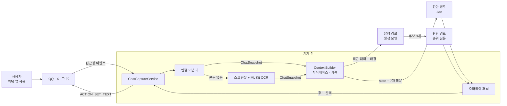

# Jev Chat Assistant 핵심 개념과 동작 구조

> 접근성 서비스, 앱별 어댑터, OCR 대체 경로, Jev 판단 질문, 생성과 순위, 지식베이스, 입력창 채우기가 각각 무엇이고 어떻게 맞물려 동작하는지 다룹니다.

## 용어 한눈에 보기

| 키워드 | 설명 |
|---|---|
| AccessibilityService | Android가 화면 낭독기 같은 보조 기능에 제공하는 서비스. 다른 앱 화면의 노드 트리를 읽고 일부 동작을 대신 수행할 수 있음 |
| 노드 트리 | 화면에 그려진 뷰를 접근성 관점에서 표현한 트리. 각 노드에 텍스트, 리소스 id, 화면 좌표가 있음 |
| ChatAppAdapter | 채팅 앱 하나의 노드 트리를 `ChatSnapshot`(제목 + 메시지 목록)으로 바꾸는 규칙 |
| ChatSnapshot | 앱과 무관한 공통 대화 표현. 이후 단계는 모두 이것만 봄 |
| OCR 대체 경로 | 트리에 본문이 없을 때 화면을 캡처해 기기 안에서 ML Kit 중국어 모델로 글자를 읽는 경로 |
| Jev / System One | TypeSafe의 판단 전용 모델. 문장을 만들지 않고 질문 유형별로 타입이 있는 답을 돌려줌 |
| Choice / Score / Noul | Jev의 세 가지 질문 유형. 선택지 고르기 / 순서 있는 단계 점수 / 참일 확률 |
| state | Jev가 판단할 대상 데이터. 이 앱에서는 최근 메시지, 관계 설명, 배경 정보, 과거 기록 |
| 판단·답장·시각 경로 | 판단(Jev), 답장 생성(OpenAI 호환), 시각(이미지 입력 모델) 세 가지 API 설정 |
| 지식베이스 | 기기 안에만 저장되는 노트와 연락처 프로필. 관련 있을 때만 분석에 포함됨 |

---

## 1. 접근성 서비스 (화면을 읽는 통로)

### 쉽게 설명하면

시각장애인용 화면 낭독기는 다른 앱의 화면에 무슨 글자가 있는지 읽어 줍니다. 이 앱은 같은 통로를 써서 "지금 열려 있는 채팅방에 어떤 말이 있는지"를 읽습니다. 채팅 앱 입장에서는 화면 낭독기가 화면을 보는 것과 같은 방식입니다.

### 개발 관점에서는

`ChatCaptureService`는 `AccessibilityService`를 상속하고, 다음 이벤트가 올 때마다 현재 활성 창의 루트 노드(`rootInActiveWindow`)를 가져옵니다.

- `TYPE_WINDOW_STATE_CHANGED`: 앱이나 화면 전환
- `TYPE_WINDOW_CONTENT_CHANGED`: 새 메시지 도착 등 화면 내용 변경
- `TYPE_VIEW_SCROLLED`: 대화 스크롤

접근성 설정 파일은 창 내용 읽기(`canRetrieveWindowContent`), 리소스 id 보고(`flagReportViewIds`), 접근성 서비스 스크린샷(`canTakeScreenshot`)을 켭니다. 그래서 별도의 화면 녹화 권한 없이도 OCR용 캡처를 할 수 있습니다. 이 기능 때문에 v1.3 이상으로 업데이트한 뒤에는 접근성 서비스를 한 번 껐다 켜야 캡처가 동작합니다.

판단 결과를 붙여 넣을 때도 같은 서비스가 입력창 노드에 `ACTION_SET_TEXT`를 보냅니다. 단, 전송 버튼을 누르는 동작은 코드에 없습니다.

### 예제

```xml
<!-- res/xml 의 접근성 서비스 설정 (요약) -->
<accessibility-service
    android:accessibilityEventTypes="typeAllMask"
    android:accessibilityFlags="flagReportViewIds|flagRetrieveInteractiveWindows|flagIncludeNotImportantViews"
    android:canRetrieveWindowContent="true"
    android:canTakeScreenshot="true"
    android:notificationTimeout="100" />
```

### 핵심

> 접근성 서비스는 "화면에 보이는 것"만 읽습니다. 채팅 앱의 데이터베이스나 계정에는 접근하지 않지만, 화면에 보이는 모든 앱의 내용을 읽을 수 있는 강한 권한이라는 점은 분명히 알고 써야 합니다.

## 2. 앱별 어댑터 (화면을 대화로 바꾸는 규칙)

### 쉽게 설명하면

QQ, X, 飞书는 화면 구조가 모두 다릅니다. 어댑터는 앱마다 한 명씩 있는 "통역사"입니다. 각자 자기 앱의 화면을 보고 "제목은 이것, 메시지는 이렇게 누가 무엇을 말했다"는 공통 형식으로 옮겨 줍니다.

### 개발 관점에서는

`ChatAppAdapter`는 패키지 이름과 `extract` 함수 하나로 이루어진 인터페이스입니다. 서비스는 전면 앱의 패키지 이름으로 어댑터를 고릅니다. `extract`의 반환값에는 세 가지 의미가 있습니다.

| 반환값 | 의미 | 서비스의 동작 |
|---|---|---|
| `null` | 채팅 창이 아님(대화 목록, 설정 등) | 분석하지 않고 대기 상태의 플로팅 버튼만 표시 |
| 메시지가 빈 `ChatSnapshot` | 채팅 창은 맞지만 트리에 본문이 없음 | OCR 대체 경로 시도 |
| 메시지가 있는 `ChatSnapshot` | 정상 수집 | 판단·생성 진행 |

현재 연결된 어댑터는 QQ, X, 飞书 세 개입니다. 앱마다 수집 방식이 다릅니다.

| 앱 | 트리 특징 | 어댑터 방식 |
|---|---|---|
| QQ | 노드에 리소스 id가 있음 | 본문 id와 제목 id를 읽고, 말풍선이 어느 쪽 아바타 열에 붙어 있는지로 발신자를 구분 |
| X | Compose UI라 id가 없고 `text`가 비어 있음 | 전체 너비 행의 `contentDescription`("발신자：본문。시간。Read")을 파싱 |
| 飞书 | 본문을 직접 그려서 트리에 글자가 없음 | 말풍선 사각형 좌표만 모아 OCR 경로로 넘기고, 읽음 표시가 있는 말풍선을 "나"로 판단 |

### 예제

```kotlin
interface ChatAppAdapter {
    val pkg: String
    fun extract(root: AccessibilityNodeInfo, res: Resources): ChatSnapshot?
}

data class Msg(val side: String, val text: String) // side: "me" 또는 "other"

data class ChatSnapshot(
    val title: String?,
    val messages: List<Msg>,
    val bubbleRects: List<BubbleRect> = emptyList(), // OCR할 말풍선 좌표
    val note: String? = null                          // 패널에 보여 줄 주의 문구
)
```

### 핵심

> 앱마다 다른 것은 "어떻게 읽는가"뿐이고, 그 결과는 모두 같은 `ChatSnapshot`이 됩니다. 새 앱을 지원하는 일은 어댑터 하나를 쓰는 일입니다. 직접 작성하는 방법은 [새 채팅 앱 어댑터 추가](04-usage-app-adapter.md)에서 다룹니다.

## 3. OCR 대체 경로 (트리에 글자가 없을 때)

### 쉽게 설명하면

어떤 앱은 글자를 그림처럼 그려서 화면 낭독기가 읽을 수 없습니다. 그럴 때는 화면 사진을 찍어 사진 속 글자를 읽습니다. 사진은 휴대폰 밖으로 나가지 않습니다.

### 개발 관점에서는

어댑터가 "채팅 창이지만 본문 없음"을 반환하면, 서비스는 접근성 스크린샷을 찍고 ML Kit의 번들형 중국어 인식 모델(`text-recognition-chinese`)로 기기 안에서 인식합니다. Google Play 서비스가 없어도 동작하는 대신 APK가 약 25~27MB로 커지고 `arm64-v8a`만 지원합니다.

캡처가 계속 반복되지 않도록 여러 겹의 제동 장치가 있습니다.

- 스크린샷 사이 최소 1초 간격, 실패 시 최대 30초까지 늘어나는 백오프
- 말풍선 좌표와 제목으로 만든 서명이 같으면 다시 찍지 않음(커서 깜빡임 같은 사소한 변화로 매초 캡처하던 문제 방지)
- 캡처 순간에는 자기 오버레이를 숨겨서 패널이 OCR 결과에 섞이지 않게 함
- OCR 모드에서 자동 분석은 기본 꺼짐

어댑터가 없는 앱은 자동 캡처를 하지 않고, 사용자가 플로팅 버튼 메뉴에서 "화면 한 번 인식"을 누를 때만 화면 전체를 OCR합니다. 이 경우 누가 말했는지 구분할 수 없어 모든 줄을 상대가 한 말로 처리하고 패널에 그 사실을 표시합니다.

### 핵심

> OCR은 "본문이 없는 트리"를 위한 보조 수단입니다. `FLAG_SECURE`가 걸린 창은 캡처할 수 없고, 화면에 보이는 부분만 읽으며 오타가 생길 수 있습니다.

## 4. Jev 판단 질문 (타입이 있는 답)

### 쉽게 설명하면

생성 모델이 "에세이를 쓰는 사람"이라면 Jev는 "객관식 시험을 푸는 사람"입니다. 질문과 보기를 주면 답을 고르고, 그 답을 얼마나 확신하는지까지 숫자로 알려 줍니다. 서술형 답안은 쓰지 않습니다.

### 개발 관점에서는

Jev는 TypeSafe의 판단 전용 모델입니다. 요청은 `model`, `state`, `questions` 세 필드로 이루어지고, `questions`의 각 항목은 세 유형 중 하나입니다.

| 유형 | 용도 | 주요 응답 필드 | 이 앱의 사용 예 |
|---|---|---|---|
| `choice` | 선택지 중 하나 고르기(최대 255개) | `choice`, `probabilities`, `confidence` | 진짜 의도, 최선의 행동, 상대가 원하는 것, 최적 답장 |
| `score` | 순서 있는 단계(2~10개) 중 어디에 가까운가 | `score`(확률 가중값), `legend`, `probabilities`, `confidence` | 위험 등급(10단계) |
| `noul` | 참일 확률(0~1) | `noul` | 말 그대로인가, 지금 실질적인 답을 할 때인가, 긴장이 풀렸는가 |

모든 질문은 같은 `state`를 기준으로 서로 독립적으로, 병렬로 평가됩니다. 그래서 질문 7개를 한 요청에 담아도 응답 시간이 크게 늘지 않습니다. 이 앱은 판단 7개를 한 번에 보내고, 답장 후보 순위는 별도 요청 하나로 보냅니다.

### 예제

```json
{
  "model": "jev-latest",
  "state": {
    "chat": {
      "relationship": "상대는 내 연인; from=me 는 내가, from=other 는 상대가 보낸 메시지",
      "messages": [
        { "from": "other", "text": "지난주에 내가 말한 거 기억나?" },
        { "from": "me", "text": "응? 어떤 거?" },
        { "from": "other", "text": "됐어. 바쁘신 분이니까." }
      ],
      "latest_from": "other"
    }
  },
  "questions": {
    "tension_resolved": {
      "type": "noul",
      "instructions": "Has interpersonal tension already been resolved?",
      "criteria": { "true": "No remaining tension.", "false": "Tension is still present." }
    }
  }
}
```

질문 문구(`instructions`, `criteria`)는 영어로, 대화 원문은 원래 언어 그대로 둡니다. Jev가 주로 영어로 학습되었기 때문에 질문을 영어로 쓰는 편이 판단이 안정적이라는 것이 프로젝트의 운영 원칙입니다.

### 핵심

> Jev의 답은 문장이 아니라 값입니다. 값이기 때문에 코드에서 임계값으로 분기하고, 화면에 색으로 표시하고, 다른 질문의 답과 조합할 수 있습니다. 7개 질문을 어떻게 설계했는지는 [판단 파이프라인 깊이 보기](07-judgment-pipeline.md)에서 다룹니다.

## 5. 생성과 순위 (문장은 생성 모델이, 선택은 판단 모델이)

### 쉽게 설명하면

글을 잘 쓰는 사람에게 초안 세 개를 받고, 판단을 잘하는 사람에게 "이 셋 중 지금 상황에 가장 맞는 것"을 고르게 하는 방식입니다.

### 개발 관점에서는

- `ReplyClient`가 OpenAI 호환 `/chat/completions`에 "서로 다른 전략의 후보 3개를 JSON 배열로, 각 40자 이내, 구어체로" 요청합니다. 온도는 0.8로 다양성을 둡니다.
- `JudgeClient.rank`가 후보 3개를 `reply_a`/`reply_b`/`reply_c` 선택지로 하는 `choice` 질문을 보냅니다. 순위 질문은 "확인되지 않은 사실이 있다면 기억을 꾸며 내거나 모호하게 사과하는 후보보다 확인하는 후보를 고르라"고 지시합니다.
- 응답의 `probabilities`로 후보를 정렬하고, 패널에 비율과 함께 보여 줍니다.

판단 7문항 요청과 "생성 → 순위" 요청은 동시에 시작됩니다. 판단 결과가 먼저 도착하면 패널 위쪽이 먼저 채워지고, 후보는 조금 뒤에 나타납니다.

### 핵심

> 생성 모델이 잘하는 것(다양한 문장)과 판단 모델이 잘하는 것(조건에 맞는 선택)을 나눠 맡깁니다. 생성 모델이 실수로 사실을 지어낸 후보를 만들어도, 순위 단계에서 아래로 밀릴 기회가 생깁니다.

## 6. 지식베이스 (기기 안에만 있는 배경 정보)

### 쉽게 설명하면

대화 상대에 대한 메모장입니다. "이 사람은 내 팀장이고, 금요일 보고를 중요하게 생각한다" 같은 내용을 적어 두면, 그 사람과 대화할 때만 조언자에게 함께 건네집니다.

### 개발 관점에서는

- **노트**: 제목, 내용, 태그, 상시 포함 여부. 상시 노트는 항상 포함되고, 나머지는 태그나 제목이 대화 제목 또는 최근 6개 메시지에 문자열로 포함될 때만 최대 5개까지 포함됩니다. 의미 검색이나 임베딩은 쓰지 않습니다.
- **연락처**: 이름, 별칭, 관계, 메모. 대화 제목이 이름이나 별칭과 일치하면 적용됩니다.
- **기록**: "채팅 기록 저장(기기에만)" 옵션은 기본 꺼짐입니다. 켜면 연락처별 최대 300개를 `filesDir/kb/logs/`에 저장하고, 분석 때 화면에 이미 보이는 메시지를 뺀 최근 N개(기본 30)를 함께 보냅니다.
- **예산**: 상시 노트를 제외한 노트와 기록은 합계 1,500자 안으로 자릅니다. 오래된 기록부터, 그다음 노트를 통째로 뺍니다.

포함된 정보는 Jev의 `state.background`·`state.history`와 생성 프롬프트 앞부분에 들어갑니다. 아무 정보도 없으면 필드 자체를 보내지 않습니다.

### 핵심

> 지식베이스는 "단순하고 예측 가능하게" 설계되어 있습니다. 문자열이 맞아야 들어가므로, 태그를 대화에 실제로 등장할 단어로 다는 것이 활용의 핵심입니다. 실제 사용법은 [대화 분석과 지식베이스](03-usage-chat-analysis.md)에서 다룹니다.

## 7. 입력창 채우기와 대화 바인딩

### 쉽게 설명하면

후보를 누르면 입력창에 글자가 들어가지만, 그사이 다른 채팅방으로 옮겼다면 엉뚱한 사람에게 들어가면 안 됩니다. 그래서 "이 답장은 어느 대화에서 나온 것인지"를 끝까지 확인합니다.

### 개발 관점에서는

분석을 시작할 때 서비스는 앱 패키지, 창 id, 대화 제목, 최근 메시지 서명으로 이루어진 대화 대상에 버전 번호를 붙인 토큰을 만듭니다. 판단 결과를 표시할 때, 후보를 표시할 때, 입력창에 쓸 때마다 현재 화면이 그 토큰과 같은 대화인지 다시 확인하고, 다르면 결과를 버립니다.

입력은 `ACTION_SET_TEXT` → 확인 → 포커스 후 재시도 → 클립보드 + `ACTION_PASTE` 순서로 시도하고, 매 단계마다 입력창을 다시 찾습니다. 그래도 안 되면 클립보드에 복사하고 "길게 눌러 붙여 넣으라"고 안내합니다.

### 핵심

> "판단 결과가 늦게 도착했는데 그사이 대화가 바뀌었다"는 비동기 앱의 전형적인 버그를 토큰으로 막습니다. 자세한 흐름은 [판단 파이프라인 깊이 보기](07-judgment-pipeline.md#대화-바인딩-늦게-도착한-결과를-버리는-방법)에서 다룹니다.

---

## 8. 전체 동작 구조



한 번의 분석이 처리되는 순서는 다음과 같습니다.

1. **시작점**: 상대가 새 메시지를 보내면 채팅 앱 화면이 바뀌고 접근성 이벤트가 서비스로 들어옵니다.
2. **이 앱이 개입하는 시점**: 서비스가 전면 앱의 어댑터로 `ChatSnapshot`을 만듭니다. 최근 6개 메시지 서명이 이전과 같으면 아무것도 하지 않고, 가장 최근 메시지가 상대 것이고 자동 분석이 켜져 있을 때만 800ms 디바운스 후 분석을 예약합니다.
3. **내부 처리**: `ContextBuilder`가 연락처·노트·기록을 붙이고, 작업 스레드 두 개에서 판단 요청과 "생성 → 순위" 요청을 동시에 실행합니다.
4. **외부 시스템과의 연결**: 판단은 사용자가 고른 Jev 제공 경로(OpenRouter, TypeSafe 직결, 博查(Bocha), Vercel, OpenCode Zen, 사용자 지정)로, 생성은 OpenAI 호환 주소로 갑니다. 429·529는 지수 백오프로 재시도하고, 다른 4xx는 재시도하지 않습니다.
5. **결과 반환**: 결과가 도착할 때마다 대화 토큰을 확인한 뒤 오버레이에 위험 등급 배지, 의도, 후보를 표시합니다. 사용자가 후보를 누르면 원래 대화의 입력창에 채워지고, 전송은 사용자가 직접 합니다.

---

[← 개요](README.md) · [설치와 첫 사용 →](02-getting-started.md)
