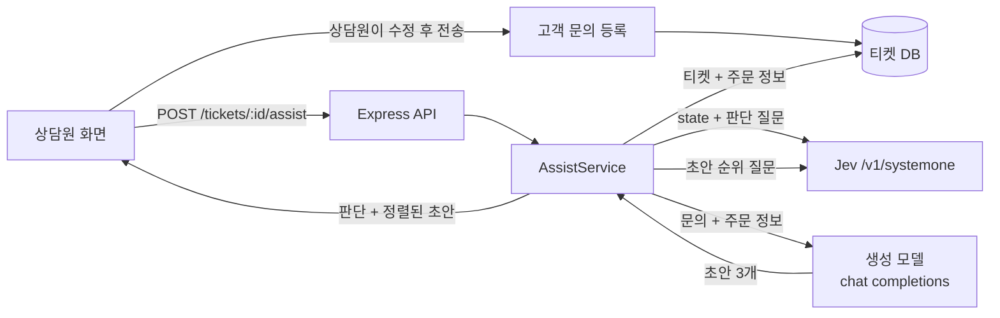

# Jev Chat Assistant 활용 예시 ③ 서버에서 판단 API 활용

> 앱에는 서버가 없지만, 앱의 핵심 구조인 "판단 → 생성 → 순위"는 서버 서비스에 그대로 옮길 수 있습니다. Jev 판단 API를 백엔드에 두는 방법과, 고객센터 답변 보조 서비스에 실제로 적용하는 과정을 다룹니다.

## 서버 환경에서의 활용

Jev Chat Assistant 자체는 서버에서 import하는 라이브러리가 아닙니다. 서버 관점에서 가져갈 것은 두 가지입니다.

1. **Jev 판단 API**: `POST /v1/systemone`에 `state`와 타입이 있는 질문을 보내 구조화된 답을 받는 HTTP API입니다. 언어와 프레임워크에 상관없이 호출할 수 있고, Python SDK(`typesafe-sdk`)도 있습니다.
2. **앱이 검증한 파이프라인 설계**: 판단 질문을 한 요청에 모으고, 생성은 별도 모델에 맡기고, 생성 결과를 다시 판단 모델로 정렬하고, 사람이 최종 결정하는 구조입니다.

### 활용 사례

- **고객 문의 분류와 답변 초안**: 문의의 부서, 긴급도, 감정 강도를 판정하고, 그 판정에 맞는 답변 초안을 상담원에게 제시합니다.
- **커뮤니티 모더레이션**: 게시글이 규칙 위반인지 Choice로, 심각도를 Score로 판정하고, 신뢰도가 낮은 것만 사람에게 보냅니다.
- **LLM 응답 가드레일**: 생성 모델의 출력이 사실을 지어냈는지, 금지 주제를 다뤘는지 Noul로 확인한 뒤 내보냅니다.
- **RAG 후보 재정렬**: 검색된 문서 조각 여러 개 중 질문에 답하는 것을 Choice 하나로 고릅니다.

### 애플리케이션 구조

판단 계층은 생성 모델과 같은 "외부 AI 어댑터" 계층에 두되, 서비스 계층이 둘을 조합합니다.

```text
Controller (POST /tickets/:id/assist)
 ↓
Service (AssistService: 판단과 생성을 조합, 신뢰도로 분기)
 ├─ JevClient       : 판단 질문 전송, 429·529 재시도
 └─ DraftClient     : OpenAI 호환 생성 모델 호출
 ↓
Repository (티켓·고객 이력 조회, 판단 결과 저장)
```

| 위치 | 담당 | 이유 |
|---|---|---|
| Controller | 요청 검증, 응답 형식 | 판단 로직이 HTTP 형식에 묶이지 않게 함 |
| Service | 질문 세트 선택, 병렬 호출, 임계값 분기 | "어떤 확률이면 자동 처리하는가"는 비즈니스 규칙이라 코드에서 관리 |
| 외부 API 어댑터 | Jev·생성 모델 호출, 재시도, 오류 정규화 | 공급자를 바꾸거나(OpenRouter ↔ TypeSafe 직결) 모델 버전을 고정하는 변경을 한곳에 모음 |
| Repository | 고객 이력, 판단 로그 | 판단 결과와 모델 버전을 저장해 나중에 임계값을 재조정할 근거로 씀 |

---

## 실전 프로젝트 적용: 쇼핑몰 고객 문의 답변 보조

### 요구사항

- 고객 문의가 들어오면 상담원 화면에 **분류(배송·환불·상품·기타), 긴급 여부, 불만 강도, 답변 초안 3개**를 보여 준다.
- 답변은 상담원이 고르고 수정해서 직접 보낸다. 자동 발송은 하지 않는다.
- 판단 신뢰도가 낮으면 분류를 자동 확정하지 않고 "확인 필요"로 표시한다.
- 초안은 주문 정보에 없는 사실(배송 날짜, 환불 금액)을 지어내면 안 된다.
- 스택: Node.js 20 + TypeScript + Express, 판단은 TypeSafe 직결, 생성은 OpenAI 호환 API.

### 전체 구조



### 폴더 구조

```text
support-assist/
├── src/
│   ├── jev/
│   │   ├── client.ts        # POST /v1/systemone, 재시도, 오류 정규화
│   │   └── questions.ts     # 판단 질문 세트와 순위 질문
│   ├── llm/
│   │   └── draft.ts         # 초안 3개 생성
│   ├── assist/
│   │   └── service.ts       # 병렬 호출, 신뢰도 분기
│   └── server.ts            # Express 라우트
├── .env.example             # TYPESAFE_API_KEY, LLM_BASE_URL, LLM_API_KEY, LLM_MODEL
└── package.json
```

### 구현

**1. Jev 클라이언트**

```ts
// src/jev/client.ts
export type Answer =
  | { type: 'noul'; noul: number }
  | { type: 'choice'; choice: string; confidence: number; probabilities: Record<string, number> }
  | { type: 'score'; score: number; confidence: number; probabilities: Record<string, number>; legend: Record<string, string> };

const JEV_URL = 'https://api.typesafe.ai/v1/systemone';
const MODEL = process.env.JEV_MODEL ?? 'jev-latest'; // 임계값을 튜닝했다면 버전 ID로 고정

export async function askJev(state: unknown, questions: Record<string, unknown>) {
  for (let attempt = 0; ; attempt++) {
    const res = await fetch(JEV_URL, {
      method: 'POST',
      headers: {
        Authorization: `Bearer ${process.env.TYPESAFE_API_KEY}`,
        'Content-Type': 'application/json',
      },
      body: JSON.stringify({ model: MODEL, state, questions }),
      signal: AbortSignal.timeout(20_000),
    });
    // 429(한도 초과), 529(과부하)만 지수 백오프로 재시도, 나머지 4xx는 즉시 실패
    if ((res.status === 429 || res.status === 529) && attempt < 3) {
      await new Promise((r) => setTimeout(r, 500 * 2 ** attempt));
      continue;
    }
    if (!res.ok) throw new Error(`Jev HTTP ${res.status}: ${(await res.text()).slice(0, 200)}`);
    const body = (await res.json()) as { model: string; answers: Record<string, Answer> };
    return body; // body.model 에 실제로 답한 버전 ID가 들어 있음
  }
}
```

**2. 판단 질문**

```ts
// src/jev/questions.ts
const CONTEXT_NOTE = ' Facts in `order` are provided context.';

export const triageQuestions = {
  department: {
    type: 'choice',
    instructions: 'Which team should handle the customer message in `message`?' + CONTEXT_NOTE,
    criteria: {
      shipping: 'Delivery status, delays, wrong address, lost parcel',
      refund: 'Refund, return, cancellation, charge dispute',
      product: 'Product spec, size, defect, usage question',
      other: 'Anything else, including account and coupon issues',
    },
  },
  frustration: {
    type: 'score',
    instructions: 'How frustrated is the customer in `message`?' + CONTEXT_NOTE,
    criteria: [
      'Calm question, no complaint',
      'Mild complaint, polite tone',
      'Clearly unhappy, mentions repeated waiting or a broken promise',
      'Angry, threatens to cancel, leave a bad review, or report',
    ],
  },
  urgent: {
    type: 'noul',
    instructions: 'Does the customer need a response today to avoid a real loss?' + CONTEXT_NOTE,
  },
} as const;

export function rankQuestion(drafts: string[]) {
  return {
    best_draft: {
      type: 'choice',
      instructions:
        'Which draft is the best reply to `message`? Penalize drafts that state dates, amounts, ' +
        'or facts not present in `order`. Prefer a draft that promises to check over one that guesses.' +
        CONTEXT_NOTE,
      criteria: Object.fromEntries(drafts.map((d, i) => [`draft_${i}`, d])),
    },
  };
}
```

**3. 초안 생성**

```ts
// src/llm/draft.ts
export async function draftReplies(message: string, order: object): Promise<string[]> {
  const res = await fetch(`${process.env.LLM_BASE_URL}/chat/completions`, {
    method: 'POST',
    headers: { Authorization: `Bearer ${process.env.LLM_API_KEY}`, 'Content-Type': 'application/json' },
    body: JSON.stringify({
      model: process.env.LLM_MODEL,
      temperature: 0.8,
      messages: [
        {
          role: 'system',
          content:
            '쇼핑몰 상담원의 답변 초안을 씁니다. JSON 문자열 배열 하나만 출력하고, 서로 다른 전략의 초안 3개를 넣습니다. ' +
            '주문 정보에 없는 날짜·금액·사실은 쓰지 않습니다.',
        },
        { role: 'user', content: `주문 정보: ${JSON.stringify(order)}\n\n고객 문의: ${message}` },
      ],
    }),
  });
  if (!res.ok) throw new Error(`LLM HTTP ${res.status}`);
  const content: string = (await res.json()).choices?.[0]?.message?.content ?? '';
  const match = content.match(/\[[\s\S]*\]/); // 모델이 앞뒤에 설명을 붙여도 배열만 추출
  const drafts: string[] = match ? JSON.parse(match[0]) : [];
  return drafts.slice(0, 3);
}
```

**4. 조합 서비스**

```ts
// src/assist/service.ts
import { askJev } from '../jev/client';
import { triageQuestions, rankQuestion } from '../jev/questions';
import { draftReplies } from '../llm/draft';

const MIN_CONFIDENCE = 0.6;

export async function assist(ticket: { message: string; order: object }) {
  const state = { message: ticket.message, order: ticket.order };

  // 판단과 "생성 → 순위"를 동시에 시작: 앱과 같은 구조
  const [triage, ranked] = await Promise.all([
    askJev(state, triageQuestions),
    draftReplies(ticket.message, ticket.order).then(async (drafts) => {
      if (drafts.length < 2) return drafts.map((text) => ({ text, prob: 1 / Math.max(drafts.length, 1) }));
      const r = await askJev(state, rankQuestion(drafts));
      const a = r.answers.best_draft;
      const probs = a.type === 'choice' ? a.probabilities : {};
      return drafts
        .map((text, i) => ({ text, prob: probs[`draft_${i}`] ?? 0 }))
        .sort((x, y) => y.prob - x.prob);
    }),
  ]);

  const dept = triage.answers.department;
  const confident = dept.type === 'choice' && dept.confidence >= MIN_CONFIDENCE;
  return {
    model: triage.model,
    department: confident && dept.type === 'choice' ? dept.choice : 'needs_review',
    frustration: triage.answers.frustration,
    urgent: triage.answers.urgent.type === 'noul' && triage.answers.urgent.noul >= 0.5,
    drafts: ranked,
  };
}
```

**5. 라우트**

```ts
// src/server.ts
import express from 'express';
import { assist } from './assist/service';
import { findTicketWithOrder } from './tickets/repository'; // 기존 티켓 저장소

const app = express();
app.post('/tickets/:id/assist', async (req, res) => {
  const ticket = await findTicketWithOrder(req.params.id);
  if (!ticket) return res.status(404).json({ error: 'ticket not found' });
  try {
    res.json(await assist(ticket));
  } catch (e) {
    // 판단 실패가 상담 업무를 막으면 안 되므로 상담원은 수동으로 계속 진행
    res.status(502).json({ error: 'assist unavailable', detail: String(e) });
  }
});
app.listen(3000);
```

### 코드 설명

1. **질문을 한 요청에 모읍니다.** 부서, 불만 강도, 긴급도를 세 번 나눠 묻지 않고 한 번에 보냅니다. Jev는 `state`를 한 번 읽고 질문을 병렬로 평가하므로 질문을 늘려도 시간이 거의 늘지 않고, 입력 토큰 기준 과금이라 상태를 반복해서 보내지 않는 만큼 비용도 줄어듭니다.
2. **`state`를 이름 있는 필드로 나눕니다.** 질문에서 `` `message` ``, `` `order` ``처럼 필드 이름을 가리키면 모델이 어느 부분을 근거로 판단해야 하는지 분명해집니다. 앱이 모든 질문 끝에 "background는 주어진 맥락"이라는 문장을 붙이는 것과 같은 역할을 `CONTEXT_NOTE`가 합니다.
3. **Score 단계를 구체적인 장면으로 씁니다.** "1점: 약간 불만"처럼 추상적인 정도가 아니라 "기다림이나 약속 위반을 언급함"처럼 관찰 가능한 행동으로 적어야 단계가 안정적으로 구분됩니다. 앱의 위험 등급 10단계도 모두 이런 장면 묘사입니다.
4. **신뢰도로 자동 처리 범위를 정합니다.** `choice`의 답과 별개로 `confidence`가 낮으면 자동 분류하지 않습니다. 이 임계값은 버전마다 달라질 수 있으므로, 응답의 `model`(실제 버전 ID)을 함께 저장하고 튜닝한 뒤에는 `JEV_MODEL`을 버전 ID로 고정합니다.
5. **순위 질문이 "지어낸 사실"을 벌점 줍니다.** 생성 모델에도 같은 금지 지시를 주지만, 지시를 어긴 초안이 나왔을 때 아래로 내리는 두 번째 장치가 순위 질문입니다.

### 실제 실행 흐름

1. **사용자 행동**: 고객이 "주문한 지 일주일인데 아직도 배송 준비 중이네요. 오늘 안 오면 취소할게요"라고 문의하고, 상담원이 티켓을 엽니다.
2. **API 요청**: 상담원 화면이 `POST /tickets/123/assist`를 호출합니다.
3. **데이터 조회**: 서비스가 티켓과 주문 정보(주문일, 상태 `preparing`, 예상 출고일 없음)를 저장소에서 가져옵니다.
4. **판단 요청**: Jev에 `state = { message, order }`와 질문 3개를 보냅니다. 예를 들어 `department = shipping`(신뢰도 높음), `frustration`은 최상위 단계에 가깝게, `urgent`는 높은 확률로 돌아옵니다.
5. **생성과 순위**: 동시에 생성 모델이 초안 3개를 쓰고, 그중 "오늘 출고됩니다"처럼 주문 정보에 없는 날짜를 단정한 초안은 순위 질문에서 낮은 확률을 받습니다. "물류 담당에 바로 확인해 오늘 중 다시 연락드리겠습니다" 같은 초안이 위로 올라옵니다.
6. **응답 반환**: 서비스가 부서·긴급도·불만 강도와 정렬된 초안을 돌려주고, 상담원 화면은 긴급 배지와 함께 초안을 보여 줍니다.
7. **결과 반영**: 상담원이 초안을 고르고 고친 뒤 직접 발송합니다. 판단 결과와 모델 버전 ID, 상담원이 실제로 고른 초안을 함께 저장해 두면, 나중에 신뢰도 임계값과 질문 문구를 재조정하는 평가 데이터가 됩니다.

---

[← 활용 예시 ② 새 채팅 앱 어댑터 추가](04-usage-app-adapter.md) · [목차](README.md) · [장단점과 대안 비교 →](06-comparison.md)
