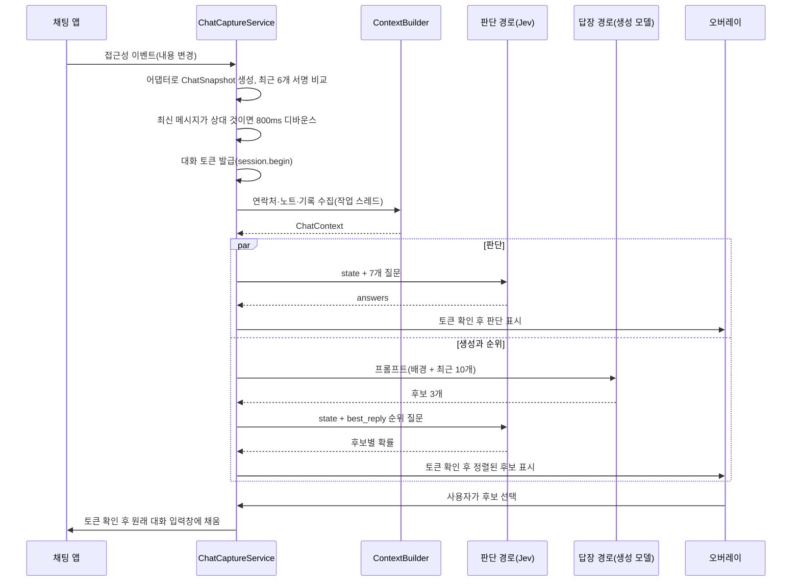

# Jev Chat Assistant 판단 파이프라인 깊이 보기

> 이 앱의 핵심인 "판단 → 생성 → 순위" 파이프라인을 소스 코드 기준으로 따라갑니다. 7개 판단 질문이 어떻게 설계되었는지, 한 번의 분석이 어떤 순서로 실행되는지, 실패와 늦게 도착한 결과를 어떻게 다루는지, 질문을 어떻게 보정하는지 다룹니다.

## 왜 판단을 먼저 하는가

### 한 줄로 구분하면

생성 모델은 **말을 만들고**, 판단 모델은 **조건에 맞는 것을 고릅니다**. 이 앱은 "상황 읽기"를 고르는 문제로 바꿔 판단 모델에 맡기고, 말 만들기만 생성 모델에 맡깁니다.

"상대가 서운한가?"를 생성 모델에게 물으면 대답은 문장입니다. 그 문장을 다시 파싱해야 하고, "약간 서운해 보이지만 단정하기 어렵습니다" 같은 답에서 분기 조건을 뽑기도 어렵습니다. 같은 질문을 Jev의 `choice`로 바꾸면 답은 `"confirm_you_care"`라는 키 하나와 각 선택지의 확률, 그리고 신뢰도입니다. 코드는 이 값으로 배지 색을 정하고, 신뢰도가 낮으면 흐리게 표시하고, 순위 질문의 기준으로 삼을 수 있습니다.

### 세 단계의 역할

| 단계 | 담당 모델 | 입력 | 출력 | 실패하면 |
|---|---|---|---|---|
| 판단 | Jev (판단 경로) | 최근 10개 메시지 + 관계 + 배경 + 기록, 7개 질문 | 질문별 타입이 있는 답 | 패널에 오류 표시. 후보 쪽은 계속 진행 |
| 생성 | OpenAI 호환 모델 (답장 경로) | 같은 메시지와 배경을 문장으로 풀어 쓴 프롬프트 | 후보 3개(JSON 배열) | 후보 영역에 오류 표시. 판단 쪽은 계속 진행 |
| 순위 | Jev (판단 경로) | 같은 state + 후보 3개를 선택지로 한 질문 | 후보별 확률 | 후보 영역에 오류 표시 |

판단과 "생성 → 순위"는 서로 독립된 두 작업으로 동시에 실행됩니다. 한쪽이 실패해도 다른 쪽 결과는 그대로 표시됩니다.

---

## 7개 판단 질문

`JevQuestions.judge()`가 매 요청마다 새로 만드는 질문 세트입니다. Python 보정 도구(`tools/jev/questions.py`)에서 보정을 통과한 문구를 그대로 옮겨 왔습니다.

| 질문 ID | 유형 | 묻는 것 | 설계 포인트 |
|---|---|---|---|
| `literal_question` | noul | 상대의 최신 메시지가 속뜻 없이 말 그대로인가 | 문장 하나가 아니라 대화 전체로 판단하라고 명시 |
| `true_intent` | choice (6개) | 진짜 의도: 신경 쓰는지 확인 / 감정 발산 / 행동 요구 / 설명 요구 / 가벼운 대화 / 주제 마무리 | "헤어지자, 연락하지 마"는 마무리가 아니라 감정 발산이라고 못 박음 |
| `danger_level` | score (10단계) | 다툼이나 관계 손상에 얼마나 가까운가 | 모든 단계를 구체적인 장면으로 서술, 최후통첩이 철회되지 않았으면 높은 단계 유지 |
| `should_reply_now` | noul | 다음 메시지에 실질적인 내용(잘못 인정, 구체적 계획, 아는 사실 설명)을 담아야 하는가 | "아무 메시지나 보낼까"가 아님을 명시, 필요한 사실이 대화 조각에 없으면 거짓 |
| `best_action` | choice (7개) | 다음 행동 유형: 기록 확인 / 사과 / 약속 / 설명 / 공감 표시 / 말 줄이기 / 계획 제안 | 타이밍은 무시하고 행동 유형만 고르라고 명시 |
| `she_needs` | choice (5개) | 상대가 지금 원하는 것: 사과 / 행동 / 설명 / 관심 / 아무것도 | 진심으로 받아들였다면 반드시 nothing, 비꼬는 "괜찮아"는 nothing이 아님 |
| `tension_resolved` | noul | 긴장이 이미 풀렸는가 | 답하지 않은 시험, 남은 비난, 열린 최후통첩이 있으면 거짓 |

`danger_level`은 Score 단계가 10개이므로 응답 점수는 0~9 범위의 확률 가중값입니다. 앱은 이 값을 반올림해 배지 숫자와 색을 정하고, 최대값은 응답의 `legend`에서 가장 큰 키로 계산합니다(문서에서 "1~9"로 표기한 부분이 있지만 질문 정의상 0부터 시작합니다).

### 질문 설계 원칙

질문 문구에는 초기 실험에서 얻은 교훈이 그대로 남아 있습니다.

**질문끼리 같은 축을 묻지 않습니다.** 초기 버전에서는 "지금 바로 답해야 하나"가 0.77, "먼저 기록을 확인하라"가 0.60으로 서로 반대 방향을 가리켰습니다. 그래서 `should_reply_now`는 "실질적인 내용을 담을 것인가"로 범위를 좁히고, `best_action`에서는 "지금 보낼지" 차원을 빼고 행동 유형만 남겼습니다.

**"없음" 선택지를 명시적으로 둡니다.** 대화가 끝났는데 "상대가 원하는 것: 행동"이 0.62로 "아무것도"(0.38)를 이긴 사례가 있었습니다. `she_needs`에 `nothing`을 두고 "상대가 진심으로 받아들였다면 앞에서 무엇을 원했든 nothing"이라는 조건을 질문 안에 넣었습니다.

**질문은 영어로, 대화는 원문으로 둡니다.** Jev의 주 학습 언어가 영어라서 지시문과 선택지 설명은 영어로 쓰고, `state`의 메시지는 번역하지 않습니다. 순위 질문만 예외로, 선택지 값이 곧 후보 문장이므로 원문 그대로 들어갑니다.

**배경 정보가 감점 요인이 되지 않게 합니다.** 모든 질문 끝에 `" Facts given in background are provided context, not off-topic."`이 붙습니다. 이 문장이 없으면 모델이 대화와 직접 관련 없어 보이는 배경을 "주제에서 벗어난 내용"으로 취급할 수 있습니다.

**Score 단계는 정도가 아니라 장면으로 씁니다.** "약간 위험"이 아니라 "비꼬는 말, 차갑고 짧은 답장, '알아서 해'. 대충 답하면 악화된다"처럼 관찰 가능한 장면을 적습니다. TypeSafe 문서도 Score 단계를 구체적으로 쓰라고 권장합니다.

판단 모델의 알려진 약점도 질문 설계에 영향을 줍니다. TypeSafe가 공개한 `jev-1.13`의 한계 목록에는 "지시문을 문자 그대로 읽는다", "Choice 선택지 순서에 따라 첫 번째 선택지 쪽으로 기우는 경우가 있다", "state를 적대적으로 취급하지 않는다" 등이 있습니다. 질문 안에 예외 조건을 길게 적어 둔 것은 "모델이 의도를 알아서 짐작해 주지 않는다"는 전제 때문입니다.

---

## state 구조

`JevQuestions.buildState`가 만드는 판단 대상 데이터입니다.

```json
{
  "chat": {
    "relationship": "사용자가 설정한 관계 설명",
    "messages": [ { "from": "other", "text": "..." }, { "from": "me", "text": "..." } ],
    "latest_from": "other"
  },
  "background": "관계, 연락처 메모, 매칭된 노트 (있을 때만)",
  "history": [ { "from": "me", "text": "..." } ]
}
```

- `messages`는 화면에서 읽은 메시지 중 **최근 10개**만 담습니다. 오래된 맥락은 `history`로 보완합니다.
- `latest_from`을 따로 두어 "누가 마지막으로 말했는가"를 질문들이 명확히 참조할 수 있게 합니다.
- `background`와 `history`는 비어 있으면 **필드 자체를 생략**합니다. 지식베이스를 쓰지 않는 요청은 이전 버전과 같은 본문이 되어, 새 필드가 판단 품질에 미치는 영향을 비교하기 쉽습니다.

---

## 한 번의 분석이 실행되는 순서



1. **이벤트 걸러 내기**: 최근 6개 메시지로 만든 서명이 직전과 같으면 아무것도 하지 않습니다. 내용은 같은데 플로팅 버튼만 사라졌다면(시스템이 프로세스를 정리한 경우 등) 버튼만 다시 띄우고 재분석하지 않습니다. 토큰과 시간을 아끼기 위해서입니다.
2. **트리거 조건**: 최신 메시지가 상대 것이고 자동 분석이 켜져 있을 때만 분석을 예약합니다. 내가 보낸 메시지로는 분석이 시작되지 않습니다.
3. **디바운스**: 새 메시지 하나에도 내용 변경 이벤트가 연달아 들어오므로 800ms 동안 조용해질 때까지 기다립니다.
4. **맥락 수집**: 파일 I/O가 있는 `ContextBuilder`는 메인 스레드가 아니라 작업 스레드에서 실행합니다.
5. **병렬 실행**: 스레드 두 개짜리 풀에 판단 작업과 "생성 → 순위" 작업을 동시에 넣습니다.
6. **결과 표시**: 각 결과는 메인 스레드로 돌아와 대화 토큰을 확인한 뒤에만 표시됩니다.

---

## 실패를 다루는 방법

### HTTP 계층

세 경로 모두 공통 도우미 `HttpJson.post`를 거칩니다.

| 상황 | 처리 |
|---|---|
| 429(한도 초과), 529(과부하) | 최대 3회, 지수 백오프로 재시도 |
| 그 밖의 4xx | 재시도하지 않고 즉시 실패(키 오류에 재시도해 봐야 소용없음) |
| 네트워크 오류, 5xx | 재시도 후 실패 |
| 오류 본문이 비었거나 읽다 실패 | 상태 코드를 잃지 않도록 상태 코드부터 확인 |
| 오류 메시지 | "판단 인터페이스 HTTP 401: (응답 앞 120자)"처럼 어느 경로의 무슨 오류인지 표시, 키는 절대 포함하지 않음 |

연결 15초, 읽기 40초 타임아웃이 있고, 작업이 취소되면(대화가 바뀐 경우) 다음 시도 전에 중단합니다.

### 판단 계층

- **판단은 예외를 던지지 않고 결과에 오류를 담아 돌려줍니다.** 패널은 오류 문구를 보여 주고, 후보 작업은 영향을 받지 않습니다.
- **배경 필드에 대한 방어적 재시도**: `background`·`history`가 붙은 요청이 4xx로 거절되면, 두 필드를 빼고 한 번 더 보냅니다. 판단 서비스가 새 필드를 받아들이는지 확실하지 않던 시점에 넣은 장치로, "검증되지 않은 필드 때문에 분석 전체가 깨지는 일"을 막습니다.

### 생성 계층

생성 모델이 JSON 배열 형식을 지키지 않을 수 있습니다. 응답에서 첫 `[`부터 마지막 `]`까지를 잘라 파싱하고, 실패하면 줄 단위로 나눠 번호와 기호를 떼어 냅니다. 3개가 안 되면 "잠깐만, 확인해 볼게" 의미의 중국어 기본 문구로 빈자리를 채웁니다.

---

## 대화 바인딩: 늦게 도착한 결과를 버리는 방법

분석에는 1초 이상 걸리고, 그 사이 사용자는 다른 대화로 옮길 수 있습니다. 2026-09-25에 병합된 수정 이전에는 늦게 도착한 판단이 새 대화의 패널에 표시되거나, 후보가 다른 사람과의 대화 입력창에 들어갈 위험이 있었습니다.

### 대화 대상과 토큰

```kotlin
// capture/ConversationSession.kt (요약)
internal class ConversationSession {
    data class Target(val pkg: String, val windowId: Int, val title: String?, val messagesSignature: String? = null)
    data class Token(val target: Target, val revision: Long)

    var target: Target? = null
        private set
    private var revision = 0L

    fun observe(next: Target?): Boolean {      // 대상이 바뀌면 버전 증가
        if (target == next) return false
        target = next; revision++; return true
    }
    fun begin(): Token? { revision++; return target?.let { Token(it, revision) } } // 새 분석마다 버전 증가
    fun accepts(token: Token) = token.target == target && token.revision == revision
}
```

1. **대상은 네 가지로 식별합니다.** 앱 패키지, 창 id, 대화 제목, 메시지 서명입니다. 다른 앱에 같은 이름의 대화가 있어도, 같은 대화에 새 메시지가 와도 다른 대상이 됩니다.
2. **분석을 시작할 때마다 버전을 올립니다.** 같은 대화에서 분석을 다시 시작하면 이전 분석의 토큰은 무효가 됩니다.
3. **돌아와도 되살아나지 않습니다.** A 대화 → B 대화 → 다시 A 대화로 와도 버전이 이미 올라갔으므로, 처음 A에서 시작한 분석 결과는 받아들여지지 않습니다. 이 동작은 `ConversationSessionTest`에 테스트로 고정되어 있습니다.

결과를 표시하기 직전과 입력창에 쓰기 직전에 서비스는 토큰을 확인하고, 추가로 **현재 화면을 다시 읽어** 대상이 같은지 확인합니다. 다르면 결과를 버리고 패널을 숨깁니다.

### 안전한 입력 순서

`GuardedInputWriter`는 입력을 다음 순서로 시도하고, **매 단계마다 입력창을 다시 찾습니다.** 다시 찾는 함수가 토큰을 확인하므로, 중간에 대화가 바뀌면 즉시 멈춥니다.

```text
SET_TEXT → 150ms 뒤 확인 ── 같으면 성공
              └ 다르면 → 클릭으로 포커스 → 300ms 뒤 SET_TEXT 재시도 → 150ms 뒤 확인 ── 같으면 성공
                                                              └ 다르면 → 클립보드 복사 → 입력창 비우기 → PASTE → 150ms 뒤 확인
```

`Thread.sleep` 대신 메인 스레드 핸들러의 지연 실행을 써서 화면이 멈추지 않게 합니다. 끝내 실패하면 클립보드에 남겨 두고 "길게 눌러 붙여 넣으세요"라고 안내합니다.

---

## 질문을 보정하는 방법

질문 문구는 감으로 고친 것이 아니라 라벨링한 대화 세트로 보정했습니다. `tools/jev/`에 PC에서 실행하는 Python 도구가 있습니다(표준 라이브러리만 사용, 키는 환경 변수로만 읽고 출력에서 가림).

```bash
export OPENROUTER_API_KEY=...        # 파일에 쓰지 않음
python tools/jev/calibrate.py --limit 5   # 앞 5건만 시험
python tools/jev/calibrate.py             # 전체 라벨 세트
```

- 라벨 세트(`fixtures/labeled_set.json`, 30건)는 연인 다툼, 명백한 분노, 이미 만족한 상대, 가벼운 잡담, 동료의 독촉, 친구의 약속, 비꼬는 말, 최후통첩 등 상황을 고루 담고, 위험 등급 0~9를 모두 포함하도록 만들어졌습니다.
- 요청은 한도에 걸리지 않도록 직렬로 0.3초 간격을 두고 보냅니다.
- 질문별 적중률, 위험 등급의 평균 절대 오차, 평균 신뢰도, 평균 지연, 총비용을 표로 출력하고 상세 내역을 보고서 파일로 남깁니다.
- 프로젝트의 합격 기준은 위험 등급 평균 절대 오차 1단계 미만, 진짜 의도와 원하는 것 적중률 60% 이상입니다.

README가 "중국어 대화의 판단 품질을 높이려면 자기 대화로 라벨을 만들어 보정하라"고 권하는 것도 이 도구를 가리킵니다. 질문을 바꾸려면 Python 쪽에서 보정을 통과시킨 뒤 Kotlin의 `JevQuestions`에 같은 문구로 옮기는 순서를 지키는 것이 안전합니다.

---

[← 장단점과 대안 비교](06-comparison.md) · [목차](README.md) · [주의할 점과 FAQ →](08-pitfalls-faq.md)
