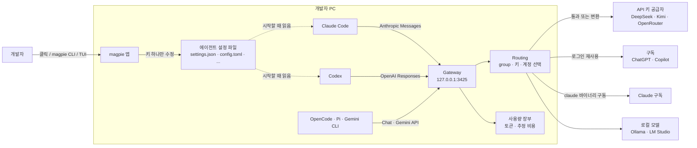

# magpie 핵심 개념과 동작 구조

> magpie를 이루는 Agent, Provider, `provider/model` 카탈로그, Gateway, 로그인한 구독, Routing group, Profile, Library가 각각 무엇이고 어떻게 맞물려 동작하는지 다룹니다.

## 용어 한눈에 보기

| 키워드 | 설명 |
|---|---|
| Agent | PC에 설치된 AI 코딩 도구. Claude Code, Codex, Gemini CLI, OpenCode, Pi, Goose 등 40여 종(2026년 10월 기준) |
| Provider | 모델을 실제로 제공하는 곳. API 키 공급자(DeepSeek, Kimi 등), 로컬 서버(Ollama), 로그인한 구독(Claude, ChatGPT, Copilot) |
| Preset | magpie가 미리 알고 있는 공급자. 키만 넣으면 엔드포인트와 모델 목록이 채워짐 |
| `provider/model` | magpie 카탈로그의 모델 이름 형식. 예: `deepseek/deepseek-chat`, `codex/gpt-5.5` |
| Gateway | `127.0.0.1:3425`에서 네 가지 LLM API를 받아 공급자에게 전달하는 로컬 서버 |
| Routing group | 여러 모델·키·계정을 `group/<id>` 하나로 묶어 요청을 나눠 보내는 단위 |
| Profile | 모든 에이전트의 현재 설정을 이름으로 저장한 스냅숏 |
| Library | 지침(instructions), MCP 서버, Skill을 한 번 등록해 여러 에이전트에 나눠 주는 저장소 |

---

## 1. Agent와 설정 파일 편집

### 쉽게 설명하면

집에 TV, 에어컨, 셋톱박스 리모컨이 따로 있는 상황에서, 모든 기기를 하나로 조작하는 통합 리모컨과 같습니다. 통합 리모컨은 기기마다 다른 신호 방식을 알고 있어서, 사용자는 "채널 7"만 누르면 됩니다.

### 개발 관점에서는

magpie는 지원하는 에이전트마다 **설정 파일 위치, 형식, 바꿀 수 있는 필드**를 알고 있습니다. 시작할 때 설치되었거나 설정 파일이 있는 에이전트만 찾아서 보여 줍니다.

| Agent | 설정 파일 | 바꿀 수 있는 필드 |
|---|---|---|
| Claude Code | `~/.claude/settings.json` | provider, model, opus/sonnet/haiku 계층별 모델 |
| Codex | `~/.codex/config.toml` | provider, model, effort |
| Gemini CLI | `~/.gemini/settings.json`, `~/.gemini/.env` | auth, model |
| OpenCode | `~/.config/opencode/opencode.json(c)` | model, small |
| Goose | `~/.config/goose/config.yaml` | model |
| Crush | `~/.config/crush/crush.json` | large, small |

편집 방식에는 세 가지 원칙이 있습니다.

- **바꾸는 키만 고칩니다.** `internal/edit` 패키지가 JSON·JSONC·TOML·YAML·`.env`를 형식별로 다루며, 주석·키 순서·들여쓰기를 보존합니다. 파일을 통째로 다시 직렬화하지 않습니다.
- **쓰기는 atomic입니다.** 중간에 실패해도 반쯤 쓰인 설정 파일이 남지 않습니다.
- **원래 값을 보관합니다.** magpie가 에이전트를 게이트웨이로 돌릴 때 덮어쓴 값(예: 원래 `ANTHROPIC_BASE_URL`)은 `~/.config/magpie/stash.json`에 저장해 두었다가, `magpie <agent> default`로 되돌릴 때 그대로 복원합니다.

### 예제

Claude Code를 게이트웨이 모델로 바꾸면 `settings.json`에 들어가는 주요 키는 다음과 같습니다(실제로는 opus·sonnet·haiku 계층별 모델 변수도 함께 들어갑니다).

```json
{
  "model": "deepseek/deepseek-chat",
  "env": {
    "ANTHROPIC_BASE_URL": "http://127.0.0.1:3425",
    "ANTHROPIC_AUTH_TOKEN": "magpie",
    "ANTHROPIC_SMALL_FAST_MODEL": "deepseek/deepseek-chat"
  }
}
```

공급자 키는 들어가지 않습니다. Claude Code는 게이트웨이에 `magpie`라는 토큰으로 접속하고, 실제 키는 magpie만 갖고 있습니다. `opus`, `sonnet` 같은 네이티브 모델을 다시 고르면 이 키들을 지우고 보관해 둔 원래 값을 되돌립니다.

Codex는 ChatGPT로 로그인되어 있는지에 따라 쓰는 방식이 다릅니다. 로그인되어 있으면 `openai_base_url`만 게이트웨이로 바꿔서 Codex의 기본 OpenAI 공급자와 로그인을 그대로 유지하고, 그렇지 않으면 `[model_providers.magpie]` 테이블(`wire_api = "responses"`)과 모델 카탈로그 파일(`~/.codex/magpie-models.json`)을 추가해 magpie를 별도 공급자로 등록합니다.

### 핵심

> magpie는 설정 파일의 "주인"이 되지 않습니다. 필요한 키만 빌려 쓰고, 빌린 키는 원래 값과 함께 기록해 두었다가 돌려줍니다.

## 2. Provider와 Preset

### 쉽게 설명하면

음식 배달 앱의 "가게 목록"과 같습니다. 유명한 가게(Preset)는 이미 등록되어 있어서 계정만 연결하면 되고, 동네 작은 가게(사용자 정의 공급자)는 이름과 주소만 직접 적으면 됩니다.

### 개발 관점에서는

Provider는 모델 요청을 실제로 처리하는 대상입니다. 네 종류가 있습니다.

- **Preset 공급자**: Anthropic, OpenAI, Gemini, DeepSeek, Kimi, GLM, MiniMax, Qwen, Mistral, Groq, xAI, OpenRouter, Together, Fireworks, SiliconFlow 등. 키만 있으면 엔드포인트와 모델 목록이 채워집니다.
- **로컬 서버**: Ollama, LM Studio. 키가 필요 없습니다.
- **사용자 정의 공급자**: 이름과 base URL만 있으면 됩니다. OpenAI 호환(`url=`), Anthropic 호환(`anthropic=`), 별도 Responses 엔드포인트(`responses=`)를 각각 지정할 수 있습니다.
- **로그인한 구독**: 아래에서 따로 다룹니다.

magpie는 **셸 환경 변수의 키를 읽지 않습니다.** `OPENAI_API_KEY`가 셸에 있어도 자동으로 쓰지 않고, 명시적으로 추가한 키만 `~/.config/magpie/providers.json`(권한 0600)에 저장해 씁니다.

### 예제

```bash
magpie presets                              # 아는 공급자 목록: vendors, relays, local
magpie provider add deepseek sk-...         # Preset은 키만
magpie provider add ollama                  # 로컬 서버는 키 없이
magpie provider add "My Relay" url=https://relay.example.com/v1 key=sk-... models=gpt-5.5,claude-sonnet-5
magpie provider test deepseek               # API마다 작은 요청 하나로 지연 시간 확인
```

### 핵심

> Provider는 "어디서 모델을 가져오는가"입니다. 키는 magpie에만 있고, 에이전트는 공급자를 직접 알지 못합니다.

## 3. `provider/model` 카탈로그

### 쉽게 설명하면

도서관의 청구 기호와 같습니다. 같은 책 제목이라도 어느 서가에 있는지까지 적어야 정확히 찾을 수 있습니다.

### 개발 관점에서는

magpie에서 모든 모델은 `provider/model` 형식으로 부릅니다. 같은 `claude-sonnet-5`라도 Anthropic 키로 부르면 `anthropic/claude-sonnet-5`, Copilot 구독으로 부르면 `copilot/claude-sonnet-4.5`처럼 공급자가 이름에 들어갑니다. 그래서 "같은 모델을 어느 경로로 부를지"가 이름만 보고 분명해집니다.

카탈로그는 컴파일 시점에 고정되어 있지 않습니다.

1. 키가 있으면 공급자에게 직접 모델 목록을 물어봅니다.
2. [models.dev](https://models.dev) 카탈로그로 사람이 읽을 이름, 지원하는 reasoning 단계, 가격, context window를 보완합니다.
3. 목록 API가 없는 공급자는 models.dev 목록을 그대로 씁니다.

오늘 아침 나온 모델도 다음 갱신(`magpie sync`) 때 선택지에 나타나는 이유입니다. 공급자별로 어떤 모델을 노출할지 고를 수 있고, 에이전트별로 선택지에서 특정 모델을 숨길 수도 있습니다.

### 예제

```bash
magpie models                         # 에이전트가 보는 전체 카탈로그
magpie models codex                   # Codex가 볼 수 있는 모델과, 못 보는 모델은 왜 못 보는지
magpie provider models deepseek       # 공급자 목록 다시 가져오기
magpie sync                           # models.dev와 모든 공급자 목록 갱신
```

### 핵심

> 모델 이름에 공급자가 들어가 있으므로, 같은 모델을 여러 경로로 부를 수 있고 비용과 사용량도 경로별로 따로 계산됩니다.

## 4. Gateway (통과와 변환)

### 쉽게 설명하면

국제회의의 동시통역 부스와 같습니다. 같은 언어를 쓰는 사람끼리는 통역 없이 바로 이야기하고(통과), 언어가 다를 때만 통역사가 끼어듭니다(변환).

### 개발 관점에서는

Gateway는 magpie 앱과 함께 시작되는 로컬 HTTP 서버입니다. 기본 주소는 `127.0.0.1:3425`이고 `MAGPIE_ADDR`로 바꿀 수 있으며, `magpie serve`로 게이트웨이만 따로 실행할 수도 있습니다.

| 경로 | API |
|---|---|
| `/v1/chat/completions` | OpenAI Chat Completions |
| `/v1/responses` | OpenAI Responses |
| `/v1/messages` | Anthropic Messages |
| `/v1/messages/count_tokens` | Anthropic 토큰 계산 |
| `/v1beta/models/{model}:generateContent` | Google Gemini (`:streamGenerateContent`, `:countTokens` 포함) |
| `/v1/models`, `/v1beta/models` | 카탈로그 |

요청이 들어오면 게이트웨이는 모델 이름에서 공급자를 찾고, **공급자가 에이전트와 같은 API로 그 모델을 제공하면 그대로 통과**시킵니다. 이때 모델 이름만 공급자가 아는 이름으로 바꿉니다. 같은 API가 없으면 요청을 공통 중간 표현으로 파싱한 뒤 공급자의 API 형식으로 다시 만들어 보내고, 스트리밍 응답도 이벤트 단위로 에이전트의 형식에 맞춰 돌려줍니다. 텍스트뿐 아니라 tool call, reasoning(thinking), 이미지, 웹 검색 결과까지 변환 대상입니다.

로컬에서만 듣고 있는 동안에는 **어떤 키 값이든 받습니다.** 관례적으로 `magpie`를 씁니다. 다른 컴퓨터와 공유할 때는 gateway key가 필요해지며, [팀 공유 게이트웨이와 운영](05-usage-shared-gateway.md)에서 다룹니다.

### 예제

```bash
# 게이트웨이를 아는 어떤 도구든 base URL만 바꾸면 된다
export OPENAI_BASE_URL=http://127.0.0.1:3425/v1
export OPENAI_API_KEY=magpie

curl -s http://127.0.0.1:3425/v1/chat/completions \
  -H "Authorization: Bearer magpie" \
  -H "Content-Type: application/json" \
  -d '{"model":"deepseek/deepseek-chat","messages":[{"role":"user","content":"ping"}]}'
```

통과와 변환을 어떻게 결정하는지는 [게이트웨이 내부](07-gateway-routing.md)에서 소스 코드와 함께 자세히 다룹니다.

### 핵심

> 에이전트는 자기가 아는 API 하나로만 말하고, 공급자가 다른 API를 쓰는 차이는 게이트웨이가 흡수합니다.

## 5. 로그인한 구독을 공급자로

### 쉽게 설명하면

이미 끊어 둔 헬스장 회원권을 다른 지점에서도 쓸 수 있게 해 주는 것과 같습니다. 새 회원권을 사지 않고, 가진 회원증을 그대로 보여 줍니다.

### 개발 관점에서는

Claude Code(OAuth 로그인), Codex(ChatGPT 로그인), Copilot(GitHub 로그인), Devin, Qoder 등에 로그인해 두면, magpie는 그 로그인을 **공급자로 보여 줍니다.** 모델은 `claude/claude-sonnet-5`, `codex/gpt-5.5`, `copilot/claude-sonnet-4.5`처럼 부릅니다.

- magpie는 키를 복사해 두지 않고 **매 요청마다 에이전트의 자격 증명 파일을 읽습니다.** 토큰이 갱신되면 에이전트가 찾을 수 있는 위치에 다시 써 줍니다.
- 에이전트에서 로그아웃하면 그 공급자도 사라집니다.
- Claude 구독은 방식이 다릅니다. Anthropic이 다른 에이전트의 시스템 프롬프트를 제3자 트래픽으로 분류하기 때문에, magpie는 **로컬에 설치된 진짜 `claude` 바이너리를 직접 구동**하고, 호출한 에이전트의 도구는 MCP로 연결합니다. 그래서 Claude 구독을 쓰려면 Claude Code가 설치되어 로그인되어 있어야 합니다.
- Google 계정(Gemini CLI, Antigravity)은 Code Assist API를 씁니다. Gemini CLI 로그인은 이제 개인 계정이 아니라 Gemini Code Assist Standard·Enterprise에만 제공되며 Google Cloud 프로젝트 지정이 필요합니다.

### 예제

```bash
magpie providers                      # "signed in as ..."로 표시되는 구독 공급자 확인
magpie opencode codex/gpt-5.5         # ChatGPT 구독 모델을 OpenCode에서
magpie accounts                       # 구독별 남은 할당량과 리셋 시각
magpie accounts add codex             # ChatGPT 계정 하나 더 추가
```

### 핵심

> 구독 공급자는 편리하지만 공급자 정책의 영향을 직접 받습니다. 계정 정지 위험과 약관 문제는 [주의할 점과 FAQ](08-pitfalls-faq.md)에서 다룹니다.

## 6. Routing group

### 쉽게 설명하면

콜센터의 자동 상담원 배정과 같습니다. 고객은 대표 번호 하나로 전화하고, 시스템이 지금 여유 있는 상담원에게 연결합니다. 상담 중이던 고객이 다시 전화하면 가능하면 같은 상담원에게 연결합니다.

### 개발 관점에서는

Routing group은 여러 모델(한 공급자든 여러 공급자든)을 `group/<id>` 하나로 묶은 것입니다. 에이전트는 그룹을 모델처럼 고르고, 게이트웨이가 요청마다 멤버의 키와 계정 전체를 대상으로 누구에게 보낼지 정합니다. 두 공급자가 같은 이름의 모델을 제공하면 magpie가 자동으로 그룹을 만들기도 합니다.

| 설정 | 값 | 의미 |
|---|---|---|
| `routing=` | `smart`(기본) | 할당량이 남은 구독 중 리셋이 가장 빨리 오는 것부터 |
| | `order` | 첫 멤버가 실패할 때까지 쓰고, 그다음 멤버로 |
| | `rotate` | 턴마다 다음 멤버로 |
| | `usage` | 최근 사용량이 가장 적은 것부터 |
| | `pace` | 주간 할당량 대비 남은 비율이 가장 큰 계정부터 |
| `stays=` | `auto`(기본) | 공급자의 프롬프트 캐시가 유지할 가치가 있는 동안 같은 키·계정에 머묾 |
| | `session` / `turn` / `off` | 세션 내내 / 한 턴 동안만 / 머물지 않음 |

### 예제

```bash
magpie group add "Opus anywhere" \
  models=claude/claude-opus-5-5,copilot/claude-opus-5.5 \
  routing=order stays=session
magpie claude group/opus-anywhere     # 그룹을 모델처럼 사용
magpie groups                         # 직접 만든 그룹과 magpie가 찾은 그룹
```

### 핵심

> Routing group은 "어떤 모델을"이 아니라 "이 모델들 중 지금 누가"를 정합니다. 할당량 소진, 장애, 캐시 유지까지 고려해 요청을 나눕니다.

## 7. Profile과 Library

### 쉽게 설명하면

Profile은 자동차 운전석의 "메모리 시트" 버튼입니다. 1번을 누르면 내 자세, 2번을 누르면 가족의 자세로 한 번에 돌아갑니다. Library는 모든 직원에게 같은 사내 매뉴얼과 도구 상자를 나눠 주는 비품실입니다.

### 개발 관점에서는

- **Profile**: 모든 에이전트의 현재 설정(모델, effort 등)을 이름으로 저장하고 한 번에 되돌립니다. `~/.config/magpie/profiles.json`에 저장됩니다.
- **Library**: 에이전트가 대화 전에 읽는 지침, 호출할 수 있는 MCP 서버, 로드할 수 있는 Skill을 한 번 등록하면, magpie가 각 에이전트의 형식에 맞게 써 넣습니다. 지울 때는 **magpie가 쓴 것만** 가져가고 나머지 설정은 건드리지 않습니다. 최근에 빠르게 커지고 있는 기능입니다.

### 예제

```bash
magpie save work                              # 현재 모든 에이전트 설정을 "work"로 저장
magpie use work                               # 한 번에 되돌리기

magpie library instructions set ./AGENTS.md   # 공통 지침 등록
magpie library mcp add github npx -y @modelcontextprotocol/server-github agents=claude,codex
magpie library                                # 에이전트별로 무엇이 들어가 있는지
```

### 핵심

> Profile은 "모델 설정"의 묶음이고, Library는 "모델 밖의 공통 자산(지침·MCP·Skill)"의 묶음입니다.

---

## 8. 전체 동작 구조

magpie는 애플리케이션 코드에 import되는 라이브러리가 아니라, **에이전트와 모델 공급자 사이에 서는 로컬 프로세스**입니다.



한 번의 요청이 처리되는 순서는 다음과 같습니다.

1. **시작점**: 개발자가 `magpie codex deepseek/deepseek-chat`을 실행하면 magpie가 Codex의 `config.toml`에서 필요한 키만 고치고, 원래 값은 보관합니다. Codex는 시작할 때 설정을 읽으므로 이미 실행 중인 세션은 재시작해야 새 모델을 씁니다.
2. **magpie가 개입하는 시점**: Codex가 작업 중 모델을 호출하면, 요청은 OpenAI가 아니라 게이트웨이의 `/v1/responses`로 갑니다.
3. **내부 처리**: 게이트웨이가 모델 이름 `deepseek/deepseek-chat`에서 공급자를 찾습니다. 그룹이라면 Routing이 후보 순서를 정합니다. DeepSeek이 Responses API로 그 모델을 제공하지 않으므로, 요청을 중간 표현으로 파싱해 Chat Completions 형식으로 다시 만듭니다.
4. **외부 시스템과의 연결**: magpie가 저장해 둔 DeepSeek 키로 공급자에 스트리밍 요청을 보내고, 돌아오는 이벤트를 Responses 형식으로 바꿔 Codex에 흘려보냅니다. 실패하면 응답을 한 바이트도 보내기 전에 한해 다음 후보로 넘어갑니다.
5. **결과 반환**: Codex는 원래 OpenAI와 이야기하는 것처럼 답을 받습니다. 게이트웨이는 토큰 수, 응답한 모델, 사용한 키·계정, 추정 비용을 사용량 장부에 기록합니다.

---

[← 개요](README.md) · [설치와 첫 사용 →](02-getting-started.md)
