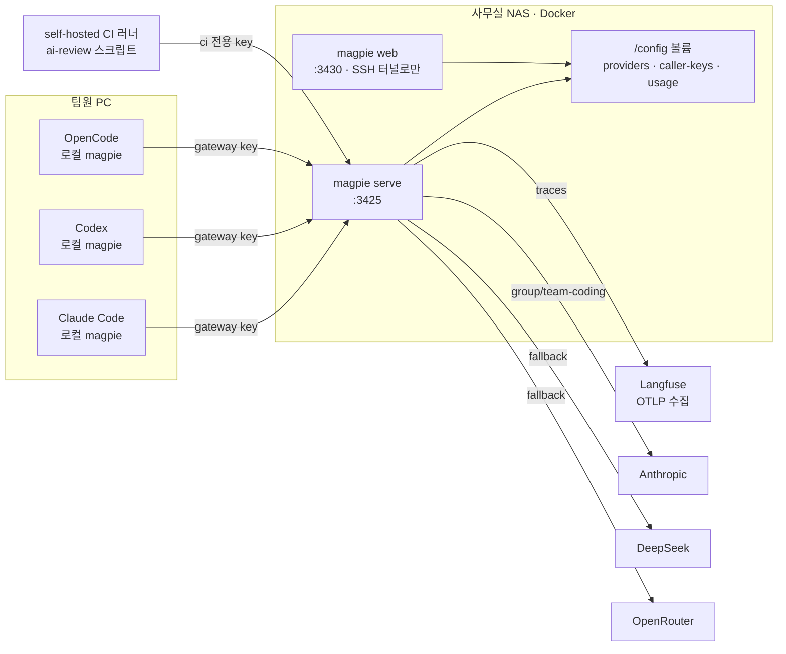

# magpie 활용 예시 ③ 팀 공유 게이트웨이와 운영

> magpie 하나를 여러 컴퓨터가 공유하는 방법, gateway key와 사용 한도, OTLP로 호출을 관측하는 방법, 그리고 소규모 팀에 실제로 도입하는 과정을 다룹니다.

## 팀·서버 환경에서의 활용

magpie는 서버 애플리케이션이 import하는 라이브러리가 아닙니다. 대신 **여러 개발자 PC와 자동화 작업이 함께 쓰는 게이트웨이**로 서버에 올릴 수 있습니다.

### 활용 사례

- **사무실 PC와 개인 노트북 공유**: 한 컴퓨터의 magpie를 *Settings → Share on local network*로 공유하고, 다른 컴퓨터에서는 그것을 `remote-magpie` 공급자로 추가합니다. 공급자·Routing group·사용량은 공유하는 쪽 것을 씁니다.
- **NAS·사내 서버의 헤드리스 게이트웨이**: Docker 이미지로 띄우고 브라우저 UI(`magpie web`)로 공급자를 설정합니다. 에이전트는 각자의 PC에서 실행되고 이 게이트웨이를 가리킵니다.
- **클라이언트별 키와 한도**: 공유를 켜면 gateway key가 필요해지며, 키마다 일·주·월 단위 토큰·비용 한도를 둘 수 있습니다.
- **관측**: OTLP/HTTP로 요청 메타데이터를 Langfuse 같은 수집기에 보내고, 라우팅 재시도와 Fallback을 span으로 볼 수 있습니다.
- **설정 동기화**: `magpie backup`은 공급자·설정·Profile·Library를 암호(AES-256-GCM, PBKDF2-SHA256)로 봉인하고, WebDAV나 S3 호환 저장소로 3분마다 여러 기기를 맞춥니다.

### 애플리케이션 구조

magpie가 "서버 코드의 어느 계층에 들어가느냐"가 아니라, **개발자 도구와 모델 공급자 사이의 어느 지점에 서느냐**로 보는 것이 맞습니다.

```text
개발자 PC의 에이전트 (Claude Code · Codex · OpenCode)
 ↓  base URL = 공유 게이트웨이, API 키 = 개인 gateway key
VPN / 사내망
 ↓
공유 magpie (Docker, NAS 또는 사내 서버)
 ├─ gateway key 검사 · 키별 한도
 ├─ Routing group · Fallback
 ├─ 사용량 장부 (키별 · 공급자별)
 └─ OTLP 내보내기 → Langfuse
 ↓
모델 공급자 (회사 API 키)
```

### 실제 코드

**gateway key 만들기와 한도 걸기**

```bash
magpie gateway-key add "alice-laptop"            # 새 키를 한 번만 출력
magpie gateway-key list                          # id · 이름 · 활성 여부 · 마스킹된 키
magpie gateway-key limit <id> week --tokens 2m --cost 5
magpie gateway-key limit <id>                    # 한도 · 사용량 · 남은 양 · 리셋 시각
magpie gateway-key rotate <id>                   # 이름과 사용 이력은 유지하고 키만 교체
```

한도를 넘은 키의 요청은 공급자에게 묻기 전에 거절되며, 각 API 형식에 맞는 429 오류와 `Retry-After`가 돌아갑니다. 키 하나가 한도에 걸려도 다른 키는 영향을 받지 않습니다. 키는 자기 상태를 `GET /v1/magpie/limit`로 확인할 수 있습니다.

**OTLP로 Langfuse에 보내기**

```bash
MAGPIE_OTEL_ENABLED=true \
MAGPIE_OTEL_ENDPOINT=https://langfuse.internal.example.com/api/public/otel \
MAGPIE_OTEL_HEADERS="Authorization=Basic%20<base64(public-key:secret-key)>" \
magpie serve
```

기본으로는 에이전트, 공급자, 모델, 토큰 수, 상태, 시간 같은 메타데이터만 나갑니다. 프롬프트와 응답 본문은 `MAGPIE_OTEL_BODIES=true`를 켰을 때만 비밀값을 가린 상태로 나가며, 공급자 계정 이름과 키는 내보내지 않습니다.

**계층별로 어떤 기능이 어울리는가**

| 위치 | 적절한 magpie 기능 | 이유 |
|---|---|---|
| 개발자 PC | 로컬 magpie + `remote-magpie` 공급자 | 각자의 에이전트 설정은 로컬 magpie가 고치고, 모델 호출은 공유 게이트웨이로 보냄 |
| 네트워크 경계 | gateway key, VPN, 루프백 publish | 공유 전 게이트웨이는 어떤 키든 받으므로 키 인증 없이 포트를 열면 안 됨 |
| 게이트웨이 | Routing group, `provider fallback` | 공급자 장애·할당량 소진을 클라이언트가 모르게 흡수 |
| 관측 | 사용량 장부, OTLP | 누가 얼마나 썼는지(gateway key)와 어디서 얼마나 썼는지(공급자 키)를 분리해 기록 |

---

## 실전 프로젝트 적용: 5인 에이전시 팀의 공유 게이트웨이

### 요구사항

다섯 명이 일하는 웹 에이전시가 magpie를 사내 공유 게이트웨이로 도입합니다.

- 사무실 NAS에서 magpie를 Docker로 운영하고, 원격 근무자는 Tailscale VPN으로 접속한다
- 팀원은 Claude Code, Codex, OpenCode를 섞어 쓴다
- 모델 비용은 회사 API 키(Anthropic, DeepSeek, OpenRouter)로만 나간다. 개인 구독은 공유 게이트웨이에 등록하지 않는다
- 팀원별 주간 비용 한도를 두고, 누가 얼마나 썼는지 매주 확인한다
- PR이 올라오면 사내 self-hosted CI 러너가 같은 게이트웨이로 자동 리뷰를 돌린다
- 기본 모델 공급자가 장애이면 자동으로 다른 공급자로 넘어간다

### 전체 구조



### 폴더 구조

```text
agency-infra/
├── magpie/
│   ├── compose.yaml            # NAS에서 실행할 magpie 서비스
│   ├── .env.example            # MAGPIE_WEB_KEY 등 (실제 .env는 커밋하지 않음)
│   └── config/                 # /config 바인드 마운트 (uid 65532가 쓸 수 있어야 함)
├── scripts/
│   ├── setup-dev.sh            # 팀원 PC 설정: remote-magpie 추가 + 에이전트 연결
│   └── ai-review.ts            # CI에서 PR diff를 리뷰하는 스크립트
├── .github/workflows/
│   └── ai-review.yml           # self-hosted 러너에서 실행
└── README.md
```

### 구현

**1. NAS의 magpie 서비스**

```yaml
# magpie/compose.yaml
services:
  magpie:
    image: ghcr.io/yetone/magpie:latest
    restart: unless-stopped
    ports:
      # 공유와 gateway key를 설정하기 전에는 루프백에만 연다
      - "127.0.0.1:3425:3425"
      - "127.0.0.1:3430:3430"
    environment:
      MAGPIE_ADDR: 0.0.0.0:3425
      MAGPIE_PUBLIC_URL: http://magpie-nas.tailnet.example:3425
      MAGPIE_WEB_KEY: ${MAGPIE_WEB_KEY}
      MAGPIE_OTEL_ENABLED: "true"
      MAGPIE_OTEL_ENDPOINT: https://langfuse.internal.example.com/api/public/otel
      MAGPIE_OTEL_HEADERS: ${MAGPIE_OTEL_HEADERS}
    volumes:
      - ./config:/config
    command: [web, --addr, 0.0.0.0:3430, --no-open]
```

```bash
sudo chown -R 65532:65532 ./magpie/config   # 컨테이너의 nonroot 사용자가 쓸 수 있게
docker compose -f magpie/compose.yaml up -d
```

이 설정으로 컨테이너는 브라우저 UI(`magpie web`)와 게이트웨이를 함께 실행합니다. 관리자는 SSH 터널로 `http://127.0.0.1:3430/?k=<MAGPIE_WEB_KEY>`에 접속해 회사 API 키를 공급자로 등록하고, *Share on local network*를 켭니다. 공유를 켜고 gateway key를 만든 **다음에야** `ports`의 3425를 Tailscale 인터페이스 주소로 바꿔 다시 띄웁니다.

**2. 라우팅 그룹과 Fallback**

```bash
docker exec -it magpie bash
magpie provider add anthropic sk-ant-...
magpie provider add deepseek sk-...
magpie provider add openrouter sk-or-...

# 팀 기본 코딩 모델: Anthropic 우선, 실패하면 OpenRouter의 같은 모델
magpie group add "Team coding" \
  models=anthropic/claude-sonnet-5,openrouter/anthropic/claude-sonnet-5 \
  routing=order stays=auto

# 저렴한 보조 모델
magpie group add "Team cheap" models=deepseek/deepseek-chat,openrouter/deepseek/deepseek-chat routing=order

for who in alice bob carol dave erin; do magpie gateway-key add "$who"; done
magpie gateway-key add "ci-review"
magpie gateway-key list    # 각 id에 주간 한도를 건다
```

**3. 팀원 PC 설정 스크립트**

```bash
#!/usr/bin/env bash
# scripts/setup-dev.sh  사용법: ./setup-dev.sh <본인 gateway key>
set -euo pipefail
KEY="$1"

# 공유 magpie를 공급자로 추가 (모델 id는 office/... 로 보인다)
magpie provider add remote-magpie "$KEY" url=http://magpie-nas.tailnet.example:3425 id=office

magpie claude office/group/team-coding
magpie claude haiku office/group/team-cheap
magpie opencode office/group/team-coding
magpie save agency
echo "완료. 실행 중인 에이전트는 새 세션을 열어야 적용됩니다."
```

**4. CI 자동 리뷰 스크립트**

```ts
// scripts/ai-review.ts
import { execSync } from 'node:child_process';
import OpenAI from 'openai';

const client = new OpenAI({
  baseURL: `${process.env.MAGPIE_URL}/v1`,
  apiKey: process.env.MAGPIE_CI_KEY!, // ci-review 전용 gateway key, 주간 한도가 걸려 있다
});

const diff = execSync(`git diff origin/${process.env.BASE_REF}...HEAD`, { encoding: 'utf8' }).slice(0, 80_000);

const res = await client.chat.completions.create({
  model: 'group/team-coding',
  messages: [
    { role: 'system', content: '리뷰어로서 버그, 보안 문제, 누락된 테스트만 지적한다. 없으면 "LGTM"만 출력한다.' },
    { role: 'user', content: diff },
  ],
});

console.log(res.choices[0]?.message.content ?? '');
```

```yaml
# .github/workflows/ai-review.yml
name: ai-review
on: [pull_request]

jobs:
  review:
    runs-on: [self-hosted, office]   # 사내망·VPN 안의 러너만 게이트웨이에 닿는다
    steps:
      - uses: actions/checkout@v4
        with:
          fetch-depth: 0
      - uses: actions/setup-node@v4
        with:
          node-version: 22
      - run: npm ci
      - run: npx tsx scripts/ai-review.ts > review.md
        env:
          MAGPIE_URL: http://magpie-nas.tailnet.example:3425
          MAGPIE_CI_KEY: ${{ secrets.MAGPIE_CI_KEY }}
          BASE_REF: ${{ github.base_ref }}
      - run: gh pr comment ${{ github.event.pull_request.number }} --body-file review.md
        env:
          GH_TOKEN: ${{ github.token }}
```

### 실제 실행 흐름

팀원 Bob이 Claude Code로 작업하는 상황을 예로 듭니다.

1. **사용자 행동**: Bob이 처음 한 번 `./scripts/setup-dev.sh <bob의 키>`를 실행합니다. 로컬 magpie가 Bob의 `~/.claude/settings.json`을 `office/group/team-coding`으로 바꾸고, 원래 값은 보관합니다.
2. **에이전트 요청**: Bob이 Claude Code 새 세션을 열고 작업을 시작하면, Anthropic Messages 요청이 Bob PC의 로컬 게이트웨이로 갑니다.
3. **원격 전달**: 로컬 magpie는 `office/` 모델을 `remote-magpie` 공급자로 인식하고, Bob의 gateway key를 붙여 NAS 게이트웨이에 같은 API 형식으로 전달합니다. API 변환이 필요하면 NAS 쪽에서 한 번만 일어납니다.
4. **인증과 한도**: NAS 게이트웨이는 Bob의 키가 활성 상태인지, 이번 주 한도가 남았는지 확인합니다. 한도를 넘었으면 공급자에게 묻지 않고 429와 리셋 시각을 돌려줍니다.
5. **라우팅과 Fallback**: `team-coding` 그룹이 `order` 규칙으로 Anthropic을 먼저 시도합니다. Anthropic이 과부하로 529를 돌려주면, 응답을 한 바이트도 보내기 전이므로 OpenRouter의 같은 모델로 넘어가고 Anthropic 키는 잠시 뒤로 밀려 쉽니다.
6. **기록과 관측**: 응답이 끝나면 사용량 장부에 Bob의 gateway key(호출자)와 OpenRouter 키(공급자 키)가 따로 기록되고, Langfuse에는 Anthropic 실패 시도와 OpenRouter 성공 시도가 한 trace의 자식 span으로 나타납니다.
7. **결과 반영과 정산**: 같은 날 PR이 올라오면 CI 러너가 `ci-review` 키로 같은 그룹을 써서 리뷰 코멘트를 남깁니다. 금요일에 관리자가 *Usage → Overview → Gateway keys*나 `magpie usage --csv 7d`로 팀원별·CI별 비용을 확인합니다.

---

[← 활용 예시 ② 내 코드에서 게이트웨이 쓰기](04-usage-gateway-clients.md) · [목차](README.md) · [장단점과 대안 비교 →](06-comparison.md)
