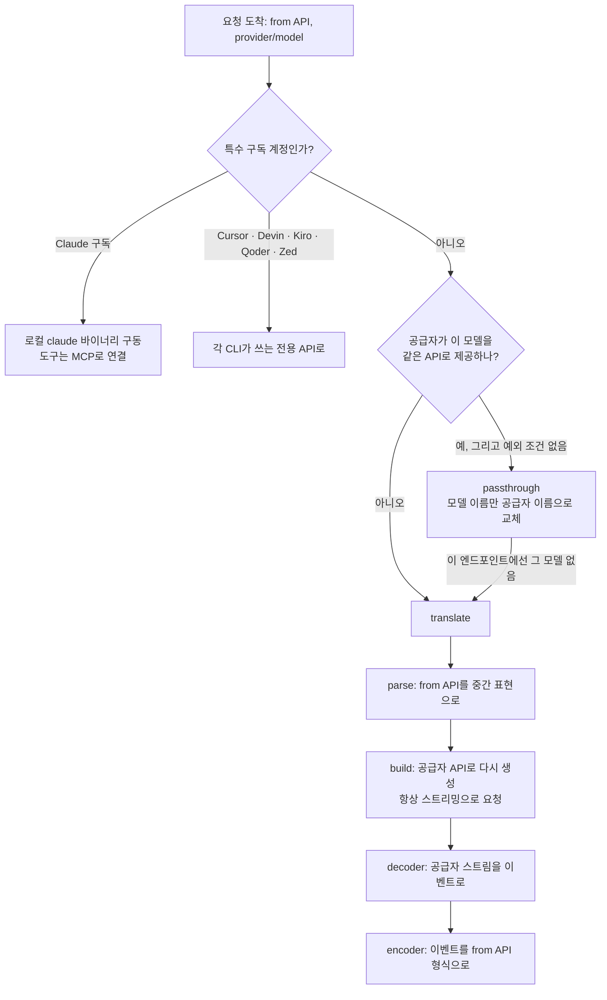
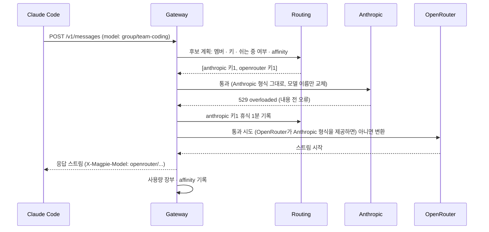

# magpie 게이트웨이 내부: 변환·라우팅·Fallback

> 게이트웨이가 요청 하나를 받아 "그대로 통과시킬지, 변환할지"를 어떻게 정하는지, 네 가지 API를 잇는 중간 표현이 어떻게 생겼는지, 그리고 Routing group이 후보를 고르고 실패를 넘기는 원리를 소스 코드(`internal/gateway`) 기준으로 다룹니다.

## 왜 게이트웨이를 알아야 하는가

magpie의 화면은 단순하지만, 실제로 일어나는 일 대부분은 게이트웨이 안에서 벌어집니다. "DeepSeek으로 바꿨더니 tool call이 이상하다", "그룹을 만들었는데 왜 이 계정만 쓰지?", "응답이 중간에 끊겼는데 왜 다른 모델로 안 넘어갔지?" 같은 질문의 답이 모두 여기에 있습니다.

게이트웨이가 하는 일은 세 가지로 나눌 수 있습니다.

| 단계 | 질문 | 담당 코드 |
|---|---|---|
| 후보 정하기 | 이 요청을 누구에게(어떤 공급자·키·계정·모델) 어떤 순서로 보낼까? | `fallback.go`, `routing.go`, `affinity.go` |
| 경로 정하기 | 그 후보에게 그대로 보낼까(통과), 다른 API로 바꿔 보낼까(변환)? | `gateway.go`의 `attempt`, `passthrough`, `translate` |
| 실패 넘기기 | 실패하면 다음 후보로 넘어가도 되나? 이 후보는 얼마나 쉬게 할까? | `fallback.go`의 `holdWriter`, `routing.go`의 휴식 규칙 |

---

## 통과와 변환: 경로를 정하는 규칙

### 한 줄로 구분하면

**통과(passthrough)는 모델 이름만 바꿔서 원본 요청을 그대로 전달하는 것**이고, **변환(translate)은 요청을 공통 중간 표현으로 풀었다가 공급자의 API로 다시 만드는 것**입니다.

통과는 원본을 거의 건드리지 않으므로 빠르고, 한쪽 API에만 있는 필드도 잃지 않습니다. 변환은 어떤 조합이든 연결할 수 있지만, 중간 표현에 담기지 않는 정보는 빠질 수 있습니다. 그래서 게이트웨이는 **가능하면 통과, 안 되면 변환**을 원칙으로 합니다.

### 결정 순서

요청 하나가 후보 하나에게 시도될 때(`attempt`) 게이트웨이는 다음 순서로 판단합니다.



핵심 판단은 다음 한 줄입니다.

```go
// internal/gateway/gateway.go (attempt 중)
relay := slices.Contains(s.usable(p, model), from) && (p.Account == nil || !p.Account.Stream || streamOf(body))
```

1. **`s.usable(p, model)`**: 공급자가 이 모델을 제공하는 API 목록입니다. 공급자 설정과 카탈로그가 말하는 API 중, 이전에 "이 엔드포인트에서는 그 모델이 없다"고 거절당해 기억해 둔(`markUnfit`) 것을 뺍니다. 순서는 Chat Completions가 먼저이고, OpenAI 계열 최신 모델처럼 Responses를 우선하는 모델(`ResponsesFirst`)은 Responses가 앞에 옵니다.
2. **`from`이 그 목록에 있으면** 통과 후보입니다. 에이전트가 말한 API를 공급자도 그 모델에 대해 제공한다는 뜻입니다.
3. **스트리밍만 하는 백엔드**(ChatGPT 백엔드처럼)에 스트리밍이 아닌 요청이 오면 통과할 수 없으므로 변환으로 보냅니다. 변환 경로는 공급자에게 항상 스트리밍으로 요청하고, 클라이언트가 원하면 결과를 모아 한 번에 돌려줍니다.

그 밖에도 통과를 포기하는 예외가 있습니다. 클라이언트가 공급자 자체 웹 검색을 요청했는데 공급자가 그 API에서 검색을 못 하면 magpie가 검색을 대신해야 하므로 변환으로 보내고, OpenCode Zen 무료 모델처럼 정해진 방식으로만 물어야 하는 경우도 변환으로 보냅니다.

### 통과에서도 하는 일

통과라고 해서 바이트를 그대로 넘기는 것은 아닙니다. `passthrough`는 최소한의 손질을 합니다.

- **모델 이름 교체**: `deepseek/deepseek-chat`을 공급자가 아는 `deepseek-chat`으로 바꿉니다. 리셀러가 다른 이름을 쓰면 `magpie model wire`로 지정한 이름을 씁니다.
- **공급자별 차이 흡수**: 예를 들어 xAI API는 도구 없이 `tool_choice`만 있는 요청을 거절하므로 그 필드를 빼고, Chat Completions 요청의 `developer` 역할을 `system`으로 바꾸는 식의 작은 보정을 합니다.
- **토큰 수 읽기**: 응답이 지나가는 동안 사용량을 읽어 장부에 기록합니다.

공급자가 "이 엔드포인트에서는 그 모델을 제공하지 않는다"고 답하면 `done=false`로 돌아오고, 아무것도 쓰지 않은 상태이므로 같은 후보에게 변환 경로로 다시 시도합니다.

---

## 중간 표현(IR): 네 가지 API를 잇는 공통 모양

변환 경로의 중심은 `internal/gateway/ir.go`에 정의된 중간 표현입니다. 파일 첫머리 주석이 설계 의도를 그대로 설명합니다. 네 API는 "가까운 사촌"이고, 요청은 공통 모양으로 파싱되었다가 그 모양에서 응답이 만들어진다는 것입니다.

```go
// internal/gateway/ir.go (요약)
type Kind string // text | image | file | tool_call | tool_result | thinking | web_search

type Part struct {
	Kind      Kind
	Text      string          // 텍스트, thinking, 도구 결과
	ID, Name  string          // tool_call
	Args      json.RawMessage // tool_call 인자 (JSON 객체)
	CallID    string          // tool_result가 어느 호출의 결과인지
	Signature string          // thinking 서명
	// ...
}

type Message struct {
	Role  string // user | assistant
	Parts []Part
}

type Request struct {
	Model, System string
	Messages      []Message
	Tools         []Tool
	ToolChoice    string // "" | auto | none | required | name:<tool>
	Stream        bool
	Effort        string // low | medium | high | xhigh | max
	// 한쪽 API에만 있는 필드는 원본 그대로 들고 다닌다
	ClientMetadata json.RawMessage // Responses 클라이언트의 client_metadata
	Metadata       json.RawMessage // Anthropic 클라이언트의 metadata
	// ...
}
```

이 구조에서 읽을 수 있는 설계 포인트는 다음과 같습니다.

1. **메시지는 Part의 목록입니다.** Anthropic의 content block, OpenAI의 tool_calls 배열, Gemini의 parts가 모두 `[]Part`로 모입니다. tool call과 tool result는 `ID`와 `CallID`로 짝을 맞춥니다.
2. **reasoning은 effort 하나로 정규화합니다.** OpenAI의 `reasoning_effort`, Anthropic의 thinking budget, Gemini의 thinking config를 `Effort`로 통일하고, 보낼 때 공급자 방식으로 다시 바꿉니다. 모델이 지원하지 않는 단계면 `fitEffort`가 그 모델의 가장 가까운 단계(동률이면 더 높은 쪽)로 맞춥니다.
3. **공통으로 표현할 수 없는 필드는 원본을 보존합니다.** `ClientMetadata`, `Metadata` 주석에는 이슈 번호(#374, #359)가 달려 있습니다. 변환 과정에서 이 필드가 빠지자 "Claude Code 요청만 받는" 리셀러가 요청을 거절하는 문제가 실제로 보고되었고, 같은 API로 다시 만들 때는 원본을 그대로 실어 보내도록 고친 흔적입니다. 변환이 왜 호환성 문제를 만들기 쉬운지 보여 주는 좋은 예입니다.

응답 쪽은 스트리밍 이벤트(`Event`)로 표현됩니다. `KStart`, `KText`, `KThink`, `KToolStart`, `KToolArgs`, `KStop`, `KUsage`, `KError` 같은 종류가 있고, 공급자별 `decoder`가 공급자 스트림을 이 이벤트로 바꾸면, 클라이언트 API별 `encoder`가 이벤트를 다시 클라이언트의 SSE 형식으로 씁니다. 그래서 N개의 API를 서로 잇는 데 N×N개의 변환기가 아니라 **N개의 decoder와 N개의 encoder**면 됩니다.

---

## 후보 정하기: Routing과 Affinity

### 후보는 "공급자"가 아니라 "키·계정 단위"

`fallback.go`의 `candidate`는 공급자, 모델, 그리고 **쉬게 할 단위(`rest`)**를 갖습니다. 공급자 하나에 키가 세 개 켜져 있으면 후보가 세 개이고, 구독 계정이 두 개면 후보가 두 개입니다. 그래서 한 계정의 할당량이 떨어지면, 다른 모델로 넘어가기 전에 **같은 공급자의 다른 계정**이 먼저 요청을 받습니다.

Routing group이면 각 멤버의 후보를 모두 모은 뒤, 그룹의 `routing=` 규칙으로 순서를 정합니다.

| 규칙 | 순서를 정하는 기준 |
|---|---|
| `smart` | 할당량이 남은 구독 중 리셋이 가장 빨리 오는 계정부터 (곧 리셋될 할당량을 먼저 써서 낭비를 줄임) |
| `order` | 멤버 순서대로 |
| `rotate` | 턴마다 다음 멤버 |
| `usage` | 최근 처리한 토큰이 적은 쪽부터. 토큰 수는 1시간 반감기로 줄어듦(`usageHalfLife`) |
| `pace` | 주간 할당량 중 리셋까지 시간당 남은 비율이 가장 큰 계정부터 |

어떤 규칙이든 **요청에 맞는 키가 맞지 않는 키보다 앞서고, 쉬는 중인 후보는 맨 뒤로** 갑니다.

### Affinity: 캐시가 있는 곳에 머물기

코딩 에이전트는 요청마다 지금까지의 대화 전체를 보냅니다. 공급자는 이 앞부분을 프롬프트 캐시로 저장해 두고 다음 요청에서 싸게 읽습니다. 그런데 라우팅이 요청마다 다른 계정으로 보내면 캐시를 매번 처음부터 다시 쓰게 되어 비용이 크게 늘어납니다.

`affinity.go`는 대화가 직전에 답한 키·계정에 머물게 합니다. 기본값(`stays=auto`)의 규칙은 다음과 같습니다.

- **한 턴 안에서는 항상 머뭅니다.** 에이전트가 도구 결과를 보내는 동안은 같은 곳으로 갑니다.
- **턴을 넘어서는 캐시가 가치 있을 때만 머뭅니다.** 직전 응답에서 캐시로 읽은 토큰이 1,024개 이상(`cacheWorth`)이고, 5분(`cacheCold`, Anthropic과 OpenAI의 가장 짧은 캐시 유지 시간)이 지나지 않았을 때입니다.
- **머물던 곳이 쉬는 중이거나 할당량을 거의 다 썼으면** 다시 라우팅 규칙을 따릅니다.
- 누가 답했는지는 `affinity.json`에 최근 512개 대화까지 24시간 저장되어, 업데이트로 재시작해도 캐시가 있는 계정을 잃지 않습니다.

### Context window에 따른 이동

멤버마다 context window가 다르면, 요청이 현재 멤버의 window 95%에 이르렀을 때 그룹 안에서 더 큰 window를 가진 멤버로 옮깁니다. 그래서 `magpie model context`로 window를 실제보다 크게 적어 두면 이 이동이 너무 늦게 일어납니다.

---

## 실패 넘기기: Fallback과 휴식

### "반쪽 응답은 없다"

Fallback의 가장 중요한 규칙은 `fallback.go` 첫머리에 적혀 있습니다. **다음 후보로 넘어가는 것은 응답이 아직 한 바이트도 클라이언트에 나가지 않았을 때뿐**입니다. 에이전트는 한 공급자의 깔끔한 응답 하나를 받고, 두 공급자의 응답이 반씩 섞이는 일은 없습니다.

이를 위해 각 시도는 `holdWriter`로 감싸집니다. `holdWriter`는 응답 헤더와 앞부분을 바로 내보내지 않고 들고 있다가, 실제 내용(텍스트, tool call 등)이 시작되면 그때부터 흘려보냅니다. 그 전에 오류가 오면 들고 있던 것을 버리고 다음 후보로 넘어갑니다. 공급자에 따라서는 HTTP 200으로 스트림을 연 뒤 첫 이벤트로 429를 보내기도 하는데, 이 경우도 내용 전 오류이므로 다음 후보로 넘깁니다. 그룹에 첫 토큰 대기 시간(`FirstToken`)을 지정하면, 그 시간 안에 첫 내용이 오지 않는 시도는 놓아 주고 다음 멤버에게 묻습니다.

거꾸로 말하면, **응답이 이미 흘러나가기 시작한 뒤 끊긴 스트림은 Fallback으로 살릴 수 없습니다.** 이때 magpie는 끊긴 응답을 정상 완료로 위장하지 않고 오류로 알립니다.

### 실패한 후보를 얼마나 쉬게 하나

실패한 후보는 뒤로 밀려 쉽니다. 쉬는 시간은 오류 응답의 상태 코드와 메시지를 정규식으로 분류해서 정합니다(영어와 중국어 오류 메시지를 모두 봅니다).

| 실패 종류 | 판단 근거 예 | 휴식 |
|---|---|---|
| 잔액 부족 (`credit`) | insufficient balance, billing, 余额, 欠费 | 30분 |
| 할당량 소진 (`quota`) | quota, usage limit, limit resets, 额度 | 공급자가 알려 준 리셋 시각까지(최대 8일), 모르면 15분 |
| 짧은 rate limit (`rate`) | rate limit, too many requests, RPM | 1분에서 시작해 반복될수록 두 배씩(최대 30분). 공급자가 `Retry-After` 등으로 더 긴 시간을 말하면 그 시간(최대 1시간) |
| 그 밖의 실패 | 5xx, 연결 오류 | 1분에서 시작해 연속 실패할수록 길게(최대 10분) |

모든 실패가 다음 후보로 넘어가는 것은 아닙니다. 인증·권한 오류(401, 403), 모델 없음(404), 429, 5xx처럼 **다른 공급자라면 될 수도 있는 실패**만 넘깁니다. 대화가 모델의 context window보다 길어서 실패한 경우는 어느 계정으로 보내도 똑같이 실패하므로 넘기지 않고, 에이전트에게 "프롬프트가 너무 길다"는 오류로 알려서 에이전트가 스스로 대화를 압축(compact)하게 합니다.

한 번 답하면 쉬던 기록과 실패 횟수가 지워집니다. 쉬는 이유와 기간은 trace에 그대로 남아서, 앱의 Routing 화면에서 "이 계정이 언제 돌아오는지"를 볼 수 있습니다.

### 한 요청의 전체 흐름

`group/team-coding`(Anthropic 키 → OpenRouter 순서)에 Claude Code가 요청을 보냈고, Anthropic이 과부하 상태인 경우를 따라가 봅니다.



1. 게이트웨이는 그룹 멤버의 후보를 모으고, 쉬는 중인 후보를 뒤로 보낸 뒤 `order` 규칙으로 정렬합니다.
2. Anthropic은 같은 Anthropic Messages API를 제공하므로 통과 경로로 보냅니다.
3. 529가 내용보다 먼저 왔으므로 `holdWriter`는 아무것도 내보내지 않은 상태입니다. Anthropic 키는 휴식에 들어가고, 다음 후보로 넘어갑니다.
4. OpenRouter에게는 그 모델을 Anthropic 형식으로 제공하는지에 따라 통과 또는 변환으로 보냅니다.
5. 응답 헤더 `X-Magpie-Model`에는 실제로 답한 멤버가 들어가고, 장부에는 호출자 키와 공급자 키가 따로 기록됩니다. 다음 턴은 affinity 규칙에 따라 캐시가 있는 OpenRouter 쪽에 머물 수 있습니다.

---

## 직접 확인하는 방법

게이트웨이의 판단은 밖에서 관찰할 수 있습니다.

```bash
MAGPIE_DEBUG=1 magpie serve          # 요청마다 무엇을 변환하는지 터미널에 출력

# 모델이 어느 API에서 통과되는지: native_endpoints 필드
curl -s http://127.0.0.1:3425/v1/models | jq '.data[] | select(.id=="deepseek/deepseek-chat")'

# 세션의 라우팅 경로: 시도한 멤버, 실패 이유
curl -s "http://127.0.0.1:3425/v1/magpie/route?session=<id>"
```

`/v1/models`의 각 항목에는 `native_endpoints`(예: `["/v1/messages"]`)가 있어서, 그 모델에 대한 요청이 어느 API에서 그대로 통과되는지 알 수 있습니다. 항상 변환되는 모델이나 Routing group에는 이 필드가 없습니다. 변환 경로에서 이상한 동작이 보이면, 같은 모델을 `native_endpoints`에 있는 API로 부르는 에이전트로 바꿔 보는 것이 원인을 좁히는 가장 빠른 방법입니다.

---

[← 장단점과 대안 비교](06-comparison.md) · [목차](README.md) · [주의할 점과 FAQ →](08-pitfalls-faq.md)
