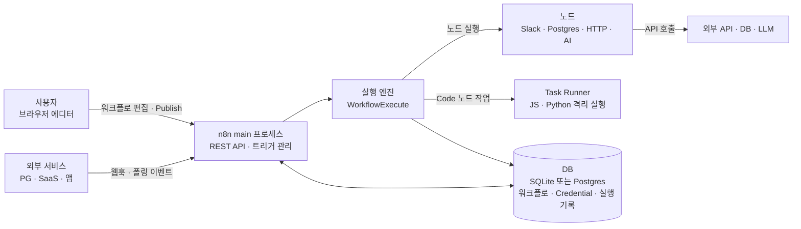
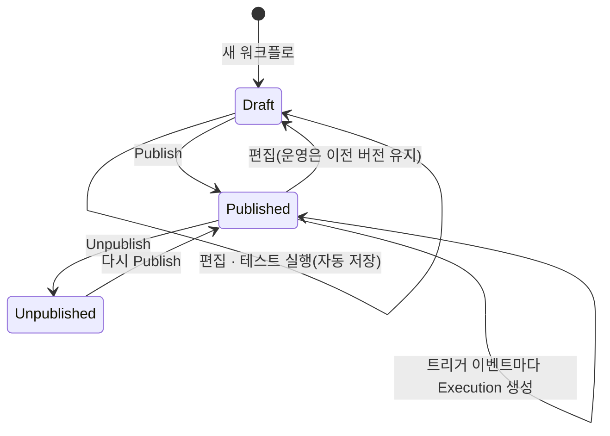

# n8n 핵심 개념과 동작 구조

> n8n을 이루는 Workflow, Node, Item, Expression, Credential, Execution, Publish가 각각 무엇이고 어떻게 맞물려 동작하는지 다룹니다.

## 용어 한눈에 보기

| 키워드 | 설명 |
|---|---|
| Workflow | 트리거에서 시작해 노드들이 연결된 하나의 자동화 흐름. 내부적으로는 노드 목록과 연결 정보를 담은 JSON |
| Node | 워크플로의 한 단계. 트리거, 앱 연동, 흐름 제어, 데이터 변환, AI 등 역할별 종류가 있음 |
| Trigger | 워크플로를 시작시키는 노드. Webhook, Schedule, 앱 이벤트, Chat, Form 등 |
| Item | 노드 사이를 오가는 데이터 한 건. `{ json, binary }` 형태이고 노드는 아이템 배열을 주고받음 |
| Expression | `{{ $json.amount }}`처럼 노드 설정값 안에서 이전 데이터를 참조하는 JavaScript 표현식 |
| Credential | API 키·OAuth 토큰 같은 인증 정보. 암호화되어 DB에 저장되고 노드는 이름으로만 참조 |
| Execution | 워크플로를 한 번 실행한 기록. 노드별 입력·출력과 성공·실패 상태가 남음 |
| Publish | 편집 중인 초안을 운영 버전으로 고정하는 동작. 운영 트리거는 Publish된 버전만 실행 |
| Cluster node | AI Agent 같은 루트 노드에 Chat Model·Memory·Tool 같은 하위 노드를 붙여 쓰는 AI용 노드 묶음 |

---

## 1. Workflow (워크플로)

### 쉽게 설명하면

공장의 컨베이어 벨트와 같습니다. 벨트 맨 앞에서 재료(이벤트)가 들어오면, 벨트를 따라 놓인 기계(노드)를 차례로 지나며 가공되고, 끝에서 결과물이 나옵니다.

### 개발 관점에서는

워크플로는 **방향이 있는 노드 그래프**이고, 저장 형식은 JSON입니다. 에디터에서 노드를 드래그해 연결하면 다음과 같은 구조가 만들어집니다.

### 예제

```json
{
  "name": "결제 실패 알림",
  "nodes": [
    { "name": "Webhook", "type": "n8n-nodes-base.webhook", "typeVersion": 2, "position": [0, 0],
      "parameters": { "httpMethod": "POST", "path": "payment-failed" } },
    { "name": "금액 확인", "type": "n8n-nodes-base.if", "typeVersion": 2, "position": [220, 0],
      "parameters": { "...": "amount >= 100000 조건" } }
  ],
  "connections": {
    "Webhook": { "main": [[{ "node": "금액 확인", "type": "main", "index": 0 }]] }
  },
  "settings": { "executionOrder": "v1" }
}
```

- `nodes`: 각 노드의 종류(`type`), 버전(`typeVersion`), 캔버스 위치(`position`), 설정값(`parameters`)
- `connections`: "어느 노드의 몇 번째 출력이 어느 노드의 몇 번째 입력으로 가는가"
- `settings.executionOrder`: 갈래가 여러 개일 때 실행 순서 규칙. 1.0 이후 만든 워크플로는 `v1`

이 JSON을 그대로 내보내고 가져올 수 있으므로, 워크플로를 Git에 보관하거나 다른 인스턴스로 옮길 수 있습니다.

### 핵심

> 워크플로는 "그림"이 아니라 **노드 목록 + 연결 정보로 된 JSON 데이터**입니다. 캔버스는 그 JSON을 편집하는 화면입니다.

## 2. Node (노드)

### 쉽게 설명하면

레고 블록입니다. 블록마다 하는 일이 정해져 있고, 블록을 끼우는 방식(입력과 출력)은 모두 같아서 어떤 순서로든 조립할 수 있습니다.

### 개발 관점에서는

노드는 역할에 따라 나뉩니다.

| 종류 | 예 | 하는 일 |
|---|---|---|
| Trigger 노드 | Webhook, Schedule Trigger, Gmail Trigger, Chat Trigger, Form Trigger | 실행을 시작시킴. 워크플로의 입구 |
| Action(App) 노드 | Slack, Postgres, Google Sheets, Notion, GitHub | 외부 서비스 API를 호출 |
| Core 노드 | HTTP Request, If, Switch, Merge, Loop Over Items, Wait, Code, Edit Fields(Set) | 흐름 제어, 데이터 변환, 범용 호출 |
| Cluster 노드 | AI Agent + Chat Model·Memory·Tool 하위 노드 | AI 기능을 루트 노드와 하위 노드 조합으로 구성 |

모든 노드에는 공통 설정이 있습니다. 실무에서 자주 쓰는 것은 다음 네 가지입니다.

- **Retry On Fail**: 실패 시 재시도. 최대 시도 횟수와 대기 시간을 지정합니다.
- **On Error**: 실패하면 워크플로를 멈출지(`stopWorkflow`), 계속할지(`continueRegularOutput`), 오류 전용 출력으로 보낼지(`continueErrorOutput`) 정합니다.
- **Always Output Data**: 결과가 비어도 빈 아이템 하나를 내보내 다음 노드가 실행되게 합니다.
- **Execute Once**: 입력 아이템이 여러 개여도 첫 아이템으로 한 번만 실행합니다.

### 핵심

> 노드의 종류는 수천 개지만, **모두 같은 입출력 규칙(아이템 배열)**을 따르기 때문에 서로 연결할 수 있습니다.

## 3. Item (아이템)

### 쉽게 설명하면

컨베이어 벨트 위의 상자 하나입니다. 상자 안에는 정보 쪽지(`json`)와 첨부 파일(`binary`)이 들어 있습니다. 벨트 위에는 상자가 여러 개 놓일 수 있습니다.

### 개발 관점에서는

노드 사이를 오가는 데이터는 항상 **객체 배열**이고, 각 객체가 아이템입니다.

### 예제

```json
[
  { "json": { "orderId": "A-1001", "amount": 120000 } },
  { "json": { "orderId": "A-1002", "amount": 35000 },
    "binary": { "receipt": { "data": "<base64>", "mimeType": "application/pdf", "fileName": "A-1002.pdf" } } }
]
```

대부분의 노드는 **아이템마다 한 번씩** 동작합니다. 위 배열이 Slack 노드에 들어가면 메시지가 두 번 전송됩니다. 그래서 "100건을 한 메시지로 보내고 싶다"면 먼저 Aggregate 노드나 Code 노드로 아이템을 하나로 합쳐야 합니다.

출력 아이템에는 "이 아이템이 입력의 몇 번째 아이템에서 왔는가"를 뜻하는 `pairedItem` 정보가 붙습니다. 그래서 뒤쪽 노드의 표현식에서 앞쪽 노드의 "같은 줄" 데이터를 찾아올 수 있습니다. 이 연결이 실행 엔진에서 어떻게 유지되는지는 [실행 엔진 깊이 보기](07-execution-engine.md#아이템과-paireditem-계보)에서 다룹니다.

### 핵심

> n8n을 이해하는 가장 중요한 한 줄: **노드는 아이템 배열을 받아, 아이템마다 일하고, 아이템 배열을 내보냅니다.**

## 4. Expression (표현식)

### 쉽게 설명하면

양식의 빈칸에 "앞에서 받은 주문 번호를 여기 넣어 주세요"라고 적어 두는 것입니다.

### 개발 관점에서는

노드의 거의 모든 설정 필드에 `{{ }}`로 감싼 JavaScript 표현식을 쓸 수 있습니다. 표현식은 현재 아이템마다 따로 평가됩니다.

### 예제

```text
{{ $json.amount }}                                  현재 아이템의 amount
{{ $json.amount >= 100000 ? '긴급' : '일반' }}       간단한 조건식
{{ $('고객 조회').item.json.email }}                 앞쪽 노드에서 같은 계보의 아이템
{{ $now.toFormat('yyyy-MM-dd') }}                   날짜 처리 (Luxon)
{{ $execution.id }}                                 현재 실행 ID
```

입력 패널에서 필드를 드래그해 설정 칸에 놓으면 `{{ $json.필드 }}` 표현식이 자동으로 만들어집니다.

### 핵심

> 노드 설정은 고정값이 아니라 **아이템마다 평가되는 템플릿**입니다. 표현식이 복잡해지면 Code 노드로 옮기는 것이 읽기 쉽습니다.

## 5. Credential (인증 정보)

### 쉽게 설명하면

건물 관리실에 맡겨 두는 열쇠입니다. 직원은 "3층 회의실 열쇠"라고 이름으로만 요청하고, 열쇠 자체를 들고 다니지 않습니다.

### 개발 관점에서는

API 키, OAuth 토큰, DB 비밀번호는 Credential로 따로 저장합니다. 값은 인스턴스의 **암호화 키**(`N8N_ENCRYPTION_KEY` 또는 첫 실행 때 자동 생성된 키)로 암호화되어 DB에 들어가고, 워크플로 JSON에는 Credential의 ID와 이름만 남습니다. 그래서 워크플로를 내보내 공유해도 비밀값은 함께 나가지 않습니다.

이 구조 때문에 **암호화 키를 잃어버리면 저장된 모든 Credential을 복호화할 수 없습니다.** 셀프호스팅에서 가장 먼저 백업해야 할 것이 이 키입니다.

### 핵심

> 워크플로는 Credential을 "이름으로 참조"만 합니다. 비밀값과 흐름을 분리해서, 흐름은 공유하고 비밀은 인스턴스에 남깁니다.

## 6. Execution과 Publish (실행 기록과 운영 버전)

### 쉽게 설명하면

Publish는 "이 버전으로 영업을 시작합니다"라는 간판을 거는 일이고, Execution은 영업 중 손님 한 명 한 명을 응대한 기록입니다.

### 개발 관점에서는

n8n 2.x에서 워크플로는 편집하는 동안 자동 저장되지만, 운영에는 **Publish한 버전**만 쓰입니다. Publish하면 Webhook·Form 트리거의 운영 URL이 열리고, Schedule이 돌기 시작하며, 앱 이벤트 트리거가 등록됩니다. 그 뒤에 편집한 내용은 다시 Publish하기 전까지 운영에 반영되지 않습니다. 1.x에서 "Active 토글"로 하던 일이 이 Publish 모델로 바뀌었습니다.

실행에는 두 종류가 있습니다.

| 구분 | 시작 방법 | 웹훅 경로 | 용도 |
|---|---|---|---|
| 수동(테스트) 실행 | 에디터의 Execute workflow, Listen for test event | `/webhook-test/...` | 개발 중 확인. 결과가 캔버스에 바로 표시됨 |
| 운영 실행 | Publish된 트리거가 받은 이벤트 | `/webhook/...` | 실제 업무. 결과는 Executions 탭에서 확인 |

각 실행은 노드별 입력·출력 데이터를 포함해 DB에 저장되고, 기본 설정에서는 14일(336시간)이 지나거나 1만 건을 넘으면 오래된 것부터 정리됩니다.

### 핵심

> **편집은 초안, 운영은 Publish된 버전**입니다. 실행 기록은 디버깅의 가장 강력한 도구이자, 쌓이면 DB를 키우는 비용입니다.

---

## 7. 전체 동작 구조

n8n은 애플리케이션 코드에 import되는 라이브러리가 아니라, **에디터·API·트리거 관리·실행 엔진을 가진 별도 서버**입니다.



한 번의 실행이 처리되는 순서는 다음과 같습니다.

1. **시작점**: Publish된 워크플로의 트리거가 이벤트를 받습니다. 웹훅이면 HTTP 요청이, Schedule이면 정해진 시각이, 폴링 트리거면 새 데이터가 시작점이 됩니다. 트리거가 만든 아이템이 첫 입력이 됩니다.
2. **n8n이 개입하는 시점**: main 프로세스가 실행 레코드를 만들고 실행 엔진을 시작합니다. Queue mode라면 실행 ID만 Redis 큐에 넣고, 실제 실행은 워커가 가져갑니다.
3. **내부 처리**: 실행 엔진은 "다음에 실행할 노드" 스택에서 노드를 하나씩 꺼내 실행하고, 출력 아이템을 연결된 다음 노드의 입력으로 넘깁니다. 입력이 여러 개인 노드(Merge 등)는 필요한 입력이 모두 도착할 때까지 기다립니다.
4. **외부 시스템과의 연결**: 각 노드는 Credential을 복호화해 외부 API·DB·LLM을 호출합니다. Code 노드의 사용자 코드는 n8n 프로세스가 아니라 Task Runner에서 격리되어 실행됩니다.
5. **결과 반환**: 노드별 결과가 실행 기록으로 DB에 저장됩니다. 웹훅 트리거라면 설정에 따라 즉시, 마지막 노드가 끝난 뒤, 또는 Respond to Webhook 노드 시점에 HTTP 응답을 돌려줍니다. 실패하면 설정된 Error Workflow가 실행됩니다.

워크플로 하나의 생명주기를 상태로 보면 다음과 같습니다.



실행 엔진이 노드 순서를 정하고 데이터를 넘기는 방식은 [실행 엔진 깊이 보기](07-execution-engine.md)에서 실제 소스 코드와 함께 다룹니다.

---

[← 개요](README.md) · [설치와 첫 사용 →](02-getting-started.md)
