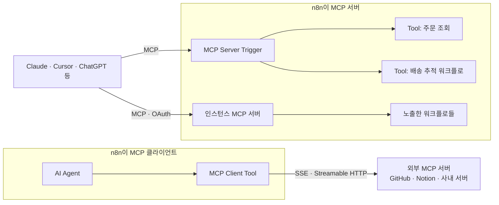

# n8n 활용 예시 ② AI 에이전트와 MCP

> AI Agent 노드로 사내 데이터를 조회하고 행동하는 CS 에이전트를 만드는 방법과, MCP로 n8n을 외부 AI 도구에 연결하는 두 방향(클라이언트·서버)을 다룹니다.

## AI 관점에서 n8n이 하는 일

LLM 하나만으로는 업무를 끝낼 수 없습니다. 주문을 조회하려면 DB에 접근해야 하고, 환불하려면 결제 API를 호출해야 하며, 위험한 작업 앞에서는 사람의 승인이 필요하고, 무슨 일이 있었는지 기록도 남아야 합니다. n8n은 **이미 갖고 있는 수많은 연동 노드를 LLM이 호출할 도구로 그대로 내어 주는 것**으로 이 문제를 풉니다.

### 활용할 수 있는 기능

- **AI Agent 노드**: Chat Model과 Tool 하위 노드를 연결하면, 모델이 어떤 도구를 어떤 인자로 호출할지 스스로 결정하는 루프를 돕니다. 내부적으로 LangChain JS의 tool calling 방식(Tools Agent)으로 동작하며, 도구는 최소 1개 연결해야 합니다.
- **하위 노드(sub-node)**: Chat Model(OpenAI, Anthropic, Google, Mistral, Groq, Ollama 등), Memory(Simple, Postgres, Redis 등), Tool(앱 노드, HTTP Request, Code, Call n8n Workflow, Vector Store, MCP Client Tool), Output Parser
- **`$fromAI()`**: 도구로 쓰는 앱 노드의 파라미터를 모델이 채우게 하는 표현식
- **Human review**: 특정 도구 호출 전에 Chat, Slack, Telegram 등으로 승인을 받고, 거부하면 실행하지 않음
- **MCP Client / MCP Client Tool 노드**: 외부 MCP 서버의 도구를 워크플로나 에이전트에서 사용
- **MCP Server Trigger 노드**와 **인스턴스 MCP 서버**: n8n의 도구와 워크플로를 Claude, Cursor, ChatGPT 같은 MCP 클라이언트에 노출
- **Agents(Preview)**: 워크플로와 나란히 두는 독립 에이전트. 모델, 지시문, 도구, Skill, 채널, 스케줄, 하위 에이전트, 지식 베이스, 메모리를 한 화면에서 구성

## 실제 예제: 주문 문의 CS 에이전트

### 요구사항

> 고객이 웹 채팅으로 "주문 A-1001 언제 와요?", "이거 환불해 주세요"라고 물으면, 에이전트가 주문 DB를 조회해 답하고, 환불은 담당자가 Slack에서 승인한 뒤에만 실행한다. 답변 끝에는 내부 분류(배송·환불·기타)를 구조화된 형태로 남긴다.

### 구현

```text
[Chat Trigger: 공개 채팅 위젯]
   ↓
[AI Agent]
   ├─ Chat Model    : Anthropic Chat Model (또는 OpenAI 등)
   ├─ Memory        : Postgres Chat Memory (sessionId 기준 대화 유지)
   ├─ Tool          : Postgres "주문 조회" (SELECT 전용 DB 사용자)
   ├─ Tool          : Call n8n Workflow "배송 추적" (택배사 API를 감싼 하위 워크플로)
   └─ Human review (Slack) ── Tool : HTTP Request "환불 요청" (결제 서버 내부 API)
```

**System Message**

```text
당신은 쇼핑몰 CS 상담원입니다.
- 주문 정보는 반드시 "주문 조회" 도구로 확인한 뒤에만 답합니다. 추측하지 않습니다.
- 다른 고객의 주문은 조회하지 않습니다. 고객이 알려준 주문번호와 이메일이 모두 일치할 때만 답합니다.
- 환불은 "환불 요청" 도구로만 처리하며, 승인이 거부되면 담당자가 연락한다고 안내합니다.
- 답변은 한국어 존댓말로 3문장 이내로 합니다.
```

**주문 조회 도구(Postgres 노드를 Tool로 연결)**: 쿼리는 고정하고, 모델이 채울 값만 `$fromAI()`로 열어 둡니다.

```sql
SELECT order_id, status, shipped_at, carrier, tracking_no, total_amount
FROM orders
WHERE order_id = $1 AND customer_email = $2
LIMIT 1;
```

```text
Query Parameters:
  {{ $fromAI('orderId', '고객이 말한 주문번호. 예: A-1001', 'string') }},
  {{ $fromAI('email', '고객 이메일 주소', 'string') }}
```

**환불 요청 도구(HTTP Request 노드를 Tool로 연결, Human review 뒤에 배치)**

```text
Method : POST
URL    : https://payments.internal.example.com/refund-requests
Auth   : Header Auth Credential (내부 서비스 토큰)
Body   :
  orderId = {{ $fromAI('orderId', '환불할 주문번호', 'string') }}
  reason  = {{ $fromAI('reason', '고객이 말한 환불 사유 요약', 'string') }}
```

**AI Agent 옵션**: Max Iterations는 기본 10에서 5로 줄여 도구 호출이 끝없이 반복되지 않게 하고, Require Specific Output Format을 켜서 Structured Output Parser로 `{ "answer": string, "category": "shipping" | "refund" | "other" }` 형태를 강제합니다.

### 실행 흐름

```text
고객: "A-1001 환불해 주세요. 이메일은 minsu@example.com 이에요"
 ↓
Chat Trigger: 메시지 + sessionId를 아이템으로 생성
 ↓
AI Agent: Memory에서 이전 대화 로드 → 모델 호출
 ↓
모델: "주문 조회" 도구 호출 결정 (orderId=A-1001, email=minsu@example.com)
 ↓
Postgres Tool 실행 → 주문 상태 반환 → 모델에게 결과 전달
 ↓
모델: "환불 요청" 도구 호출 결정
 ↓
Human review: Slack으로 승인 요청 전송 → 실행이 대기 상태가 됨
 ↓
담당자 Approve → HTTP Request 실행 → 결과를 모델에게 전달
 ↓
모델: 최종 답변 + category=refund (Output Parser가 형식 검증)
 ↓
Chat Trigger: 고객 화면에 답변 표시, 실행 기록에 도구 호출 단계 전체 저장
```

### 코드 설명

1. **도구가 곧 권한입니다.** 에이전트는 연결된 도구만 쓸 수 있습니다. 조회는 SELECT 권한만 가진 DB 사용자로, 환불은 사람 승인 뒤에만 실행되게 해서 모델이 잘못 판단해도 피해 범위가 정해집니다.
2. **쿼리는 고정하고 값만 AI에게 맡깁니다.** `$fromAI()`는 "모델이 채울 인자"를 선언하는 것이지 SQL을 만들게 하는 것이 아닙니다. 모델에게 SQL 전체를 쓰게 하는 것보다 훨씬 안전합니다.
3. **복잡한 도구는 하위 워크플로로 감쌉니다.** 택배사마다 API가 다른 배송 추적은 별도 워크플로로 만들고 Call n8n Workflow 도구로 연결하면, 에이전트는 "배송 추적"이라는 단순한 도구만 보게 됩니다.
4. **메모리는 저장소가 있는 것을 씁니다.** Simple Memory는 n8n 프로세스 안에 대화를 보관하므로 재시작이나 Queue mode의 여러 워커 환경에 맞지 않습니다. 운영에서는 Postgres나 Redis 기반 Chat Memory를 씁니다.
5. **실행 기록이 감사 로그가 됩니다.** 어떤 도구를 어떤 인자로 불렀는지가 실행 기록에 남아서, "에이전트가 왜 이렇게 답했나"를 나중에 확인할 수 있습니다.

### 왜 이렇게 사용하는가?

에이전트를 코드로 직접 만들면 모델 호출 루프보다 **주변 작업**(DB 연결, 결제 API 인증, 승인 대기와 재개, 실행 기록)이 훨씬 많은 코드를 차지합니다. n8n에서는 그 주변 작업이 이미 노드로 존재하므로, 개발자는 System Message와 도구의 권한 범위를 설계하는 데 집중할 수 있습니다.

---

## MCP로 n8n을 외부 AI 도구와 연결하기

MCP(Model Context Protocol)는 AI 애플리케이션이 외부 도구를 표준 방식으로 호출하게 하는 프로토콜입니다. n8n은 양쪽 역할을 모두 합니다.



### n8n이 클라이언트일 때: MCP Client Tool

외부 MCP 서버의 엔드포인트와 인증(Bearer, 헤더, OAuth2)을 지정하면 서버가 제공하는 도구 목록을 자동으로 가져옵니다. 에이전트에게 노출할 도구를 골라 둘 수 있으므로, 쓰기 도구가 많은 서버라면 읽기 도구만 선택하는 것이 좋습니다.

### n8n이 서버일 때: MCP Server Trigger

워크플로 하나를 MCP 서버로 만들고, 그 워크플로에 연결한 Tool 노드만 MCP 클라이언트에 노출합니다. 일반 트리거와 달리 다음 노드로 데이터를 넘기지 않고, 연결된 도구를 호출받아 실행하는 역할만 합니다. 전송 방식은 SSE와 Streamable HTTP이며 stdio는 지원하지 않으므로, stdio만 지원하는 클라이언트는 `mcp-remote` 같은 중계기를 씁니다.

```json
{
  "mcpServers": {
    "n8n-cs-tools": {
      "command": "npx",
      "args": ["mcp-remote", "https://n8n.example.com/mcp/cs-tools", "--header", "Authorization: Bearer ${AUTH_TOKEN}"],
      "env": { "AUTH_TOKEN": "<MCP Server Trigger에 설정한 Bearer 토큰>" }
    }
  }
}
```

인스턴스 단위 MCP 서버를 켜면, 노출하도록 고른 워크플로를 MCP 클라이언트가 검색·실행할 수 있고, 2.13.0부터는 워크플로 생성·수정까지 할 수 있습니다. 인증은 OAuth(권장) 또는 API 키를 씁니다. 다만 **클라이언트별로 범위를 나누지 못해, 연결된 모든 클라이언트가 노출된 워크플로 전체를 봅니다.** 민감한 워크플로는 노출 목록에서 빼야 합니다.

## 실제 서비스에서는

> CS 팀은 웹 채팅 위젯으로 고객 문의를 받고, 같은 "주문 조회"·"배송 추적" 도구를 MCP Server Trigger로도 노출해 사내 개발자가 Claude나 Cursor에서 "A-1001 주문 상태 확인해 줘"라고 물을 수 있게 합니다. 도구 구현은 n8n 한곳에만 있고, 고객용 에이전트와 사내 개발 도구가 그것을 함께 씁니다. 환불처럼 되돌리기 어려운 도구는 고객용 에이전트에서만 Human review 뒤에 두고, MCP로는 노출하지 않습니다.

AI 기능은 변화가 가장 빠른 영역입니다. AI Agent 노드의 agent type 설정은 deprecated되어 모든 에이전트가 Tools Agent로 동작하며, 그 설정이 있는 v1 노드는 3.0에서 제거될 예정입니다. Agents 기능은 Preview이고 셀프호스팅 Enterprise 플랜에서는 아직 쓸 수 없으며 Queue mode도 지원하지 않습니다. 관련 주의점은 [주의할 점과 FAQ](08-pitfalls-faq.md)에 정리했습니다.

---

[← 활용 예시 ① 웹훅 기반 업무 자동화](03-usage-webhook-automation.md) · [목차](README.md) · [활용 예시 ③ 셀프호스팅 운영과 실전 적용 →](05-usage-self-hosting-ops.md)
