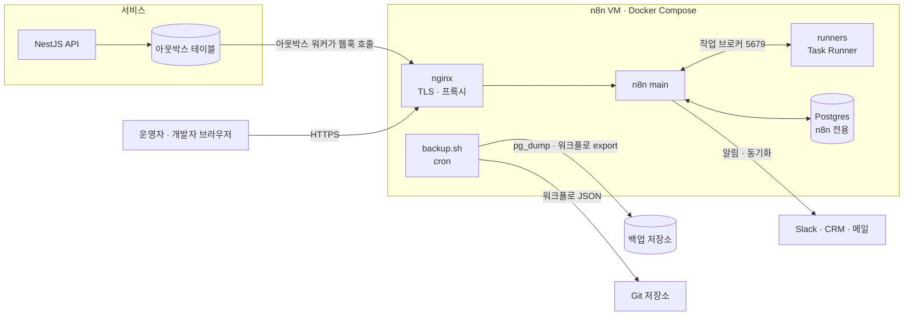

# n8n 활용 예시 ③ 셀프호스팅 운영과 실전 적용

> n8n을 서버로 운영할 때의 구조(Postgres, Queue mode, Task Runner, 리버스 프록시)와, 작은 커머스 팀이 운영 자동화 플랫폼으로 n8n을 도입하는 과정을 파일 단위로 다룹니다.

## 서버 관점에서의 활용

n8n은 그 자체가 서버 애플리케이션입니다. 그래서 "서버 코드의 어느 계층에 넣느냐"가 아니라, **우리 서비스 옆에 어떤 구성으로 띄우고 어떻게 운영하느냐**가 핵심 질문입니다.

### 활용 사례

- **사내 자동화 플랫폼**: 여러 팀의 알림·동기화·리포트 워크플로를 한 인스턴스에 모으고, 프로젝트와 역할로 권한을 나눕니다.
- **이벤트 후속 처리 계층**: 핵심 서비스는 도메인 이벤트만 내보내고, 알림·CRM 동기화·데이터 적재 같은 후속 처리는 n8n이 맡습니다.
- **배치·정기 작업**: cron 서버에 흩어져 있던 정기 스크립트를 Schedule Trigger 워크플로로 옮겨 실행 기록과 실패 알림을 얻습니다.
- **AI 기능의 백엔드**: 채팅 위젯, MCP 서버, 문서 요약 파이프라인처럼 LLM을 쓰는 기능의 오케스트레이션을 맡습니다.

### 애플리케이션 구조

단일 프로세스(regular mode)로 시작해, 실행량이 늘면 Queue mode로 나눕니다.

```text
[regular mode: 작은 팀]
리버스 프록시 → n8n main (에디터 · API · 트리거 · 실행) + Task Runner
                 ↓
               Postgres

[queue mode: 실행량이 많을 때]
리버스 프록시 ─┬→ n8n main     (에디터 · API · 스케줄·폴링 트리거, 실행은 큐에 넣기만)
              └→ n8n webhook  (/webhook/* 수신 전용, 선택)
                      ↓ 실행 ID
                    Redis (Bull 큐)
                      ↓
              n8n worker × N  (실제 실행, 각자 Task Runner 사이드카)
                      ↓
                   Postgres   (워크플로 · Credential · 실행 기록)
```

Queue mode에서 main은 트리거를 받아 실행 레코드를 만들고 **실행 ID만** Redis에 넣습니다. 워커가 ID를 꺼내 DB에서 워크플로를 읽어 실행하고, 결과를 DB에 쓴 뒤 완료를 Redis로 알립니다. 그래서 모든 프로세스는 같은 Postgres, 같은 Redis, **같은 암호화 키**를 공유해야 합니다.

### 실제 코드

**Queue mode의 핵심 환경 변수**

```bash
EXECUTIONS_MODE=queue                       # main, worker, webhook 모두
QUEUE_BULL_REDIS_HOST=redis
QUEUE_BULL_REDIS_PORT=6379
N8N_ENCRYPTION_KEY=<모든 프로세스가 같은 값>
OFFLOAD_MANUAL_EXECUTIONS_TO_WORKERS=true   # 에디터의 수동 실행도 워커에서
QUEUE_HEALTH_CHECK_ACTIVE=true              # 워커의 /healthz, /healthz/readiness 활성화
```

**워커 실행**

```bash
# 워커 프로세스는 같은 이미지에 worker 명령으로 띄운다
# --concurrency: 워커 하나가 동시에 처리할 실행 수. 기본 10, 공식 권장은 5 이상
n8n worker --concurrency=10
```

### 어느 계층에 두는가

| 위치 | n8n이 맡기 좋은 일 | 이유 |
|---|---|---|
| 사용자 요청 경로(API 동기 처리) | 맡기지 않음 | 실행 기록·큐를 거치는 지연이 사용자 응답 시간에 그대로 더해짐 |
| 도메인 이벤트 이후(비동기) | 알림, CRM·시트 동기화, 메일, 데이터 적재 | 자주 바뀌고 실패해도 재시도할 수 있는 일 |
| 배치·스케줄 | 정기 리포트, 정산 데이터 수집, 정리 작업 | 실행 기록과 실패 알림이 기본 제공됨 |
| 사내 운영 도구 | 승인 흐름, 온보딩, 슬랙 명령 처리 | 비개발자가 흐름을 보고 고칠 수 있음 |
| 핵심 트랜잭션 | 맡기지 않음 | 테스트·버전 관리·롤백이 코드보다 약함 |

---

## 실전 프로젝트 적용: 커머스 운영 자동화 플랫폼

### 요구사항

개발자 세 명, 운영자 다섯 명인 온라인 쇼핑몰이 n8n을 도입합니다.

- 스택: NestJS API + PostgreSQL, AWS 단일 VM(Docker Compose)에 n8n 셀프호스팅
- 결제 실패·신규 주문·재고 부족 이벤트의 후속 처리를 n8n으로 옮긴다
- 매일 오전 9시(한국 시간) 전날 매출 리포트를 Slack으로 보낸다
- 운영자는 메시지 문구와 기준 값을 직접 고치되, Publish는 개발자 확인 뒤에 한다
- 워크플로 정의는 Git에 남기고, DB와 암호화 키는 매일 백업한다
- Code 노드의 사용자 코드는 n8n 프로세스와 격리한다

### 전체 구조



처음에는 regular mode 하나로 시작합니다. 하루 실행이 수천 건 수준이면 단일 프로세스로 충분하고, 운영 요소가 적을수록 장애 지점도 줄어듭니다. 실행량이 늘면 같은 구성에 Redis와 워커를 더해 Queue mode로 옮깁니다.

### 폴더 구조

```text
n8n-ops/
├── compose.yml              # n8n main, runners, postgres
├── .env.example             # 필요한 환경 변수 목록 (실제 .env는 커밋하지 않음)
├── nginx/
│   └── n8n.conf             # TLS 종료, 웹소켓, MCP·SSE용 버퍼링 해제
├── scripts/
│   ├── backup.sh            # DB 덤프 + 워크플로 export + 암호화 키 보관 확인
│   └── export-workflows.sh  # 워크플로 JSON을 workflows/ 로 내보내 Git 커밋
├── workflows/               # 내보낸 워크플로 JSON (리뷰·이력 관리용)
│   ├── payment-failed.json
│   ├── daily-sales-report.json
│   └── error-handler.json
└── README.md                # 운영 절차: 업그레이드, 복구, 키 관리
```

### 파일 단위 구현

**1. compose.yml**

```yaml
services:
  postgres:
    image: postgres:16
    restart: unless-stopped
    environment:
      POSTGRES_USER: n8n
      POSTGRES_PASSWORD: ${DB_PASSWORD}
      POSTGRES_DB: n8n
    volumes:
      - pg_data:/var/lib/postgresql/data
    healthcheck:
      test: ['CMD-SHELL', 'pg_isready -U n8n -d n8n']
      interval: 5s
      retries: 10

  n8n:
    image: docker.n8n.io/n8nio/n8n:2.41.6   # 정확한 버전 고정
    restart: unless-stopped
    depends_on:
      postgres:
        condition: service_healthy
    ports:
      - '127.0.0.1:5678:5678'               # 외부 노출은 nginx만
    environment:
      DB_TYPE: postgresdb
      DB_POSTGRESDB_HOST: postgres
      DB_POSTGRESDB_DATABASE: n8n
      DB_POSTGRESDB_USER: n8n
      DB_POSTGRESDB_PASSWORD: ${DB_PASSWORD}
      N8N_ENCRYPTION_KEY: ${N8N_ENCRYPTION_KEY}
      WEBHOOK_URL: https://n8n.shop.example.com/
      N8N_PROXY_HOPS: '1'                   # nginx 한 단계 뒤에 있음
      GENERIC_TIMEZONE: Asia/Seoul
      TZ: Asia/Seoul
      EXECUTIONS_DATA_MAX_AGE: '168'        # 실행 기록 7일 보관
      N8N_RUNNERS_MODE: external
      N8N_RUNNERS_AUTH_TOKEN: ${RUNNERS_AUTH_TOKEN}
      N8N_RUNNERS_BROKER_LISTEN_ADDRESS: 0.0.0.0
    volumes:
      - n8n_data:/home/node/.n8n

  runners:
    image: n8nio/runners:2.41.6             # n8n과 같은 버전
    restart: unless-stopped
    depends_on:
      - n8n
    environment:
      N8N_RUNNERS_AUTH_TOKEN: ${RUNNERS_AUTH_TOKEN}
      N8N_RUNNERS_TASK_BROKER_URI: http://n8n:5679
      N8N_RUNNERS_AUTO_SHUTDOWN_TIMEOUT: '15'

volumes:
  pg_data:
  n8n_data:
```

- `runners` 컨테이너는 Code 노드의 JavaScript·Python을 실행하는 Task Runner입니다. external mode로 분리하면 사용자 코드가 n8n 프로세스의 DB 접속 정보나 암호화 키에 접근하기 어렵습니다. 포트는 외부에 열지 않습니다.
- Postgres 지원 버전은 n8n 버전마다 공식 문서에서 확인합니다.

**2. nginx/n8n.conf**

```nginx
server {
  listen 443 ssl;
  server_name n8n.shop.example.com;
  # ssl_certificate ... (생략)

  location / {
    proxy_pass http://127.0.0.1:5678;
    proxy_http_version 1.1;
    proxy_set_header Upgrade $http_upgrade;     # 에디터 실시간 갱신(웹소켓)
    proxy_set_header Connection "upgrade";
    proxy_set_header Host $host;
    proxy_set_header X-Forwarded-For $proxy_add_x_forwarded_for;
    proxy_set_header X-Forwarded-Proto $scheme;
    client_max_body_size 16m;                   # 웹훅 기본 최대 페이로드와 맞춤
  }

  location /mcp/ {
    proxy_pass http://127.0.0.1:5678;
    proxy_http_version 1.1;
    proxy_set_header Connection "";
    proxy_buffering off;                        # SSE·스트리밍 응답이 끊기지 않게
    gzip off;
    chunked_transfer_encoding off;
  }
}
```

**3. scripts/backup.sh**

```bash
#!/usr/bin/env bash
set -euo pipefail
STAMP=$(date +%Y%m%d-%H%M)
DEST=/var/backups/n8n/$STAMP
mkdir -p "$DEST"

# 1) DB 전체 덤프: 워크플로, 암호화된 Credential, 실행 기록
docker compose exec -T postgres pg_dump -U n8n -Fc n8n > "$DEST/n8n.dump"

# 2) 워크플로를 사람이 읽을 수 있는 JSON으로 (Git 이력용)
docker compose exec -T n8n n8n export:workflow --backup --output=/home/node/.n8n/backup/
docker compose cp n8n:/home/node/.n8n/backup "$DEST/workflows"

# 3) 암호화 키는 이 스크립트에서 다루지 않는다
#    (.env의 N8N_ENCRYPTION_KEY는 별도 비밀 저장소에 한 번 보관해 두고, 덤프와 섞지 않는다)

aws s3 cp --recursive "$DEST" "s3://shop-backups/n8n/$STAMP/"
```

DB 덤프에는 Credential이 암호화된 채로 들어 있으므로, **덤프와 암호화 키를 같은 곳에 두지 않는 것**이 원칙입니다. 둘 중 하나만 유출되면 비밀값은 안전하지만, 둘 다 잃으면 복구할 수 없습니다.

**4. scripts/export-workflows.sh**

```bash
#!/usr/bin/env bash
set -euo pipefail
docker compose exec -T n8n n8n export:workflow --backup --output=/home/node/.n8n/git-export/
docker compose cp n8n:/home/node/.n8n/git-export/. ./workflows/
git add workflows
git commit -m "chore(n8n): 워크플로 스냅샷 $(date +%F)" || echo "변경 없음"
```

Git 연동(Source control and environments) 기능은 Enterprise 플랜에서 제공됩니다. Community 에디션에서는 이렇게 CLI로 내보낸 JSON을 커밋해 **변경 이력과 리뷰용 diff**를 확보합니다.

### 실제 실행 흐름

"재고 부족 알림" 워크플로를 추가하고 운영하는 과정을 예로 듭니다.

1. **사용자 행동**: 개발자가 에디터에서 Webhook(`/webhook/stock-low`) → Postgres(상품·공급사 조회) → Slack(구매 담당 채널) 워크플로를 만들고, 테스트 URL로 샘플 이벤트를 보내 결과를 확인합니다.
2. **검토와 Publish**: 운영자가 Slack 메시지 문구를 다듬은 뒤, 개발자가 Error workflow 지정과 재시도 설정을 확인하고 Publish합니다. 이 시점부터 운영 URL이 열립니다.
3. **이벤트 발생**: NestJS API가 재고를 차감하다 임계값 아래로 내려가면 같은 트랜잭션에서 아웃박스 테이블에 이벤트를 적고, 아웃박스 워커가 n8n 운영 웹훅을 호출합니다.
4. **n8n 처리**: nginx가 요청을 n8n main으로 넘기고, 실행 엔진이 Postgres 조회와 Slack 전송을 실행합니다. 공급사 이름을 다듬는 Code 노드는 `runners` 컨테이너에서 실행됩니다.
5. **실패 대응**: Slack 토큰이 만료되어 Slack 노드가 재시도 끝에 실패하면 Error Workflow가 운영 채널에 실행 링크를 보냅니다. 개발자는 Credential을 다시 연결하고, 실패한 실행을 Executions 화면에서 다시 실행합니다.
6. **이력과 백업**: 매일 새벽 `backup.sh`가 DB 덤프와 워크플로 JSON을 백업 저장소에 올리고, `export-workflows.sh`가 변경된 워크플로를 Git에 커밋합니다. 리뷰어는 diff로 "누가 어떤 노드를 바꿨는지" 확인합니다.
7. **확장**: 프로모션 기간에 실행이 몰려 에디터가 느려지면, Redis와 워커 컨테이너(각각 Task Runner 사이드카 포함)를 추가하고 `EXECUTIONS_MODE=queue`로 전환합니다. 워커와 main은 같은 n8n 버전, 같은 암호화 키를 써야 합니다.

---

[← 활용 예시 ② AI 에이전트와 MCP](04-usage-ai-agents.md) · [목차](README.md) · [장단점과 대안 비교 →](06-comparison.md)
