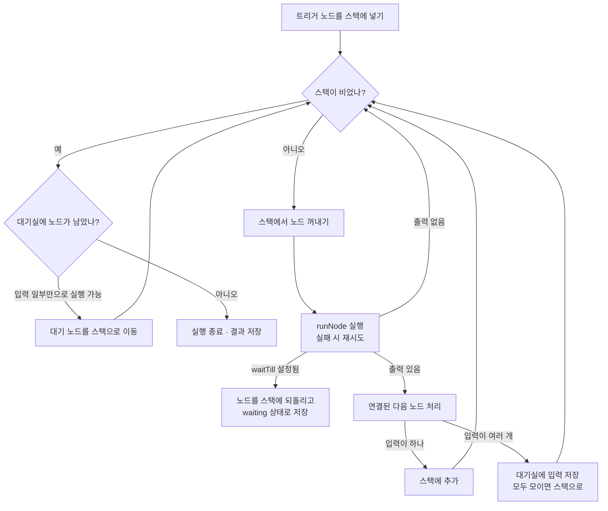

# n8n 실행 엔진 깊이 보기

> 워크플로 한 번의 실행이 엔진 안에서 어떤 자료구조로 표현되고, 노드 순서·데이터 전달·재시도·대기·아이템 계보가 어떻게 처리되는지 실제 소스 코드를 따라가며 다룹니다.

## 왜 실행 엔진을 알아야 하는가

n8n을 쓰다 보면 이런 질문을 만나게 됩니다.

- 갈래가 두 개인데 왜 아래쪽 갈래가 먼저 실행됐을까?
- If 노드의 false 쪽에 아무것도 안 나왔는데, 왜 그 뒤 Merge 노드는 실행되지 않을까?
- Slack 노드의 재시도를 10회로 설정했는데 왜 5번만 시도할까?
- Wait 노드에서 사흘을 기다리는 동안 서버를 재시작해도 괜찮을까?
- `$('노드 이름').item`은 어떻게 "같은 줄"의 아이템을 찾아올까?

모두 실행 엔진이 동작하는 방식에서 나오는 결과입니다. 이 문서는 `packages/core/src/execution-engine/workflow-execute.ts`(2026년 10월 `master` 기준 약 3,200줄)의 `WorkflowExecute` 클래스를 중심으로 설명합니다. 코드는 이해를 돕기 위해 핵심만 줄여서 보여줍니다.

---

## 실행 하나는 어떤 데이터로 표현되는가

실행 엔진의 상태는 `runExecutionData` 객체 하나에 모두 들어 있습니다. 이 객체가 DB에 저장되고, Queue mode에서는 워커가 읽어 가고, Wait 노드 이후에는 이것으로 실행을 재개합니다.

```ts
// 핵심 필드만 간추린 구조
runExecutionData = {
  startData: { destinationNode, runNodeFilter },   // 부분 실행 시 "어디까지" 실행할지
  resultData: {
    runData: { '노드 이름': [taskData, ...] },     // 노드별 실행 결과(실행될 때마다 하나씩 추가)
    pinData,                                       // 고정 데이터가 있는 노드는 실행 대신 이 값 사용
    lastNodeExecuted,
    error,
  },
  executionData: {
    nodeExecutionStack: [{ node, data, source }],  // 다음에 실행할 노드와 그 입력
    waitingExecution: { '노드 이름': { ... } },     // 입력이 아직 다 모이지 않은 노드
    waitingExecutionSource: { ... },
  },
  waitTill,                                        // Wait 노드가 설정한 재개 시각
};
```

| 필드 | 역할 |
|---|---|
| `nodeExecutionStack` | 실행할 노드와 그 노드가 받을 입력 아이템의 목록. 엔진은 여기서 하나씩 꺼내 실행 |
| `waitingExecution` | Merge처럼 입력이 여러 개인 노드가 나머지 입력을 기다리는 대기실 |
| `runData` | 노드별 결과. 같은 노드가 루프로 여러 번 실행되면 배열에 차례로 쌓이고, 그 순번이 `runIndex` |
| `waitTill` | 값이 있으면 이번 실행은 "대기 중"으로 저장되고 그 시각에 다시 시작됨 |

실행을 시작할 때 엔진은 트리거 노드를 스택에 넣는 것으로 시작합니다.

```ts
const nodeExecutionStack: IExecuteData[] = [
  {
    node: startNode,
    data: triggerToStartFrom?.data?.data ?? { main: [[{ json: {} }]] },
    source: null,
  },
];
```

수동 실행에서 트리거 데이터가 없으면 빈 아이템 하나(`{ json: {} }`)로 시작합니다. 그래서 Manual Trigger 뒤의 노드는 항상 한 번 실행됩니다.

---

## 메인 루프: 스택에서 꺼내고, 실행하고, 다음 노드를 넣는다

`processRunExecutionData()`의 중심은 `executionLoop`라는 이름이 붙은 `while` 루프입니다. 흐름만 남기면 다음과 같습니다.

```ts
executionLoop: while (this.isExecutionStackNotEmpty()) {
  executionData = this.popExecutionStack();            // 1. 스택 맨 앞 노드를 꺼낸다
  executionData.data = this.addPairedItemLineage(executionData); // 2. 입력 아이템에 계보 표시

  runIndex = this.computeRunIndex(executionData);       // 이 노드가 몇 번째 실행인가
  currentExecutionTry = `${executionNode.name}:${runIndex}`;
  if (currentExecutionTry === lastExecutionTry) {
    throw new UserError('Stopped execution because it seems to be in an endless loop');
  }
  if (!this.ensureInputData(...)) {                     // 입력이 아직 없으면 건너뛰고 기록
    lastExecutionTry = currentExecutionTry;
    continue executionLoop;
  }

  await hooks.runHook('nodeExecuteBefore', [...]);       // 3. UI 갱신 등 생명주기 훅

  const [maxTries, waitBetweenTries] = this.getRetryParams(executionData);
  for (let tryIndex = 0; tryIndex < maxTries; tryIndex++) {
    runNodeData = await this.runNode(...);              // 4. 노드 실행 (재시도 포함)
    ...
  }

  if (nodeSuccessData === null) continue executionLoop; // 5. 출력이 없으면 이 갈래는 끝

  if (this.runExecutionData.waitTill) {                 // 6. Wait 노드면 스택에 되돌리고 중단
    this.pushExecutionStack(executionData);
    break;
  }

  // 7. 출력마다 연결된 다음 노드를 스택(또는 대기실)에 넣는다
  for (connectionData of workflow.connectionsBySourceNode[executionNode.name].main[outputIndex]) {
    this.addNodeToBeExecuted(workflow, connectionData, outputIndex, ...);
  }

  await hooks.runHook('nodeExecuteAfter', [...]);        // 8. 결과 저장, UI 푸시
}
```



세 가지가 실무에 바로 영향을 줍니다.

1. **출력이 비면 그 갈래는 끝납니다.** If 노드의 false 출력에 아이템이 0개면, 그 뒤 노드들은 스택에 들어가지 않습니다. "아무 데이터가 없어도 다음 노드를 실행하고 싶다"면 노드 설정의 **Always Output Data**를 켭니다. 엔진은 이 경우 빈 아이템 하나(`{ json: {}, pairedItem }`)를 만들어 넘깁니다.
2. **입력이 준비되지 않아 건너뛴 노드가 같은 순번(`노드 이름:runIndex`)으로 곧바로 다시 꺼내지면 무한 루프로 판단해 멈춥니다.** 엔진이 같은 자리를 맴돌며 끝나지 않는 상황을 막는 안전장치입니다.
3. **노드 단위로 훅이 실행됩니다.** `nodeExecuteBefore`·`nodeExecuteAfter`, `workflowExecuteBefore`·`workflowExecuteAfter` 같은 생명주기 훅이 에디터에 진행 상황을 푸시하고, 실행 기록을 저장하고, Queue mode에서는 결과를 main에 알리는 데 쓰입니다. 엔진 자체는 저장 방식을 모르고, 훅이 그 역할을 나눠 맡는 구조입니다.

---

## 실행 순서: v0와 v1은 무엇이 다른가

갈래가 여러 개일 때 순서는 워크플로 설정의 `executionOrder`로 정해집니다. 차이는 다음 노드를 스택의 **뒤에 넣느냐(push), 앞에 넣느냐(unshift)** 한 줄입니다.

```ts
const enqueueFn = workflow.settings.executionOrder === 'v1' ? 'unshift' : 'push';
```

| 설정 | 넣는 위치 | 결과 | 대상 |
|---|---|---|---|
| `v0`(legacy) | 스택 뒤(push) | 너비 우선. 모든 갈래의 첫 노드 → 모든 갈래의 둘째 노드 순서 | 1.0 이전에 만든 워크플로 |
| `v1` | 스택 앞(unshift) | 깊이 우선. 한 갈래를 끝까지 실행한 뒤 다음 갈래로 | 1.0 이후 만든 워크플로 |

`v1`에서는 한 노드의 출력이 여러 노드로 갈 때, 다음 노드들을 **캔버스 위치**로 정렬한 뒤 스택 앞에 넣습니다.

```ts
nodesToAdd.sort((a, b) => {
  if (a.position[1] < b.position[1]) return 1;   // y가 작은(위쪽) 노드를 뒤로 정렬
  if (a.position[1] > b.position[1]) return -1;
  if (a.position[0] > b.position[0]) return -1;  // 같은 높이면 x가 큰(오른쪽) 노드를 앞으로
  return 0;
});
for (const nodeData of nodesToAdd) this.addNodeToBeExecuted(...); // 차례로 unshift
```

정렬된 순서대로 하나씩 스택 앞에 넣으므로, 마지막에 넣은 **가장 위쪽(같은 높이면 가장 왼쪽) 노드가 스택 맨 앞**에 옵니다. 공식 문서의 "위에서 아래로, 같은 높이면 왼쪽부터 한 갈래씩"이라는 규칙이 이렇게 구현되어 있습니다. 그래서 **노드를 캔버스에서 위아래로 옮기기만 해도 실행 순서가 바뀝니다.** 순서가 중요한 흐름이라면 갈래를 나누지 말고 한 줄로 잇는 편이 안전합니다.

---

## 입력이 여러 개인 노드: 대기실(waitingExecution)

Merge 노드처럼 입력이 둘 이상인 노드는 한쪽 입력만 도착했다고 바로 실행되지 않습니다. `addNodeToBeExecuted()`는 대상 노드의 입력 개수를 먼저 확인합니다.

```ts
const numberOfInputs = workflow.connectionsByDestinationNode[connectionData.node]?.main?.length ?? 0;
if (numberOfInputs > 1) {
  // 도착한 입력을 waitingExecution[노드][runIndex].main[입력 번호]에 저장하고,
  // 모든 입력이 채워졌을 때만 nodeExecutionStack으로 옮긴다
}
```

스택이 모두 비었는데 대기실에 노드가 남아 있으면, 엔진은 그 노드가 "모든 입력이 필요한 노드인지"(`requiredInputs`)를 확인합니다. 일부 입력만으로도 실행할 수 있는 노드라면 그때 실행하고, 모든 입력이 필요한 노드라면 실행하지 않고 끝냅니다. If의 한쪽 갈래가 비어서 Merge에 입력 하나만 도착했을 때 Merge가 실행되지 않는 현상이 여기서 나옵니다. Merge 노드의 모드와 버전에 따라 동작이 다르므로, 한쪽이 빌 수 있는 흐름이라면 앞 노드에 Always Output Data를 켜는 방법을 함께 고려합니다.

---

## 재시도와 오류 처리

노드 설정의 Retry On Fail 값은 엔진에서 다음 범위로 잘립니다.

```ts
private getRetryParams(executionData: IExecuteData): [number, number] {
  if (executionData.node.retryOnFail !== true || isResumedError) return [1, 0];
  return [
    Math.min(5, Math.max(2, executionData.node.maxTries || 3)),             // 2~5회, 기본 3
    Math.min(5000, Math.max(0, executionData.node.waitBetweenTries || 1000)), // 0~5초, 기본 1초
  ];
}
```

그래서 최대 시도 횟수를 10으로 적어도 실제로는 **최대 5회, 대기 최대 5초**입니다. 외부 API의 장애가 몇 분씩 이어진다면 노드 재시도로는 부족하고, Error Workflow에서 알림을 받은 뒤 실행을 다시 돌리거나, Wait 노드와 루프로 긴 간격의 재시도를 직접 설계해야 합니다.

재시도까지 모두 실패하면 노드의 **On Error** 설정을 봅니다.

| 설정 | 엔진의 처리 |
|---|---|
| `stopWorkflow`(기본) | 실행을 실패로 끝내고 Error Workflow를 실행 |
| `continueRegularOutput` | 오류 정보를 담은 아이템을 일반 출력으로 내보내고 계속 |
| `continueErrorOutput` | 노드에 생긴 별도의 오류 출력으로 실패 아이템을 보내 다른 갈래에서 처리 |

AI Agent의 도구로 실행된 노드는 조금 다르게 처리됩니다. 도구가 실패하면 기본적으로 `{ error: 메시지 }`를 도구 결과로 돌려주어 모델이 다른 방법을 시도하게 하고, `stopWorkflow`를 명시한 경우에만 실행 전체를 멈춥니다.

---

## Wait: 실행을 멈췄다가 나중에 다시 시작하는 방법

Wait 노드(그리고 Slack의 "Send and Wait", Human review 같은 승인 대기)는 실행을 메모리에 붙잡아 두지 않습니다. 노드가 `waitTill`을 설정하면 엔진은 다음과 같이 처리합니다.

```ts
if (this.runExecutionData.waitTill) {
  await hooks.runHook('nodeExecuteAfter', [...]);
  this.pushExecutionStack(executionData); // 대기 중인 노드를 스택에 되돌려 둔다
  break;                                   // 루프를 빠져나와 실행 상태를 'waiting'으로 저장
}
```

실행 상태 전체(스택, 지금까지의 `runData`)가 DB에 `waiting` 상태로 저장되고, 프로세스는 다른 일을 합니다. 지정한 시각이 되거나 재개용 웹훅(`/webhook-waiting/...`)이 호출되면, 저장해 둔 `runExecutionData`를 다시 읽어 `waitTill`을 지우고 스택 맨 앞의 Wait 노드부터 실행을 이어 갑니다. 그래서 **사흘을 기다리는 동안 서버를 재시작해도 실행은 이어집니다.** 대신 대기 중인 실행이 많아지면 DB에 그만큼 상태가 쌓입니다.

---

## 아이템과 pairedItem 계보

메인 루프는 노드를 실행하기 직전에 모든 입력 아이템에 "자기가 입력의 몇 번째인지"를 표시합니다.

```ts
private addPairedItemLineage(executionData: IExecuteData) {
  // 각 입력(inputIndex)의 각 아이템(itemIndex)에
  return { ...item, pairedItem: { item: itemIndex, input: inputIndex || undefined } };
}
```

노드는 출력 아이템을 만들 때 "이 출력은 입력의 몇 번째에서 나왔다"를 `pairedItem`으로 남깁니다. 이 연결이 이어지면 아이템 하나하나가 트리거까지 거슬러 올라가는 계보를 갖게 되고, 표현식 `$('Edit Fields').item`은 그 계보를 따라가 "지금 처리 중인 아이템의 조상"을 찾습니다.

계보가 끊기는 대표적인 경우는 **Code 노드에서 아이템을 새로 만들 때**입니다. "Run Once for All Items" 모드에서 입력과 관계없는 새 배열을 반환하면, 뒤쪽에서 `$('앞 노드').item`을 쓸 때 어떤 아이템과 짝인지 알 수 없어 오류가 납니다. 이럴 때는 출력 아이템에 계보를 직접 적어 줍니다.

```js
// Code 노드 (Run Once for All Items): 주문별로 상품 행을 펼치면서 계보 유지
const out = [];
$input.all().forEach((order, index) => {
  for (const line of order.json.lines) {
    out.push({
      json: { orderId: order.json.orderId, sku: line.sku, qty: line.qty },
      pairedItem: { item: index }, // 이 행은 입력의 index번째 주문에서 나왔다
    });
  }
});
return out;
```

---

## 노드가 지켜야 하는 계약

엔진이 노드에 기대하는 것은 단순합니다. **입력 아이템 배열을 받아, 출력별 아이템 배열의 배열(`INodeExecutionData[][]`)을 돌려준다.** 직접 노드를 만들면(`npm create @n8n/node`) 이 계약이 그대로 드러납니다.

```ts
import type { IExecuteFunctions, INodeExecutionData, INodeType, INodeTypeDescription } from 'n8n-workflow';
import { NodeConnectionTypes, NodeOperationError } from 'n8n-workflow';

export class PriceWithVat implements INodeType {
  description: INodeTypeDescription = {
    displayName: 'Price With VAT',
    name: 'priceWithVat',
    group: ['transform'],
    version: 1,
    description: '가격에 부가세를 더한 필드를 추가합니다',
    defaults: { name: 'Price With VAT' },
    inputs: [NodeConnectionTypes.Main],
    outputs: [NodeConnectionTypes.Main],
    properties: [{ displayName: 'VAT Rate', name: 'vatRate', type: 'number', default: 0.1 }],
  };

  async execute(this: IExecuteFunctions): Promise<INodeExecutionData[][]> {
    const items = this.getInputData();
    const out: INodeExecutionData[] = [];

    for (let i = 0; i < items.length; i++) {
      try {
        // 파라미터도 아이템마다 읽는다: 표현식이면 아이템마다 값이 다를 수 있다
        const rate = this.getNodeParameter('vatRate', i) as number;
        const price = Number(items[i].json.price);
        out.push({ json: { ...items[i].json, priceWithVat: Math.round(price * (1 + rate)) }, pairedItem: { item: i } });
      } catch (error) {
        if (this.continueOnFail()) {
          out.push({ json: { error: (error as Error).message }, pairedItem: { item: i } });
          continue;
        }
        throw new NodeOperationError(this.getNode(), error as Error, { itemIndex: i });
      }
    }
    return [out]; // 출력이 하나이므로 배열 하나를 감싸서 반환
  }
}
```

1. **반환값이 2차원 배열인 이유**: 바깥 배열은 출력 번호입니다. If 노드는 `[trueItems, falseItems]`를 돌려주고, 엔진은 각 출력에 연결된 노드로 해당 배열을 보냅니다.
2. **`getNodeParameter(name, i)`가 아이템 번호를 받는 이유**: 설정값이 표현식이면 아이템마다 평가 결과가 다르기 때문입니다.
3. **`continueOnFail()`**: 사용자가 On Error를 "계속"으로 설정했는지 확인해, 실패를 예외 대신 출력 아이템으로 바꿉니다.
4. **`pairedItem`**: 앞에서 본 계보를 노드가 직접 이어 주는 부분입니다.

Code 노드의 사용자 코드는 이 `execute()` 안에서 바로 실행되지 않습니다. Code 노드는 작업을 Task Broker에 요청하고, 별도 프로세스(Task Runner)가 코드를 실행해 결과 아이템을 돌려줍니다. 엔진 입장에서는 Code 노드도 "아이템을 받아 아이템을 돌려주는 노드"일 뿐이고, 격리는 그 아래에서 일어납니다.

---

## 정리: 엔진 동작에서 나오는 실무 규칙

| 엔진 동작 | 실무 규칙 |
|---|---|
| 노드는 아이템마다 실행 | 한 번만 보내야 하는 알림은 Aggregate로 합치거나 Execute Once 사용 |
| 출력이 비면 갈래 종료 | 데이터가 없어도 이어져야 하면 Always Output Data |
| v1은 위치 기반 깊이 우선 | 순서가 중요하면 갈래를 나누지 말고 한 줄로 연결 |
| 다중 입력 노드는 대기실에서 기다림 | 한쪽이 빌 수 있는 Merge 앞은 출력 보장 여부를 확인 |
| 재시도는 최대 5회·5초 | 긴 장애는 Error Workflow와 재실행으로 대응 |
| Wait는 상태를 DB에 저장 | 장기 대기는 안전하지만 대기 실행 수와 DB 크기를 관찰 |
| pairedItem 계보로 앞 노드 아이템 참조 | Code 노드에서 새 아이템을 만들면 `pairedItem`을 직접 기록 |

---

[← 장단점과 대안 비교](06-comparison.md) · [목차](README.md) · [주의할 점과 FAQ →](08-pitfalls-faq.md)
