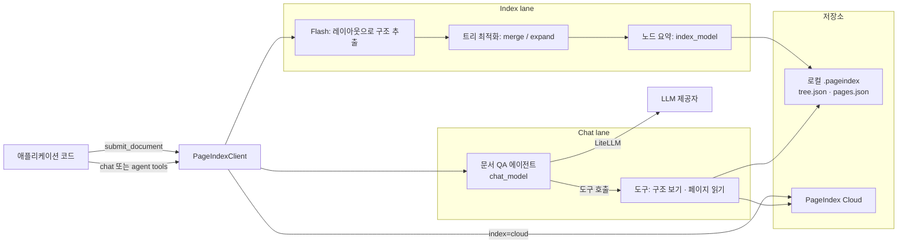

# PageIndex 핵심 개념과 동작 구조

> PageIndex를 이루는 트리 인덱스, 노드 요약, Flash 인덱싱, index/chat 레인, 에이전트 도구, 인용이 각각 무엇이고 어떻게 맞물려 동작하는지 다룹니다.

## 용어 한눈에 보기

| 키워드 | 설명 |
|---|---|
| Tree index | 문서의 장·절 구조를 그대로 옮긴 계층형 인덱스. 노드마다 제목, 페이지 범위, 요약을 가짐 |
| Node | 트리의 한 칸. `node_id`(4자리 문자열), `title`, `start_index`, `end_index`, `summary`, 하위 `nodes` |
| Flash | 로컬 기본 인덱싱 엔진. PDF 레이아웃 통계로 구조를 뽑고 LLM은 요약만 작성 |
| Standard | LLM이 목차 탐지부터 트리 생성까지 맡는 기존 파이프라인(`mode="standard"`) |
| Index lane | 트리를 만들고 요약하는 모델(`index_model`). 저렴한 기본 모델로 충분 |
| Chat lane | 트리를 탐색해 답하는 모델(`chat_model`). 가능한 좋은 모델 권장 |
| Agent tools | 에이전트가 쓰는 도구 묶음. `browse_documents`, `get_document`, `get_document_structure`, `get_page_content` |
| Citation | 답변 속 근거 태그. 로컬은 페이지 단위, Cloud는 레이아웃 블록 단위까지 |
| `toc_source` | 트리 구조의 출처. `detected` / `bookmarks` / `hybrid` / `pages` / `unreadable` |

---

## 1. 트리 인덱스 (Tree Index)

### 쉽게 설명하면

책 앞쪽의 목차에 "각 장이 무슨 내용인지 한두 문단 설명"을 붙여 둔 것입니다. 목차만 훑어도 어느 장을 펴야 할지 알 수 있습니다.

### 개발 관점에서는

PageIndex의 인덱스는 벡터 배열이 아니라 **JSON 트리**입니다. 노드는 문서의 실제 제목을 따르고, 각 노드는 자신이 덮는 페이지 범위(`start_index` ~ `end_index`, 1부터 시작, 양 끝 포함)와 그 범위의 요약을 가집니다. 검색 단계에서 모델이 보는 것은 이 트리(텍스트 제외)이고, 실제 본문은 필요할 때 페이지 번호로 따로 꺼냅니다.

0.2.21부터 로컬과 Cloud의 트리 모양이 하나로 통일되었습니다. 부모 노드의 범위와 요약은 하위 섹션까지 포함한 섹션 전체를 덮고, 부모의 첫 하위 섹션 앞에 있는 페이지는 `"<제목> (intro)"` 노드로 분리됩니다.

### 예제

```json
[
  {
    "title": "재무 정보",
    "node_id": "0007",
    "start_index": 38,
    "end_index": 61,
    "summary": "연결 손익, 부문별 실적, 현금흐름과 주요 재무 비율을 다룬다.",
    "nodes": [
      {
        "title": "손익 요약",
        "node_id": "0008",
        "start_index": 41,
        "end_index": 44,
        "summary": "2023년 매출 24.7조 원, 영업이익률 12.3%, 전년 대비 원가율 변화 설명."
      },
      {
        "title": "부문별 실적",
        "node_id": "0009",
        "start_index": 45,
        "end_index": 52,
        "summary": "가전·부품·서비스 부문별 매출과 영업이익, 환율 영향."
      }
    ]
  }
]
```

에이전트는 이 구조만 보고도 "영업이익률은 0008 노드, 41~44쪽"이라고 판단할 수 있습니다.

### 핵심

> 인덱스가 "의미 벡터"가 아니라 "사람이 읽을 수 있는 목차"이기 때문에, 검색 경로를 사람이 그대로 확인할 수 있습니다.

## 2. 노드 요약과 index lane

### 쉽게 설명하면

목차 제목만으로는 부족할 때가 있습니다. "기타 사항"이라는 제목 아래 핵심 수치가 숨어 있을 수 있으니, 각 장에 짧은 소개글을 붙여 두는 작업입니다.

### 개발 관점에서는

노드 요약은 인덱싱 시점에 **index lane 모델**이 씁니다. 공식 권장은 "index 모델은 기본 모델로 충분"입니다. 구조 자체는 레이아웃에서 나오고 모델은 요약과 다듬기만 하기 때문입니다. 요약은 `summary_max_words`(기본 150단어) 안에서 작성되고, 짧은 말단 노드는 요약 대신 원문을 그대로 씁니다.

한 번 만든 요약은 저장되어 이후 모든 질문에서 재사용됩니다. 그래서 인덱싱은 "문서당 한 번 내는 고정 비용"이고, 질문 비용은 chat lane에서 발생합니다.

### 예제

```python
from pageindex import PageIndexClient

client = PageIndexClient(
    index={"model": "gpt-5.6-luna", "summary_max_words": 80},  # 저렴한 모델 + 짧은 요약
    chat="gpt-5.6-sol",                                         # 탐색은 좋은 모델
)
```

### 핵심

> 요약은 "검색할 때 길잡이가 되는 메타데이터"입니다. 저렴한 모델로 한 번 만들고, 돈은 질문에 답하는 모델에 씁니다.

## 3. Flash와 Standard 인덱싱

### 쉽게 설명하면

목차를 만드는 두 가지 방법입니다. Flash는 "글자가 크고 굵고 번호가 붙은 줄은 제목"이라는 식으로 **모양을 보고** 목차를 만들고, Standard는 LLM에게 **내용을 읽혀서** 목차를 만듭니다.

### 개발 관점에서는

- **Flash(로컬 기본값)**: pdfium으로 글자 단위 정보를 뽑아 줄·블록·단(column)을 복원하고, 머리글·바닥글·워터마크를 걸러낸 뒤 제목 후보를 모아 개요를 조립합니다. PDF에 북마크가 있고 믿을 만하면 그것도 씁니다. 구조 생성에는 LLM이 없고, 그 뒤 트리 최적화(병합·확장)와 노드 요약에만 LLM을 씁니다.
- **Standard(`mode="standard"`)**: 목차 페이지 탐지, 제목-페이지 매칭, 검증을 LLM 호출로 수행하는 기존 파이프라인입니다. 더 느리지만 레이아웃이 특이한 문서에서 대안이 됩니다.

트리 최적화는 `optimize`로 조절합니다. `"full"`(기본)은 결정적 병합 + LLM 확장, `"merge"`는 LLM 없는 병합만, `"off"`는 원본 트리 그대로입니다. 세부 원리는 [트리 인덱스와 추론 탐색 깊이 보기](07-tree-index-and-search.md)에서 다룹니다.

### 예제

```python
# 기본: Flash + 최적화(full) + 요약
doc = client.submit_document("annual-report.pdf")

# 레이아웃이 특이해 Flash 결과가 마음에 들지 않을 때
doc = client.submit_document("odd-layout.pdf", mode="standard")
```

### 핵심

> Flash는 "구조는 규칙으로, 요약은 LLM으로" 나눠 인덱싱을 빠르고 싸게 만든 엔진입니다. 결과에 붙는 `toc_source`로 구조가 어디서 왔는지 확인할 수 있습니다.

## 4. index / chat 두 레인과 로컬·Cloud

### 쉽게 설명하면

"문서를 어디에 보관하고 정리하느냐"와 "누가 질문에 답하느냐"를 따로 고를 수 있습니다. 도서관(문서 보관)은 Cloud에 맡기고, 사서(답하는 모델)는 내가 계약한 모델을 쓰는 식입니다.

### 개발 관점에서는

`PageIndexClient`는 두 축으로 구성됩니다.

| 축 | 로컬 | Cloud |
|---|---|---|
| index (문서가 사는 곳) | 내 컴퓨터에서 인덱싱, `storage_path`(기본 `./.pageindex`)에 저장 | PageIndex가 파싱·OCR·트리 생성·저장 |
| chat (누가 답하나) | 내 모델, 내 키(LiteLLM 경유) | 내 모델(`chat_model` 지정 시) 또는 PageIndex 관리형 chat |

인자 없는 `PageIndexClient()`는 환경 변수에 `PAGEINDEX_API_KEY`가 있어도 **항상 로컬**입니다. Cloud는 `index="cloud"`나 `api_key=`로 코드에서 명시해야 합니다. "로컬 문서 + 관리형 chat" 조합은 관리형 chat이 내 디스크를 읽을 수 없으므로 불가능합니다.

### 예제

```python
from pageindex import PageIndexClient

local = PageIndexClient()                                   # 로컬 문서 + 내 모델(기본값)
cloud_own_model = PageIndexClient(index="cloud", chat="gpt-5.6-sol")  # Cloud 문서 + 내 모델
cloud_managed = PageIndexClient(index="cloud")              # Cloud 문서 + 관리형 chat
```

### 핵심

> `api_key`는 문서의 위치를 옮길 뿐, 모델을 바꾸지 않습니다. 같은 코드를 로컬에서 Cloud로 옮길 때 바뀌는 것은 index 쪽 한 줄입니다.

## 5. 에이전트 도구 (구조 보기 → 페이지 읽기)

### 쉽게 설명하면

사서에게 주는 업무 도구입니다. "서가 목록 보기", "책 상태 확인", "목차 보기", "특정 페이지 펴기" 네 가지만 쥐여 주고, 어떤 순서로 쓸지는 사서가 판단합니다.

### 개발 관점에서는

`chat()`의 내부와 `agent_tools()`가 공유하는 도구 계약은 PageIndex Cloud MCP 서버와 이름·스키마가 같습니다.

| 도구 | 하는 일 |
|---|---|
| `browse_documents` | 라이브러리의 문서 목록(이름, 설명) |
| `get_document` | 문서 상태와 메타데이터 확인 |
| `get_document_structure` | 텍스트를 뺀 트리(제목·범위·요약). 크면 `part`로 나눠 받음 |
| `get_page_content` | `"41-44"`, `"3,7,10"` 같은 페이지 지정으로 본문 읽기 |
| `remove_document` | 문서 삭제(`include_management=True`일 때만) |

에이전트 지시문에는 "20페이지를 넘는 문서는 구조를 먼저 보고 좁은 페이지 범위만 읽어라, 20페이지 이하면 바로 읽어라"라는 규칙이 들어 있습니다. 도구는 예외를 던지지 않고 `{"success": ...}` 또는 `{"error": ...}` JSON과 다음 행동 안내(`next_steps`)를 돌려줍니다.

### 예제

```python
tools = client.agent_tools()        # 프레임워크 무관 일반 함수 목록
print([t.__name__ for t in tools])
# ['browse_documents', 'get_document', 'get_document_structure', 'get_page_content']
```

### 핵심

> PageIndex의 "검색"은 함수 하나가 아니라 **도구 호출의 연쇄**입니다. 트리는 지도이고, 어디를 읽을지는 chat 모델이 정합니다.

## 6. 인용 (Citations)

### 쉽게 설명하면

답변 문장마다 "(보고서 42쪽)"처럼 출처를 다는 것입니다.

### 개발 관점에서는

`chat(citations=True)`로 물으면 모델이 `<cite doc="report.pdf" page="42"/>` 태그를 답에 넣습니다. `get_citations(answer)`는 이 태그를 문서 ID·페이지 목록으로 풀고, `resolve_citations(answer)`는 태그를 `[[1]](#pageindex-citation-01)` 같은 번호 링크로 바꾼 표시용 답변과 인용 목록을 돌려줍니다. Cloud 문서는 블록 단위(페이지 내 좌표 `bbox`)까지 내려갈 수 있습니다.

### 예제

```python
answer = client.chat("2023년 영업이익률은?", doc_id=doc_id, citations=True)
resolved = client.resolve_citations(answer, doc_id=doc_id)
print(resolved["answer"])                     # 번호 링크가 달린 답변
for c in resolved["citations"]:
    print(c["index"], c["document"], c["page"])
```

### 핵심

> 인용은 "모델이 실제로 읽은 페이지"를 사용자 화면까지 연결하는 장치입니다. 0.2.19에서 이름이 바뀐 이력이 있으니 버전을 확인하고 씁니다.

---

## 7. 전체 동작 구조



한 번의 질문이 처리되는 순서는 다음과 같습니다.

1. **시작점**: 문서를 처음 올리면 `submit_document()`가 PDF의 페이지 텍스트를 뽑고 Flash로 트리 구조를 만듭니다. 로컬에서는 이 호출 안에서 인덱싱이 끝나고, Cloud에서는 업로드 후 비동기로 처리됩니다(`wait=True`로 기다릴 수 있음).
2. **PageIndex가 개입하는 시점**: 트리 최적화와 노드 요약이 index lane 모델로 실행되고, 결과가 `tree.json`(구조·요약)과 `pages.json`(페이지 본문)으로 저장됩니다. 여기까지가 문서당 한 번 일어나는 일입니다.
3. **내부 처리**: `chat(question, doc_id=...)`가 호출되면 chat lane 모델로 문서 QA 에이전트가 만들어지고, 대상 문서 정보와 도구 사용 규칙이 지시문으로 들어갑니다.
4. **외부 시스템과의 연결**: 에이전트는 `get_document_structure`로 트리를 보고, 관련 노드의 페이지 범위를 `get_page_content`로 읽습니다. 부족하면 다른 노드를 더 읽습니다. 모델 호출은 LiteLLM을 거쳐 OpenAI·Anthropic·Bedrock·Vertex·OpenAI 호환 서버 등으로 나갑니다.
5. **결과 반환**: 에이전트가 읽은 페이지를 근거로 답을 만들고, 요청했다면 인용 태그를 붙여 반환합니다. 스트리밍(`stream=True`)이면 생각·도구 호출 과정이 텍스트로 흘러나옵니다.

---

[← 개요](README.md) · [설치와 첫 사용 →](02-getting-started.md)
