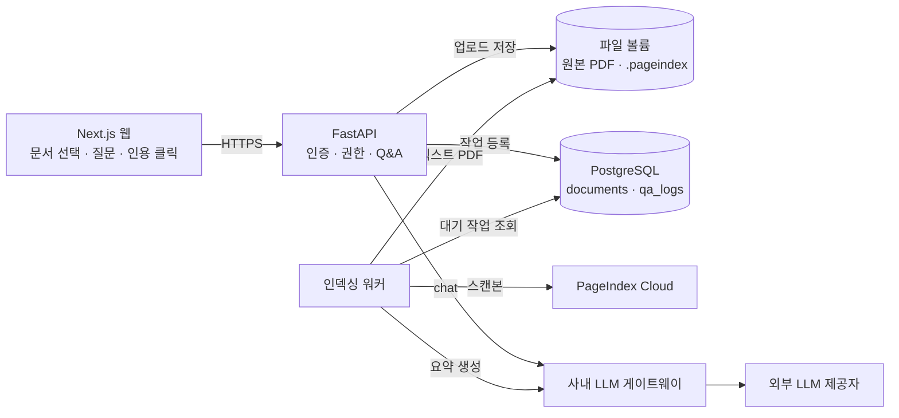

# PageIndex 활용 예시 ③ 서비스 운영과 실전 프로젝트

> Python 백엔드에서 PageIndex를 어느 계층에 두고 인덱싱과 질의응답을 어떻게 나누는지, 그리고 사내 문서 Q&A 포털에 실제로 적용하는 과정을 다룹니다.

## 서버에서의 활용

### 활용 사례

- **문서 업로드 → 비동기 인덱싱**: 업로드 API는 파일만 받고, 인덱싱은 별도 워커 프로세스가 처리합니다. 로컬 인덱싱은 수십 초~수 분 걸리고 CPU와 여러 프로세스를 쓰기 때문입니다.
- **질의응답 API**: `doc_id`와 질문을 받아 `chat()`을 호출하고, 인용을 풀어 프론트엔드에 페이지 링크와 함께 돌려줍니다.
- **스트리밍 응답**: `chat(stream=True)`의 텍스트 조각을 Server-Sent Events로 흘려 체감 지연을 줄입니다.
- **문서 성격에 따른 Local/Cloud 분기**: 텍스트 PDF는 로컬, 스캔본은 Cloud로 보내는 식으로 index 쪽만 나눕니다. chat 쪽 코드와 도구 계약은 같습니다.
- **사내 모델 게이트웨이 연결**: index/chat 레인마다 `backend={"base_url": ...}`로 사내 LLM 게이트웨이를 지정해, 문서 내용이 승인된 경로로만 나가게 합니다.

### 애플리케이션 구조

PageIndex는 **검색 계층(Retrieval)이자 외부 LLM 어댑터**에 해당합니다. 비즈니스 로직이 직접 부르기보다 서비스 계층 뒤에 감싸 둡니다.

```text
Controller (FastAPI 라우터)
 ↓  요청 검증, 인증, 권한 확인 (이 사용자가 이 doc_id를 볼 수 있는가)
Service (DocumentQAService)
 ↓  doc_id 조회, 대화 이력 구성, 인용 변환, 감사 로그
Retrieval Adapter (PageIndexClient 래퍼)
 ↓  chat(), resolve_citations(), submit_document()
Storage
    ├─ RDB: documents(id, name, doc_id, status, owner) · qa_logs
    ├─ 파일 볼륨: 원본 PDF, PageIndex storage_path(.pageindex)
    └─ 외부: LLM 제공자 / 사내 게이트웨이, (선택) PageIndex Cloud
```

| 위치 | 둘 것 | 이유 |
|---|---|---|
| Controller | 문서 접근 권한 검사 | PageIndex에는 사용자 개념이 없습니다. 누가 어떤 `doc_id`를 볼 수 있는지는 애플리케이션이 판단해야 합니다 |
| Service | 대화 이력, 인용 변환, 로그 | `chat()`은 상태가 없으므로 대화를 저장하고 다시 넘기는 책임이 여기 있습니다 |
| Adapter | `PageIndexClient` 생성과 호출 | 모델·저장 위치·Local/Cloud 설정을 한곳에 모아, 교체할 때 여기만 바꿉니다 |
| Worker | `submit_document()` | 무겁고 오래 걸리는 인덱싱을 요청 처리 경로에서 떼어냅니다 |

### 실제 코드

```python
# app/pageindex_adapter.py
import os

from pageindex import PageIndexClient

STORAGE = os.environ.get("PAGEINDEX_STORAGE", "/srv/pageindex")
GATEWAY = {"api_key": os.environ["LLM_GATEWAY_KEY"], "base_url": os.environ["LLM_GATEWAY_URL"]}


def make_client() -> PageIndexClient:
    # 한 곳에서만 설정한다. 스레드 안전성이 문서화되어 있지 않으므로 요청마다 새로 만든다
    return PageIndexClient(
        index={"model": "gpt-5.6-luna", "storage_path": STORAGE, "backend": GATEWAY,
               "summary_concurrency": 16},  # 게이트웨이 레이트 리밋에 맞춤
        chat={"model": "gpt-5.6-sol", "backend": GATEWAY},
    )
```

```python
# app/main.py
from fastapi import Depends, FastAPI, HTTPException
from pydantic import BaseModel

from .auth import current_user, can_read           # 애플리케이션의 인증·권한 모듈
from .db import get_document_row, save_qa_log
from .pageindex_adapter import make_client

app = FastAPI()


class AskRequest(BaseModel):
    messages: list[dict]   # [{"role": "user", "content": "..."}, ...]


@app.post("/documents/{document_id}/ask")
def ask(document_id: int, body: AskRequest, user=Depends(current_user)):
    row = get_document_row(document_id)
    if row is None or not can_read(user, row):
        raise HTTPException(404)
    if row.status != "ready":
        raise HTTPException(409, "문서 인덱싱이 아직 끝나지 않았습니다.")

    client = make_client()
    answer = client.chat(body.messages, doc_id=row.doc_id, citations=True, max_turns=12)
    resolved = client.resolve_citations(answer, doc_id=row.doc_id)
    save_qa_log(user.id, document_id, body.messages[-1]["content"], resolved)
    return resolved   # {"answer": "... [[1]](#pageindex-citation-01)", "citations": [...]}
```

`def`(비동기 아님)로 선언한 엔드포인트는 FastAPI가 스레드 풀에서 실행하므로, 동기 함수인 `chat()`이 이벤트 루프를 막지 않습니다. `max_turns`는 에이전트가 도구 호출을 몇 번까지 반복할지의 상한으로, 넘으면 "질문을 좁히거나 상한을 올리라"는 오류가 납니다. 질문당 비용과 지연의 상한 역할을 합니다.

---

## 실전 프로젝트 적용: 사내 규정·계약 문서 Q&A 포털

### 요구사항

직원 2,000명 규모 회사의 법무·총무팀이 쓰는 문서 Q&A 포털을 만듭니다.

- 문서: 사내 규정집, 표준 계약서, 공급 계약서 약 400건(건당 20~600페이지), 일부는 스캔본
- 직원은 웹에서 문서를 고르고 질문하며, 답변에는 반드시 근거 페이지가 붙어야 한다
- 부서별로 볼 수 있는 문서가 다르다
- 문서 내용은 사내 LLM 게이트웨이를 통해서만 외부 모델로 나갈 수 있다
- 법무팀은 어떤 질문에 어떤 페이지를 근거로 답했는지 나중에 확인할 수 있어야 한다

### 전체 구조



### 폴더 구조

```text
doc-qa-portal/
├── app/
│   ├── main.py                 # FastAPI 라우터 (업로드, 질문, 문서 목록)
│   ├── auth.py                 # SSO 사용자, 부서별 문서 권한
│   ├── db.py                   # documents, qa_logs 테이블 접근
│   ├── pageindex_adapter.py    # PageIndexClient 생성 (로컬/Cloud)
│   └── qa_service.py           # 대화 이력·인용 변환·감사 로그
├── worker/
│   └── index_worker.py         # 대기 문서를 인덱싱
├── web/                        # Next.js 프론트엔드
└── docker-compose.yml          # api, worker, postgres, 공유 볼륨
```

### 구현

**1. 업로드 API: 파일만 받고 작업을 등록**

```python
# app/main.py (일부)
import shutil
import uuid
from pathlib import Path

from fastapi import UploadFile

from .db import create_document_row

UPLOAD_DIR = Path("/srv/uploads")


@app.post("/documents")
def upload(file: UploadFile, scanned: bool = False, user=Depends(current_user)):
    if not file.filename.lower().endswith(".pdf"):
        raise HTTPException(400, "PDF만 업로드할 수 있습니다.")
    path = UPLOAD_DIR / f"{uuid.uuid4().hex}-{Path(file.filename).name}"
    with path.open("wb") as out:
        shutil.copyfileobj(file.file, out)
    doc = create_document_row(owner_dept=user.dept, path=str(path),
                              name=file.filename, scanned=scanned, status="queued")
    return {"id": doc.id, "status": doc.status}
```

**2. 인덱싱 워커: 문서 성격에 따라 Local/Cloud 선택**

```python
# worker/index_worker.py
import time

from pageindex import PageIndexAPIError, PageIndexClient

from app.db import claim_next_queued, mark_failed, mark_ready
from app.pageindex_adapter import make_client


def index_one(row) -> None:
    if row.scanned:
        client = PageIndexClient(index="cloud", chat="gpt-5.6-sol")  # OCR이 필요한 문서
        doc_id = client.submit_document(row.path, wait=True, metadata={"dept": row.owner_dept})["doc_id"]
        mark_ready(row.id, doc_id=doc_id, location="cloud")
    else:
        client = make_client()
        doc_id = client.submit_document(row.path, metadata={"dept": row.owner_dept})["doc_id"]
        mark_ready(row.id, doc_id=doc_id, location="local")


def main() -> None:
    while True:
        row = claim_next_queued()          # SELECT ... FOR UPDATE SKIP LOCKED
        if row is None:
            time.sleep(5)
            continue
        try:
            index_one(row)
        except (PageIndexAPIError, FileNotFoundError) as exc:
            mark_failed(row.id, reason=str(exc))   # 텍스트 없는 PDF 등은 사유와 함께 실패 처리


if __name__ == "__main__":   # Flash의 하위 프로세스 생성 때문에 필수
    main()
```

**3. Q&A 서비스: 문서 위치에 맞는 클라이언트로 질문**

```python
# app/qa_service.py
from pageindex import PageIndexClient

from .pageindex_adapter import GATEWAY, make_client


def client_for(row) -> PageIndexClient:
    if row.location == "cloud":
        # Cloud 문서 + 내 모델: 페이지 내용이 내 프로세스를 거쳐 게이트웨이로 간다
        return PageIndexClient(index="cloud", chat={"model": "gpt-5.6-sol", "backend": GATEWAY})
    return make_client()


def ask(row, messages: list[dict]) -> dict:
    client = client_for(row)
    answer = client.chat(messages, doc_id=row.doc_id, citations=True, max_turns=12)
    return client.resolve_citations(answer, doc_id=row.doc_id)
```

Cloud 문서에도 `chat_model`을 지정하면 관리형 chat 대신 내 프로세스의 에이전트가 답하므로, "문서 내용은 사내 게이트웨이로만 나간다"는 요구를 chat 단계에서는 지킬 수 있습니다. 다만 스캔본 원본 자체는 Cloud에 업로드되므로, 이 부분은 보안 검토 대상입니다.

### 실제 실행 흐름

"공급 계약서의 지체상금 상한"을 묻는 상황을 예로 듭니다.

1. **사용자 행동**: 구매팀 직원이 포털에서 `supply-contract-2026.pdf`를 고르고 "납품 지연 시 지체상금 상한은?"이라고 입력합니다.
2. **API 처리**: FastAPI가 SSO 사용자의 부서를 확인하고, 이 문서가 구매팀에 공개된 문서인지 `documents` 테이블로 검사합니다. 상태가 `ready`가 아니면 409를 돌려줍니다.
3. **PageIndex 호출**: `qa_service.ask()`가 문서 위치(local)에 맞는 클라이언트로 `chat(citations=True)`를 호출합니다.
4. **트리 탐색**: 에이전트가 `get_document_structure`로 계약서 트리를 보고 "제12조 지체상금(18~19쪽)"을 고른 뒤 `get_page_content("18-19")`로 읽습니다. 상한이 "별표 3"을 참조하면 별표 노드의 페이지를 추가로 읽습니다.
5. **외부 모델 호출**: 모든 모델 호출은 chat 레인의 `backend` 설정에 따라 사내 게이트웨이를 거쳐 나갑니다.
6. **결과 반환**: `resolve_citations()`가 번호 링크로 바꾼 답변과 인용 목록(문서, 페이지)을 돌려주고, 웹은 인용 번호를 누르면 원본 PDF 뷰어를 해당 페이지로 엽니다.
7. **기록**: `qa_logs`에 질문, 답변, 인용 페이지를 저장합니다. 더 엄밀한 감사가 필요하면 [활용 예시 ①](03-usage-document-qa.md#예제-2-에이전트가-읽은-페이지를-감사-로그로-남기기)처럼 도구 호출 이벤트에서 실제로 읽은 페이지도 함께 저장합니다.

---

[← 활용 예시 ② 에이전트에 문서 도구로 붙이기](04-usage-agent-integration.md) · [목차](README.md) · [장단점과 대안 비교 →](06-comparison.md)
