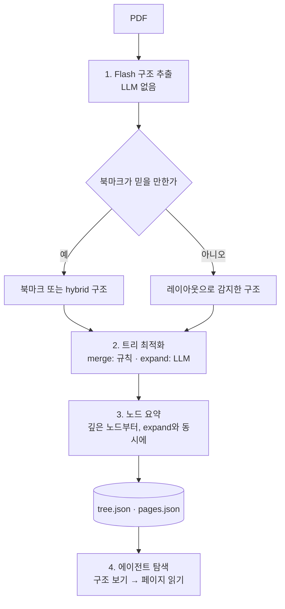

# PageIndex 트리 인덱스와 추론 탐색 깊이 보기

> PDF에서 트리가 어떤 단계로 만들어지고, 그 트리를 "탐색 비용"이라는 기준으로 어떻게 다듬으며, 에이전트가 완성된 트리를 어떤 규칙으로 탐색하는지 소스 코드 기준으로 다룹니다.

## 왜 이 주제인가

PageIndex의 정확도는 두 가지로 결정됩니다. **트리가 얼마나 좋은 지도인가**, 그리고 **에이전트가 그 지도를 얼마나 잘 읽는가**입니다. 트리가 잘못되면 좋은 모델도 엉뚱한 섹션으로 들어가고, 트리가 좋아도 탐색 규칙이 없으면 모델이 문서 전체를 읽으려 듭니다. 이 둘을 이해하면 "왜 이 문서에서는 답을 못 찾았는가"를 스스로 진단할 수 있습니다.

전체 흐름은 다음과 같습니다.



---

## 1. Flash: 레이아웃에서 구조를 뽑는 단계

### 무엇을 하는가

`pageindex/flash/main.py`의 오케스트레이터는 다음 순서로 실행되며, 문서 주석에 "순서 자체가 하중을 받는다(load-bearing)"고 적혀 있습니다. 뒤 단계가 앞 단계의 표시(annotation)를 소비하기 때문입니다.

| 순서 | 단계 | 하는 일 |
|---|---|---|
| 1 | 글자 단위 파싱 | pdfium으로 글자, 글꼴, 크기, 좌표를 추출(여러 프로세스 병렬) |
| 2 | 줄 묶기 | 글자 조각을 줄로 묶음 |
| 3 | 페이지 통계 | 페이지별 글자 크기 분포 등 계산 |
| 4 | 단(column) 감지 | 2단 편집을 감지하고 단을 고려해 줄을 다시 묶음 |
| 5 | 줄 번호 제거 | 법률 문서 등의 줄 번호 흔적 제거 후 통계 재계산 |
| 6 | 문서 통계 | 본문 글자 크기 같은 문서 전체 기준값 계산 |
| 7 | 블록·읽기 순서 | 줄을 블록으로 묶고 읽는 순서 부여 |
| 8 | 분류 | 머리글·바닥글·워터마크·목차 페이지·캡션·참고문헌·본문 문단 판별 |
| 9 | 문서 제목 감지 | 제목 블록 선택 |
| 10 | 개요 조립 | 제목 후보(크기, 굵기, 번호 체계, 주변 여백)를 모아 계층 트리로 조립 |

여기에 PDF 내장 북마크가 결합됩니다(`use_embedded_toc=True`, 기본값). 북마크가 깊고 믿을 만하면 뼈대로 쓰고 빠진 섹션을 감지 결과로 채우며, 북마크가 얕으면 장 단위 뼈대로만 쓰고 감지한 노드를 그 아래에 다시 매답니다. 쓸모없는 북마크는 무시합니다.

### 결과에 남는 신호: `toc_source`

| 값 | 의미 | 실무 해석 |
|---|---|---|
| `detected` | 레이아웃에서 감지 | 일반적인 경우 |
| `bookmarks` | 내장 북마크 사용 | 북마크 품질이 곧 트리 품질 |
| `hybrid` | 북마크 뼈대 + 감지 섹션 | 대체로 가장 좋은 경우 |
| `pages` | 계층을 못 찾아 페이지당 노드 하나(`Page N`) | 트리 탐색의 이점이 거의 없음. 10페이지를 넘으면 로컬 클라이언트가 인덱싱을 거부 |
| `unreadable` | 텍스트가 있는 페이지가 없음 | 스캔본. OCR 필요 |

어떤 페이지도 트리에서 빠지지 않도록, 첫 제목이 1페이지보다 뒤에 나오면 그 앞을 `Preface` 노드로, 부모의 첫 하위 섹션 앞 페이지를 `"<부모 제목> (intro)"` 노드로 만듭니다.

### 핵심

> Flash는 "사람이 제목을 알아보는 시각적 단서"를 규칙으로 옮긴 것입니다. 그래서 언어나 문자 체계와 무관하게 같은 레이아웃이면 같은 제목을 뽑지만, 시각적 단서가 없는 문서에서는 구조를 만들 수 없습니다.

---

## 2. 트리 최적화: "탐색 비용"으로 나누고 합치기

레이아웃에서 나온 트리는 그대로 쓰기에 두 가지 문제가 있습니다. 어떤 노드는 너무 커서(제목 하나 아래 40페이지) 에이전트가 고르고도 40페이지를 다 읽어야 하고, 어떤 노드는 너무 잘게 쪼개져서(1페이지짜리 소제목 여러 개) 구조를 읽는 비용만 늘립니다. `pageindex/tree_optimize.py`는 이것을 **최악의 경우 탐색 비용(페이지 수)**이라는 하나의 기준으로 판단합니다.

### 비용 정의

- `S(v)`: 노드 v를 펼치지 않고 통째로 읽을 때 드는 페이지 수 = v가 덮는 전체 범위
- `R(v)`: v를 경유하며 제목·요약·하위 설명을 보는 비용 = 1페이지(`ROUTING_COST`)
- `S_residual(v)`: v의 페이지 중 어떤 하위 노드에도 속하지 않는 페이지 수

### expand: 큰 노드를 LLM으로 쪼개기

하위 노드가 없는 노드 v가 5페이지(`TRIGGER_PAGES`)보다 크면, LLM에게 그 페이지들을 보여주고 "이 범위 안에서 시작하는 하위 제목과 시작 페이지"를 묻습니다.

```text
collapse_cost = S(v)
expand_cost   = R(v) + max(S_residual(v), 가장 큰 하위 노드의 S)
expand_cost < collapse_cost 일 때만 펼친다 (같으면 펼치지 않음)
```

> 예: 40페이지짜리 "부문별 실적" 노드에서 LLM이 10페이지씩 4개 부문 제목을 찾았다면, expand_cost = 1 + 10 = 11 < 40 이므로 펼칩니다. 에이전트는 최악의 경우에도 40페이지 대신 11페이지 분량만 보면 됩니다.

expand 프롬프트에는 "문서에 실제로 인쇄된 제목만 쓰고, 지어내거나 바꿔 쓰지 말 것", "머리글·표의 열 이름·상호 참조는 제목이 아님", "연속된 산문이나 한 표가 이어지는 구간이면 빈 목록을 돌려줄 것(정상적인 답)" 같은 규칙이 있습니다. LLM이 구조를 지어내는 것을 막는 장치입니다. expand는 노드 여러 개를 동시에(최대 32개) 처리합니다.

### merge: 쓸모없이 잘게 나뉜 하위 트리 합치기

하위 트리가 있는 노드는 아래에서부터 다음 기준으로 판단합니다.

```text
merge_cost    = S(v)
tree_cost(v)  = S(v)                                         (v가 말단일 때)
              = R(v) + max(S_residual(v), 하위 노드들의 tree_cost 최댓값)   (펼쳐져 있을 때)
merge_cost <= tree_cost(v) 이면 합친다 (같으면 합침)
```

> 예: 2페이지짜리 노드 아래 1페이지씩 소제목 두 개가 있으면, tree_cost = 1 + 1 = 2, merge_cost = 2 이므로 합칩니다. 구조를 한 단계 더 보는 비용이 페이지를 그냥 읽는 비용보다 작지 않기 때문입니다.

합쳐서 사라진 하위 제목은 부모의 `key_items`에 남깁니다. 페이지는 부모를 통째로 읽으면 여전히 닿지만, 제목은 에이전트가 길을 찾는 단서이므로 버리지 않는 것입니다.

같은 페이지를 덮는 형제 노드는 따로 합칩니다(`merge_same_page`). 검색 단위가 페이지이므로 에이전트가 어느 쪽으로 가든 같은 텍스트를 읽게 되고, 요약도 거의 같아져 구분이 불가능하기 때문입니다.

### `optimize` 옵션의 의미

| 값 | merge | expand | LLM 사용 |
|---|:-:|:-:|:-:|
| `"full"`(기본) | O | O | O |
| `"merge"` | O | X | X |
| `"off"` | X | X | X |

스캔본이나 북마크만 있는 PDF처럼 페이지 텍스트가 없으면 expand는 자동으로 건너뜁니다.

### 핵심

> 트리 최적화의 목표는 "예쁜 목차"가 아니라 **에이전트가 최악의 경우 읽어야 하는 페이지 수를 줄이는 것**입니다. 그래서 같은 문서라도 원래 목차와 최종 트리가 다를 수 있습니다.

---

## 3. 노드 요약: 깊은 곳부터, 쉬지 않고

요약은 index lane 모델이 노드마다 씁니다. 0.2.20부터 가장 깊은 노드부터 요약을 시작하고, expand가 아직 다른 노드를 쪼개는 중에도 준비된 노드의 요약을 먼저 돌립니다. 부모 요약은 하위 섹션 요약이 끝나는 즉시 시작합니다. 공식 수치로 222페이지 보고서가 98초에서 73초로, 758페이지 책이 174초에서 137초로 줄었습니다.

요약은 `summary_max_words`(기본 150단어) 안에서 작성되고, 짧은 말단 노드는 요약 대신 자기 원문을 그대로 씁니다. 부모의 요약은 하위 섹션까지 포함한 섹션 전체를 설명합니다(0.2.21에서 로컬·Cloud 모두 이 규칙으로 통일).

---

## 4. 에이전트 탐색: 도구 계약과 탐색 규칙

트리가 완성되면 검색은 `pageindex/agent_tools.py`의 도구와 지시문이 담당합니다.

### 탐색 규칙

에이전트 지시문의 "READING WORKFLOW"는 짧습니다.

- **20페이지 초과 문서**: `get_document_structure()`로 구조를 먼저 보고, 관련 섹션의 페이지 범위만 `get_page_content()`로 읽는다.
- **20페이지 이하 문서**: 구조를 건너뛰고 `get_page_content()`로 바로 읽는다.

`get_page_content`의 도구 설명에는 "좁고 표적화된 페이지 범위를 쓰고, 절대 문서 전체를 한 번에 읽지 말 것"이 들어 있습니다. 페이지 지정은 `"5"`, `"3,7,10"`, `"5-10"`, `"1-3,7,9-12"` 형식만 허용됩니다.

### 큰 트리는 나눠서 보여준다

`get_document_structure`는 텍스트를 뺀 트리(제목, `node_id`, 페이지 범위, 요약, 하위 노드)를 돌려줍니다. 직렬화한 크기가 도구 응답 한도(10만 자)의 95%를 넘으면 노드 단위로 여러 `part`로 나누고, 응답의 `pagination.has_more`가 `false`가 될 때까지 `part`를 올려 가며 읽으라고 안내합니다. 1,000페이지 교재의 트리도 모델 컨텍스트를 한 번에 채우지 않게 하는 장치입니다.

### 실패해도 예외 대신 안내를 준다

도구는 예외를 던지지 않고 `{"success": true, ...}` 또는 `{"error": ..., "next_steps": {...}}` JSON을 돌려줍니다. 예를 들어 처리 중인 문서를 읽으려 하면 "처리 중이니 `wait_for_completion`을 쓰라"는 선택지를 줍니다. 모델이 문자열로 보낸 `"false"` 같은 불리언도 도구 쪽에서 보정합니다. 에이전트 루프가 사소한 오류로 끊기지 않게 하려는 설계입니다(Cloud의 인증 실패·사용량 초과 같은 치명적 오류만 예외로 올립니다).

### 범위 제한과 끈기

- `chat(doc_id=...)`로 대상을 정하면, 로컬 문서에서는 다른 문서를 열 수 없도록 **도구 계층에서** 막습니다. 프롬프트로 부탁하는 것보다 강한 보장입니다.
- 문서를 특정하지 않은 질문에서는 "PERSISTENCE" 규칙이 적용됩니다. 첫 검색에서 못 찾았다고 포기하지 말고, 동의어로 다시 찾고, 라이브러리 전체를 페이지 단위로 훑은 다음에야 "없다"고 결론 내리며, 일반 지식으로 대신 답하지 말라는 내용입니다.

### 핵심

> 탐색 품질은 모델의 똑똑함만이 아니라 **도구가 강제하는 읽기 습관**(구조 먼저, 좁은 범위, 범위 밖 금지, 쉽게 포기하지 않기)에서 나옵니다.

---

## 5. 직접 확인해 보기

트리 품질이 의심될 때는 질문을 바꾸기 전에 트리부터 봅니다.

```python
# inspect_tree.py
from pageindex import page_index_flash
from pageindex.utils import get_node_path, print_tree


def main() -> None:
    # LLM 없이 레이아웃 구조만: 비용 0, 몇 초
    raw = page_index_flash("contract.pdf", summary=False, optimize=False)
    print("toc_source:", raw["toc_source"])
    print_tree(raw["structure"])

    # 결정적 병합까지 (여전히 LLM 없음)
    merged = page_index_flash("contract.pdf", summary=False, optimize="merge")
    print(merged.get("optimize"))   # 병합 횟수와 전후 탐색 비용 지표

    # 특정 노드까지의 경로: 에이전트가 거쳐 갈 목차 경로
    for node in get_node_path(merged["structure"], "0012"):
        print(node["title"], node["start_index"], node["end_index"])


if __name__ == "__main__":
    main()
```

저장소 예제 폴더의 408페이지 규정안 PDF(`Regulation Best Interest_proposed rule.pdf`)로 0.2.21에서 실행하면 API 키 없이 다음과 같은 결과가 나옵니다(요약).

```text
toc_source: bookmarks
[0000] SUMMARY
[0001] FOR FURTHER INFORMATION CONTACT
{'merges': 11, 'expands': 0, 'same_page_merges': 1, ...,
 'before': {'frontier_nodes': 147, 'worst_case_search_complexity': 18, 'average_search_complexity': 9.152, 'max_depth': 6, ...},
 'after':  {'frontier_nodes': 138, 'worst_case_search_complexity': 18, 'average_search_complexity': 8.985, 'max_depth': 5, ...}}
I.   Introduction 6 44
A. Background 12 36
A. Background (intro) 12 22
```

북마크로 구조를 잡았고, 병합 11번으로 말단 노드가 147개에서 138개로 줄면서 평균 탐색 비용(페이지)이 조금 낮아졌습니다. 마지막 세 줄은 노드 경로로, `(intro)` 노드가 부모의 첫 하위 섹션 앞 페이지(12~22쪽)를 맡는 모습입니다.

1. `summary=False, optimize=False`는 LLM을 전혀 쓰지 않으므로 키 없이도 돌릴 수 있습니다. `toc_source`가 `pages`라면 이 문서는 트리 탐색의 이점을 거의 못 봅니다.
2. `optimize="merge"`의 결과에는 병합 횟수와 최적화 전후 탐색 비용이 함께 기록됩니다.
3. `get_node_path`, `get_node`, `get_node_parent`, `get_node_map`(0.2.21 추가)은 트리를 한 번 받아 로컬에서 탐색하는 도우미입니다. 에이전트가 왜 그 노드로 갔는지 경로를 확인할 때 유용합니다.

저장소를 클론했다면 최적화 결정만 미리 볼 수도 있습니다.

```bash
python3 -m pageindex.tree_optimize --pdf contract.pdf --structure tree.json --plan
```

`--plan`은 API 호출 없이 노드별 비용과 병합·확장 결정만 출력합니다.

---

[← 장단점과 대안 비교](06-comparison.md) · [목차](README.md) · [주의할 점과 FAQ →](08-pitfalls-faq.md)
