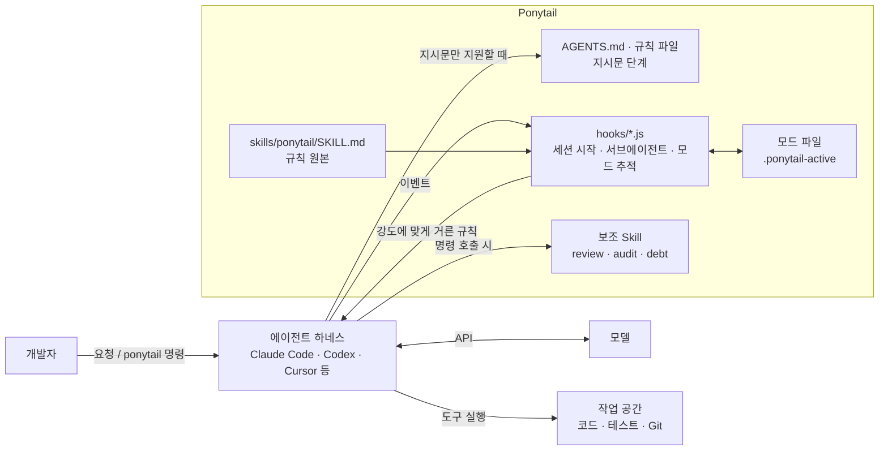
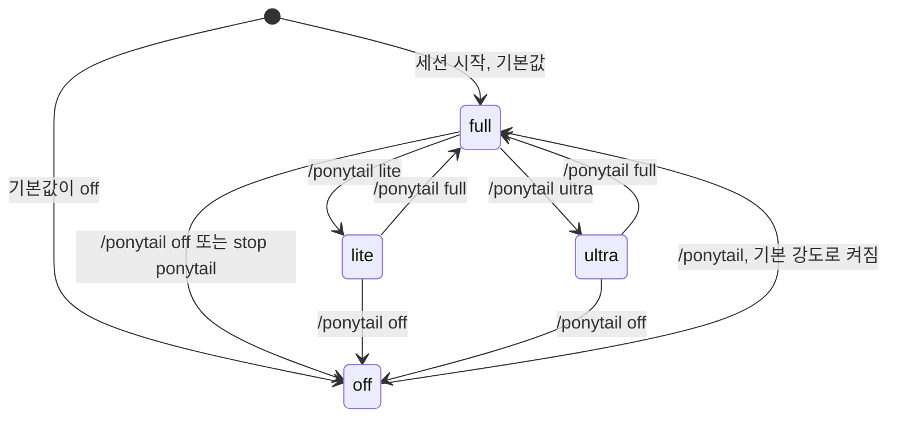

# Ponytail 핵심 개념과 동작 구조

> Ponytail을 이루는 7단 사다리, 강도, 줄이지 않는 것, `ponytail:` 주석, 보조 Skill, 플러그인·지시문 단계가 각각 무엇이고 어떻게 맞물려 동작하는지 다룹니다.

## 용어 한눈에 보기

| 키워드 | 설명 |
|---|---|
| Ruleset | `skills/ponytail/SKILL.md`에 있는 규칙 본문. 에이전트 컨텍스트에 들어가는 실체 |
| Ladder (사다리) | 코드를 쓰기 전에 위에서부터 확인하는 7개 질문. 처음 성립하는 단계에서 멈춤 |
| Intensity (강도) | `lite` / `full` / `ultra`. 사다리를 얼마나 강하게 적용할지 정함. 기본값 `full` |
| Not lazy about | 절대 줄이지 않는 것. 신뢰 경계 입력 검증, 데이터 손실 방지 오류 처리, 보안, 접근성 등 |
| `ponytail:` 주석 | 한계가 알려진 의도적 단순화에 한계와 업그레이드 시점을 적는 주석 규약 |
| 보조 Skill | `ponytail-review`, `ponytail-audit`, `ponytail-debt`, `ponytail-gain`, `ponytail-help` |
| Plugin tier | Hook으로 규칙을 자동 주입하고 `/ponytail` 강도 전환이 되는 에이전트 지원 방식 |
| Instruction tier | `AGENTS.md`나 규칙 파일만 읽는 에이전트 지원 방식. 강도 전환·명령 없음 |
| Adapter | 같은 규칙을 특정 에이전트 형식으로 전달하는 얇은 파일(매니페스트, Hook 설정, 규칙 사본) |

---

## 1. 7단 사다리 (The ladder)

### 쉽게 설명하면

경험 많은 시니어 개발자는 "이거 만들어 주세요"라는 말을 들으면 바로 코드를 쓰지 않습니다. "이거 진짜 필요해요? 저번에 만든 거 있지 않아요? 브라우저에 원래 있는 기능 아니에요?"를 먼저 묻습니다. 사다리는 그 질문 순서를 적어 둔 것입니다.

### 개발 관점에서는

에이전트는 코드를 쓰기 전에 아래 질문을 위에서부터 확인하고, **처음으로 "예"가 되는 단계에서 멈춥니다.**

| 단계 | 질문 | 예 |
|---|---|---|
| 1 | 이게 존재해야 하는가? (YAGNI) | "나중에 쓸지도 모르는" 설정 옵션은 만들지 않고 한 줄로 그 사실만 말함 |
| 2 | 이미 이 코드베이스에 있는가? | `src/lib/slug.ts`에 있는 함수를 다시 만들지 않고 import |
| 3 | 표준 라이브러리가 하는가? | 직접 만든 캐시 클래스 대신 `functools.lru_cache` |
| 4 | 네이티브 플랫폼 기능이 있는가? | 날짜 선택기 라이브러리 대신 `<input type="date">`, JS 대신 CSS, 앱 코드 대신 DB 제약 |
| 5 | 이미 설치된 의존성이 해결하는가? | 새 패키지를 추가하지 않고 이미 있는 것 사용 |
| 6 | 한 줄로 되는가? | 한 줄로 작성 |
| 7 | 그제야 | 동작하는 최소한의 코드 |

중요한 단서가 두 가지 붙어 있습니다.

- **사다리는 이해한 다음에 오릅니다.** 작업과 그 작업이 닿는 코드를 먼저 읽고, 실제 흐름을 끝까지 따라간 뒤에 단계를 고릅니다. 이해 없이 작은 diff를 내는 것은 "효율로 위장한 게으름"이라고 규칙이 직접 경고합니다.
- **버그 수정은 증상이 아니라 근본 원인을 고칩니다.** 수정할 함수의 호출부를 모두 찾고(grep), 모든 호출이 지나가는 공유 함수에 가드를 한 번 넣습니다. 호출부마다 가드를 넣는 것보다 diff가 작고, 티켓에 적힌 경로만 고쳐서 다른 호출부가 여전히 깨져 있는 상황도 막습니다.

### 예제

"이 API 응답을 캐시해 줘"라는 요청에 대한 사다리 적용입니다.

```python
from functools import lru_cache

@lru_cache(maxsize=1000)  # 3단계: 표준 라이브러리
def fetch_exchange_rate(currency: str) -> float:
    return http_get(f"/rates/{currency}").json()["rate"]
```

응답 끝에는 "생략: 직접 만든 캐시 클래스, 추가 시점: `lru_cache`로 부족하다는 측정 결과가 나올 때"처럼 생략한 것과 추가할 조건이 붙습니다.

### 핵심

> 사다리는 "가장 짧은 코드"를 찾는 게임이 아니라 "새로 만들지 않아도 되는 이유"를 먼저 찾는 순서입니다.

## 2. 강도 (lite / full / ultra)

### 쉽게 설명하면

같은 시니어라도 기분에 따라 반응이 다릅니다. "만들어 드릴게요, 근데 이것도 있어요"(lite), "그냥 이걸로 하세요"(full), "그거 왜 필요한데요?"(ultra).

### 개발 관점에서는

| 강도 | 동작 |
|---|---|
| `lite` | 요청한 대로 만들되, 더 게으른 대안을 한 줄로 알려 주고 선택은 사용자에게 맡김 |
| `full` | 사다리를 강제. 표준 라이브러리와 네이티브 우선, 가장 짧은 diff와 설명. 기본값 |
| `ultra` | 삭제가 추가보다 먼저. 한 줄짜리를 내놓으면서 요구사항의 나머지에 이의를 제기 |

규칙 본문에는 강도별 표 행과 예시가 모두 들어 있지만, 실제로 주입될 때는 **현재 강도에 해당하는 행과 예시만 남기고 나머지는 걸러집니다.** 이 필터링이 어떻게 이루어지는지는 [규칙 주입 구조 깊이 보기](07-rule-injection.md)에서 다룹니다.

### 예제

"API 응답에 캐시를 추가해 줘"에 대한 강도별 응답 예시(규칙 본문의 예를 옮긴 것)입니다.

```text
lite : 캐시 클래스 추가했습니다. 참고로 functools.lru_cache 한 줄로도 됩니다.
full : fetch 함수에 @lru_cache(maxsize=1000). 직접 만든 캐시 클래스는 생략, lru_cache가 부족하다는 측정이 나오면 추가.
ultra: 프로파일러가 필요하다고 할 때까지 캐시 없음. 그때 @lru_cache. 직접 만든 TTL 캐시는 버그 농장입니다.
```

### 핵심

> 처음 도입할 때는 `lite`로 대안만 보고, 익숙해지면 기본값 `full`로 씁니다. `ultra`는 정리 작업처럼 "지우는 것"이 목표일 때만 씁니다.

## 3. 줄이지 않는 것 (When NOT to be lazy)

### 쉽게 설명하면

게으른 것과 대충 하는 것은 다릅니다. 좋은 시니어는 코드를 줄여도 문단속은 빼먹지 않습니다.

### 개발 관점에서는

규칙은 다음 항목을 **절대 단순화하지 않는다**고 명시합니다.

- 신뢰 경계(사용자 입력, 외부 API 응답, 파일명 등)의 입력 검증
- 데이터 손실을 막는 오류 처리
- 보안 조치
- 접근성 기본(레이블, 키보드 조작 등)
- 실제 하드웨어 보정값(시계는 틀어지고 센서는 오차가 있으므로 보정 손잡이는 남김)
- 사용자가 명시적으로 요청한 것. 사용자가 전체 버전을 고집하면 다시 따지지 않고 만듭니다.

여기에 **최소 검증 하나**가 더해집니다. 분기·루프·파서·금전·보안 경로처럼 단순하지 않은 로직에는, 로직이 깨지면 실패하는 가장 작은 검사 하나(`assert` 기반 self-check나 작은 테스트 파일 하나)를 남깁니다. 테스트 프레임워크나 함수별 테스트 묶음까지는 요청이 없으면 만들지 않고, 한 줄짜리 코드에는 테스트도 붙이지 않습니다.

### 예제

신뢰할 수 없는 파일명을 업로드 디렉터리에 붙이는 함수입니다. "짧게"만 강조하면 `path.join(base, name)` 한 줄이 되지만, Ponytail은 경로 탐색 검사를 남깁니다.

```ts
import path from 'node:path';

export function safeJoin(baseDir: string, filename: string): string {
  const base = path.resolve(baseDir);
  const target = path.resolve(base, filename);
  // 신뢰 경계: ../../ 로 디렉터리를 벗어나는 파일명 차단
  if (!target.startsWith(base + path.sep)) throw new Error('invalid filename');
  return target;
}

// 최소 검증 하나
import assert from 'node:assert';
assert.throws(() => safeJoin('/srv/uploads', '../../etc/passwd'));
assert.equal(safeJoin('/srv/uploads', 'a.png'), path.resolve('/srv/uploads/a.png'));
```

공개된 벤치마크의 `safe-path` 작업에서 Ponytail이 한 줄 프롬프트보다 약 3줄 더 쓴 부분이 바로 이 경로 탐색 검사였습니다.

### 핵심

> Ponytail이 줄이는 것은 "필요 없는 코드"이지 "필요한 방어 코드"가 아닙니다. 이 목록이 단순한 "짧게 써라" 프롬프트와 가장 크게 다른 점입니다.

## 4. `ponytail:` 주석과 출력 형식

### 쉽게 설명하면

일부러 대충 만든 곳에 "여기는 일부러 이렇게 했고, 이럴 때 바꾸세요"라는 포스트잇을 붙이는 것입니다.

### 개발 관점에서는

전역 락, O(n²) 스캔, 단순한 휴리스틱처럼 **한계가 알려진 의도적 단순화**에는 `ponytail:` 주석으로 한계(ceiling)와 업그레이드 경로를 남깁니다. 이 주석은 나중에 `/ponytail-debt`가 grep으로 모아 부채 장부를 만드는 입력이 됩니다.

응답 형식도 정해져 있습니다. 코드가 먼저 나오고, 그 뒤에는 "무엇을 생략했고 언제 추가하면 되는지"를 최대 세 줄로만 씁니다. 사용자가 명시적으로 요청한 설명(보고서, 단계별 설명)은 예외입니다.

```text
[code] → skipped: [X], add when [Y].
```

### 예제

```ts
// ponytail: 프로세스 단위 Map, 인스턴스가 2대 이상이 되면 Redis로 옮길 것
const attempts = new Map<string, number>();
```

### 핵심

> 단순화는 숨기면 부채가 되고, 표시하면 계획이 됩니다.

## 5. 보조 Skill 다섯 개

### 쉽게 설명하면

코드를 쓸 때의 태도(본체 Skill) 말고도, 이미 있는 코드를 보는 도구들이 따로 있습니다.

### 개발 관점에서는

| Skill(명령) | 하는 일 | 범위 |
|---|---|---|
| `/ponytail-review` | 현재 diff에서 지울 것을 한 줄씩 나열하고 `net: -<N> lines possible.`로 끝냄 | 과잉 설계만. 정확성·보안·성능은 범위 밖 |
| `/ponytail-audit` | diff가 아니라 저장소 전체를 감사해 큰 것부터 순위대로 나열 | `delete:` 전에는 테스트까지 포함해 저장소 전체를 grep |
| `/ponytail-debt` | `ponytail:` 주석을 모아 부채 장부를 만들고, 업그레이드 조건이 없는 항목에 `no-trigger` 표시 | 읽기만 하고 파일은 바꾸지 않음 |
| `/ponytail-gain` | 공개 벤치마크의 효과 점수판 표시 | 현재 저장소의 수치가 아님 |
| `/ponytail-help` | 명령 요약 | - |

리뷰와 감사 결과는 `delete:`, `stdlib:`, `native:`, `reuse:`, `yagni:`, `shrink:` 여섯 가지 태그로 분류됩니다. `reuse:` 태그는 v4.11.0에서 추가되었습니다. 실제 사용 방법은 [활용 예시 ② 기존 코드 리뷰와 부채 관리](04-usage-review-debt.md)에서 다룹니다.

### 핵심

> 본체 Skill은 "새로 쓰는 코드"를, 보조 Skill은 "이미 있는 코드"를 다룹니다. 모두 목록만 주고 직접 고치지는 않습니다.

## 6. 플러그인 단계와 지시문 단계

### 쉽게 설명하면

같은 규칙을 전달하는 방법이 두 가지입니다. 하나는 비서가 매 회의 시작마다 메모를 책상에 올려 두는 방식(플러그인), 다른 하나는 사무실 벽에 붙여 두는 방식(지시문)입니다.

### 개발 관점에서는

| 구분 | 대표 에이전트 | 규칙 전달 | 강도 전환·명령 |
|---|---|---|---|
| 플러그인 단계 | Claude Code, Codex, Copilot CLI, OpenCode, pi, Hermes, Gemini CLI, Grok Build, Cursor(Hook 설치), Qoder(Hook 설정) | Hook이나 플러그인이 세션 시작 또는 매 턴에 주입 | O (에이전트마다 범위 차이 있음) |
| 지시문 단계 | Windsurf, Cline, Copilot Chat, Kiro, Zed, Amp, Jules, Junie, Antigravity 등 | `AGENTS.md`나 전용 규칙 파일을 항상 읽음 | X |

저장소는 이를 "어댑터는 얇게 유지한다"는 원칙으로 관리합니다. Skill이나 Hook을 지원하는 에이전트는 기존 `skills/`, `hooks/`를 가리키게 하고, 지시문만 지원하는 에이전트의 규칙 사본은 `AGENTS.md`와 내용을 맞춥니다(`scripts/check-rule-copies.js`로 검사).

### 핵심

> 규칙의 원본은 하나(`SKILL.md`, 압축본 `AGENTS.md`)이고, 에이전트별 파일은 전달 방법만 다릅니다. 기능 차이는 "규칙 내용"이 아니라 "전달 방법"에서 생깁니다.

---

## 7. 전체 동작 구조

Ponytail은 애플리케이션 코드에 들어가지 않고, **개발자와 모델 사이의 에이전트 하네스 안에서 규칙을 전달하는 계층**입니다.



한 번의 작업이 처리되는 순서는 다음과 같습니다(Claude Code 기준).

1. **시작점**: 세션이 시작(또는 재개, `/clear`, 컨텍스트 압축)되면 `SessionStart` Hook이 기본 강도를 정하고, 모드 파일에 기록한 뒤, 그 강도에 맞게 거른 규칙 본문을 컨텍스트에 넣습니다.
2. **Ponytail이 개입하는 시점**: 개발자가 "판매 시작일 입력 칸 추가"를 요청하면, 모델은 이미 받은 규칙에 따라 관련 코드를 읽고 사다리를 오릅니다. 코딩 작업이면 Skill 설명과도 맞기 때문에 Skill이 다시 호출될 수 있습니다.
3. **내부 처리**: 모델이 탐색이나 리뷰를 위해 서브에이전트를 띄우면 `SubagentStart` Hook이 같은 규칙을 서브에이전트에도 주입합니다. 개발자가 `/ponytail ultra`를 입력하면 `UserPromptSubmit` Hook이 모드 파일을 바꿉니다.
4. **외부 시스템과의 연결**: Ponytail은 모델 호출이나 도구 실행에 직접 끼어들지 않습니다. 파일 수정, 셸 실행, 모델 API는 모두 하네스 설정을 그대로 따르고, Ponytail은 컨텍스트에 들어가는 "판단 기준"만 바꿉니다.
5. **결과 반환**: 모델은 코드를 먼저 내고, 생략한 것과 추가할 시점을 짧게 덧붙입니다. 의도적 단순화에는 `ponytail:` 주석이 남아 나중에 `/ponytail-debt`로 모을 수 있습니다.

강도가 바뀌는 흐름을 상태로 보면 다음과 같습니다.



---

[← 개요](README.md) · [설치와 첫 사용 →](02-getting-started.md)
