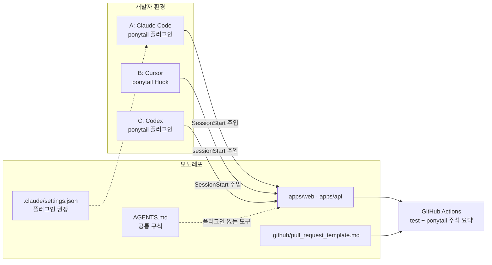

# Ponytail 활용 예시 ③ 팀·다중 에이전트 운영

> 여러 사람이 서로 다른 에이전트를 쓰는 팀에서 Ponytail 규칙을 공유하는 방법, 백엔드 코드에서 사다리가 어디에 적용되는지, 작은 서비스에 실제로 도입하는 과정을 다룹니다.

## 팀·서버 환경에서의 활용

Ponytail은 서버 런타임에 들어가는 라이브러리가 아닙니다. 대신 **서버 코드를 쓰는 에이전트의 판단 기준**과 **팀 단위 규칙 공유**에 쓰입니다.

### 활용 사례

- **저장소에 공통 바닥 깔기**: 루트에 `AGENTS.md`를 커밋하면 Codex, Zed, Amp, Jules, OpenCode 등 이 파일을 읽는 에이전트는 플러그인 없이도 같은 규칙을 받습니다.
- **개인별 플러그인으로 강도 조절**: Claude Code·Codex·Cursor 사용자는 플러그인이나 Hook을 설치해 `/ponytail lite|full|ultra`와 리뷰 명령을 씁니다.
- **서브에이전트 범위 지정**: 읽기 전용 탐색 에이전트에는 규칙이 필요 없으므로 `PONYTAIL_SUBAGENT_MATCHER`로 코드를 쓰는 에이전트에만 주입합니다.
- **공유 게이트웨이 권한 관리**: Hermes Agent처럼 여러 사람이 한 프로세스를 공유하는 환경에서는 강도가 프로세스 단위로 바뀌므로, `/ponytail` 명령을 신뢰할 수 있는 사용자로 제한하라고 안내합니다.
- **부채 가시화**: `ponytail:` 주석 목록을 PR 요약에 표시해, 의도적 단순화가 몰래 늘어나지 않게 합니다.

### 애플리케이션 구조

Ponytail이 "서버 코드의 어느 계층에 들어가느냐"가 아니라, **각 계층에서 사다리의 어느 단계가 자주 성립하느냐**로 보는 것이 맞습니다.

| 계층 | 자주 성립하는 단계 | 예 |
|---|---|---|
| Controller / 라우트 | 5. 설치된 의존성 | 이미 쓰는 검증 라이브러리(zod, class-validator)로 입력 검증, 별도 검증 클래스 만들지 않음 |
| Service | 1. 필요한가, 2. 이미 있는가 | 구현체가 하나인 전략 패턴, 쓰이지 않는 옵션 제거, 기존 헬퍼 재사용 |
| Repository / DB | 4. 네이티브 기능 | 앱 코드의 중복 검사 대신 DB 유니크 제약, 앱 단 정렬·집계 대신 SQL |
| 공통 유틸 | 3. 표준 라이브러리 | 직접 만든 deepClone 대신 `structuredClone`, 날짜 포맷은 `Intl` |
| 버그 수정 전반 | 근본 원인 | 호출부를 모두 찾고 공유 함수에서 한 번 고침 |

그리고 어느 계층이든 **신뢰 경계의 입력 검증과 데이터 손실을 막는 오류 처리**는 줄이지 않습니다.

### 실제 코드

**1. 앱 코드 중복 검사 대신 DB 제약 (4단계)**

```prisma
// prisma/schema.prisma
model Reservation {
  id     String   @id @default(cuid())
  seatId String
  date   DateTime @db.Date
  slot   Int
  userId String

  // 같은 좌석·날짜·시간대는 한 건만. 동시 요청도 DB가 막는다
  @@unique([seatId, date, slot])
}
```

```ts
// src/reservations/reservation.service.ts
import { Prisma, type PrismaClient } from '@prisma/client';

export class SeatTakenError extends Error {}

export async function reserve(db: PrismaClient, input: { seatId: string; date: Date; slot: number; userId: string }) {
  try {
    return await db.reservation.create({ data: input });
  } catch (e) {
    // P2002 = 유니크 제약 위반. 사용자에게 의미 있는 오류로 바꿔 준다 (오류 처리는 줄이지 않음)
    if (e instanceof Prisma.PrismaClientKnownRequestError && e.code === 'P2002') throw new SeatTakenError();
    throw e;
  }
}
```

규칙 없이 요청하면 에이전트는 흔히 "먼저 `findFirst`로 조회하고 없으면 `create`"하는 코드를 쓰고, 동시 요청을 걱정해 트랜잭션과 잠금 코드를 더합니다. DB 유니크 제약은 그 문제를 한 줄로, 그리고 더 정확하게 해결합니다.

**2. 저장소에 공통 규칙 고정하기**

```bash
# Ponytail 저장소의 AGENTS.md를 프로젝트 루트에 복사
curl -fsSL https://raw.githubusercontent.com/DietrichGebert/ponytail/main/AGENTS.md -o AGENTS.md
git add AGENTS.md
git commit -m "chore: 에이전트 공통 규칙(ponytail) 추가"
```

기존 `AGENTS.md`가 있다면 덮어쓰지 말고 Ponytail 단락을 붙여 넣습니다. 복사본은 업스트림이 바뀌어도 자동으로 갱신되지 않으므로, 버전을 올릴 때 함께 비교해야 합니다.

**3. Claude Code 사용자에게 플러그인을 프로젝트 단위로 권장하기**

```json
// .claude/settings.json
{
  "extraKnownMarketplaces": {
    "ponytail": { "source": { "source": "github", "repo": "DietrichGebert/ponytail" } }
  },
  "enabledPlugins": { "ponytail@ponytail": true }
}
```

이 파일을 커밋하면 팀원이 저장소를 신뢰할 때 마켓플레이스 추가와 플러그인 설치를 안내받습니다. 설치는 각자 승인해야 하며 강제되지 않습니다.

---

## 실전 프로젝트 적용: 동네 도서관 열람실 좌석 예약 서비스

### 요구사항

세 명이 개발하는 "열람실 좌석 예약 서비스"에 Ponytail을 도입합니다.

- 스택: Next.js(프론트) + Fastify(API) + PostgreSQL(Prisma), TypeScript 모노레포
- 개발자 A는 Claude Code, B는 Cursor, C는 Codex를 사용
- 에이전트 PR이 너무 커서 리뷰가 밀린다는 불만이 있음
- 의존성 추가는 리뷰에서 반드시 이유를 확인
- 의도적 단순화는 기록하고 스프린트마다 점검

### 전체 구조



### 폴더 구조

```text
seat-booking/
├── AGENTS.md                         # Ponytail 공통 규칙 + 팀 추가 규칙 한 단락
├── .claude/
│   └── settings.json                 # ponytail 플러그인 권장
├── .github/
│   ├── pull_request_template.md      # 의존성 추가 이유, ponytail-review 결과 붙이기
│   └── workflows/
│       └── ci.yml                    # 테스트 + ponytail: 주석 요약
├── apps/
│   ├── web/                          # Next.js
│   └── api/                          # Fastify + Prisma
│       ├── prisma/schema.prisma
│       └── src/reservations/
└── package.json
```

### 구현

**1. 팀 추가 규칙: `AGENTS.md` 끝에 한 단락**

```md
## Team additions

- New dependencies need one line in the PR description: what it replaces and why a few lines of code won't do.
- Reservation rules live in the database (constraints) first, application code second.
```

Ponytail 규칙 본문은 그대로 두고, 팀 고유 규칙은 짧게 덧붙입니다. 규칙 본문을 직접 고치면 업스트림 갱신 때 비교가 어려워집니다.

**2. Cursor 사용자 설정**

```bash
git clone https://github.com/DietrichGebert/ponytail ~/tools/ponytail
node ~/tools/ponytail/scripts/cursor-hooks.js install
```

저장소에 `.cursor/rules/ponytail.mdc`를 커밋하지 **않는** 이유가 있습니다. 규칙 파일이 작업 공간에 있으면 Cursor Hook이 주입을 멈추고 강도 전환도 막히므로, B가 `/ponytail ultra` 같은 명령을 쓸 수 없게 됩니다.

**3. PR 템플릿**

```md
<!-- .github/pull_request_template.md -->
## 변경 내용

## 새 의존성 (없으면 "없음")
- 패키지 / 대체한 것 / 몇 줄로 안 되는 이유:

## /ponytail-review 결과
<!-- 마지막 줄 net: ... 포함해서 붙여 넣기. 반영하지 않은 항목은 이유 한 줄 -->
```

**4. CI: `ponytail:` 주석 요약을 PR에 표시**

```yaml
# .github/workflows/ci.yml
name: ci
on: [pull_request]

jobs:
  test:
    runs-on: ubuntu-latest
    steps:
      - uses: actions/checkout@v4
      - uses: pnpm/action-setup@v4
      - uses: actions/setup-node@v4
        with:
          node-version: 22
          cache: pnpm
      - run: pnpm install --frozen-lockfile
      - run: pnpm -r test

  ponytail-debt:
    runs-on: ubuntu-latest
    steps:
      - uses: actions/checkout@v4
      - name: List ponytail markers
        run: |
          {
            echo "### ponytail: markers"
            grep -rnE --exclude-dir=.git --exclude-dir=node_modules --exclude-dir=dist --exclude-dir=.next \
              '(#|//|/[*]) ?ponytail:' . || echo "none"
          } >> "$GITHUB_STEP_SUMMARY"
```

`/ponytail-debt`와 같은 검색식을 CI에서 그대로 돌려 Actions 요약 화면에 표시합니다. 실패시키지 않고 보여 주기만 합니다. 업그레이드 조건이 있는지 판단하는 것은 사람과 `/ponytail-debt`의 몫입니다.

**5. 서브에이전트 범위 (A의 셸 설정)**

```bash
# ~/.zshrc
export PONYTAIL_SUBAGENT_MATCHER='general'   # 탐색 전용 에이전트(Explore 등)에는 주입하지 않음
```

### 실제 실행 흐름

"같은 좌석이 두 번 예약되는 버그 수정" 작업을 예로 듭니다.

1. **사용자 행동**: 개발자 A가 Claude Code에서 "주말에 같은 좌석이 두 명에게 예약되는 버그 고쳐 줘"라고 입력합니다.
2. **규칙 주입**: 세션 시작 때 `SessionStart` Hook이 `full` 강도의 규칙을 이미 넣어 두었습니다. 모델이 원인을 찾으려고 탐색 서브에이전트를 띄우지만, `PONYTAIL_SUBAGENT_MATCHER`와 맞지 않아 규칙 없이 가볍게 실행됩니다.
3. **근본 원인 추적**: 규칙의 "버그 수정은 근본 원인" 지침에 따라 에이전트는 `reserve`를 호출하는 곳을 모두 찾습니다. 웹 예약 API뿐 아니라 관리자 일괄 배정 스크립트도 같은 "조회 후 생성" 패턴을 쓰고 있음을 발견합니다.
4. **사다리 적용**: 각 호출부에 잠금을 넣는 대신 4단계(네이티브 기능)에서 멈춰 `@@unique([seatId, date, slot])` 마이그레이션 하나와 `P2002`를 `SeatTakenError`로 바꾸는 처리를 공유 함수에 넣습니다. 기존 데이터에 중복이 있으면 마이그레이션이 실패하므로, 중복 행을 찾는 SQL과 정리 절차를 함께 제시합니다(데이터 손실 방지는 줄이지 않음).
5. **최소 검증**: 동시 요청 두 건 중 하나만 성공하는지 확인하는 테스트 하나를 남깁니다.
6. **리뷰**: A는 `/ponytail-review`를 실행해 `net: -18 lines possible.`(기존 "조회 후 생성" 분기 삭제)을 확인하고 PR 템플릿에 붙입니다. 정확성과 마이그레이션 안전성은 B가 일반 코드 리뷰로 확인합니다.
7. **결과 반영과 부채 확인**: CI 요약에 `ponytail:` 주석 목록이 표시되고, 스프린트 회고에서 C가 Codex로 `$ponytail-debt`를 실행해 업그레이드 조건이 충족된 항목을 다음 스프린트로 옮깁니다.

---

[← 활용 예시 ② 기존 코드 리뷰와 부채 관리](04-usage-review-debt.md) · [목차](README.md) · [장단점과 대안 비교 →](06-comparison.md)
