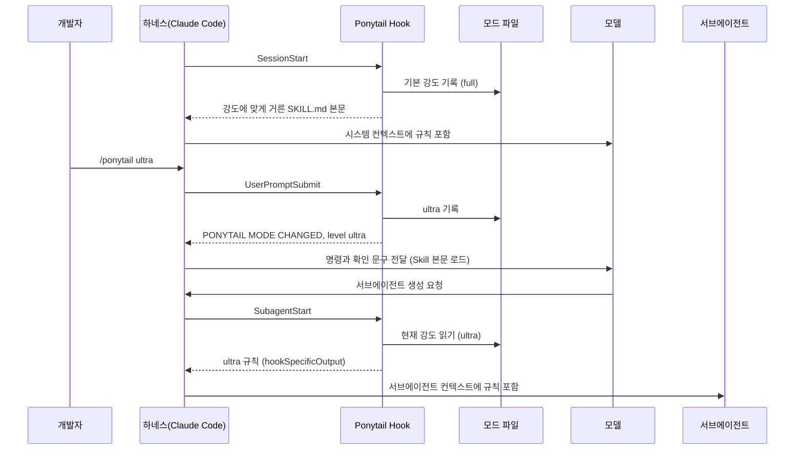

# Ponytail 규칙 주입 구조 깊이 보기

> Ponytail의 규칙이 언제, 어떤 경로로, 어떤 형태로 모델에게 도달하는지를 실제 Hook 소스 코드를 따라가며 다룹니다. 강도별 필터링, 모드 상태 파일, 서브에이전트 주입, 에이전트별 출력 형식, "세션을 절대 멈추지 않는다"는 설계 원칙이 핵심입니다.

## 왜 이 주제가 중요한가

Ponytail의 "기능"은 Markdown 한 파일에 적힌 규칙이 전부입니다. 그래서 Ponytail을 제대로 이해한다는 것은 **그 규칙이 언제 컨텍스트에 들어가고, 언제 들어가지 않는가**를 아는 것입니다. 이걸 알면 다음 질문에 스스로 답할 수 있습니다.

- 규칙은 매 턴 주입되나, 세션 시작에 한 번 주입되나?
- 서브에이전트는 규칙을 받나?
- `/ponytail ultra`를 입력하면 정확히 무엇이 바뀌나?
- 같은 컴퓨터에서 세션 두 개를 열면 강도가 서로 영향을 주나?
- Hook이 실패하면 세션이 멈추나?

아래 설명은 2026년 10월 기준 `main` 브랜치(v4.11.0)의 `hooks/` 디렉터리 소스를 기준으로 합니다.

---

## 규칙이 도달하는 세 가지 경로

Claude Code·Codex용 Hook 설정(`hooks/claude-codex-hooks.json`)에는 이벤트가 세 개만 등록되어 있습니다.

| 이벤트 | 스크립트 | 하는 일 | 규칙 본문 주입 |
|---|---|---|---|
| `SessionStart` (startup, resume, clear, compact) | `ponytail-activate.js` | 기본 강도 결정, 모드 파일 기록, 규칙 주입, 상태 표시줄 안내 | O |
| `SubagentStart` | `ponytail-subagent.js` | 현재 강도의 규칙을 서브에이전트에 주입 | O |
| `UserPromptSubmit` | `ponytail-mode-tracker.js` | `/ponytail ...` 명령과 "stop ponytail"을 감지해 모드 파일 갱신 | X (확인 문구만) |

여기서 흔한 오해 하나가 풀립니다. **Claude Code에서 규칙 본문은 매 턴 주입되지 않습니다.** 세션이 시작될 때, 그리고 `/clear`나 컨텍스트 압축(compact)으로 대화가 다시 시작될 때 주입되고, 서브에이전트가 생길 때 주입됩니다. 일반 프롬프트에서 `UserPromptSubmit` Hook은 아무것도 출력하지 않습니다. 압축 이벤트를 matcher에 넣은 이유도 여기에 있습니다. 압축으로 앞부분 대화가 요약되면 규칙도 함께 흐려질 수 있으므로 다시 넣는 것입니다.

반면 다른 에이전트는 구조가 다릅니다.

| 에이전트 | 주입 시점 | 방법 |
|---|---|---|
| Claude Code, Codex, Copilot CLI, ZCode, CodeBuddy | 세션 시작(+서브에이전트, 지원 시) | 위 세 Hook |
| Cursor (Hook 설치) | 세션 시작, 강도 변경 시 | `sessionStart`, `beforeSubmitPrompt`의 `additional_context` |
| Qoder | 매 프롬프트 | 세션 시작 이벤트가 없어 `UserPromptSubmit`이 활성화와 주입을 함께 처리 |
| OpenCode, Kilo Code | 매 턴 | 서버 플러그인이 `experimental.chat.system.transform`으로 시스템 프롬프트 변환 |
| pi | 매 턴 | 확장이 공유 instruction 빌더로 주입 |
| Hermes Agent | 세션당 한 번 (v4.11.0부터) | `pre_llm_call`. 이전에는 매 턴 주입해 토큰을 낭비한다는 지적이 있었음 |
| 지시문 단계 에이전트 | 항상 | `AGENTS.md`나 규칙 파일을 에이전트가 직접 읽음 |



---

## Hook 명령은 왜 이렇게 생겼나

`hooks/claude-codex-hooks.json`의 명령은 스크립트 경로를 직접 쓰지 않습니다.

```json
{
  "type": "command",
  "command": "node -e \"require(require('node:path').join(process.env.CLAUDE_PLUGIN_ROOT.replaceAll(String.fromCharCode(92), '/'), 'hooks/ponytail-activate.js'))\"",
  "timeout": 5
}
```

평범하게 `node "${CLAUDE_PLUGIN_ROOT}/hooks/ponytail-activate.js"`라고 쓰지 않은 데는 두 가지 이유가 있습니다.

1. **셸 문자열에 경로를 끼워 넣지 않기 위해서입니다.** 플러그인 설치 경로에 공백이나 셸 특수문자가 있으면, 경로를 명령 문자열에 그대로 넣는 방식은 깨지거나 의도하지 않은 명령이 실행될 수 있습니다. v4.10.2는 이를 보안 수정으로 다뤄, 경로를 셸이 아니라 Node가 환경 변수에서 직접 읽도록 바꿨습니다.
2. **Windows 경로를 정규화하기 위해서입니다.** `String.fromCharCode(92)`는 백슬래시입니다. JSON과 셸 양쪽의 이스케이프를 피하려고 문자 코드로 쓴 것이고, 백슬래시 경로를 `/`로 바꿔 Windows에서도 스크립트를 찾게 합니다.

`timeout: 5`는 Hook이 아무리 늦어도 5초 안에 하네스가 끊는다는 뜻이지만, 아래에서 보듯 스크립트 자체도 1초 안에 스스로 끝나도록 만들어져 있습니다.

---

## `ponytail-activate.js`: 세션 시작에 일어나는 일

```text
1. 기본 강도 결정
   PONYTAIL_DEFAULT_MODE 환경 변수 → ~/.config/ponytail/config.json 의 defaultMode → 'full'
2. off 이면 모드 파일을 지우고 종료 (규칙을 주입하지 않음)
3. Cursor 이고 작업 공간에 .cursor/rules/ponytail.mdc 가 있으면 안내 문구만 내고 종료
4. 모드 파일 기록 (setMode)
5. 강도에 맞게 거른 규칙 본문 생성 (getPonytailInstructions)
6. Claude Code 이고 statusLine 설정이 없으면, 설정 방법 안내를 한 번만 덧붙임
7. 에이전트 형식에 맞게 출력 (writeHookOutput)
```

3번은 중복 주입을 막는 장치입니다. Cursor의 항상 켜진 규칙 파일이 이미 규칙을 넣고 있으면 Hook이 두 번째 사본을 넣지 않습니다. 규칙 파일은 Hook이 끌 수 없으므로, 두 사본의 강도가 다르면 서로 모순되기 때문입니다.

6번의 안내는 `.ponytail-statusline-nudged` 파일로 "이미 한 번 보여 줬음"을 기록해, 매 세션 같은 제안을 반복하지 않습니다.

---

## 강도별 필터링: `filterSkillBodyForMode`

`SKILL.md`에는 세 강도의 설명과 예시가 모두 들어 있습니다. 그대로 주입하면 `full` 세션에 `ultra` 예시까지 들어가 모델이 어느 쪽을 따를지 헷갈립니다. 그래서 `hooks/ponytail-instructions.js`는 **현재 강도와 관계없는 줄만** 지웁니다.

```js
// hooks/ponytail-instructions.js (요약)
function filterSkillBodyForMode(body, mode) {
  const withoutFrontmatter = body.replace(/^---[\s\S]*?---\s*/, ''); // frontmatter 제거
  return withoutFrontmatter
    .split(/\r?\n/)
    .filter((line) => {
      // 강도 표의 행: | **lite** | ... |
      const tableLabel = line.match(/^\|\s*\*\*(.+?)\*\*\s*\|/);
      if (tableLabel && normalizeMode(tableLabel[1])) return normalizeMode(tableLabel[1]) === mode;

      // 예시 줄: - lite: "..."   (따옴표가 바로 따라와야 예시로 인정)
      const exampleLabel = line.match(/^-\s*([^:]+):\s*"/);
      if (exampleLabel && normalizeMode(exampleLabel[1])) return normalizeMode(exampleLabel[1]) === mode;

      return true; // 나머지 규칙은 그대로
    })
    .join('\n');
}
```

설계에서 눈여겨볼 점은 두 가지입니다.

- **규칙을 두 벌 관리하지 않습니다.** 강도별 파일을 따로 두지 않고, 하나의 `SKILL.md`에서 줄 단위로 걸러 냅니다. 규칙을 고칠 곳이 한 군데뿐입니다.
- **예시로 인정하는 조건이 엄격합니다.** `- Full: ...`처럼 우연히 강도 이름으로 시작하는 일반 규칙 줄이 다른 강도에서 사라지지 않도록, 콜론 뒤에 따옴표가 바로 와야만 예시로 봅니다. 이 조건이 없으면 평범한 규칙이 조용히 빠지는 버그가 생깁니다.

`SKILL.md`를 읽지 못하면 코드에 내장된 압축 규칙(`getFallbackInstructions`)을 대신 씁니다. 파일 하나가 깨져도 규칙이 아예 없는 상태는 되지 않습니다.

주입되는 결과의 첫 줄은 항상 `PONYTAIL MODE ACTIVE — level: <강도>`입니다. 모델과 사용자 모두 지금 어떤 강도인지 알 수 있게 하는 표시입니다.

---

## 모드 상태는 어디에 저장되나

강도는 대화 내용이 아니라 **파일**에 저장됩니다. 그래야 별도 프로세스로 실행되는 `SubagentStart` Hook이나 상태 표시줄 스크립트가 같은 값을 읽을 수 있습니다.

| 파일 | 내용 | 비고 |
|---|---|---|
| `~/.claude/.ponytail-active` | 현재 강도 문자열 (`full` 등) | 공유 플래그. 상태 표시줄이 읽음. `CLAUDE_CONFIG_DIR`을 따름 |
| `~/.claude/ponytail-modes/<프로젝트 경로>` | 프로젝트별 현재 강도 | v4.10.3부터. `CLAUDE_PROJECT_DIR`이 있을 때만 |
| `~/.config/ponytail/config.json` | `defaultMode` 등 기본값 | `/ponytail default <강도>`가 쓰는 유일한 경로 |

에이전트마다 상태 디렉터리가 다릅니다. Codex는 `$PLUGIN_DATA`, Copilot CLI는 `$COPILOT_PLUGIN_DATA`, Cursor는 `~/.cursor`, Qoder는 `~/.qoder`, CodeBuddy는 `~/.codebuddy`를 씁니다.

v4.10.3 이전에는 공유 플래그 하나만 있어서, 저장소 A의 세션에서 `/ponytail off`를 하면 저장소 B 세션의 강도까지 꺼졌습니다. 지금은 프로젝트 경로별 파일을 먼저 읽으므로 다른 저장소끼리는 서로 영향을 주지 않습니다. 다만 **같은 저장소에서 연 세션 두 개는 여전히 강도를 공유**합니다. 소스에도 `ponytail:` 주석으로 이 한계와 업그레이드 경로(세션 ID 기준으로 키 바꾸기)가 적혀 있고, 2026년 10월 기준 이를 고치는 PR이 열려 있습니다. 프로젝트 자체가 자기 규약을 그대로 쓰고 있는 예이기도 합니다.

---

## `ponytail-mode-tracker.js`: 명령 해석

`UserPromptSubmit` Hook은 사용자의 입력 전체를 받아 소문자로 바꾼 뒤 다음 규칙으로 해석합니다.

| 입력 | 동작 |
|---|---|
| `/ponytail lite` / `full` / `ultra` | 모드 파일 변경, `PONYTAIL MODE CHANGED — level: <강도>` 출력 |
| `/ponytail off`, `stop ponytail`, `normal mode` | 모드 파일 삭제, `PONYTAIL MODE OFF` 출력 |
| `/ponytail` (인자 없음) | 꺼져 있으면 기본 강도로 켜고(기본값도 off면 `full`), 켜져 있으면 현재 강도만 보고 |
| `/ponytail default <강도>` | `config.json`의 `defaultMode`만 바꾸고 현재 세션 강도는 그대로 |
| `/ponytail-review` 등 | 아무것도 저장하지 않음 (일회성 Skill) |
| `@ponytail`, `$ponytail` | `/ponytail`과 같게 취급 (에이전트별 호출 문법 차이 흡수) |

`/ponytail-review`를 "강도"로 저장하지 않는 것은 실제 버그 수정의 결과입니다. 예전에는 리뷰 명령이 모드를 `review`로 바꿔 놓아, 리뷰가 끝난 뒤에도 세션 내내 리뷰 모드가 유지되었습니다(v4.10.3에서 수정).

Claude Code에서 이 Hook은 확인 문구만 출력하고, 바뀐 강도의 규칙 본문은 `/ponytail` 명령이 Skill을 불러오면서 들어갑니다. 반면 Cursor에는 Skill로 동작하는 `/ponytail` 명령이 없으므로, 이 Hook이 확인 문구와 함께 새 강도의 규칙 본문까지 출력합니다. Qoder는 매 프롬프트마다 규칙 전체를 출력하는데, 강도가 바뀐 턴에는 확인 문구를 규칙 앞에 붙여 출력을 하나로 합칩니다.

---

## `ponytail-subagent.js`: 서브에이전트 주입

Claude Code에서 `SessionStart`로 넣은 컨텍스트는 메인 대화에만 있고 서브에이전트에는 전달되지 않습니다. 그래서 별도 Hook이 필요합니다(v4.8.3에서 추가).

```text
1. 모드 파일 읽기 → 없거나 off 이면 아무것도 하지 않고 종료
2. PONYTAIL_SUBAGENT_MATCHER 가 없으면 → stdin 을 기다리지 않고 바로 주입
3. 있으면 → stdin 의 agent_type 을 읽어 정규식 검사
   - 확실히 불일치할 때만 주입 생략
   - agent_type 이 없거나, JSON 이 깨졌거나, 정규식이 잘못됐거나, 검사가 100ms 를 넘으면 → 주입 (fail open)
```

정규식 검사를 `vm.runInNewContext(..., { timeout: 100 })` 안에서 실행하는 이유는 `(a+)+$` 같은 역추적이 심한 정규식이 이벤트 루프를 막아 세션 전체를 멈추게 할 수 있기 때문입니다(v4.10.2에서 수정). 의심스러운 모든 경우에 "주입한다" 쪽으로 기우는 것도 의도된 설계입니다. 범위 지정 설정 때문에 규칙이 조용히 사라지는 것보다, 필요 없는 곳에 규칙이 들어가는 편이 덜 위험하다고 본 것입니다.

---

## 에이전트별 출력 형식: `writeHookOutput`

같은 규칙이라도 에이전트마다 Hook 출력을 해석하는 방식이 다릅니다. `hooks/ponytail-runtime.js`는 환경 변수로 실행 중인 에이전트를 판별한 뒤 형식을 맞춥니다.

| 판별 기준 | 에이전트 | 출력 형식 |
|---|---|---|
| `COPILOT_PLUGIN_DATA`, 또는 `.vscode/agent-plugins` 경로 | Copilot | `{ "additionalContext": ... }` (세션 시작만) |
| `PLUGIN_DATA` | Codex | `{ "hookSpecificOutput": { "hookEventName", "additionalContext" } }` |
| `QODER_SESSION_ID` / `ZCODE_APP_VERSION` / `CODEBUDDY_PLUGIN_ROOT` | Qoder, ZCode, CodeBuddy | Codex와 같은 `hookSpecificOutput` JSON |
| `CURSOR_VERSION` | Cursor | `{ "additional_context": ... }`, 프롬프트 이벤트에는 `continue: true` |
| 그 외 | Claude Code | 세션 시작은 일반 텍스트, `SubagentStart`는 `hookSpecificOutput` JSON |

이 표에는 실제로 겪은 문제들이 녹아 있습니다.

- **Codex의 노란 경고**: 예전에는 Codex에 `systemMessage`도 함께 보냈는데, Codex가 이를 `warning:`으로 표시해 매 세션 오류처럼 보였습니다. v4.10.3에서 제거했습니다.
- **ZCode의 무시된 규칙**: ZCode는 Hook 출력을 엄격한 JSON으로만 받아서, 일반 텍스트로 보낸 규칙이 조용히 버려졌습니다. v4.10.3에서 JSON 형식으로 바꿔 해결했습니다.
- **Claude Code `SubagentStart`**: 세션 시작과 달리 일반 텍스트를 보내면 컨텍스트가 버려지므로 JSON 형식이 필요합니다.

판별 순서도 중요합니다. Cursor 터미널 안에서 Claude Code를 실행해도 `CURSOR_VERSION`은 Cursor가 Hook 프로세스에만 설정하므로 Claude Code로 올바르게 판별된다는 내용이 소스 주석에 기록되어 있습니다.

---

## 설계 원칙: Hook 때문에 세션이 멈추면 안 된다

Ponytail Hook 코드 전반에는 하나의 원칙이 일관되게 적용되어 있습니다. **Hook은 최선을 다하되(best effort), 실패해도 세션을 막지 않는다.**

- 모든 파일 쓰기와 출력은 `try/catch`로 감싸고, 실패하면 조용히 넘어갑니다.
- 모든 스크립트는 종료 코드 0으로 끝납니다. Ponytail은 도구 실행을 차단하는 Hook이 아닙니다.
- stdin을 읽는 스크립트는 1초 타이머를 둡니다. Windows의 PowerShell 래퍼가 입력을 삼켜 stdin 종료 신호가 오지 않으면 Hook이 영원히 기다려 세션이 멈추던 문제(#443) 때문입니다. 이 타이머를 `unref()`하면 Windows에서는 아예 실행되지 않는다는 것도 나중에 발견되어(#790) 지금은 일부러 ref 상태로 둡니다.
- `config.json`이나 `settings.json`을 읽을 때는 Windows 편집기가 붙이는 UTF-8 BOM을 지운 뒤 파싱합니다.

ECC 같은 도구의 Hook이 "위험하면 막는다(fail closed)"를 원칙으로 하는 것과 대조적입니다. Ponytail의 Hook은 안전장치가 아니라 **규칙 배달원**이므로, 배달에 실패하더라도 작업은 계속되는 쪽(fail open)이 맞다고 본 것입니다.

---

## 직접 확인해 보기

Hook은 stdin으로 JSON을 받고 stdout으로 결과를 내는 일반 Node.js 스크립트이므로, 에이전트 없이도 동작을 확인할 수 있습니다. 실제 설정을 건드리지 않도록 임시 디렉터리를 설정 위치로 지정합니다.

```bash
git clone https://github.com/DietrichGebert/ponytail && cd ponytail
export CLAUDE_CONFIG_DIR="$(mktemp -d)" XDG_CONFIG_HOME="$(mktemp -d)"

# 1) 세션 시작: ultra 강도의 규칙이 출력되고 모드 파일이 생긴다
PONYTAIL_DEFAULT_MODE=ultra node hooks/ponytail-activate.js | head -1
# PONYTAIL MODE ACTIVE — level: ultra
cat "$CLAUDE_CONFIG_DIR/.ponytail-active"
# ultra

# 강도 표와 예시는 ultra 행만 남는다
PONYTAIL_DEFAULT_MODE=ultra node hooks/ponytail-activate.js | grep -E '^\| \*\*|^- (lite|full|ultra): "'

# 2) 강도 변경
echo '{"prompt":"/ponytail lite"}' | node hooks/ponytail-mode-tracker.js
# PONYTAIL MODE CHANGED — level: lite

# 3) 서브에이전트 범위 지정: Explore 는 주입 생략, general-purpose 는 주입
echo '{"agent_type":"Explore"}' | PONYTAIL_SUBAGENT_MATCHER=general node hooks/ponytail-subagent.js
# (출력 없음)
echo '{"agent_type":"general-purpose"}' | PONYTAIL_SUBAGENT_MATCHER=general node hooks/ponytail-subagent.js | head -c 80
# {"hookSpecificOutput":{"hookEventName":"SubagentStart","additionalContext":"PONY...

# 4) 기본값 저장
echo '{"prompt":"/ponytail default lite"}' | node hooks/ponytail-mode-tracker.js
cat "$XDG_CONFIG_HOME/ponytail/config.json"
# { "defaultMode": "lite" }
```

이렇게 돌려 보면 "규칙이 안 먹는 것 같다"는 문제를 만났을 때 원인을 나눠 볼 수 있습니다. Hook 출력이 비어 있으면 모드 파일이나 기본값 설정 문제이고, 출력은 정상인데 모델이 따르지 않으면 하네스가 출력을 컨텍스트에 넣지 않았거나(형식 문제, Hook 미신뢰) 모델이 지시를 따르지 않은 것입니다.

---

[← 장단점과 대안 비교](06-comparison.md) · [목차](README.md) · [주의할 점과 FAQ →](08-pitfalls-faq.md)
